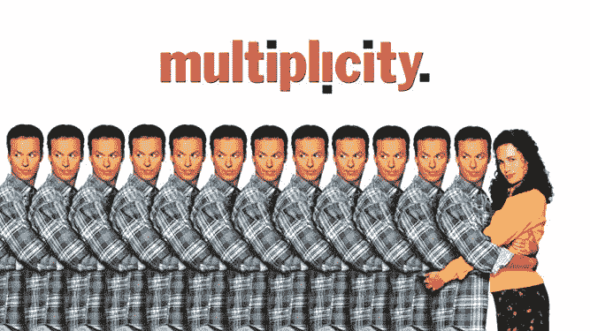
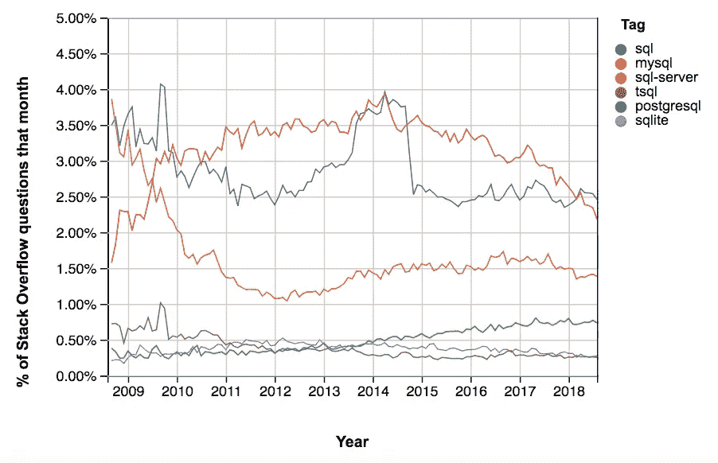

# SQL 的多面性

> 原文：<https://towardsdatascience.com/the-many-faces-of-sql-bd04af1315b0?source=collection_archive---------29----------------------->

SQL 的许多实现的简要概述

最近，我遇到了一个红移 SQL 技术挑战，本质上是盲目编码——没有办法测试我的查询。SQL 有如此多的实现，您可能会遇到一个您不熟悉的实现。我将为您概述我们最喜欢的结构化查询语言的最流行的实现之间的主要区别，并给它们贴上标签，就好像它们是男孩乐队的成员一样:

*   结构化查询语言
*   关系型数据库
*   Oracle 数据库
*   NoSQL
*   一种数据库系统
*   SQLite

[https://www.datacamp.com/community/blog/sql-differences](https://www.datacamp.com/community/blog/sql-differences)

# SQL —领导者

SQL 是第一个。OG 结构化查询语言。它最初是在 1974 年由 IBM 开发的。它是作为 IBM 的内部项目而设计的，其他版本是为商业用途而创建的。SQL 有许多语法标准，它的许多迭代都没有遵循这些标准。例如，用于终止查询的分号、双引号和大写。SQL 是基本的数据库语言。SQL 的附加实现试图填补空白，并满足特定的需求。

SQL is Beyoncé

# MySQL——最流行的一个

根据[数据库引擎排名](https://db-engines.com/en/)，自 2012 年该网站开始跟踪数据库受欢迎程度以来，MySQL 一直是最受欢迎的**开源**关系数据库管理系统(RDBMS)。它由一家名为 MySQL AB 的瑞典公司于 20 世纪 90 年代推出。MySQL 是热门网站的好朋友，包括 Twitter、脸书、网飞、Youtube 和 Spotify。虽然它并不总是遵循所有的 SQL 规则，但它是快速、可靠和受保护的。使用 MySQL 数据库的应用程序通过一个独立的[守护进程](https://en.wikipedia.org/wiki/Daemon_(computing))访问它。服务器进程位于数据库和其他应用程序之间，因此可以更好地控制谁可以访问数据库。

MySQL 适用于网站和应用程序。它最大的局限性在于缺乏对完全连接子句的支持。MySQL 有开源和商业版本，所以插件的特定功能可能不可用，除非你愿意为它们支付额外费用。

MySQL

# Oracle SQL—智能产品

Oracle 数据库是由 SDL(软件开发实验室)于 1979 年创建的。Oracle 是一个多模型数据库管理系统。大多数数据库主要只支持一种模式，如:[关系数据库](https://en.wikipedia.org/wiki/Relational_database)、[面向文档的数据库](https://en.wikipedia.org/wiki/Document-oriented_database)、[图形数据库](https://en.wikipedia.org/wiki/Graph_database)或[三重存储](https://en.wikipedia.org/wiki/Triplestore)。结合了许多这些的数据库是多模型的。

“Oracle 数据库(通常称为 Oracle RDBMS 或简称 Oracle)是一个[专有的](https://en.wikipedia.org/wiki/Proprietary_software) [多模式数据库](https://en.wikipedia.org/wiki/Multi-model_database)管理系统。Oracle 是一种常用于运行在线事务处理(OLTP)、数据仓库(DW)和混合(OLTP & DW)数据库工作负载的数据库。”

一些人认为 Oracle 数据库比其竞争对手微软(Microsoft)的 SQL Server 更复杂。Oracle 适用于需要大型数据库的大型组织。Oracle 的一个优势是它可以在任何操作系统上使用。此外，Oracle 有更多的事务控制。例如，如果需要立即更新一组记录，MS SQL Server 会单独执行每个命令。如果在此更新过程中遇到任何错误，将很难进行修改。Oracle 能够将每个新的数据库连接视为一个新的事务，从而提高了效率。

就功能而言，MS SQL Server 不提供分区、位图索引、反向键索引、基于函数的索引或星型查询优化，而 Oracle 提供了所有这些功能。

Smartypants

# 反叛者 NoSQL

不仅是 SQL 的缩写，NoSQL 数据库不是关系数据库管理系统。有些人可能会认为它甚至不属于本文中的其他组，但它的定义与 SQL 相反。它主要被称为非关系型或分布式数据库。NoSQL 数据库是没有标准模式定义的键值对、文档、图形数据库或宽列存储的集合。NoSQL 数据库的定义特征是它保存非结构化数据。

尽管在 SQL[(20 世纪 60 年代末)](https://en.wikipedia.org/wiki/NoSQL)之前就已经存在，NoSQL 这个绰号还是在 1998 年被冠以。有时它也被称为 UnQL(非结构化查询语言)。使用 UnQL 的语法因数据库而异。

Breaking all the rules

# PostgreSQL——兼容的

PostgreSQL 越来越受欢迎，它遵循大多数 SQL 标准。PostgreSQL 是一个对象关系数据库。它的行为类似于一个常规的关系数据库，但是它有一些附加的特性，类似于一个对象数据库。表继承和函数重载是这方面的一些重要例子。

根据官方[文档](https://www.postgresql.org/docs/current/features.html)，PostgreSQL 符合 179 个 SQL 特性中的 160 个。原来亚马逊的产品 Redshift 是基于 PostgreSQL 的。

This one was tough, but this picture…

# SQLite——可爱的那个

SQLite 占用空间小，因为它是非常轻量级的。它可能占用不到 600Kb 的空间，并且是完全独立的。没有需要安装 SQLite 才能工作的外部依赖项。它不需要停止、启动或重启，因为它不作为服务器进程运行。这些特性使它能够轻松地与应用程序集成。一个完整的 SQLite 数据库可以完美地存储在一个文件中——太可爱了！该文件可以通过可移动介质或文件传输来共享。

将 SQLite 与嵌入式应用程序结合使用是理想的，使用 SQLite 测试应用程序功能很容易，因为它不需要额外的服务器来运行。

RIP QT

# 结论

SQL 的实现如此之多，以至于很难跟踪所有的实现。如果您确实在技术挑战中遇到了一个新的实现，并且您没有办法实际测试查询，那么可以放心地假设它与所有其他实现一样。每个 SQL 实现的语法没有太大的区别。事实上，像连接这样的事情在大多数实现中仍然是一样的。最大的区别在于功能和具体用途，但似乎相似之处比不同之处更常见。