# 火星编年史——当深度学习遇到全球协作

> 原文：<https://towardsdatascience.com/the-martian-chronicles-when-deep-learning-meets-global-collaboration-872425ba2787?source=collection_archive---------18----------------------->

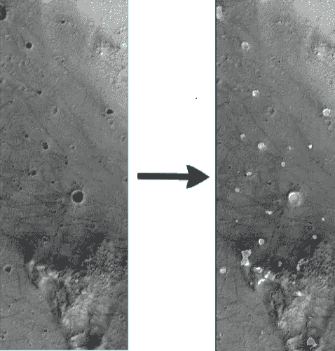

上面你看到的是两张火星表面的灰度照片，是在勇气号着陆点附近拍摄的，勇气号是由美国宇航局建造的机器人漫游车，在 2004 年至 2010 年期间活动。如果你仔细观察，你会发现箭头右边的图像与左边的图像完全相同，只是陨石坑被神经网络用白色高亮显示了。

如果你想知道这个非凡的结果是如何实现的，不要再想了，让我告诉你一个你从未听说过的故事——在这个故事中，你会发现来自地球各个角落的一群人，拥有不同的技能*(与火星相关或无关)*，他们如何远程合作，创建了一个能够自动下载和分析火星表面原始图像的完整管道。

我将这整个 2 个月的“太空之旅”分成 6 个阶段，并冒昧地对每个阶段做一个简要的概述。

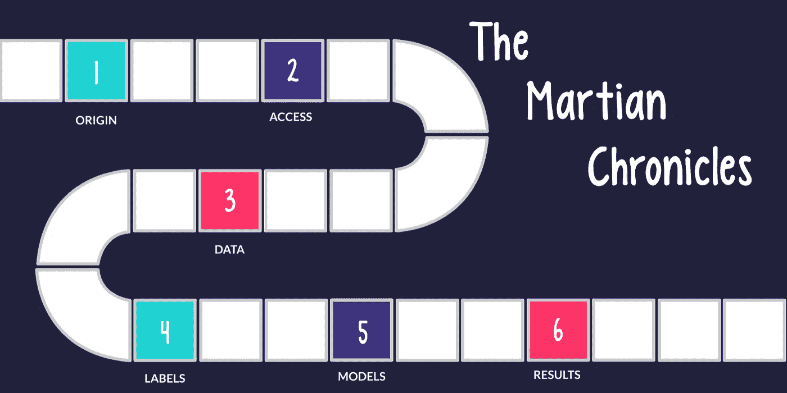

The entire space-trip of 2 months, broken up into 6 stages

# 起源故事

这一切都始于 ***火星*，**当然还有 ***—*** 太阳系中第二小的行星，由稀薄的大气层组成，其表面特征让人想起月球的撞击坑以及地球的山谷、沙漠和极地冰盖。

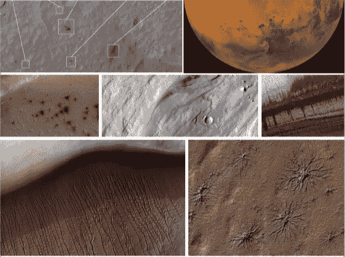

Examples of the Mars’ diverse surface

最近，寻找技术签名——为过去或现在的外星技术提供科学证据的可测量属性——获得了新的兴趣。

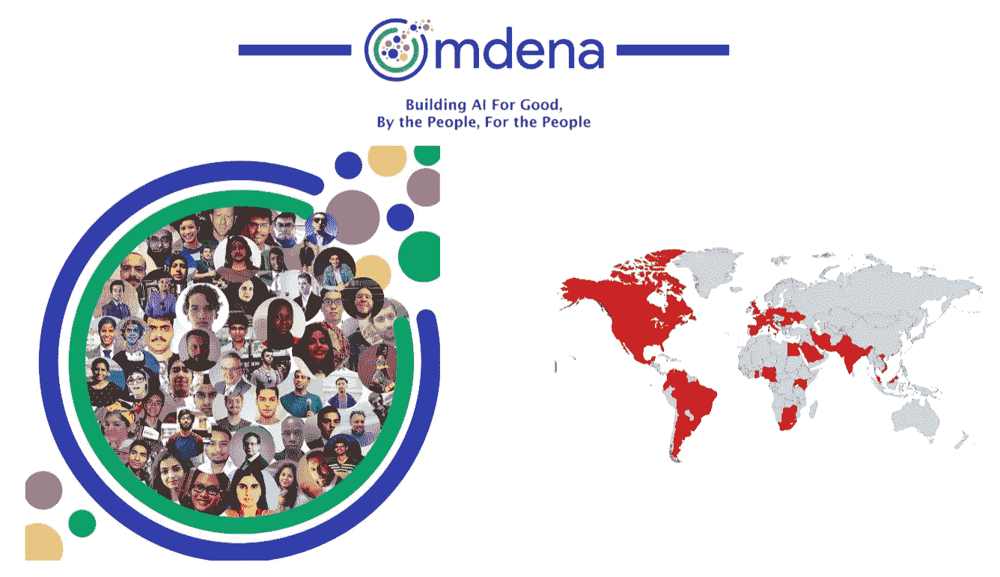

会见 Omdena——这是一个全球合作平台，汇集了来自 18 个国家的 36 名地球人，为期 2 个月，以确定火星表面的异常情况，这将有助于发现技术签名和着陆点。当我在浏览我的媒体新闻时，我偶然发现了这颗宝石，并无意中发现了下面这篇改变人生的文章:

 [## 通过协作学习 AI，而不是通过竞争。

### 与他人一起学习，获得真实世界的经验，成为全球社区的一员。

medium.com](https://medium.com/omdena/learn-ai-through-collaboration-not-through-competition-f3b13f7f3f21) 

这篇文章出现的正是时候，当时我已经在诸如 **Udacity、fast.ai、Coursera** 等平台上完成了相当多的 ML 课程。，并在寻找全新的项目来应用我新获得的技能。我没有浪费时间申请，几天后，经过简短的面试，我非常兴奋地收到一封电子邮件，确认我在这个项目中的 ML 工程师的角色。

如果没有出色的在线协作工具，未来两个月的协作是不可能的，例如:

*   **Slack** ，我们曾经在名副其实的#channels 的帮助下，用它来相互交流和集思广益。
*   **Zoom** ，我们用它来举行每周同步视频会议，所有参与者每周都可以分享他们的进步和学习。
*   **GitHub** ，我们用来贡献和分享所有开发代码的。
*   **谷歌合作实验室**，免费提供支持 GPU 的 Jupyter 笔记本电脑，以试验不同的模型。
*   **Google Drive、Google Docs 和 Google Slides** ，帮助我们以一种易于阅读的格式记录我们所有的数据和知识，并将它们呈现给其他人。

# 接近

在我们自己的 Python 包——mars-ode-data-access——诞生之前，我们花了两周时间分析需求。对于那些试图访问和下载火星表面图像的人来说，这让生活变得更加容易。关于它的用法的所有信息都可以在这里找到—[https://github.com/samiriff/mars-ode-data-access](https://github.com/samiriff/mars-ode-data-access)。

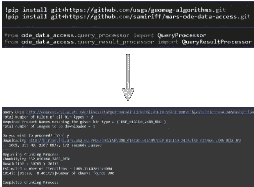

Sample usage of the mars-ode-data-access Python package

数据是如何从火星一路传回我们的 Jupyter 笔记本的？长话短说，由美国宇航局建造的火星探测轨道器 *(MRO)* ，使用高分辨率成像科学实验 *(HiRISE)* 相机捕捉火星表面的高分辨率照片，并通过深空网络 *(DSN)* 传回地球。像我们这样的普通用户通过在我们的浏览器中打开火星轨道数据浏览器 *(ODE)* 网站来访问所有这些数据，或者更好的是，通过使用我们自己的 python 包以编程方式访问这些数据。

如果你想更深入地了解这一旅程的细节，请阅读下面的文章了解更多信息:

 [## 从火星轨道飞行器到陆地神经网络的旅程

### 引入 Python 包来高效处理来自火星的数据

medium.com](https://medium.com/omdena/a-journey-from-martian-orbiters-to-terrestrial-neural-networks-93541169f665) 

# 数据

一旦我们获得了数据，我们需要理解我们正在寻找的异常。基于[芝诺多数据集](https://zenodo.org/record/2538136)，我们能够识别 7 种不同的异常，即**陨石坑、黑色沙丘、斜坡条纹、明亮沙丘、撞击喷出物、蜘蛛和瑞士奶酪。**

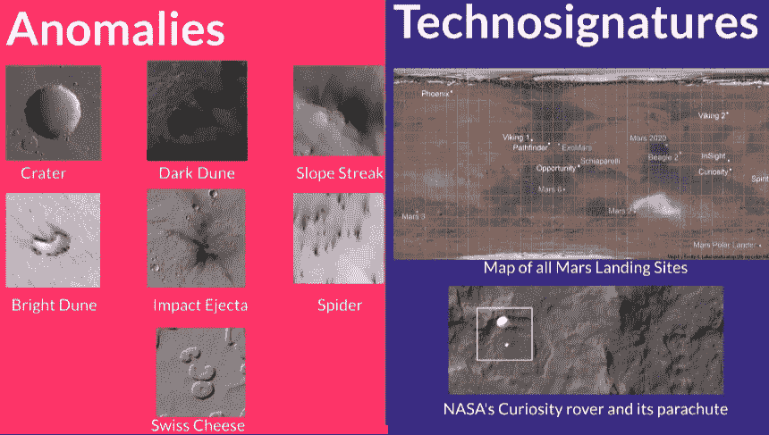

除此之外，我们还从火星任务的不同着陆点识别出了**技术特征**，比如美国宇航局的好奇号探测器的降落伞。

此外，我们创建了**预处理实用程序**来对齐、裁剪、平移、旋转、缩放和转换下载的数据。

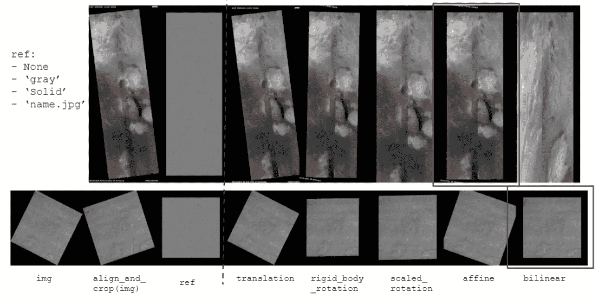

你可以在下面这篇由 Sebastian Laverde 撰写的文章中找到关于这些工具的更多细节:

 [## 通过深度对抗训练进行马氏检测

### “通过每一个发现的裂缝，一些看似不正常的东西从黑暗中掉了出来，落下来，作为进入……

medium.com](https://medium.com/omdena/marsian-omaly-detection-through-deep-adversarial-training-4dbb10744ce8) 

# 标签

所有数据就绪后，我们必须手动标记所有图像。简单图像分类的日子已经一去不复返了。我们现在生活在一个对象检测和语义分割的世界，有各种各样的注释工具和标签格式！糟糕的是没有一个单一的标准，这就是为什么我们有多个参与者使用不同的注释工具来标记不同的图像。贴标签是一项相当劳动密集型的任务，这是我们证明我们在数量上的优势的时候，我们平均在一周多一点的时间里，通过贴标签 300-400 张图片，完成了这项看似艰巨的任务。

我们开始使用[label img](https://github.com/tzutalin/labelImg)——一种开源注释工具，在感兴趣的异常周围绘制矩形框，还创建了一个实用程序，用于在 [PASCAL VOC](http://host.robots.ox.ac.uk/pascal/VOC/) 和 [YOLO](https://github.com/AlexeyAB/Yolo_mark/issues/60) 格式之间自动转换。

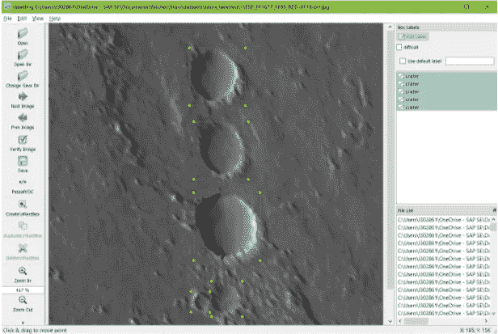

Drawing bounding boxes over craters with the LabelImg Tool

然后，我们使用 [VGG 图像注释器(VIA)](http://www.robots.ox.ac.uk/~vgg/software/via/) 工具在感兴趣的异常周围绘制多边形。

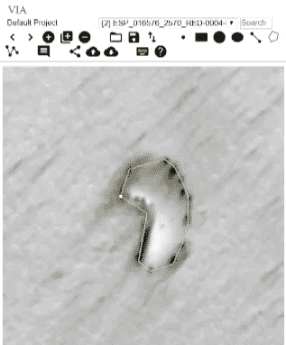

Drawing Polygons around Bright Dunes with the VIA tool

最后但同样重要的是，我们创建了一个工具——[https://github.com/samiriff/image-annotation-converter](https://github.com/samiriff/image-annotation-converter)——能够在 LabelMe 工具的帮助下，自动将来自 VIA 工具的多边形注释转换为分段遮罩。

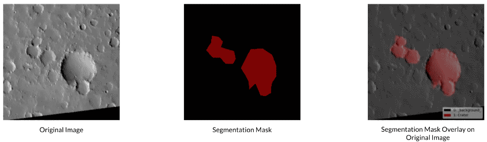

Segmentation masks of craters obtained from an image annotated with the VIA tool

# 模型

终于，经过如此精心的准备，我们到了大家期待已久的阶段——模特选拔和培训！

我们尝试了监督和非监督模型，但为了保持这个故事的简洁，我将展示 3 个监督模型 *(SSD，Mask R-CNN 和 U-Net)* 和 1 个非监督模型 *(Ano-GAN)* 。所有实验都在谷歌实验室进行。

## 单触发多盒探测器(SSD)

利用由 1674 个训练样本、350 个验证样本和多种类型的图像转换组成的 **LabelImg 注释数据集**，由预训练 Resnet34 模型支持的单次多盒检测机通过 1 周期学习率调度器被训练 30 个时期。选择焦点损失作为损失函数，并通过 Adam 优化器在 6.5 分钟内将其最小化，从而产生下图中显示的预测，异常周围有边界框。

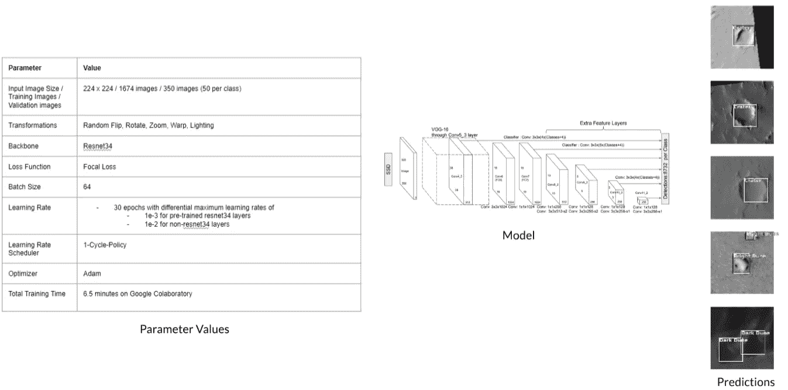

Parameter Values, Model Architecture and Sample Predictions for an SSD Model

## 屏蔽 R-CNN

利用 **VIA 注释数据集**和 1024 x 1024 像素的更高输入分辨率，由预训练的 Resnet101 主干支持的掩模 R-CNN 模型被训练 30 个时期。损失函数由边界框和掩膜损失的组合组成，由 SGD 优化器在大约 3 小时内最小化，从而产生下图中显示的预测，异常以不同颜色突出显示。

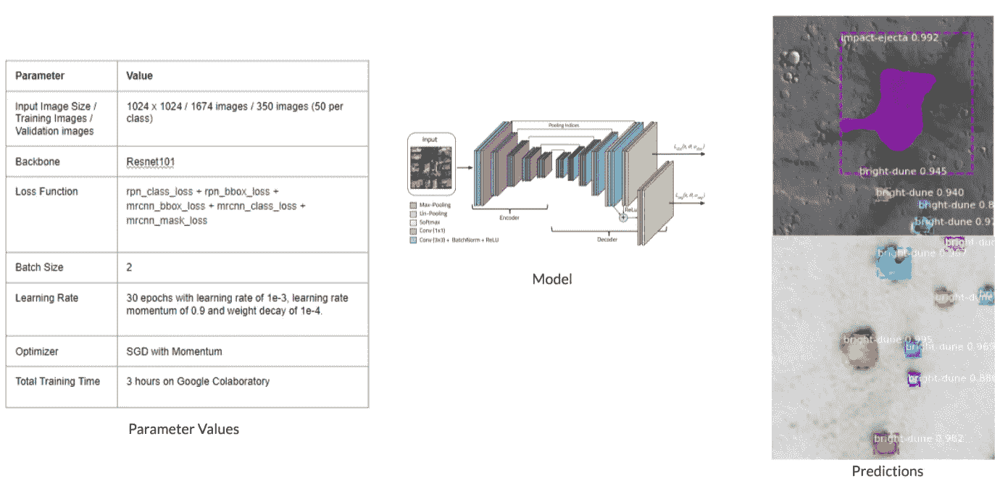

Parameter Values, Model Architecture and Sample Predictions for a Mask R-CNN model

## 优信网

利用**分割掩码**的数据集，由 Resnet18 模型支持的 U-Net 模型利用 1 周期学习率调度器，使用学习率和权重衰减的不同组合，被训练 47 个时期。Adam 优化器在大约 2 小时内将交叉熵损失函数的平坦损失最小化，从而产生了下图中的预测，异常以白色突出显示。

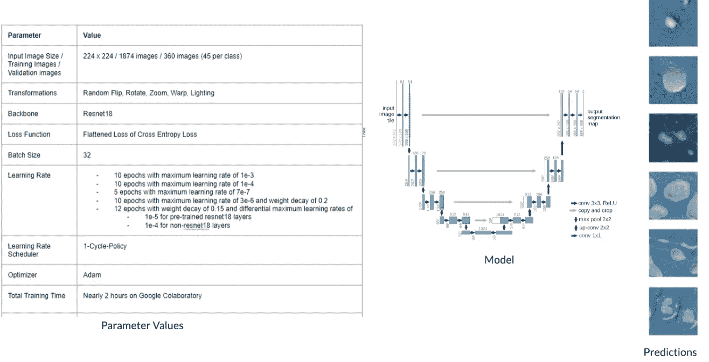

Parameter Values, Model Architecture and Sample Predictions for a U-Net Model

## 阿诺-甘

最后但并非最不重要的是，利用 10000 幅图像的完全未标记数据集，对 200 个时代训练了一个生成性对抗网络。Adam 优化器在大约 6 小时内将 L1 重建损失降至最低，从而产生了显示在右侧的预测。探测到了隔热板、降落伞、坠机地点和好奇号火星车等技术特征。

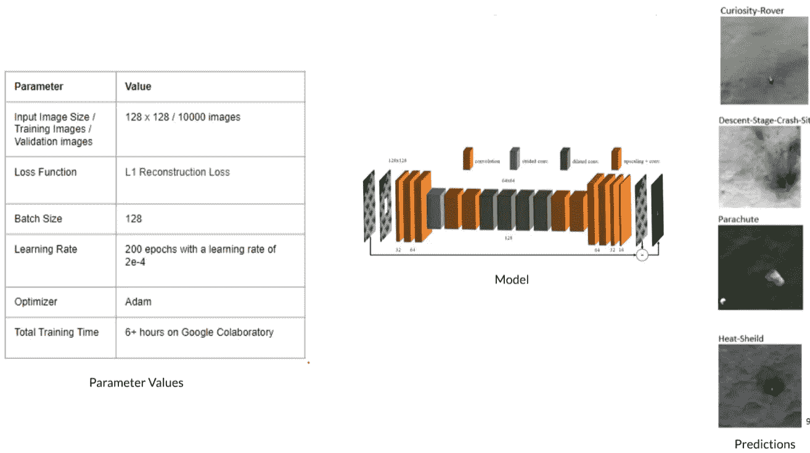

Parameter Values, Model Architecture and Sample Predictions for an Ano-GAN model

在这篇由 [Murli Sivashanmugam](https://in.linkedin.com/in/smurli) 撰写的文章中，阅读更多关于这种模型的架构以及它是如何被训练的:

 [## 火星表面的异常探测——大海捞针！

### 我们如何克服数据挑战，并使用深度卷积网络和社区协作来检测…

medium.com](https://medium.com/omdena/anomaly-detection-in-martian-surface-searching-for-needles-in-a-haystack-169fb0246da7) 

在继续之前，我想花一点时间感谢**杰瑞米·霍华德**和 **fast.ai** 背后的人们，他们创建了这样一个奇妙的图书馆和令人惊叹的视频讲座，这使我们更容易理解 SSD、U-Net 和 GAN 模型的内部工作原理。如果你之前没看过这个课程，我强烈建议你立刻访问 [https://course.fast.ai](https://course.fast.ai/) 。

# 结果

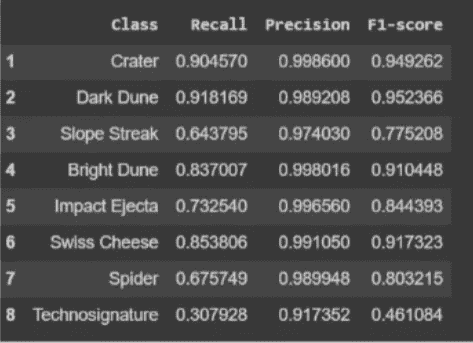

Precision, Recall, and F1-Scores for all label classes

发现 U-Net 模型产生了最好的分数。所有异常的精确度分数都在 90%以上，但是在技术签名、斜坡条纹和蜘蛛的召回分数方面仍有改进的空间。

基于交集超过并集 *(IOU)* 分数的混淆矩阵如下所示:

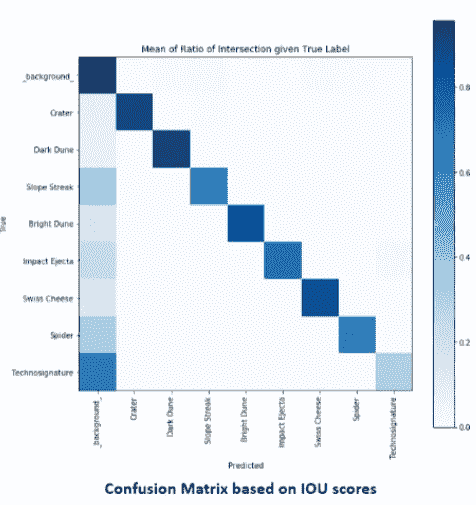

等等！这个故事还没有结束。在我结束之前，让我向您展示一个用户友好的应用程序，它是通过将所有这 6 个部分结合在一起创建的，以创建一个端到端的管道，能够直接从火星轨道数据探测器下载图像，并使用我们训练有素的 U-Net 模型进行分析*(确保您在支持 GPU 的环境中运行此笔记本)*:

 [## 谷歌联合实验室

### 用户友好的 Mars ODE + U-Net 管道

colab.research.google.com](https://colab.research.google.com/drive/1snboX3JG9USKmbCAGf3XtCZkSjayMgM2) 

如果你想看我们所有的实验或者也有所贡献，请访问[https://github.com/cienciaydatos/ai-challenge-mars](https://github.com/cienciaydatos/ai-challenge-mars)。

# 结论

好了，这就是我们过去两个月的旅程。我希望你喜欢阅读我们的项目，就像我们喜欢做它一样。

> **在这个项目中合作工作类似于训练一个神经网络，在项目开始时，事情是混乱的，随机的陌生人加入了一个新创建的合作环境*(类似于神经网络中的权重和偏差在创建过程中是如何随机初始化的)*随着时间的推移，我们逐渐了解并相互学习。 通过不断迭代*(类似于神经网络如何在多个时期逐渐调整其权重以最小化成本函数)*来精炼我们的理解并变得不那么混乱，直到我们实现我们的目标或接近它*(类似于神经网络最终产生预期结果的方式)。* **

我们非常感激 Rudradeb Mitra 把我们聚集在一起并指导我们；**丹尼尔·安格豪森**和**帕特里西奥·韦塞拉**为我们提供问题陈述指导；**迈克尔·布哈特**宣传我们的媒体文章，并让我们了解奥姆德纳的最新动态；**法维奥·瓦兹奎**帮助我们开始使用 GitHub 上的开源库。

在一个被贪婪、仇恨和偏狭所困扰的世界里，奥姆德纳为消除国家壁垒带来了一股新鲜空气。这个项目证明了这样一个事实，即把一群来自地球不同角落的陌生人聚集在一起，他们以前从未见过面；超越地理边界和时区，共同努力解决引人入胜的社会问题；虽然每天都互相学习和启发，但这不仅仅是一个白日梦，**感谢在线教育、协作工具和 Omdena** 这样的平台！

如果您希望了解更多关于 Omdena 的信息，并将您的技能应用于新的合作挑战，请访问[https://omdena.com](https://omdena.com/)。

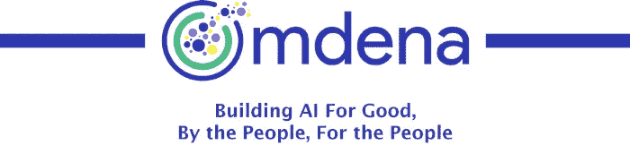

地面控制呼叫汤姆少校。通话完毕……

## 参考

[1][http://course 18 . fast . ai](http://course18.fast.ai/lessons/lesson9.html)
【2】[https://zenodo.org/record/2538136#.XTHh3OgzbIV](https://zenodo.org/record/2538136#.XTHh3OgzbIV)
【3】[https://medium . com/om dena/a-journey-from-mars-orbiters-to-terrestrial-neural-networks-93541169 f 665](https://medium.com/omdena/a-journey-from-martian-orbiters-to-terrestrial-neural-networks-93541169f665)
【4】[https://github.com/cienciaydatos/ai-challenge-mars](https://github.com/cienciaydatos/ai-challenge-mars)
【5】[https://medium . com/om dena/pushing-the-the](https://medium.com/omdena/marsian-omaly-detection-through-deep-adversarial-training-4dbb10744ce8)