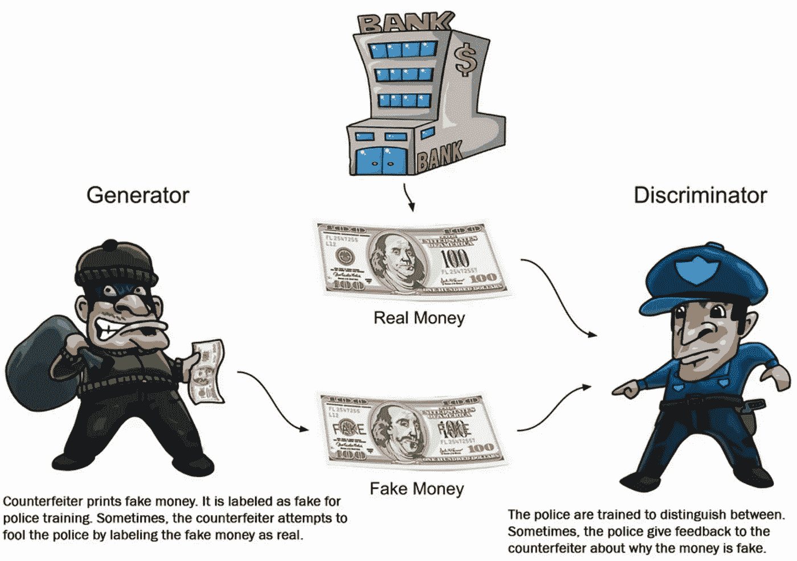

# GANs(生成对抗网络)背后的数学

> 原文：<https://towardsdatascience.com/the-math-behind-gans-generative-adversarial-networks-3828f3469d9c?source=collection_archive---------3----------------------->

## 详细了解原始 GANs 背后的数学原理，包括其局限性

# 1.介绍

生成对抗网络(GAN)由两个模型组成:生成模型 **G** 和鉴别模型 **D** 。生成模型可以被认为是一个试图制造假币并使用它而不被抓住的伪造者，而鉴别模型类似于警察，试图抓住假币。这场竞争一直持续到伪造者变得足够聪明，能够成功骗过警察。

Figure 1: Representation of the generator and discriminator as a counterfeiter and police, respectively. Figure from [1].

换句话说，

**鉴别器:**作用是区分真实的和生成的(假的)数据。

**生成器:**作用是以一种可以欺骗鉴别器的方式创建数据。

# 2.一些参数和变量

在我们进入推导之前，让我们描述一些参数和变量。

# 3.损失函数的求导

Ian Goodfellow 等人在原论文中描述的损失函数可以从二元交叉熵损失公式中导出。二进制交叉熵损失可以写成:

## 3.1 鉴频器损耗

现在，鉴别器的目标是正确地分类伪数据集和真实数据集。为此，等式(1)和(2)应最大化，鉴频器的最终损失函数可由下式给出:

## 3.2 发电机损耗

这里，生成器与鉴别器竞争。因此，它将尝试最小化等式(3)并且损失函数被给定为:

## 3.3 组合损失函数

我们可以组合等式(3)和(4)并写成:

请记住，上述损失函数仅对单个数据点有效，要考虑整个数据集，我们需要将上述等式的期望值取为

该等式与 Goodfellow 等人在原始论文中描述的等式相同。

# 4.算法

Figure 2: Algorithm described in the original paper by Goodfellow et al. Figure from [2].

从上面的算法可以注意到，生成器和鉴别器是分开训练的。在第一部分中，真实数据和虚假数据被插入到具有正确标签的鉴别器中，并进行训练。梯度传播保持发电机固定。此外，我们通过提升其随机梯度来更新鉴别器，因为对于鉴别器，我们想要最大化等式(6)中给出的损失函数。

另一方面，我们通过保持鉴别器固定和传递带有假标签的假数据来更新生成器，以便欺骗鉴别器。这里，我们通过降低其随机梯度来更新发生器，因为对于发生器，我们希望最小化等式(6)中给出的损失函数。

# 5.Pg = Pdata 的全局最优

对于任何给定的发生器 **G** 的最佳鉴别器 **D** 可以通过对损失函数(等式(6))求导来找到，

上述等式在数学上非常重要，但在现实中，你无法计算出最优的 **D** ，因为 **Pdata(x)** 是未知的。现在，当我们有最佳的 **D** 时，对于 **G** 的损失可以通过将等式(7)代入损失函数中得到，

现在，Kullback-Leibler(KL)和 Jensen-Shannon(JS)的散度由下式给出:

因此，

由于散度变为零，当 **Pg** 接近 **Pdata** 时，上述等式简化为 **-2log2** 。

# 6.限制

导出的损失函数(等式(9))有一些限制，这将在本节中描述。

## 6.1 消失渐变

等式(9)的优化目的是将 **Pg** 向 **Pdata** 或 **Pr** 移动，以获得最佳 **D** 。如果 **Pr** 和 **Pg** 之间没有重叠，JS 偏差保持不变(图 3)。可以观察到，距离大于 5 时，JS 散度为常数，其梯度接近于 0，代表训练过程对 **G** 没有任何影响(图 4)。只有当 **Pg** 和 **Pr** 有明显重叠时，梯度才不为零，这意味着当 **D** 接近最优时， **G** 将面临梯度消失的问题。

Figure 3: Illustration of training progress for a GAN. Two normal distributions are used here for visualization. Given an optimal D, the objective of GANs is to update G in order to move the generated distribution Pg (red) towards the real distribution Pr (blue) (G is updated from left to right in this figure. Left: initial state, middle: during training, right: training converging). However, JS divergence for the left two figures are both 0.693 and the figure on the right is 0.336, indicating that JS divergence does not provide sufficient gradient at the initial state. Figure from [3].

Figure 4: JS divergence and gradient change with the distance between Pr and Pg. The distance is the difference between the two distribution means. Figure from [3].

这个问题可以通过修改 **G** 的原始损失函数来解决，

## 6.2 模式崩溃

在训练过程中，发电机可能会陷入一个设置，在那里它总是产生相同的输出。这被称为模式崩溃。发生这种情况是因为 **G** 的主要目的是欺骗 **D** 不产生不同的输出。这背后的数学有点复杂，将在以后的文章中讨论。

顺便说一句，这是我的第一个故事，我希望你喜欢它。

# 7.参考

1]阿蒂恩萨，罗威尔。*使用 Keras 的高级深度学习:应用深度学习技术、自动编码器、GANs、可变自动编码器、深度强化学习、策略梯度等*。帕克特出版有限公司，2018 年。

2]古德费勒，伊恩，等《生成性对抗性网络》*神经信息处理系统的进展*。2014.

[3]王、、佘琦、沃德。"生成性对抗网络:综述与分类." *arXiv 预印本 arXiv:1906.01529* (2019)。