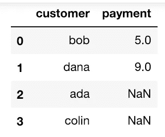
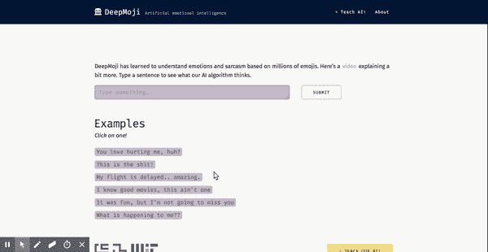
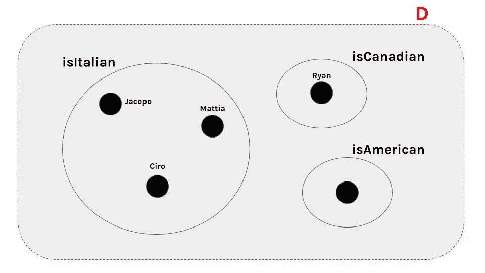
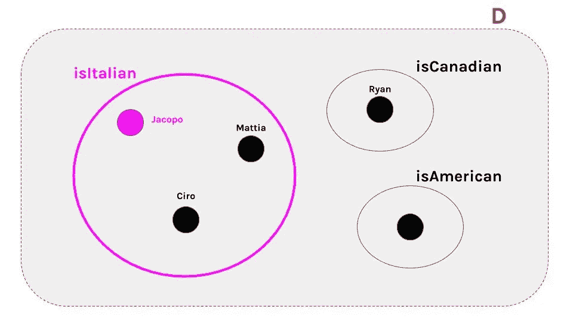

# 《生命的意义》及其他 NLP 故事

> 原文：<https://towardsdatascience.com/the-meaning-of-life-and-other-nlp-stories-4cbe791ce62a?source=collection_archive---------18----------------------->

## 面向语言爱好者的组合语义学 Pythonic 介绍。

## “意义”的含义

> "**我们**被**的技术困住了，而我们**真正**想要的**只是**能工作的东西**。"亚当斯

尽管在这个人工智能时代，科技巨头做出了种种承诺，各种全新的小玩意迅速充斥着我们的家庭，但我们仍然很容易发现机器完全误解人类语言的令人沮丧的例子。在数千万美元之后，我们得到了这个:

Some A.I. epic fails — I’m sure you have your own top 10.

当我们期待这个的时候(顺便问一下，我的喷气背包在哪里？):

A.I. writing a piece of music for you (awwww).

*为什么？*

简而言之，理解语言是非常困难的，因为解决语言之谜意味着在一个同样困难的问题网络中航行，这些问题涉及我们认知能力的极限、逻辑表达的能力以及人类社会的怪癖和偏见:在柏拉图关于这个问题的思想提出多年后，我们仍然远远没有一个好的理论。

对于“[自然语言处理](https://en.wikipedia.org/wiki/Natural_language_processing)”(或“[自然语言理解](https://en.wikipedia.org/wiki/Natural-language_understanding)”， *NLU* ，就像最近酷孩子说的)来说，显然是*意为*的概念:可以说，我们在 NLU 仍然落后的原因之一是，我们对于*意为*没有一个好的、统一的观点。由于技术和历史原因，文献在某种程度上分为两种观点:

*   有一种“统计”观点，例如由 [word2vec](https://arxiv.org/pdf/1301.3781.pdf) 和相关[作品](https://www.microsoft.com/en-us/research/wp-content/uploads/2016/02/rvecs.pdf)举例说明，主要在机器学习社区中进行:这里的焦点主要是词汇项和语义关系，如同义词；通常，这些分析成为下游系统应对挑战的支柱，如情感分析和[文本分类](https://github.com/m2dsupsdlclass/lectures-labs/blob/master/labs/06_deep_nlp/NLP_word_vectors_classification_rendered.ipynb)。在一句广告语中，*意为*是多维语义空间中的向量；
*   有一种关于意义的“功能”观点，例如由[本](https://www.press.uchicago.edu/ucp/books/book/distributed/R/bo3685980.html)和[相关的著作](http://www.computational-semantics.eu/)举例说明，主要由[语言学家](https://mitpress.mit.edu/books/ontological-semantics)，语言哲学家和逻辑学家执行:这里的重点主要是推理的系统规则和语义关系，如蕴涵；典型的任务是自动推理和知识表示。在广告语中，*表示*是语言片段的功能(如名词、连接词等)。)到集合论对象(例如集合的元素、函数等)。).

虽然这种区分显然有点过于简单(虽然，例如，非常接近于背景中的 [*Baroni 等人的*](http://csli-lilt.stanford.edu/ojs/index.php/LiLT/article/view/6\) )，但这是一个很好的初步近似:第一种方法更实用，更善于解释[词汇概念](http://cocosci.princeton.edu/papers/vector_space_analogy_cogsci2017_final.pdf)之间的关系( [*男人*对于*国王*，什么*女人*对于……？](https://www.aclweb.org/anthology/D14-1162)”；第二种比较抽象，善于解释文字[如何组合在一起](https://www.jstor.org/stable/25001052)产生复杂的概念。

为了在深入理论之前立即理解一些实际后果，请考虑您最喜欢的 CRM 中的以下客户表:



A sample customer table recording customers and payments.

有许多问题我们希望我们的计算机能自动回答:所有的顾客都付款了吗？鲍勃明确付钱了吗？鲍勃比阿达付的多吗？

在“统计”视图下(比如，[一个深度学习聊天机器人](/training-a-goal-oriented-chatbot-with-deep-reinforcement-learning-part-i-introduction-and-dce3af21d383))，我们会尝试收集许多(*许多！*)配对<问题，在这个和类似的设置中回答>，然后想出一些优化程序，让我们的系统准备好回答看不见的问题。在“功能”的观点下，我们将*首先*教计算机关于列和它们的关系，然后使用语义的力量通过评估合适的正式语言的表达式来回答看不见的问题。所谓的“作为推理的查询”范式不需要大数据训练，并且随着问题复杂性的增加，可以预测地推广，但它有自己的缺点。

我们相信这两种传统都使我们对语言的理解有了很大的进步，但是当然没有一种传统能让我们达到 HAL 9000。无论您选择什么武器来应对当前的 NLP 挑战，对这两种观点的深刻理解对于在艰难的现实场景中取得进展都是至关重要的。既然有[大量最近的材料](http://w4nderlu.st/teaching/word-embeddings) 关于第一个传统已经[可用](https://www.kaggle.com/pierremegret/gensim-word2vec-tutorial)，*这个*小帖子将作为我们(固执己见的)第二个中基本概念的介绍。

*免责声明:这篇文章主要是为熟悉统计 NLP 工具包(从* [*后退语言模型*](https://en.wikipedia.org/wiki/Katz%27s_back-off_model) *，到*[*word 2 vec*](https://en.wikipedia.org/wiki/Word2vec)*)但从未接触过形式语义的刺激和危险的数据科学家和受过教育的读者写的。遵循古语“*我不能创造的，我不理解的”，*我们强化了共享一个* [*小 Python 项目*](https://github.com/jacopotagliabue/tarski-2.0) *的概念(完整细节在最后)。另一方面，已经熟悉模型理论但不太熟悉现代编程语言的读者可以使用 repo 来了解“语义计算”如何通过代码来表达(请注意，我们将在这里或那里稍微滥用符号和术语，以专注于建立直觉，而不是开发正式的系统)。*

***这个帖子的代码可以在***[***GitHub***](https://github.com/jacopotagliabue/tarski-2.0)***上免费获得。***

## 思想的语言(或者:如何用简单的概念表达复杂的概念)

> ”**命题是其真值条件的表达。**”—维特根斯坦，[《逻辑哲学论》](https://en.wikipedia.org/wiki/Tractatus_Logico-Philosophicus) (4.431)

为了理解作为一门学科的形式语义学(以及它与其他方法的不同)，我们需要回到 20 世纪初的一个疯狂的奥地利人身上。*理解一句话的意思是什么？*

> 理解一个句子的意思意味着理解它的真值条件，也就是说，理解如果这个句子是真的，这个世界会是什么样子。

所以，要让“狮子比家猫大”成为事实，世界应该是这样的:一种给定类型的猫科动物比另一种更大(真)；要让“狮子比蓝鲸大”成为真，世界应该是这样的，给定类型的猫科动物比给定类型的水生哺乳动物大(假)(请注意:我们能确立句子是真/假的事实与理解它无关；每个人都明白“1517 年 1 月 1 日威尼斯的猫的总数是奇数。”，但没人知道是不是真的)。

所以如果我们买那个*意=真条件*，问题不就解决了吗？实际上*没有*，因为可能的句子数量是*无限的*:没有一个列表，无论多么大，都会给我们“英语的所有真实条件”。让读者惊讶不已的是，下面这句话——很可能是历史上第一次写在这里**—**——可以毫不费力地理解:

> 46 只企鹅从 Ciad 的一个基因实验室意外逃脱后，在撒哈拉沙漠中失踪。

这是怎么发生的？资源有限的有限头脑怎么可能无限理解*许多事情？*

形式语义就像玩无限乐高:复杂的乐高是用更简单的积木搭建的，更简单的乐高是用基本的乐高积木搭建的；如果你知道砖块是如何组合的，并且有一些砖块作为开始，你可以创造出无数的东西。以非常相似的方式，一个句子的(待定义)含义可以预测地从其成分的(待定义)含义中建立起来:所以如果你知道*企鹅*和*撒哈拉*的含义，你就可以理解一只企鹅在沙漠中迷路意味着什么。

> 形式语义学是研究指令集的学科，在指令集里我们的语言可以被组合在一起。

如果所有这些对人类来说都很简单，那么检查一些著名的 NLP 架构中的组合性将会很好。以下面的两个句子和 [DeepMoji](https://deepmoji.mit.edu/#) 为例，这是一个建议表情符号的神经网络(这个例子来自我们的[人工智能观点文章](/in-praise-of-artificial-stupidity-60c2cdb686cd)):

*   我的航班被延迟了..太神奇了。
*   我的航班没有延误..太神奇了。



The same emojis are suggested for the sarcastic vs normal sentence (original video [here](https://drive.google.com/file/d/1rI0uV_5TsqpxXf2mYQmTxkx_4a3NlxdY/view)).

这两个句子只有一个单词不同(*而不是*)，但我们知道这个单词是“特殊的”。*而不是*促成的方式(是的！)上面句子的真值条件被 DeepMoji 完全忽略了，它甚至不拥有一个非常基本的复合性概念；换句话说，在一个句子中添加否定通常不会在一条想象的“意义线上”移动几个点(无论如何解释)(就像在“这个蛋糕(非常)好”中添加“非常”)，而是完全“颠倒”它。

无论 DeepMoji 和类似系统中嵌入了什么“语言理解”,如果我们要捕捉上面的*而不是*行为，我们需要一种完全不同的方式来表示*的含义*。形式语义学的故事是关于我们如何利用数学使“语言乐高”的概念更加精确和易于处理的故事。

请注意，这不是一个大团圆结局的故事。

## 语义学 101

> "在我看来，自然语言和逻辑学家的人工语言之间没有重要的理论区别。"——r·蒙塔古

关于*表示*的一个关键问题是，它有两个*元素——回想一下上面那个古怪的奥地利人的定义:*

> …理解如果这句话是真的，世界会是什么样子。

所以有一个*句子*，没错，但也有*世界*:意义，本质上是我们的语言和我们的世界之间的某种关系(从技术上来说，[多个世界](https://en.wikipedia.org/wiki/Kripke_semantics)，但事情就变得复杂了)。由于世界是一个相当大且不切实际的东西，我们使用集合论中的对象作为我们的世界模型。在公式和代码之前，我们将首先使用这一部分来建立我们的直觉。

我们的第一个玩具语言由以下基本元素组成:

```
names = ['Jacopo', 'Mattia', 'Ryan', 'Ciro']
predicates = ['IsItalian', 'IsAmerican', 'IsCanadian']
connectives = ['and']
negation = ['not']
```

基本元素可以根据以下语法规则进行组合:

```
a "name + predicate" is a formula
if A is a formula and B is a formula, "A connective B" is a formula
if A is a formula, "negation A" is a formula
```

这意味着下面的句子都是 *L* 的一部分:

```
Jacopo IsItalian
Mattia IsAmerican and Jacopo IsItalian
not Jacopo IsItalian
...
```

现在是时候介绍一下*语义*了:虽然我们可能会被诱惑*使用一些背景知识来解释 L* (例如，我的名字是“雅格布”)，但记住 *L* 中的句子没有任何意义是绝对重要的。由于我们期望复杂事物的意义是从简单事物建立起来的，我们将从*名称*和*谓词*的意义开始，因为“名称+谓词”是我们需要解释的最简单的句子。我们从论域 *D* 开始，论域是由一些元素和一些子集组成的集合，然后我们说:

*   名字的意义(它的“外延”)是 D 的一个元素；
*   谓词的意义(它的“外延”)是 d 的子集。

*D* 是我们模型的通用“容器”:它只是一个“盒子”,里面有表示 *L.* 中的含义所需的所有部分。如果您将一个示例 *D* (如下)可视化，就很容易理解我们如何为“名称+谓词”句子定义*真值条件*:

*   如果 A 是“名+谓”句，则 A 为真当且仅当`name`的外延在`predicate`的外延内。



A sample domain for our toy language L.

比如说:

*   当且仅当代表`Jacopo`的 *D* 中的元素是代表`IsItalian`的集合的成员时，“Jacopo IsItalian”为真；
*   当且仅当代表`Jacopo`的 *D* 中的元素是代表`IsCanadian`的集合的成员时，“雅格布是加拿大人”为真。

正如我们所了解的，*真值条件*不会告诉你什么是真/假，而是告诉你这个世界(更好地说，你的世界模型)对于事物的真/假应该是什么样子。有了我们的定义，我们可以再次查看我们的 *D* 并且我们可以看到，在我们的例子中，“雅格布·伊斯塔利亚”是真的，而“雅格布·伊斯塔利亚”是假的。



The extension of “isItalian” contains the denotation of “Jacopo” (in purple).

当 *L* 中的一个句子在我们这个集合论的小世界中为真时，我们也说这个句子在模型中是*满足*(从技术上讲，对句子来说*为真*是对一般公式来说*满足*的特例)。既然我们已经为基本句子定义了真值条件，我们就可以通过基本句子来定义复杂句子的真值条件:

*   如果 A 是公式，B 是公式，“A 和 B”为真当且仅当 A 为真，B 为真。

比如说:

*   当且仅当雅格布·伊斯塔里安和马蒂亚·伊斯塔里安为真且马蒂亚·伊斯塔里安为真时，雅格布·伊斯塔里安和马蒂亚·伊斯塔里安为真。

由于“Jacopo IsItalian”和“Mattia IsAmerican”是“名+谓”句，我们现在可以完整地拼出意思了:

*   当且仅当代表`Jacopo`的 *D* 中的元素是代表`IsItalian`的集合的成员，代表`Mattia`的 *D* 中的元素是代表`IsAmerican`的集合的成员。

有了我们的定义，我们可以查看 *D* 并且看到“雅格布·伊斯塔里安和马蒂亚·伊萨美国”是错误的，因为“马蒂亚·伊萨美国”是错误的:


The extension of “isAmerican” does not contain the denotation of “Mattia” (in blue).

最后，我们可以在我们的*语义*中看到*否定*如何确实是一个“反转”操作:

*   如果 A 是一个公式，“非 A”为真当且仅当 A 为假。
*   “不是雅格布·伊斯塔里安”为真，当且仅当“雅格布·伊斯塔里安”为假。
*   当且仅当代表`Jacopo`的 *D* 中的元素不是代表`IsItalian`的集合的成员时，“not Jacopo IsItalian”为真。

显然，为我们的玩具语言 *L* 指定真值条件对于构建 HAL 9000 并不是非常有用。但即使是这个简单的例子，也应该注意两件事:

1.  我们的*语义*是完全复合的，并允许*以有限的方式为无限数量的句子*分配真值条件:在 *L* 中没有一个可能的句子被我们的意义定义遗漏。更具表达力的语言会有(更)复杂的组合规则，但总的要点是一样的:一组有限的指令自动概括成无限多的目标句子；
2.  我们对 *D* 的选择只是众多可能性中的一个:我们可以选择一个“Mattia IsAmerican”为真的世界，我们的*语义*也是一样的——记住，*语义*分配真值条件，但它没有说明这些条件实际上是如何满足的。在现实世界的应用中，我们也经常对*真理*感兴趣，因此我们需要将语义与“知识库”相结合，即关于我们所关心的世界的具体事实:当对现实世界的现象建模时， *D* 应该被解释为与其“同构”，因此“在 *D* 中为真”将意味着“在感兴趣的领域中为真”。

专业读者可能已经猜到了我们如何通过利用上面的(1)和(2)来构建具有直接价值的应用程序:(1)保证由语义编码的知识很好地一般化；(2)保证在我们仔细选择目标域的范围内，满意度算法将评估所有并且只有我们关心其真实性的句子为真。

特别是，即使是计算语义学中更简单的程序(比如检查任意公式满意度的代码)也可以被看作是作为推理的的*查询的一个实例(这里支持):*

> 给定一个以某种有用的方式(例如数据库)建模的世界状态，机器能自动回答我们关于感兴趣的领域的问题吗？

在接下来的章节中，我们将在这样的背景下探索一种稍微复杂一点的语言。

【**额外的技术要点**:如果*语义*不以任何方式约束真理——即就语义而言，一个`Jacopo isItalian`为真的世界和一个`Jacopo isCanadian`为真的世界一样好——它本身有帮助吗？是的，非常，但是要知道为什么我们需要明白语义学的*核心概念*确实是*蕴涵、*即研究在什么条件下一个句子 X 在逻辑上被一组句子 Y *1* ，Y *2* ，… Y *n* 所隐含。特别是，真正的问题语义学设定的答案是:

*   给定一个域 *D，*一个句子 *X，*一个句子 *Y* ，如果 *D* 中 *X* 为真，那么 *Y* 也必然为真吗？

*蕴涵*也是证明理论的关键概念:事实上，我们对演绎系统和语义之间的[关系有一个惊人的证明，但这个笔记太小，无法包含它。]](https://en.wikipedia.org/wiki/G%C3%B6del%27s_completeness_theorem)

## *“查询*作为推理”使用计算语义

> "为了理解递归，你必须首先理解递归."— [我的 t 恤](https://www.thinkgeek.com/images/products/frontsquare/b2ae_recursion.jpg)

假设下表摘自我们的 CRM:


A sample customer table recording customers and payments.

即使看着这样一个简单的表格，我们也可能会想问很多有趣的问题:

*   所有顾客都付钱了吗？
*   *Bob* 具体付出了吗？
*   鲍勃付了五美元吗？
*   *…以此类推*

我们可以很好地利用我们的框架，为这个领域制定一个语义，然后查询系统以获得我们需要的所有答案(描绘这个用例的 Python 笔记本也包含在[的报告](https://github.com/jacopotagliabue/tarski-2.0)中)。因此，第一步是创建一种语言来表示我们的目标领域，例如:

```
names = ['bob', 'dana', 'ada', 'colin'] + digits [0-9]
unary predicates = ['IsCustomer', 'IsPayment']
binary predicates = ['MadePayment', 'HasTotal']
quantifiers = ['all', 'some']
connectives = ['and']
negation = ['not']
```

我们的语言允许我们表达这样的概念:

```
there is a thing in the domain of discourse which is a customer named bobthere is a thing ... X which is a customer, a thing Y which is a payment, and X made Ythere is a thing ... which is a payment and has a total of X
```

第二步是建立一个模型，忠实地代表我们的兴趣表。换句话说，我们需要构建一个对象域，即名称和对象之间的映射，并正确地解释谓词扩展，以便表中指定的属性在模型中一致地表示:

```
domain: [1, 2, 3, 4, 5, 6],
constants: {'bob': 1, 'dana': 2, 'ada': 3, 'colin': 4},
extensions: {
  'IsCustomer': [[1], [2], [3], [4]],
  'IsPayment': [[5], [6]],
  'MadePayment': [[1, 5], [2, 6]]
  ...
}
```

一旦完成，我们就可以查询系统，让机器自动计算答案:

*   `Did all customers pay?`变成查询`For each thing x, if x IsCustomer, there is a y such that y IsPayment and x MadePayment y`，评估为`False` [ **加分技术点**:为了简洁起见，我们一直在跳过涉及`all`语义的确切细节，其含义远比简单的名称复杂；感兴趣的读者可以探索我们的[回购](https://github.com/jacopotagliabue/tarski-2.0)，了解计算`all`和`some`含义所需的所有技术步骤。
*   `Did Bob pay?`成为查询`There is an x such that x IsPayment and bob MadePayment y`，被求值为`True`。
*   `Did Bob pay 5 dollars?`成为查询`There is an x such that x IsPayment and bob MadePayment x and x HasTotal 5`，被评估为`True` [ **附加技术要点**:为了快速扩展语义以处理数字比较，我们必须 I)在语法规范中引入数字，ii)修改原子公式中的满意度定义，以确保数字映射到自身。显然，全面概括地包含数字需要更多的技巧:鼓励非常不懒惰的读者从现有的框架开始思考如何做到这一点！].

这不是很棒吗？如果我们的模型反映了底层的客户表，我们可以问*几乎无限多的问题*，并确保能够精确地计算出答案——所有这些都只需要几行 Python 代码。

## 从玩具模型到现实

> “从理论上来说，理论和实践之间没有区别。实际上是有的。”-y .贝拉

“作为推理的查询”范式具有形式逻辑的所有优雅和美丽:一个小的和很好理解的 Python 脚本可以用来回答目标领域中潜在的无限问题。不幸的是，它也有形式逻辑的所有*缺点*，这使得它在实验室之外的直接应用不像你希望的那样简单:

*   *语义*正如我们所定义的，它仅限于表达一些基本的概念和关系，但我们希望做得更多(例如，我们希望`sum`关注上面客户表中的数字)。虽然可以扩展框架以覆盖日益复杂的结构，但这需要付出一些复杂性和人工成本；
*   真实用例中的模型构建需要做出许多艰难的决定:在我们的玩具客户表示例中，我们仍然需要做出重要的选择，如何将表行映射到可以正式查询的域。用例越复杂，数据科学家就越难产生一个紧凑、完整、可扩展的形式域；
*   *查询*是用一种正式的语言完成的，这种语言对人类并不友好:用户必须知道如何将英语翻译成某种合乎逻辑的方言才能得到想要的答案。当然，一个*好得多的 UX* 将为用户提供一个英文搜索栏，并提供一个从自然语言翻译成正式语言的中间层——我们在[所做的一些工作也是如此——因此](https://tooso.ai/)利用了这种想法的一个版本，使查询尽可能地人性化[ **为倾向于历史的读者注意**:定义正式语言的语义，然后提供英文到正式语言的翻译可以追溯到开创性的 [PTQ](http://www.cs.rhul.ac.uk/~zhaohui/montague73.pdf)

这些可伸缩性问题和其他技术原因(例如一阶逻辑中的[完全通用推理的限制](https://math.stackexchange.com/questions/2680534/first-order-logic-clauses-decidability))在历史上阻止了计算语义像其他 NLP 工具一样在行业中普及。最近，一些[研究项目](http://csli-lilt.stanford.edu/ojs/index.php/LiLT/article/view/6%5C)致力于弥合基于向量的观点和基于集合论的观点之间的差距，试图两全其美:统计的可扩展性和灵活性，逻辑的组合性和结构。此外，来自概率编程社区的研究人员正在该框架内工作，将概率和组合性结合起来，以系统地解释语用现象(见我们自己关于主题的文章[这里](/fluid-concepts-and-creative-probabilities-785d3c81610a))。

> 在 [Tooso](https://tooso.ai/) ，我们的愿景一直是弥合人类与数据之间的鸿沟。虽然我们相信没有一个单一的想法能够解决*的含义*的谜团，并且这个谜题的许多部分仍然缺失，但我们确实认为，在人类历史上，没有比现在更好的时机来用全新的理论眼光和当今可用的令人难以置信的工程工具来应对这一挑战了。
> 
> 在我们完全解决语言之谜之前，有许多用例需要* *一些** 语言理解，这可以释放巨大的技术和商业价值。

作为最后一个额外的考虑，从科学到“更大的图景”，让我们不要忘记，在这篇文章之后，我们现在应该准备好最终知道“生命”的意义是什么(轶事显然是由著名的语义学家[芭芭拉·帕蒂](https://en.wikipedia.org/wiki/Barbara_Partee)引起的):我们必须将它翻译成一个常数符号*生命*，并使用一个运算符如`|`来表明我们正在讨论它在我们的模型中的扩展。所以，说到底，“命”的意义就是`|life`。也许这就是那个疯狂的奥地利人所说的:

> 即使所有可能的科学问题都被回答了，生命的问题仍然完全没有被触及。

但这显然是一个完全不同的故事。

## 再见，太空牛仔


这就是全部，伙计们:有数学倾向的读者有兴趣接受语义的更正式的处理，一般来说，形式逻辑的主题，被邀请从[语言、证明和逻辑](https://www.amazon.com/Language-Proof-Logic-David-Barker-Plummer/dp/1575866323)开始，继续[可计算性和逻辑](https://www.amazon.com/Computability-Logic-George-S-Boolos/dp/0521701465)，最后用[一阶模态逻辑](https://www.springer.com/us/book/9780792353348)探索可能世界的迷人概念。

如有要求、疑问、反馈，请联系[jacopo . taglia bue @ tooso . ai](mailto:jacopo.tagliabue@tooso.ai)。

别忘了在[媒体](https://medium.com/tooso)、 [Linkedin](https://www.linkedin.com/company/tooso) 、 [Twitter](https://twitter.com/tooso_ai) 和 [Instagram](https://www.instagram.com/tooso_ai/) 上获取 [Tooso](http://tooso.ai/) 的最新消息。

## 感谢

感谢 Tooso 团队的所有成员对本文前一稿的建议和反馈。

## Python 3 时代的塔尔斯基

> "真理只能在一个地方找到:代码."
> ― **马丁公司**

配套的 [Github repo](https://github.com/jacopotagliabue/tarski-2.0) 包含 Python 3.6 中的一个工作“模型检查器”，即一个 Python 项目，给定一个公式和一些域，自动评估公式是否满足。

虽然代码被大量注释并且非常容易理解，但是我们在这里提供了对其主要部分的非常高级的描述；虽然我们不知道其他 Python 检查器也是以类似的精神构建的，但代码是作为本博客和相关项目的教育工具而不是作为高性能软件编写的(有趣的是，Bos 和 Blackburn 还在他们的书中[哀叹](https://www.press.uchicago.edu/ucp/books/book/distributed/R/bo3685980.html)实现“普通的”一阶检查器非常困难)。项目结构如下:

```
project_folder notebooks
      tarski-2-pandas.ipynb   fol_main.py
   fol_grammar.py
   fol_semantics.py
   fol_models.py test_fol_semantics.py README.md
   requirements.txt
```

核心文件如下:

*   展示了如何从静态集合中加载一个模型，实例化语法和语义的类，以及评估一个表达式。
*   `fol_grammar.py`是处理检查器语法部分的类——它在内部使用 [lark](https://github.com/lark-parser/lark) 来解析类似 FOL 的表达式，它有一个内置的递归函数来检索公式中的自由变量。如果你想扩展/改变词汇或语法约定，这就是你应该开始的地方。
*   `fol_semantics.py`是处理语义的类——该类公开了*check _ formula _ satisfaction _ in _ model*函数，该函数采用一个表达式和一个模型，将公式计算为模型中的`True/False`。这个类在一个带有*部分*赋值的模型中定义满意度，比经典的[塔斯基](https://en.wikipedia.org/wiki/Alfred_Tarski)的工作更多地遵循[这个](https://www.amazon.com/Language-Proof-Logic-David-Barker-Plummer/dp/1575866323)。如果您想添加语义规则或修改满意度以涵盖额外的数据结构(比方说，数据库而不是 Python 中指定的模型)，这是您应该考虑的地方。
*   `fol_models.py`包含了一些基本的模型，可以让你开始探索检查器的行为(一些模型对于测试也非常有用)。如果您有自己的目标域要建模，您可以按照提供的示例在这里添加一个 Python 对象，然后使用`fol_main.py`调用该模型上的检查器。
*   `test_fol_semantics.py`包含一系列测试(我们通常使用 [pytest](https://docs.pytest.org/en/latest/) 进行 Python 测试)来确保检查器在不同条件下的行为符合预期。

编码快乐！