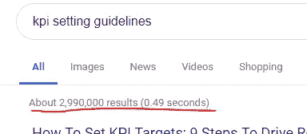

# 度量元游戏

> 原文：<https://towardsdatascience.com/the-metrics-meta-game-982001b16e6d?source=collection_archive---------17----------------------->

## 作为公司内部良好数据实践的管理者，我们数据专业人员经常被要求帮助设置指标，无论我们喜欢与否，我们都在围绕这个过程玩一个完整的元游戏。

It’s all games and moody lighting until someone loses an eye

度量设置是一项艰巨的工作。虽然有大量关于如何选择和挑选指标和 KPI(关键绩效指标)的建议，但它们都要求你非常熟悉企业的运作方式，并理解其根本目标是什么。

你必须确保事情被正确衡量，与你的主要目标有因果关系，或者至少有很强的相关性。它必须相对容易理解，你可以影响和改变，最重要的是，你只能选择其中的一小部分。平衡所有这些竞争因素是一门艺术。

So. Much. Ink.

然后，一旦你完成了所有的工作，你还有最后一个老板要处理——古德哈特定律。

> "任何观察到的统计规律性，一旦出于控制的目的对其施加压力，就会趋于崩溃."

从本质上讲，你选择和使用的任何指标，人们都会找到一种方法来玩弄它，它对我们选择它的目的不再有用。这种游戏行为可能非常危险，因为它颠覆了最初创建指标的初衷，甚至可能违背初衷。

他们这样做可能是因为外在的动机，比如他们的年度奖金取决于此，或者他们这样做可能是因为内在的原因，比如他们只是想要一个高分。人类是怪异却聪明的生物。

一个公制的设定者应该做什么？

## 否决明显自私的指标

典型的情况是，销售团队希望他们的奖金基于带来的销售线索数量，而忽略了实际完成的交易数量(和规模)。显然，积累大量销售线索比达成交易更容易，这种衡量标准的游戏显然会导致浪费大量时间来产生永远不会达成的销售线索，从而损害实际达成的交易。

大多数真实世界的例子不会那么明显，但它们通常符合一个人相对容易操纵的指标模式，同时又不完全符合公司的目标。*它们是被拉动的杠杆，而不是杠杆被拉动后系统的结果。*人们往往只关注短期收益，而忽视长期影响。

当设定一个指标时，你应该经常问自己，为了达到这个指标，需要采取什么样的行动。戴上你的黑帽子，看看你是否能想出阴险的方法来“赢得”游戏。

## 接受游戏的发生，尽你所能去适应它

几乎任何指标都是可以博弈的，你一个人不可能想出一个给定指标的所有漏洞和后门，更不用说那些会受指标影响的聪明人了。因此，承认元博弈的存在，并问自己“如果这个指标被滥用，它会疯狂上涨，会发生什么，它会是一个净正数吗？”

一个例子是某人在脸书上的朋友数量，尤其是在早期。当然，肆无忌惮的人可以也确实在脸书上购买大量的机器人朋友，但平均来说，拥有更多联系的用户会让社交网络变得更强大、更有粘性。机器人可以作为一种扭曲力量单独处理，但从脸书的角度来看，出于自身原因试图最大化数量的正常人类可以被视为积极的。

免责声明:我从未与脸书合作过，也没有听说过他们的标准，我只是编造了一些说明性的例子。

总体而言，该指标与公司的核心使命越一致，就越有可能产生类似的积极关系。

## 控制出现的扭曲因素

和前面的例子一样，由于各种原因，一个度量标准可能是好的，但是仍然有明显的方法可以进行游戏。尽管遇到了挫折，您可能仍然认为这是一个正确的衡量标准，因为它对许多其他结果非常重要。在这种情况下，您可以通过明确地从指标中排除某些类型的行为(例如，排除所有内部用户)，或者根除扭曲的来源(例如，禁止所有机器人)，来建立针对游戏行为的防护栏。

虽然这是一种不令人满意的反应姿态，但抓住骗子的成本可能是你可以接受的。请注意，它催生了一系列关于如何发现和抓住骗子的新指标讨论。它的度量会议一路向下。

## 无论你选择什么，都要保持警惕

自由的代价可能是永远的警惕，但可悲的是，这同样适用于核心公司指标。人们需要时刻警惕不当行为。这真的很难做到，因为在事情顺利进行了一年之后，很容易变得自满。

至少，每隔一段时间(可能每隔 1-3 年)，建议进行一次新的分析，看看最初使该指标具有吸引力的因素(与公司目标的一致性、简单性、变革能力)是否仍然有效。业务和人员会发生变化，您的度量标准也需要随之变化。

类似地，如果一个指标讲述了一个伟大的成长故事，其他指标应该讲述这个故事的变化，理想的是那些测量完全不同的系统或过程的指标。当一部分说了伟大的事情，而另一部分没有时，要保持警惕。

## 不要麻痹大意

很容易被所有这些问题淹没。我的建议是，做好你的系统运行的功课，获得反馈，然后花一两天时间思考效用和漏洞。之后，根据你所知道的，挑选看起来最好的。

你不太可能第一次(或者永远)就把你的核心指标做到完美。幸运的是，度量是我们为自己制造的工具。当它们不起作用时，我们可以改变它们。

# 其他参考文献

我只关注指标设置的游戏/滥用方面，因为我认为这是探索最少的部分。像往常一样，我从我的个人经历中汲取了很多，而且会有各种各样的差距。YMMV。

关于度量设置的一些更严肃的处理，从上到下，看看这些替代来源:

[“构建更少缺陷的度量标准”——David Manheim](https://mpra.ub.uni-muenchen.de/90649/1/MPRA_paper_90649.pdf)——关于度量标准和古德哈特定律的学术论文

以及一个有趣的框架来定义新的指标:

 [## 为任何产品定义优秀指标的 4 个步骤

### 一个心智模型和框架，你可以用于新产品、现有产品，甚至 PM 访谈

hackernoon.com](https://hackernoon.com/metrics-game-framework-5e3dce1be8ac)