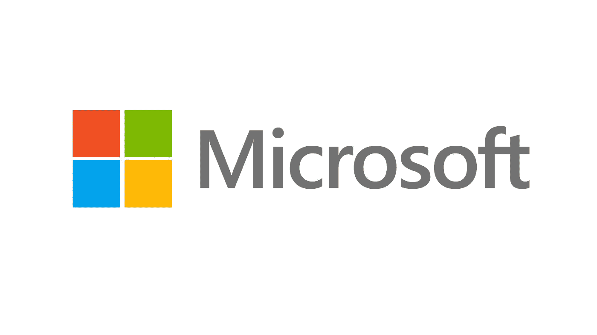
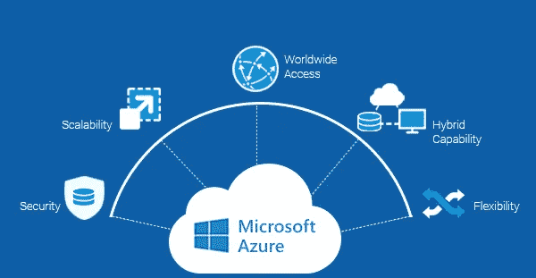

# 微软数据科学家访谈

> 原文：<https://towardsdatascience.com/the-microsoft-data-scientist-interview-e511d6947652?source=collection_archive---------2----------------------->

## 微软数据科学面试问题

在 Azure 和它的机器学习工具成为云计算市场上最大的服务提供商之后，微软一直是数据科学行业的一个大玩家。因此，在过去五年里，微软一直在缓慢但稳步地建设其数据科学团队，以成为招聘该职位的最大公司之一。

# **工作角色**

微软数据科学家的角色变化很大，取决于你面试的团队。每一份微软数据科学工作都是不同的，从基于分析的角色到更多的机器学习任务。作为一家庞大的多企业集团公司，微软有不同的团队，从事语音和语言、人工智能、Azure 上的机器学习基础设施、云计算的数据科学咨询等工作。

## **所需技能**

微软通常更倾向于雇用至少有 2 年以上数据科学工作经验的有经验的候选人担任中级职位。一般资格是一个定量领域的博士学位，以及在这些领域中的任何一个领域(DNN、NLP、时间序列、强化学习、网络分析或因果推理)的几年经验。

*   以前在 DNN，自然语言处理，时间序列，强化学习，网络分析，因果推理或任何相关领域的经验
*   精通以下任何数字编程语言(Python/Numpy/Scipy、R、SQL、C#或 Spark)
*   具有 AWS 或 Azure 等基于云的架构的经验

## **数据科学家有哪些类型？**

微软有一个工程部门叫做**数据和应用科学**。这个部门的员工通常被分成团队，有三个主要头衔:**数据科学家、应用科学家和机器学习工程师**。根据团队的不同，他们的职能包括:

*   编写代码将模型交付生产。
*   为机器学习算法编写代码，供其他数据科学家使用。
*   直接或间接与客户合作解决技术问题。
*   致力于度量和实验。
*   开发产品功能。

微软数据和应用科学家角色的理想候选人应该能够应用广泛的机器学习工具和分析技术来回答广泛的高影响力业务问题，并以简洁有效的方式提出见解。

# **面试**

Azure ML

## **初始屏幕**

提交工作申请后，第一个电话面试的人可能是招聘人员，也可能不是，这取决于职位的资历级别。很多时候，招聘经理会先进行一次 30 分钟的面试，以了解你过去的经历。

预计电话面试的这一部分将分为两个部分。你会被问到你的背景和项目，以及一些技术性的面试问题。技术面试问题将更加理论化，解释机器学习概念如何工作，或者快速概率或统计问题。

**例子:**

*   *套索和岭回归有什么区别？*
*   *你会如何向商业人士解释深度学习模型的工作原理？*
*   对于非技术人员，你如何定义 p 值？

> 点击 **查看我们的 [**机器学习面试指南。**](https://www.interviewquery.com/blog-machine-learning-interview-questions/)**

## **技术屏幕**

在招聘经理筛选之后，招聘人员将安排微软数据科学家进行第二次更具技术性的筛选。一般来说，这个屏幕是 45 分钟到一个小时，旨在测试纯粹的技术技能，以及你如何编码和解释你的思维过程。

技术屏幕由大约三个不同的问题组成，涵盖了算法、SQL 编码和概率统计的主题。期待类似于 [Python](https://www.interviewquery.com/blog-python-data-science-interview-questions/) 中的数据结构和算法的问题以及数据处理类型的问题。

示例:

*   *给定一个单词数组和一个最大宽度参数，格式化文本，使每行正好有 X 个字符。*
*   编写一个查询，从一个有 1 亿行的表中随机抽取一行。
*   *你掷出三个骰子至少掷出两个 3 的概率有多大？*

> 你即将登上去西雅图的飞机。你想知道你是否应该带一把伞。
> 
> 你打电话给住在那里的三个朋友，分别问他们是否在下雨。你的每个朋友都有 2/3 的机会对你说真话，1/3 的机会用谎言来搞乱你。三个朋友都告诉你“是的”下雨了。
> 
> 西雅图真的下雨的概率有多大？

在我们的互动指南中尝试解决微软的概率问题

## **现场面试**

现场面试包括从上午 9 点到下午 4 点的全天活动。您将会见五位不同的数据科学家，并参加一次午餐访谈。

面试小组通常是这样的:

*   概率与统计
*   数据结构和算法
*   建模和机器学习系统
*   招聘经理和行为面试
*   数据操作
*   您还将在午休时间与一两位数据科学家进行一对一的交流，以了解更多关于微软及其团队的信息。这通常是一个小时的午餐面试，他们会让你休息一下或者谈谈他们正在做的事情。

现场访谈将主要是所有不同技术概念的组合。请记住学习不同环境下的不同模型评估指标、共线性下系数的偏差/方差权衡、关于采样方案的开放式问题、实验和 ab 测试设计、向 5 岁儿童解释 p 值、贝叶斯定理的不同概念，以及向面试官教授您选择的统计学习技巧。

微软的另一个重点是**沟通**，因为微软的数据科学团队在整个组织中都有合作伙伴，以确保团队正在做有用的工作。

你可以在[面试查询](https://www.interviewquery.com/)或者 Leetcode 上找到很多数据结构和算法的问题。考虑到白板上的编码与电脑上的编码有多么不同，还建议拿一块白板来练习编写代码。

# **微软数据科学面试问题示例**

*   你如何从 600 万个搜索查询中选择一个有代表性的样本？
*   *求整数列表中子序列的最大值？*
*   *举一个你会使用朴素贝叶斯而不是另一个分类器的场景的例子？*
*   *你如何尽可能简洁地解释 MapReduce 的功能？*
*   *ROC 曲线和敏感性、特异性、混淆矩阵的含义是什么？*
*   *自动完成特性:你会如何实现它，你能指出这个工具目前的缺陷吗？*
*   *描述合并给定的 k 个大小为 n 的排序数组的有效方法。*

# 感谢阅读！

*   报名参加 [**面试查询**](https://www.interviewquery.com/) ，每周在你的收件箱里收到几个数据科学面试问题。
*   **订阅 Youtube 上的** [**我的频道**](https://www.youtube.com/channel/UCcQx1UnmorvmSEZef4X7-6g/) 获取数据科学[模拟面试](https://www.youtube.com/watch?v=e2LJ-6NagpE)，指南，以及技巧和窍门。
*   需要具体的技能面试指南吗？查看我们对 [**SQL** ，](https://www.interviewquery.com/blog-sql-interview-questions/) [**机器学习**](https://www.interviewquery.com/blog-machine-learning-interview-questions/) **，**[**python**](https://www.interviewquery.com/blog-python-data-science-interview-questions/)**，** [**产品数据科学面试题**](https://www.interviewquery.com/blog-product-data-science-interview/) **的深度分析。**