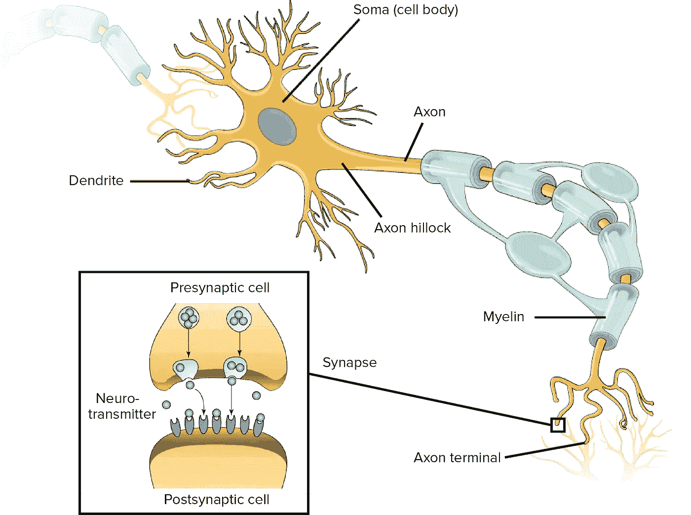

# 百万美元的神经网络，第一部分:理解生物学基础

> 原文：<https://towardsdatascience.com/the-million-dollar-neural-network-part-i-understanding-the-biological-basis-6920910a7cf9?source=collection_archive---------30----------------------->

## 了解如何建立一个神经网络，并在这个由 3 部分组成的系列中赢得 165 万美元的 CMS 人工智能健康成果挑战赛

如果我告诉你，你可以学会使用机器学习——更具体地说，神经网络——来解决医疗保健中的一些最大问题，会怎么样？

你们中的一些人可能会感兴趣。其他的，就没那么多了。

但是现在，如果我告诉你，这样做，你就有机会赢得****一百万美元，同时为人类的利益做出贡献，会怎么样呢？****

****这会引起你的注意吗？****

****如果是这样，这是你的大好机会。****

********

****Do I have your attention? Good.****

****医疗保险和医疗补助服务中心最近宣布，他们计划**分配高达 165 万美元**给[鼓励开发人工智能在医疗保健领域的现实应用](https://innovation.cms.gov/initiatives/artificial-intelligence-health-outcomes-challenge/)。****

****这项挑战被称为[人工智能健康结果挑战](http://dev.cmschallenge.com)，正如它的名字一样，要求提交使用人工智能(或机器学习，更具体地说)预测健康结果的作品:****

> ****医疗保险和医疗补助服务中心(CMS)医疗保险和医疗补助创新中心(创新中心)与美国家庭医生学会和劳拉·约翰·阿诺德基金会合作，发起了人工智能(AI)健康成果挑战。CMS 人工智能健康成果挑战赛将分配高达 165 万美元的资金，以鼓励人工智能在健康和医疗保健领域的进一步发展，并加速该技术的现实应用开发。****
> 
> ****参与者将分析大型医疗保健数据集，并开发提案、人工智能驱动的模型和框架，以准确预测计划外医院和 SNF 入院和不良事件。****

****这发生在一个令人惊叹的时代，现在构建神经网络比以往任何时候都更容易，因为 [Keras 现在充当了*tensor flow 2.0*](https://hackernoon.com/tensorflow-is-dead-long-live-tensorflow-49d3e975cf04)的高级 API(不要担心——如果你还不知道，到本系列结束时你就会知道这到底意味着什么)。****

****现在你可能会说，“那太好了，但我以前从未编写过代码，更不用说构建神经网络了。”****

****谢天谢地，*机器学习并不是真的要成为伟大的程序员。*****

******喘息** “亵渎！”你可能会说。****

********

****“You stink. You smell like beef and cheese! You don’t smell like a Data Scientist.”****

****现在这只是我个人的看法，所以要半信半疑——但机器学习更多的是理解算法背后的******和学习***如何*** ***机器学习*** 而不是编码。**********

***当然，您需要牢牢掌握 Python*。但是，让数据科学家脱颖而出的是对底层概念的非凡理解，而不是非凡的编码能力。***

*****和 SQL 进行数据工程，处理数据库等。你大部分的时间都将在那里度过。不幸的是，这种很酷的机器学习只是大多数数据科学家日常工作的一小部分****

******

***From *Forbes, “*Cleaning Big Data: Most Time-Consuming, Least Enjoyable Data Science Task, Survey Says”***

***这就是为什么，在本教程的第 1 部分和第 2 部分，我们将花很多时间关注概念(第 1 部分的生物学基础；第 2 部分中的机器上下文)，然后在第 3 部分中实际构建我们的神经网络。***

# ***神经网络的生物学基础***

## ***神经元解剖学***

***我们的大脑由神经元组成。没有变得不必要的复杂，神经元通过**树突**(图中那些看起来像头发的小家伙)接收来自其他神经元的大量输入。***

***当这些输入在**细胞体**(细胞体，或“头”到树突“毛”)中达到足够的阈值时，一个**动作电位**被触发，这意味着信号或“消息”沿着神经元的**轴突**(细长的“尾巴”)传递，从**轴突小丘**(基本上是轴突的起点)开始，一路向下到达**轴突末端**(末端)***

***轴突周围的**髓鞘**本质上是作为轴突电线的绝缘体，允许信号快速有效地传输。***

***轴突终末连接(有点——它们实际上不*接触】下一个神经元的树突，并通过被称为**神经递质**的化学物质将它们的信号穿过**突触**(一个神经元的轴突终末和另一个神经元的树突之间的小间隙)(这是另一整桶蠕虫，我们在这里并不需要真正了解)。****

***突触前的神经元和突触后的神经元分别称为**前**和**后**。***

******

***Finally, for once, my undergrad neuroscience major is coming in handy! Image Source: Khan Academy***

***这里过于简单化了(对不起，神经科学家)，但让我们来做:假设一个神经元从你的眼睛接收输入，并沿着它的轴突传递信号，并向控制你眼睑的肌肉传递输出。***

***如果信号足够强(即大量的阳光)，就会触发一个动作电位，信号就会向下发送到控制你眼睑的肌肉(即闭上你该死的眼睛，这样你就不会失明)。***

## ***动作电位***

***让我们来看一个例子，让你了解这些神经元是如何相互传递信号的:***

***让我们想象一下，这些小树突中的每一个都接收到一个输入，我们将为其分配一个-5 到+5 的合成值。在这个假想的例子中，胞体沿着轴突传递信息的阈值是+10。***

***假设我们得到三个+5 的输入，两个-3 的输入，三个 0 的输入。(3*5) + (2*(-3))+(3*0) = +9，因此不会触发动作电位。现在，假设我们得到两个+5 的输入，两个-3 的输入，三个+2 的输入。(2*5) + (2*(-3))+(3*2) = +10，所以我们*会*得到一个动作电位。***

***如果这个总数是 10，20，或 100，这并不重要。**只要达到或超过阈值，就会触发同等强度的动作电位。**如果没有达到或超过阈值，**什么都不会发生** —没有微小或部分信号。这就是所谓的**“全有或全无”原则**。***

## ***让我们总结一下***

*****神经元**通过**树突**接收输入。这些输入然后在细胞体中相加。如果集体输入达到或超过该神经元的特定阈值，则触发**动作电位**(回忆**“全有或全无”**原则)。***

***然后信号沿着**轴突**向下传播，从**轴突丘**开始，一路向下到达**轴突末端**，在那里它转变为化学信号——即**神经递质**穿过**突触**，从**突触前**神经元到**突触后**。***

# ***好的，太好了。但是为什么这很重要，接下来呢？***

***如果你要建立一个人工神经网络，你需要牢牢掌握它们所基于的生物系统。***

***理解生物神经元中的动作电位将有助于你理解为什么像**激活函数**这样的东西对人工神经元如此重要。***

***但是现在你理解了生物神经元的基础，我们终于可以问自己，“这如何转化为机器环境？”***

***关于这个答案，请继续关注第二部分，在那里我们将看到**人工神经网络如何学习**——深入探讨**反向传播**和**梯度下降**的主题。***

***然后在**第三部分**中，我们将综合所有这些经验教训，并利用它们**使用 TensorFlow** 为我们自己构建第一个神经网络！***

***.***

***.***

***.***

****有兴趣使用机器学习在医疗保健领域产生真正的影响吗？了解我们如何* [*解决医生数据不准确的问题*](https://stories.orderlyhealth.com/issue-brief-provider-data-accuracy-52ac7a7be693) *并查看我们的网站:orderlyhealth.com****