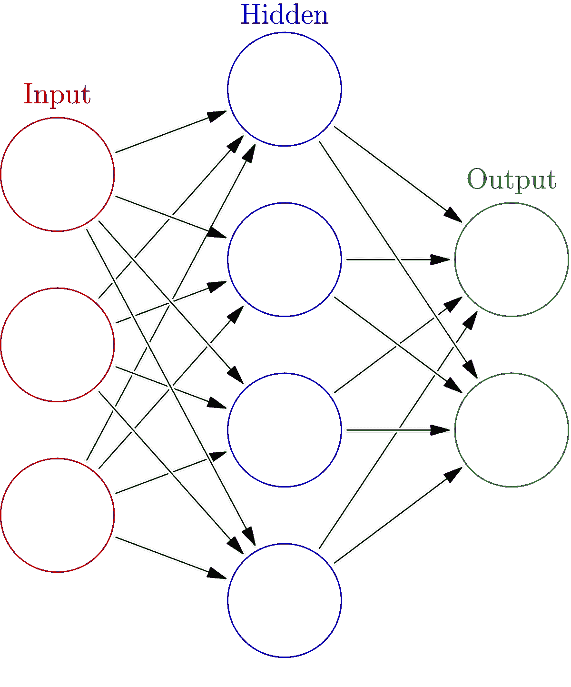
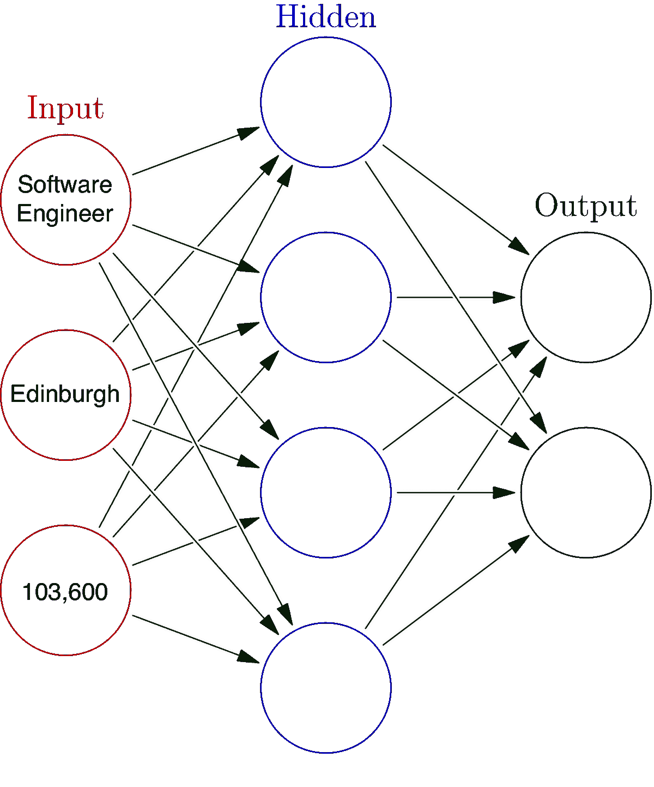
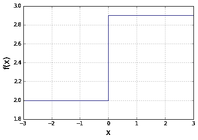
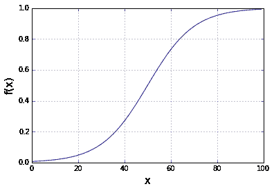
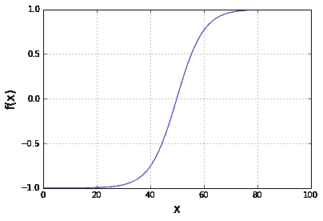
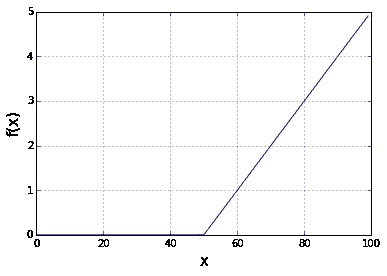
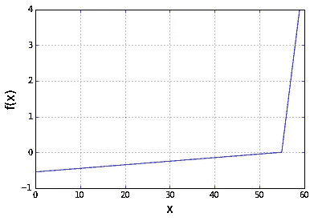
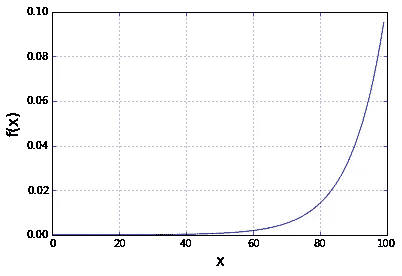

# 百万美元的神经网络，第二部分:机器学习直觉

> 原文：<https://towardsdatascience.com/the-million-dollar-neural-network-part-ii-machine-learning-intuition-a84650185e44?source=collection_archive---------25----------------------->

## 了解如何建立一个神经网络，并在这个由 3 部分组成的系列中赢得 165 万美元的 CMS 人工智能健康成果挑战赛

*作者注:在* [*第一部分*](/the-million-dollar-neural-network-part-i-understanding-the-biological-basis-6920910a7cf9) *中，我们讨论了价值 165 万美元的 CMS 人工智能健康成果挑战、擅长数据科学需要什么，以及神经网络的生物学基础。如果你还没有，读一读(大约 6 分钟。)在这里继续之前。*

这个系列的这个特殊部分变得相当长。因此，我将分为 2(这部分)和 2A。然后在第 3 部分，我们将按照最初的计划实际构建我们的神经网络。

所以，现在你已经对人工神经网络(ann)的生物学对应部分有了牢固的理解，是时候进入 ann 本身了。

以下是我们将涉及的主题的简要概述:

*   从生物学到计算机科学:神经元到节点
*   神经网络结构:输入、隐藏和输出层
*   分配和更新权重:神经网络如何学习
*   将输入转换为输出:激活功能

现在，事不宜迟，让我们开始吧。

# 从生物学到计算机科学:神经元到节点

正如我们在[第一部分](/the-million-dollar-neural-network-part-i-understanding-the-biological-basis-6920910a7cf9)中所讨论的，生物神经元接收来自其他神经元的大量输入(通过**树突**)。

这些输入被相加(在**体细胞**中),如果相加的输入达到或超过该神经元的指定阈值，则信号(通过**动作电位**沿**轴突**的长度向下传输。

这个输出然后通过**突触**(通过化学信号)从**突触前神经元**的**轴突末端**传递到**突触后神经元**的树突。

就像它们的生物对应物一样，人工神经元(或者通常被称为**节点**)从网络中的其他神经元接收大量输入，并传递输出。

## 神经网络结构:输入、隐藏和输出层

在人工神经网络中，节点(如下图圆圈所示)属于三个不同的**层**中的一个:输入层**输入层**、隐藏层**隐藏层**或输出层**输出层**，它们都由**突触**连接(如下图箭头所示)。



正如您可能猜到的那样，**输入层**从数据集的一行数据中接收输入。给定输入集中的每个输入来自不同的数据元素，**都来自同一行**。

例如，让我们看看下面的数据集。想象一下，你和我一起经营一家大型国际公司。现在想象一下，我们正面临一个员工流动率很高的问题。我们想做的是尝试并预测我们不同的员工中哪些人最有可能离开，这样我们就可以围绕提高员工保留率设计有效的计划。

假设我们已经使用我们的员工数据训练了我们的神经网络，我们现在使用以下数据进行一些预测。


我们神经网络的输入将是*姓名*、*职位、办公室、年龄、开始日期*和*薪水*。因此，给定的一组输入将全部来自同一行，可能如下所示:

```
Sonya Frost; Software Engineer; Edinburgh; 23; 2008/12/13; $103,600
```

或者重新使用我们之前基本神经网络的图像:



现在需要注意的是，输入层没有应用任何计算(或**激活函数**)——没有输入求和，没有达到或超过阈值。其目的仅仅是向**隐藏层**节点传递信息。

**隐藏层节点**从输入层接收输入，执行计算，并将输出传递给**输出节点。**输出节点执行最终计算并给出答案。这个最终输出是对来自同一行的**数据的响应——在我们的例子中，这可能代表 Sonya 辞职的可能性，比方说在 0 到 1 的范围内可能是 0.6。**

这个最终输出可以是**连续的、二进制的、**或**分类的**；您需要的输出类型将取决于您的特定用例/问题。

在我们的例子中，概率分数将是最有帮助的，所以我们将在输出层中使用一个 **sigmoid 函数**。如果你在这个阶段不确定这意味着什么，不要担心——我们一会儿就会讲到**激活功能**:)。

该过程实质上对下一行数据重复进行。再次使用我们的示例数据集，这将是:

```
Doris Wilder; Sales Assistant; Sidney; 23; 2010/09/20; $85,600
```

在更复杂的神经网络的情况下，也称为**深度神经网络，其中是**多个隐藏层**，隐藏层的节点从前一个隐藏层的节点接收输入，直到最后一个隐藏层将其输出发送到输出层。**

这样想一想:

回到第一部分中的示例，假设从数据集接收数据的输入图层等同于您的眼睛接收视觉刺激，即强烈的阳光。输出层的最终输出相当于控制你眼睑点火的肌肉，使你闭上眼睛。隐藏层是中间的所有复杂步骤，使它看起来像魔术一样。

# 分配和更新权重—神经网络如何学习

那么还记得在[第一部分](/the-million-dollar-neural-network-part-i-understanding-the-biological-basis-6920910a7cf9)中，我们如何说理解**动作电位**将有助于理解**激活功能**吗？这就是最终派上用场的地方。

节点间的**突触**或连接被赋予随机强度，也称为**权重**。

神经网络通过更新这些权重来学习，增加一些节点之间的连接强度，削弱甚至消除(或**修剪**)其他节点之间的连接。

这正是人类大脑的工作方式——加强一些联系，删减一些。

那么在各个节点内部发生了什么呢？

暂时回到生物神经元:在生物神经元的**胞体**(细胞体)中，所有的输入都加在一起。如果总和超过特定神经元的给定阈值，则触发**动作电位**。

在人工神经元(节点)中，节点的所有输入都乘以各自连接的权重，并求和在一起，产生**加权和**。

## 将输入转换为输出:激活功能

因此，一旦我们有了加权和，就应用一个**激活函数**将这些输入转换成输出，这决定了什么样的信号被传递(或不传递)到下一个节点。激活函数引入了**非线性**并使神经网络能够分析图像、音频和视频等复杂数据。

有许多类型的激活函数，其中一些更适合用于隐藏层(例如 ReLU)，而另一些更适合用于输出层(例如 sigmoid):

*   **二进制步骤** →产生 1 或 0 输出；当你需要一个简单的是/否预测时，这是很棒的



Binary Step Function

*   **Sigmoid 函数** →在输出层预测概率时非常有用，因为每个概率都在 0 和 1 之间



Sigmoid Function

*   **双曲正切**(又名**双曲正切**)及其变体(LeCun 的双曲正切，硬双曲正切)→本质上是范围从-1 到 1 的缩放的 sigmoid 函数



Tanh function

*   **ReLU(整流线性单元)**及其变种(**漏 ReLU** ，PReLU，eLU 等。)→至今仍是神经网络中最常用的函数之一。使计算变得简单而有效。Leaky ReLU 变体解决了传统 ReLU 常见的“死亡神经元”问题。



ReLU vs Leaky ReLU

*   **SoftMax →** 一种 sigmoid 函数，最适用于多类别分类问题的输出层(例如，输入是一个神奇宝贝的图像，输出是特定神奇宝贝是火、草或水类型的概率)



SoftMax function

# 让我们回顾一下

所以回到第一部分，我们讨论了人工神经网络的生物学基础——人脑。重要的是，当神经元从其他神经元接收输入时，这些输入在**细胞体**(细胞体)中相加。如果这些输入的总和达到或超过特定神经元的给定阈值，则**动作电位**被触发，信号沿着**轴突**传播，并穿过**突触**到达下一个神经元。

在第二部分中，我们已经讨论了这如何转化为机器学习环境。**节点**，或者人工神经网络中的单个神经元，通过**突触**相互连接。神经网络由三个独立的层组成:输入层**输入层**(传递来自数据集的数据)、隐藏层**隐藏层**(神经网络的真正魔力发生在这里)，以及输出层**(在给出最终答案之前应用最终计算或激活函数)。**

**初始输入是来自数据集的数据元素，*都来自同一行或观察*(按照我们之前的例子，开始日期、薪水和办公室位置)。最后的输出也是针对同一行的(根据我们前面的例子，雇员离开组织的概率)。在该行/观察的数据元素通过神经网络运行之后，该过程在下一行/观察中再次重复。**

**突触具有不同的**权重**或强度，当神经网络学习时，这些权重或强度会更新(加强或削弱)。给定节点的输入乘以它们的权重并求和以给出一个**加权和**。**

**那么，这些节点如何知道应该传递什么样的信号呢？该节点取其输入的加权和，并应用一个**激活函数。**有几种激活函数，有些更适合用于隐藏层，如 **ReLU 函数**，或用于输出层，如 **sigmoid 函数**。**

**输出层使用的激活函数很大程度上取决于你需要什么样的答案。例如，sigmoid 函数在 0 到 1 的范围内给出了一个很好的概率。如果您需要将概率分配给多个类别，那么使用 **SoftMax 函数可能会更好。****

***不幸的是，第二部分很长，所以我们将在 2A 的一部分完成我们的机器学习直觉，我们将讨论隐藏层的重要性，最小化成本函数，梯度下降和反向传播。然后在第 3 部分，我们将最终进入实际建设我们的神经网络！***

***对使用机器学习在医疗保健领域产生实际影响感兴趣？了解我们如何* [*解决医生数据*](https://medcitynews.com/2019/04/orderly-health-provider-data-accuracy/) *不准确的问题，并访问我们的网站*[*orderlyhealth.com*](http://orderlyhealth.com)*。***