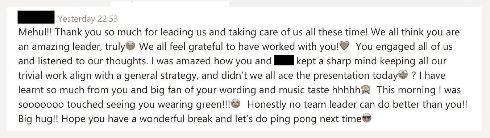

# 我对数据了解得越多，人们对我就越感兴趣

> 原文：<https://towardsdatascience.com/the-more-i-learn-about-data-the-more-people-interest-me-f60046f79460?source=collection_archive---------21----------------------->

## 我是如何辞去公司的全职工作，去攻读数据科学学位的

Photo by [Razvan Chisu](https://unsplash.com/@nullplus?utm_source=medium&utm_medium=referral) on [Unsplash](https://unsplash.com?utm_source=medium&utm_medium=referral)

这篇文章总结了我辞去专业服务公司的全职工作，决定攻读商业分析硕士的想法。我希望我要说的话能在某种程度上帮助你。

Inspiration: Jay Shetty

我选择攻读硕士学位的根本原因是因为我对学习的渴望。我们生活在一个社会不断扩张的时代，许多不同种类的职业得到了认可。随着多样化社区和工作场所的增加，有着巨大不同经历的人们正在想出创新的方法以他们自己的方式做出贡献。对我来说，分析是真正引起我共鸣的东西，我对这个主题研究得越多，我就越好奇。我开始意识到这是一个我可以尽我所能做出贡献的领域。

作为一名工程师，我一直支持自己成为一名喜欢动手的技术专家。我花时间去理解我正在做的项目的复杂性。随着我逐渐成为一名顾问，我开始意识到技术是如何推动商业发展的。一家企业的核心本质不是它如何使用最先进的机器或拥有最复杂的算法，而是它试图解决的市场问题。像“伟大的组织和优秀的组织有什么区别？”这样的问题为什么一家公司的领导团队会选择一条有时看起来不是最佳解决方案的道路？以及“一些出色的同事如何在个人层面比在团队中做出更好的贡献？”开始引起我的兴趣。考虑到这一点，商业分析似乎是一门为我量身定制的课程。

Photo by [Austin Distel](https://unsplash.com/@austindistel?utm_source=medium&utm_medium=referral) on [Unsplash](https://unsplash.com?utm_source=medium&utm_medium=referral)

我在这个项目中的前 6 个星期是非同寻常的，我在精神和身体上都受到了挑战，与一些最聪明的年轻专业人士在一起，并参加了一些迫使我打开思维和全面思考的讲座。对我来说，最大的调整是，尽管我每天朝九晚五地忙碌，但这是非常不同的。连续 3 个小时保持思维敏捷和集中注意力会在一天结束时导致疲劳。在工作中，你有更多的灵活性来更好地管理你的时间和精力。但是几个星期过去了，我开始适应了。我们的适应能力有时是我们最被低估的品质之一。如果你在某件事情上坚持的时间足够长，你的大脑就会发展出神经通路，然后它就会变成一种习惯。

我感谢我的家人和朋友以及他们对我的支持。这个项目让我付出了很多，我有时无法回报他们对我付出的努力。在这当中，他们仍然支持我并为之努力，今年剩下的日子肯定会很艰难，但我认为这将是对我们决心的一个很好的考验。他们的耐心和理解绝对值得称赞。

虽然我可以写很多东西，但迄今为止，我从这个项目中得到了五个关键收获:

1.  商业的真正本质是什么？你可以在一个组织中工作多年，并认为你了解它是如何运作的。然后你和一个不同部门的同事聊天，突然你觉得他们完全来自不同的组织。我以为我对商业有些了解，但是我学得越多，我意识到我知道的越少。我们在本模块中的商业主题讲座是我认为我一生中学到的最好的课程。营销教会了我如何以结构化的方式分解和处理案例研究，金融教会了我作为一个组织的领导者的责任，人力资源告诉我人有多重要，战略告诉我企业的核心是什么。当我从那次演讲中走出来的时候，我感觉自己被赋予了力量，因为我知道我只是触及了表面，但是我可以看到商业是如何影响和改变社会的。
2.  **作为团队领导** 在我的职业生涯中，我一直很感激为那些给我成长空间并在我犯错时支持我的经理们工作。处于关系的另一端是一种全新的体验。在我的第一次辛迪加会议上，我意识到你的团队有可能自然而然地选择你作为领导者。我见识了领导一个团队是什么样的。当人们信任你的方向和指导时，很少有什么能比得上这种感觉。这可能会令人望而生畏。我利用自己与优秀经理共事的经验，尽最大努力反映我喜欢他们的地方。建立良好的团队士气，确保每个人都感受到被倾听和被欣赏，定期反思我们的进步，这些对我来说都非常有效。最激励我的是我真诚地关心个人，我最大的收获是当我的队友非常害怕公开演讲时，看到他在观众面前讲话，我感到多么自豪。当我更担心团队的表现而不是我的表现时，我知道我正朝着正确的方向前进。
3.  如果不是坐在我旁边的那个人，这个模块不会像现在这样容易受影响。一个来自南非的非盈利组织的联合创始人拥有一个博士学位是令人印象深刻的，但更重要的是，他谦逊的个性和非常引人注目的头脑可能比我更喜欢学习，这使他在我看来是一个真正独一无二的人。作为工程师同事，我们发现课程的一些部分对我们来说是新的，但不断地交谈和相互分享想法是吸收信息的有效方式。有一个朋友能够把你和他的经历联系起来，让你成为一个全新学习过程的一部分，这让人耳目一新。
4.  **沟通是最重要的资产** 与一群聪明人一起工作意味着会有很多精力和想法涌现出来。虽然这有一个巨大的积极意义，但这意味着试图找到最佳解决方案会变得同样具有挑战性。你找到解决办法的唯一途径就是交流。如果每个人都觉得他们处在一个他们的想法和观点被听到和欣赏的空间，你会惊讶于事情是如何一起流动的。对于那些愿意分享的人来说，我认识到首先成为朋友是很重要的。在一起相处、共进午餐或打乒乓球的时间可能和真正坐下来工作一样重要。当团队中有一种共同的责任感时，我们会一起变得更好。我确信，一个不怕互相交流的团队从长远来看会做得很好。我希望这种学习能伴随我的余生。
5.  **数据是好的，但人更好** 唯一比从数据中获得洞察力更好的事情是揭示人们如何获得这些洞察力的故事。我们有机会坐下来听其他小组作为作业的一部分所做的报告。我经常记下我喜欢的他们的想法和思考过程。一些团队可以轻松地一起工作，而另一些团队则有创新的想法。同样的数据迫使同学们发挥创造力和独创性，这可能是所有学习中最有价值的。我希望这能让我更加注意和意识到我们作为个体所拥有的无限潜力。

昨天发生在我身上最好的事情之一。我以前收到过来自过去的人的致谢，在接受称赞时，我通常会感到不舒服。我认为我们学会接受和欣赏人们对我们说的好话是非常重要的。我还在努力。

我的一个团队成员昨天给我发了这条消息。在我收到的致谢中，这将是我最亲近的一个，我希望这是真的。

A text message by a team member

她提到她对演示感到紧张，我提到这是团队的努力。我选择穿绿色的衣服，只是因为她说那是她唯一的正式衬衫，她不想引人注目。我惊讶地发现这对她来说如此重要。我之前撒了谎，这将是我从本模块中获得的最大收获。我逐渐意识到 ***小事要紧*** 。无论是用你自己的方式来表达你对某人的支持，还是在交谈时关掉手机，让你全神贯注，或者发送一条礼貌的信息来感谢某人，感谢他们的时间。总之，你能做的最基本的事情就是对人友好。一个朋友曾经告诉我，他有时会惊讶为什么这么多人连这都做不到。

我觉得这是总结我的想法的合适的内容。教育系统有很多问题，我希望有一天我能够改善这些问题。尽管我还是个孩子的时候，我就一直想去世界上最有声望的大学学习(斯坦福大学是我的首选)，墨尔本商学院似乎也反映了这类学校的一些声望。更重要的是，这取决于你能从自己的经历中获得什么。有这么多的事情要考虑，我很高兴有这个时间休息，这样我就可以重组，得到一些休息时间。充电也是很有必要的，因为我很兴奋能体验节目的下一章，我有一种感觉，这将是辉煌的一年。

Photo by [delfi de la Rua](https://unsplash.com/@delfidelarua7?utm_source=medium&utm_medium=referral) on [Unsplash](https://unsplash.com?utm_source=medium&utm_medium=referral)