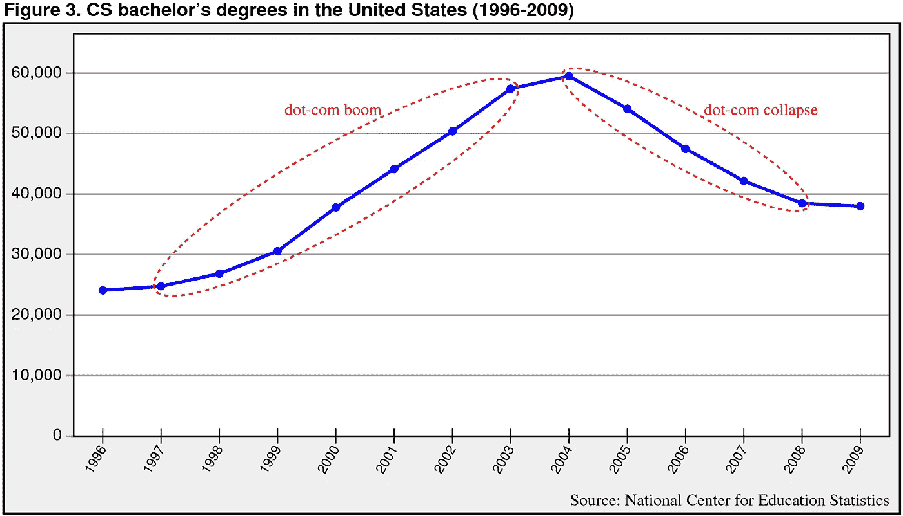
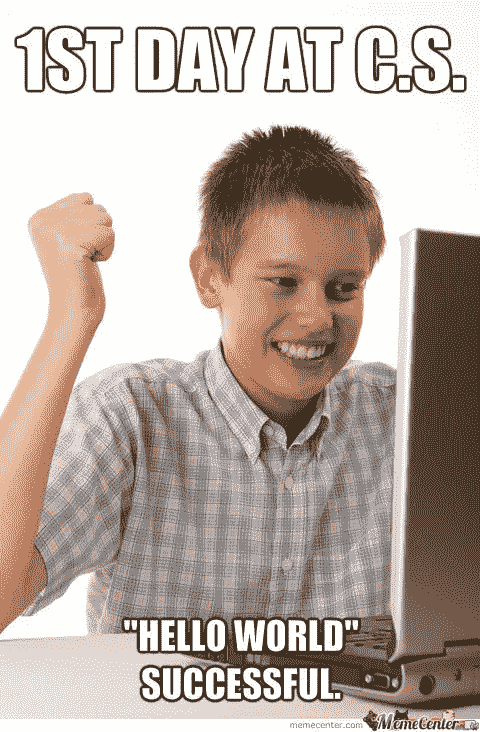
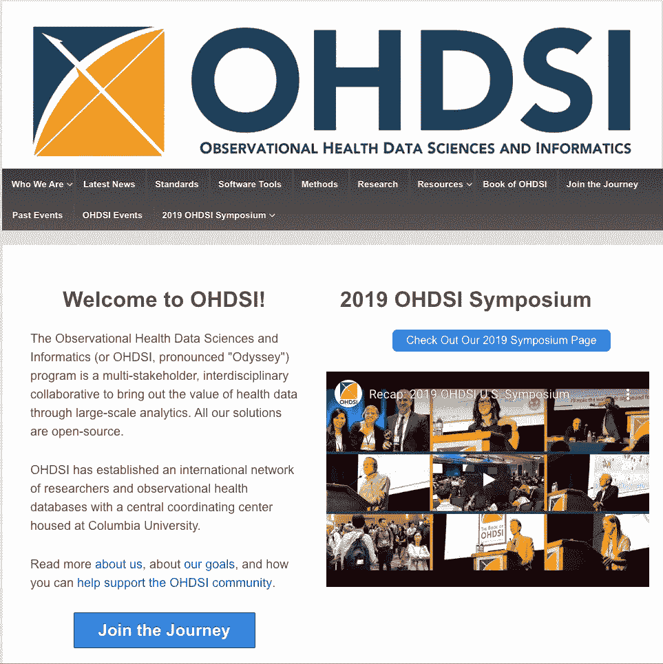
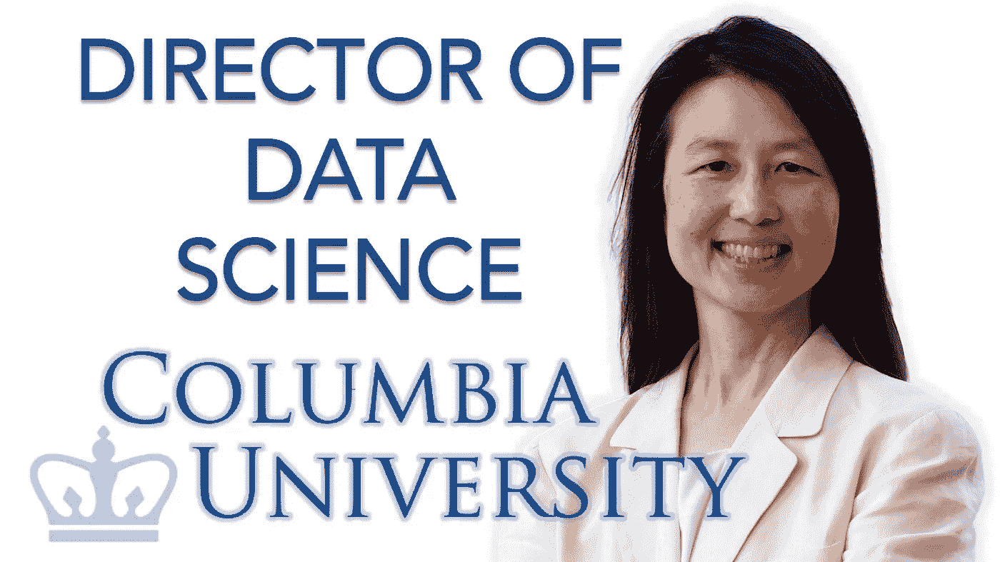

# 与哥伦比亚大学数据科学主任的真实对话

> 原文：<https://towardsdatascience.com/the-most-dangerous-data-science-problem-that-we-arent-talking-about-9ba56ebbe498?source=collection_archive---------7----------------------->

## [独家 TDS 采访](https://towardsdatascience.com/tagged/tds-interview)

## 人工智能伦理、计算思维和运行微软研究

**面试官:**[TowardsDataScience.com 项目负责人 Haebichan Jung](https://medium.com/@haebichan) 。旧金山 Recurly 的数据科学家。

**受访者:**[Jeannette Wing](https://industry.datascience.columbia.edu/profile/jeannette-wing)博士，Avanessians 数据科学研究所主任，哥伦比亚大学计算机科学教授(2017-)。微软研究院前企业副总裁(2013–2017)。卡内基梅隆大学计算机科学系前系主任(两次)。

**你在微软研究院的主要职责是什么？**

运行公司研究实验室有两个主要功能。

1.  我负责基础研究实验室。它是关于在所有形式的研究中推动最先进的技术。那时，微软研究院(MR)已经不仅仅覆盖计算机科学(CS)了。我们有生物学家、社会科学家、经济学家等。
2.  我与微软的核心业务部门进行沟通，确保 MR 研究人员开发的伟大技术能够为业务部门所用，并确保业务部门在技术和预测未来方面永远领先一步。

我负责全球所有研究实验室的这两项工作，例如位于雷蒙德、纽约市、剑桥(英国)、班加罗尔(印度)和北京(中国)的实验室。

**你参与了微软对人工智能项目的投资吗？如果是，你面临过哪些挑战？**

我参与了与机器学习、人工智能和数据科学相关的研究投资，更广泛地说，是我们雇佣的人员和支持的项目，以及我们与业务部门的合作。我当时在一个名为“人工智能和研究”的实际业务部门。该业务部门的人工智能部分与其他业务部门合作，以确保其他业务部门了解最新的 ML 和人工智能技术，以及如何利用来自公司研究部门的研究想法。

**你提出并推广的“计算思维”是什么？**

计算思维(CT)是用计算机(无论是人还是机器)能够有效执行的方式来表述问题并表达其解决方案的思维过程。这是一个复杂的定义，每个词都非常重要。但是为了更直观地理解 CT 是什么，它像计算机科学家一样思考。

计算机科学家每天都在使用某些技术和方法来解决问题。有些是:

1.  我如何设计一个算法来解决这个特殊的问题
2.  我如何将这个特殊的问题分解成更小的部分
3.  我如何定义抽象层
4.  我如何定义组件之间的接口

这个问题解决技术的集合和一个人处理一个大系统或大问题的方法的集合——这就是我所说的像计算机科学家一样思考的意思。

我在 2006 年写的关于计算思维的文章有两个目的:

1.  大约在 2004-2005 年，我们经历了网络泡沫破灭。每个人都在逃避计算机科学。许多本科院校的计算机专业招生人数都在下降。人们担心他们是否应该关闭计算机科学系。我写这篇文章的一个原因是告诉作为计算机科学家的我们自己，我们没有什么可担心的。这些事情循环往复。而且，我们有一种对大家都有利的思维方式，不管你是不是计算机专业的。那篇文章的目的之一是说计算机科学是为所有人服务的。我不是说每个人都要主修 CS。我的意思是，每个人都可以从 CS 提供的一些概念中受益。思维概念。这就是我使用计算思维这个术语的原因。
2.  当时，CS 的入门课程差不多就是“Java / C++ /你最喜欢的编程语言入门”。这让许多想体验计算机科学并了解该领域所能提供的东西的学生望而却步。因此，这篇文章也让我们 CS 社区的人说，“在教授 CS 方面，我们能提供的比如何编程更多”。

[youtube](https://www.youtube.com/watch?v=RYa2Kcub4NU)

实际上，如何编程只是你作为一个计算机科学家所学习的一项技能。比知道如何编程更重要的是 CS 教给学生的解决问题的技巧。如果你不想成为一名计算机科学家，这些技能甚至比知道如何编程更重要。

自 2006 年以来，不仅双方的界面发生了变化，而且关于如何将计算机科学纳入全球 K-12 教育的讨论也越来越多。

**什么是数据科学研究所(DSI)？**

DSI 是一个大学范围和大学级别的机构。它与校园内的每所学校和校园内的所有其他机构/中心合作。这确实证明了我的观点，即数据无处不在，每个人都可以从分析我们拥有的数据中受益。我们与历史/英语学院、教师、医学院(基因组学、公共卫生)、法学院、商科学生等合作。

DSI 有一个由三部分组成的使命宣言，我希望它能传达我的抱负。

1.  推进数据科学的最新发展。这实际上是推动基础研究。对于数据科学来说，就是定义领域。这是一个新兴的领域。无论如何，学术界仍在试图弄清楚数据科学到底是什么。我希望哥伦比亚大学带头定义什么是数据科学。
2.  通过应用数据科学改变所有领域、专业和部门。
3.  确保负责任地使用数据造福社会。这是为了应对社会在能源、社会公正、气候变化和医疗保健方面的巨大挑战。负责任地使用数据说明了收集数据和分析数据(尤其是与人相关的数据)时的道德和隐私问题。我认为数据科学作为一个新兴领域，强调对数据的伦理关注是很重要的(CS 错过了这条船)。

这三个组成部分可以总结如下:为善的数据、为善的数据和数据责任。

**您能谈谈该研究所的一些创新数据科学研究吗？**

我可以举出一些具体的研究例子:

1.  在因果推理中，我们有一个结果，讲的是一个人可以用比单一因果推理假设更弱的方式进行多重因果推理，但在现实世界中比单一因果推理更普遍。
2.  显示数据科学如何应用于任何领域研究中的应用。我们有从事生物学、历史、天文学、材料科学、医学等领域工作的人。具体谈到医学，我们有一个非常有趣的数据集，叫做 OHDSI，我们在哥伦比亚协调，它有 5 亿个独特的患者记录。

[youtube](https://www.youtube.com/watch?v=RYa2Kcub4NU)

**你能就人工智能中的伦理问题发表更多评论吗？这个话题不常被谈论，但对所有数据科学家来说都是开创性的。**

我们所了解到的是，人们对人工智能和机器学习应用于几乎所有事情感到非常兴奋:对购买的书籍和观看的电影提出建议，自动驾驶汽车中的计算机视觉系统，对医疗进行预测/分类。

当谈论书籍推荐时，出错可能没关系——我们不会让最终用户感到不安。但是当谈到自动驾驶汽车或医疗诊断时，我们需要确保这些系统是正确的、可靠的、安全的、有保障的，同时也是道德和公平的。

人工智能的另一个应用领域是决定某人是否应该被保释。我们正在决定是否雇用你。你希望所有这些决定都是公平的。但是如果模型是根据有偏差的数据训练的，那么模型就会有偏差，这是不公平的。

所以突然之间，这些 ML 模型被用在安全关键，生命关键的情况下，在做关于人的决定时，这些决定将会影响我们一生。我们想确保这些模型是公平的，它们的结果是可信的。现在没有理由相信任何事。因此，我正在推广一个名为“可信人工智能”的整体领域，来研究特定人工智能模型在上下文、每个任务、每个领域中的安全性、可靠性、公平性、健壮性等所有这些属性。

如需了解对 Jeannette Wing 博士的完整采访，请点击此处观看 YouTube 视频。

 [## Haebichan Jung —中等

### 阅读容格在媒介上的作品。项目负责人@ TDS |数据科学家@ Recurly。每天，Haebichan Jung…

medium.com](https://medium.com/@haebichan) 