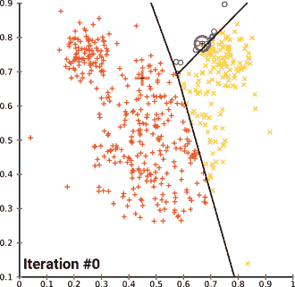
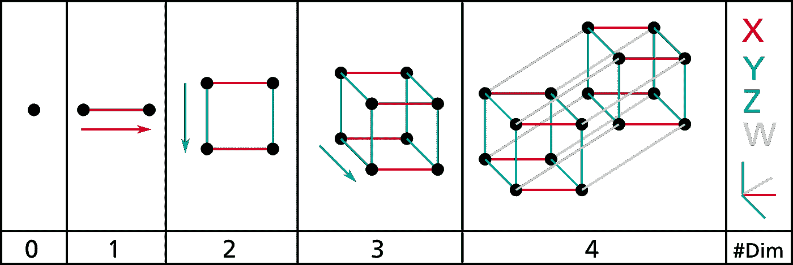
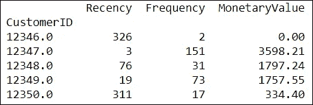
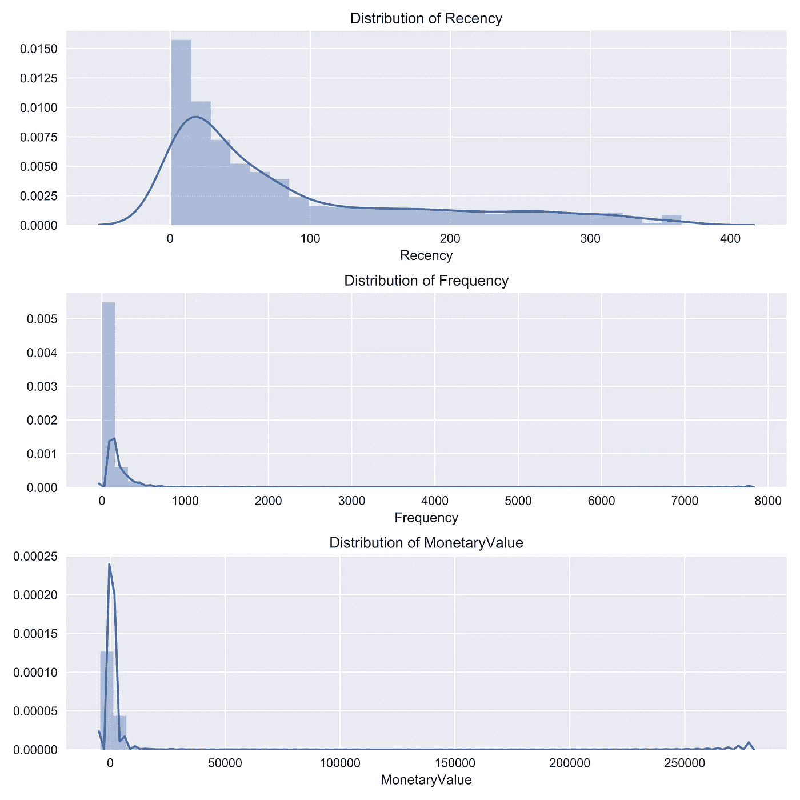
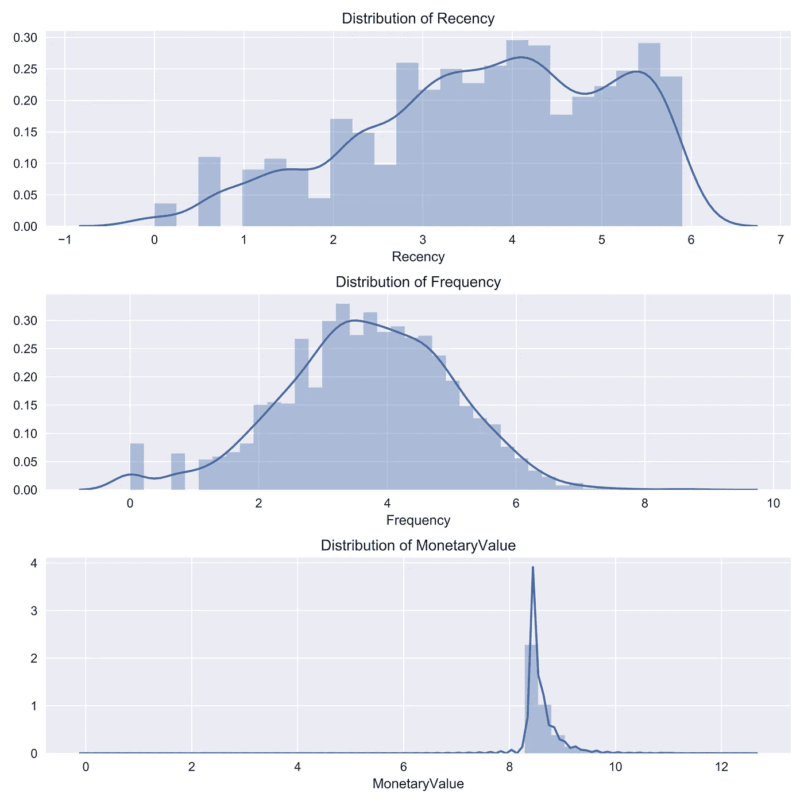
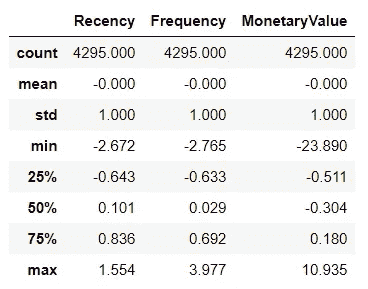
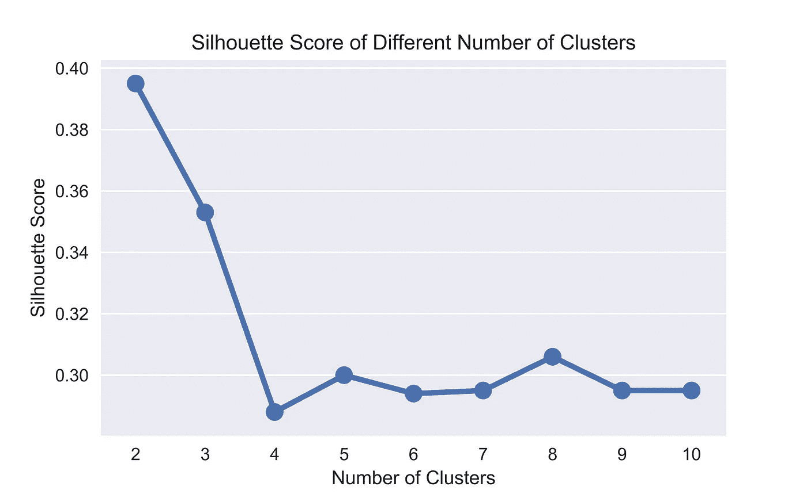
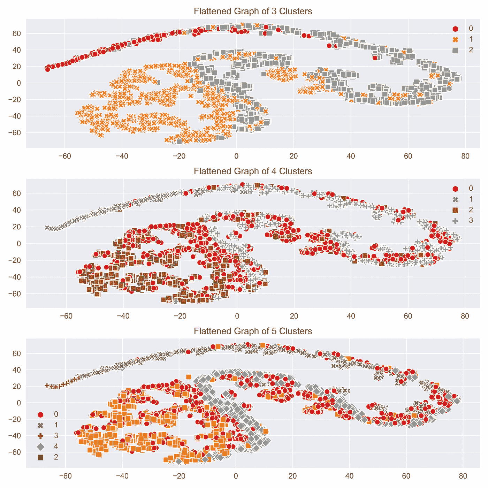
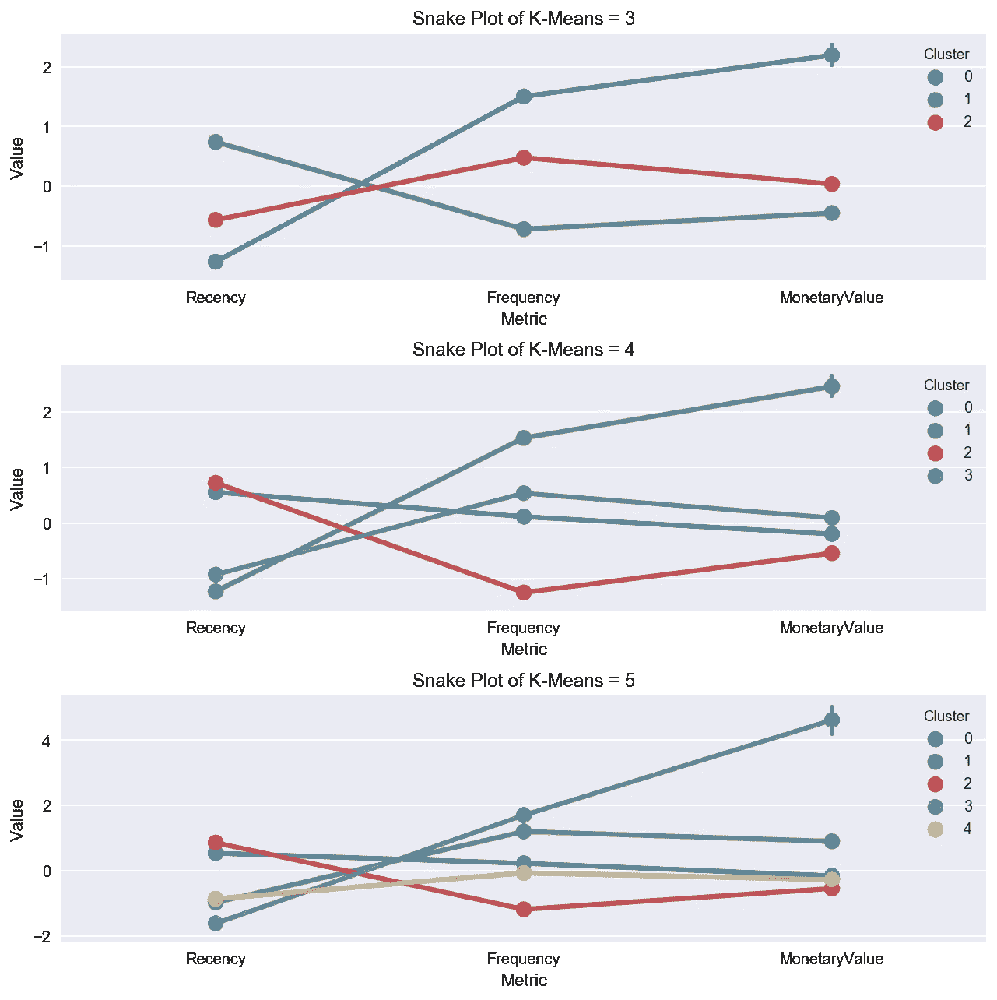
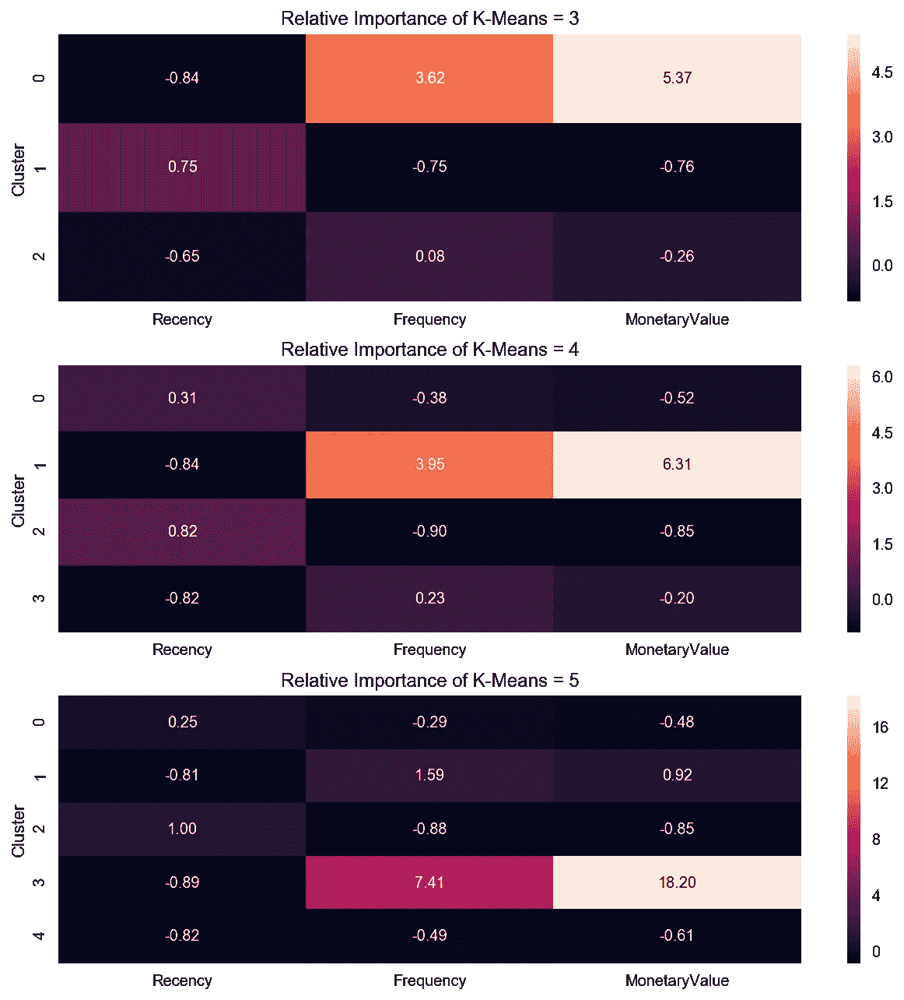

# 市场和客户细分最重要的数据科学工具

> 原文：<https://towardsdatascience.com/the-most-important-data-science-tool-for-market-and-customer-segmentation-c9709ca0b64a?source=collection_archive---------11----------------------->

## 使用 K-means，让 AI 告诉你有多少段(*实际上是*)。

市场和客户细分是任何公司最重要的任务之一。完成的细分将影响营销和销售决策，并可能影响公司的生存。

令人惊讶的是，尽管机器学习取得了进步，但很少有营销人员使用这种技术来增强他们至关重要的市场和客户细分工作。

在本文中，我将向您展示如何使用一种简单而强大的机器学习技术 K-means 来增强您的细分分析。学会这一点会让你比你的竞争对手(和同事)更有优势。

## 那么 K-means 是什么？

K-means 是一种流行的*聚类*算法，用于*无监督*机器学习。它将相似的数据点分组到*预定数量的组*。

让我为你解释每个术语:

*   **聚类**:一种机器学习技术，用于识别相似的数据点(例如客户)并将其分组在一起。
*   **无监督机器学习**:你不需要给算法提供如何对客户分组的标签数据。它将浏览*与每个客户相关的所有*信息，并学习将他们分组的最佳方式。
*   **预定义的组数**:你需要告诉 K-means 要组成多少组。这是你唯一需要的输入。

这里有一个与上述概念的类比:想象你有一些玩具，在没有提供进一步指导的情况下，你让你的孩子将玩具分成三组。*你的孩子会四处玩耍，最终找到自己的最佳方式，将三组相似的玩具组合起来*。

## 好的…那么 K-means 是如何工作的呢？

让我们假设你认为有 3 个潜在的客户群。

K-means 将在随机位置随机启动 3 个点(即质心),并将每个数据点慢慢拟合到最近的质心。每个数据点代表一个客户，离同一个质心最近的客户会在同一个组。

质心的位置会根据分配给它们的最近客户自动调整。这样做，它将*自己学习*寻找其他具有相似特征的客户。

K-means identifying 3 clusters in a data set. Source: Wikipedia

## 什么？这看起来很简单。我可以自己进行可视化分组！

上面客户的二维表示是数据可视化的简化形式。

与客户相关的每个信息代表一个维度的数据。例如，如果你只是绘制购买的物品和数量，那么这就是二维的。一旦你考虑到每个客户的额外信息，如居住国家和总支出，复杂性就会跳到 4 维！

Visualisation of different dimensions. Source: Wikipedia

对于我们来说，很难想象在三维空间之外将物品分组在一起，但对于机器学习来说并非如此。这使得机器学习在寻找有意义的片段方面比传统方法强大得多。

机器学习可以理解超出我们想象的多个维度，根据客户的信息找到客户的相似特征，并将相似的客户分组在一起。

这就是它的妙处！

## 但是我怎么知道组成小组的最佳数量是多少呢？

您可以通过遵循以下两条原则找到最佳的组数:

1.  同一群中的*客户应该靠得很近(紧密的群内距离)*
2.  每个不同的客户群应该彼此远离(远群间距离)

下面是对上述原则的另一种解释:

1.  *物以类聚*相似的羽毛。他们聚集在一起寻找志同道合的朋友；越是志趣相投，就越是群聚在一起。
2.  不同的鸟群不会彼此靠近。每个鸥群都为自己独特的身份而自豪；他们的身份越鲜明，他们就越远离其他群体。

找到最佳组数的一种方法是使用*剪影分数*。它考虑了类内和类间距离，并返回一个分数；分数越低，形成的聚类越有意义。

> 使用 K-mean 最具挑战性的一个方面是决定形成多少个聚类。这可以通过使用轮廓分数来数学地识别。

## 太好了。你能举例说明使用 K-means 来分割一个实际的客户数据集吗？

我将举例说明使用 K-means 来执行 [RFM(最近、频率和货币)客户细分](https://clevertap.com/blog/rfm-analysis/)。[数据源](https://archive.ics.uci.edu/ml/datasets/online+retail)来自英国的一家真实的在线零售商。

我已经通过执行以下步骤对数据进行了预处理:

1.  提取最近 1 年的交易数据。
2.  根据每个客户的最新交易日期计算他们的最近交易时间。
3.  通过合计标记给每个客户的发票数量来计算每个客户的频率。
4.  通过合计每个客户各自的总支出来计算他们的货币价值。

下面是我创建的每个客户的 RFM 值的快照:

RFM value of each customer.

## 在实现 K-means 之前，我还需要做什么？

K-means 在以下条件下给出最佳结果:

1.  数据的分布不是偏斜的(即长尾分布)
2.  数据是标准化的(即平均值为 0，标准偏差为 1)。

为什么？回想一下，K-means 根据客户到质心的距离将相似的客户分组在一起。

图表上每个数据点的位置是通过考虑与特定客户相关的所有信息来确定的。如果任何信息不在相同的距离尺度上，K-means 可能不会为您形成有意义的聚类。

> 机器学习就是从数据中学习。为了获得最佳结果，您应该准备数据，使机器易于学习。

以下是使用 K 均值前准备数据的具体步骤:

1.  绘制分布图以检查偏斜度。如果数据是偏斜的(即具有长尾分布)，则执行对数变换以降低偏斜度。
2.  缩放并居中数据，使平均值为 0，方差为 1。

我首先通过绘制新近性、频率和货币价值的分布图来检查数据的偏斜度:

Distribution Plots of RFM. All variables are heavily skewed.

我执行了对数转换来减少每个变量的偏斜度。下面是对数变换后的 RFM 分布图:

Distribution Plots of RFM. The skewness is reduced after log transformation.

一旦偏斜度降低，我就通过居中和缩放来标准化数据。请注意，现在所有变量的平均值为 0，标准差为 1。

Basic statistics of RFM. All variables have mean of 0 and standard deviation of 1 after centring and scaling.

## 找最优组数怎么样？

准备好数据后，下一步是运行 K-means 迭代(通常多达 10 个聚类)来计算每个聚类的轮廓得分。

A function to identify the optimal number of clusters based on the Silhouette Score.

较低的轮廓分数表示形成了更好和更有意义的聚类；下面的结果显示了集群的最佳数量是四个。

Silhouette Score of 2 to 10 clusters. The optimal number of clusters is 4.

尽管如此，通常的做法是在所识别的最优聚类的+/- 1 上实现 K 均值聚类；在这里，它是 3、4 和 5 个集群。

这提供了一个更广阔的视角，并有助于与您的利益相关者进行有意义的讨论，以确定适当数量的客户群。

也许会有一些市场特性，你的利益相关者可能会决定在 5 个集群上实施他们的营销策略，而不是确定的最佳 4 个集群。

## K-means 分割的最终结果是什么样的？

现在，我们准备通过 3、4 和 5 个集群的 K 均值来运行数据，以便对我们的客户进行细分。

A function to implement K-means on data set.

以下是客户细分的结果:

Flattened (t-SNE) graph of 3,4 and5 clusters.

回想一下，与客户相关联的每个信息都创建了一个额外的维度。上面的图像是通过将三维图形(根据新近度、频率和货币价值创建)展平为二维图形而获得的，以便于可视化。

这种观想可以让你感觉到星团是如何形成的。

如果你想知道，展平高维图形并将其可视化为二维格式的技术被称为*t-分布式随机邻居嵌入(t-SNE)。*如果你有兴趣，你可以[阅读更多关于这个](http://distributed_stochastic_neighbor_embedding)的内容；对此的解释超出了本文的范围。

## 我如何在营销中利用细分结果？

在这个阶段，数据集中的每个客户都用各自的组号进行标记。您可以继续使用任何行业的通用实践来可视化结果。

下面是一个使用 [*蛇图*](http://www.marketingprofs.com/tutorials/snakeplot.asp) 和*属性相对重要性图*来构建人物角色的每个聚类的细分的例子。两者都是营销行业中用于客户细分的常用方法。

Snake Plot of 3, 4, 5 clusters formed using K-means.

Relative Importance Chart of 3, 4, and 5 clusters formed using K-means.

您可以将这个结果与使用传统方法完成的原始分割进行比较。有什么大的区别吗？

深入了解 K-means 认为某个特定群体的客户属于同一群体的原因是一个很好的做法(是的，遗憾的是，K-means 还不能为我们写一份关于他们细分决策的营销报告)。

了解这一点后，你可以与相关利益相关者展开讨论，征求他们的意见，并在启动下一个大型营销活动之前，就如何最好地细分客户达成一致。

这篇文章的所有相关代码都可以在我的 [repo](https://github.com/optiflow/customer_segmentation) 中找到。

# 结论

K-means 是一种简单而有效的分割方法。任何进行客户或市场细分的人都应该利用这一点来增强传统方法。否则，它们有可能在人工智能时代被淘汰。

本文首发于 [AI 新加坡 makers space](https://makerspace.aisingapore.org/2020/04/the-most-important-data-science-tool-for-market-and-customer-segmentation/)。