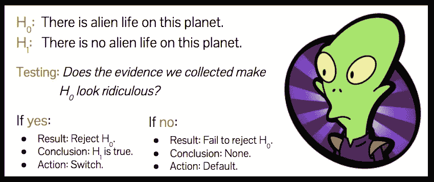

# 统计学中最重要的观点

> 原文：<https://towardsdatascience.com/the-most-important-idea-in-statistics-8c18d514ad1c?source=collection_archive---------7----------------------->

想到[统计学](http://bit.ly/quaesita_statistics)这门学科，你会想到什么？

人口、样本和假设？或者你可能上过一门强调概率、分布、p 值和置信区间的课程？所有这些都是拼图的一部分，但是它们在核心的下游。一切的真正开始——启动整个纠结的跳板——是[的默认动作](http://bit.ly/quaesita_damnedlies)。

# 什么是默认操作？

[统计学](http://bit.ly/quaesita_statistics)是一门在不确定的情况下改变你想法的科学，所以首要任务是弄清楚你要做什么*，除非数据说服你放弃。这就是为什么[一切都从](http://bit.ly/quaesita_inspired)一个身体动作/决定开始，如果你没有收集到任何(更多)证据，你就[承诺](http://bit.ly/quaesita_inspired)去做。这叫做你的 ***默认动作*** 。*

*本文是系列文章的一部分:*

*   *[第 0 部分](http://bit.ly/quaesita_damnedlies)(可选)介绍概念。*
*   *第一部分用一个例子将概念带入生活。*
*   *第二部分(欢迎！)重温示例，向您展示如果您在[第 1 部分](http://bit.ly/quaesita_fisher)中选择不同的默认操作会有什么变化。(剧透:*一切*都变了！)*

**

# *平行宇宙:另一个默认动作*

*你刚刚降落在一个外星球上。你的任务是什么？找出这里是否有外星生命。有什么问题吗？你微薄的预算只允许你在选择一个答案(是或否)并继续下一个任务之前搜索三个小时。*

**

*This is the entirety of your control panel. YES, there is alien life here. NO, there’s no alien life here. There is no way to input maybes, comments, or hedging.*

*在[之前的文章](http://bit.ly/quaesita_fisher)中，你的老板选择了按下“否”按钮(没有外星人)作为默认动作。如果他们选择了“是”会怎么样？这是新的设置:*

*[**默认动作:**](http://bit.ly/quaesita_damnedlies) 按下是按钮。*

*[**替代动作:**](http://bit.ly/quaesita_damnedlies) 按下 NO 按钮。*

*[**无效假设(H0):**](http://bit.ly/quaesita_damnedlies) 这个星球上有外星生命。*

*[**另类假设(H1):**](http://bit.ly/quaesita_damnedlies) 这个星球上没有外星生命。*

**

*还记得统计学的核心问题吗？在第 1 部分中，我们看到所有的统计推断都可以归结为一句有力的话:*

> *"我们收集的证据让我们的零假设看起来可笑吗？"*

*这意味着我们在问，我们在三个小时的步行中所看到的是否让“这个星球上有外星生命”的说法看起来很荒谬。在我们穿好衣服飞往那个星球之前，让我们想想我们会看到什么。*

*假设我们看到一个外星人。我们的零假设可笑吗？不，当然不是。如果我们徒步旅行三个小时，我们没有看到外星人呢？外星生命的零假设可笑吗？还是不行。(如果你还在纠结这个，你真的应该找个时间去地球上徒步旅行。很容易三个小时不见其他人……)*

*笑点是什么？**不管怎样，我们都会用“否”来回答我们的测试问题***

*这意味着无论证据如何，我们每次都将采取默认操作(是按钮)。在这种情况下，我们唯一可以拒绝的方法是，我们可以搜索这个星球的每个角落，以确认它们没有外星人，这对我们微薄的预算来说太多了。*

**

*Space exploration as work from home? Best job ever!*

*你看到庆祝的理由了吗？如果你的太空探索公司的政策选择了“是”作为在新信息下按下的正确按钮…你可以在家里像工作一样进行太空探索，穿着睡衣懒洋洋地躺着，同时为所有的行星按下“是，是，是，是，是”！*

*此外，呆在沙发上是正确的事情。去那个星球只是为了做一些复杂的计算，这是浪费时间和燃料。决策者已经选择了这个决策框架，在这个框架中，按“是”是正确的答案。不要抱怨，试着用其他默认动作，这样你就有借口使用一个奇特的公式——这不是大学。我们不是为了计算东西而计算东西。我们只做统计计算，看看数据对切换动作说了些什么。(你猜怎么着，有时候我们能看到答案，所以我们甚至不需要计算什么。)*

*如果你不喜欢你的领导选择默认行动和[决策背景](http://bit.ly/quaesita_inspired)的方式，你最好申请他们的工作，这样你有一天可以发号施令。只要你只是一名[数据科学家](http://bit.ly/quaesita_roles)(或宇航员)，你的工作就是根据你的领导为你创造的环境做正确的事情。*

> *决策者的技能决定了所有统计工作的成败。明智地选择他们。*

*您的默认操作决定了整个分析。请不要试图从假设开始[，并倒退到让你使用你喜欢的数学的默认动作。如果你没有首选的默认动作，你甚至不需要统计推断。改为读](http://bit.ly/quaesita_damnedlies)[这个](http://bit.ly/quaesita_pointofstats)。*

# *感谢阅读！YouTube AI 课程怎么样？*

*如果你在这里玩得开心，并且你正在寻找一个为初学者和专家设计的有趣的应用人工智能课程，这里有一个我为你制作的娱乐课程:*

*Enjoy the entire course playlist here: [bit.ly/machinefriend](http://bit.ly/machinefriend)*