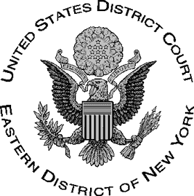
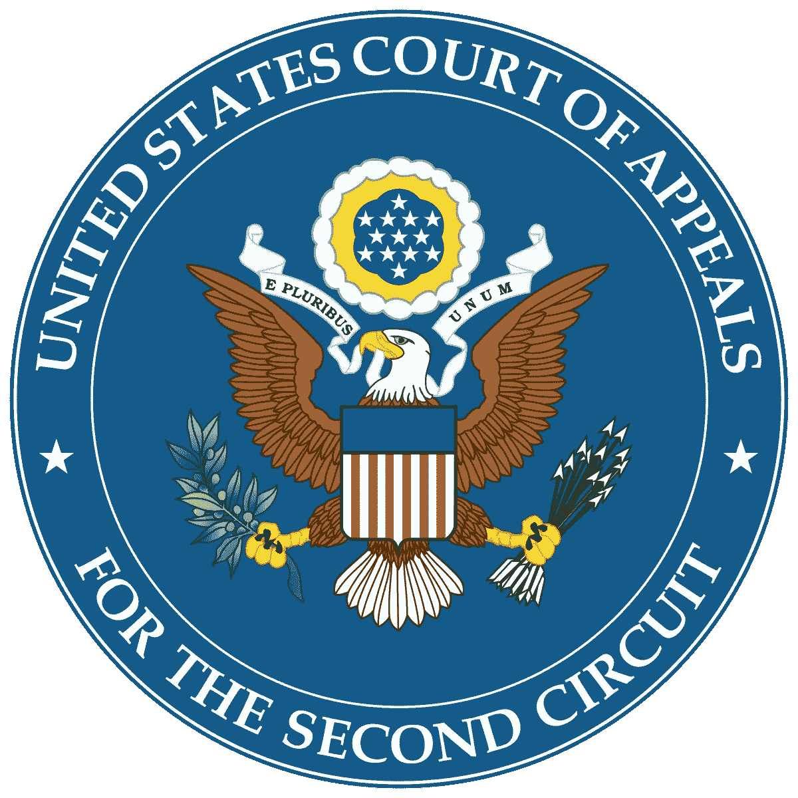
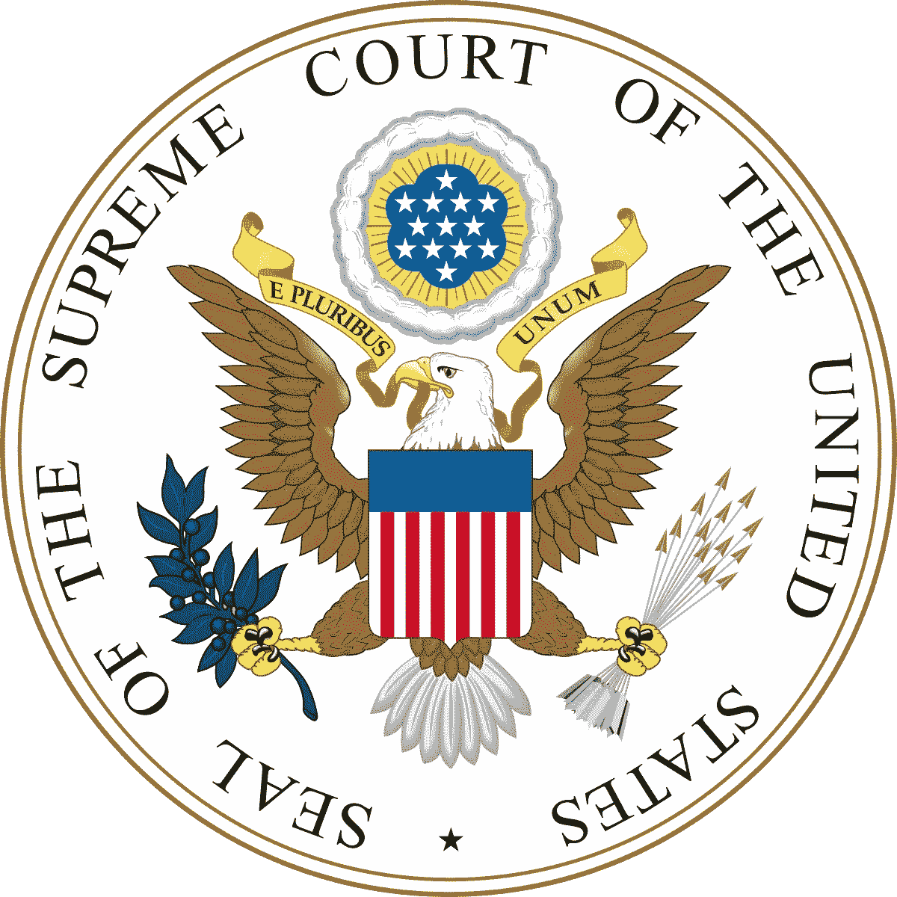

# 对数据科学和机器学习来说最重要的法院判决

> 原文：<https://towardsdatascience.com/the-most-important-supreme-court-decision-for-data-science-and-machine-learning-44cfc1c1bcaf?source=collection_archive---------4----------------------->

## 根据美国第二巡回法院的说法，在受版权保护的数据上训练算法并不违法。

本文将讨论 [***作者协会诉谷歌***](https://en.wikipedia.org/wiki/Authors_Guild,_Inc._v._Google,_Inc.) 一案及其先例在可预见的未来对人工智能领域的影响。

# 案件概述

*作者公会诉谷歌*轻松开创了人工智能领域，更明确地说，机器学习领域最重要的先例之一。该案件讨论了谷歌使用其训练数据库中受版权保护的书籍来训练其谷歌图书搜索算法的合法权利。作者协会声称谷歌图书搜索数据库的开发侵犯了数百万本图书的版权。

在 2005 年的后几个月，美国作家协会和美国出版商协会都起诉了谷歌，声称该公司因使用受版权保护的书籍来训练图书搜索算法而犯下了“大规模侵犯版权”的行为。谷歌声称，它的项目代表了数据的合理使用，它的实现相当于一个数字年龄卡目录。

美国作家协会和出版商协会联合起来反对谷歌，经过几年的诉讼后，提出了一个解决方案。由于种种原因，2011 年 3 月 22 日和解被驳回。出版商协会与谷歌达成和解，但与作者协会的诉讼仍在继续。

2011 年，作者公会提议的职业获得了认证。谷歌对这一决定提出上诉，一些法庭之友声称该类别不充分，第二巡回法院于 2013 年 7 月驳回了该类别认证，将案件发回地区法院，以考虑谷歌的合理使用辩护。

在 2013 年的后几个月，[美国巡回法官](https://en.wikipedia.org/wiki/US_Circuit_Judge) [Denny Chin](https://en.wikipedia.org/wiki/Denny_Chin) 驳回了诉讼，并确认谷歌图书程序符合“[合理使用](https://en.wikipedia.org/wiki/Fair_use)”的所有法律要求。

[Source](https://en.wikipedia.org/wiki/United_States_District_Court_for_the_Eastern_District_of_New_York)

# 地区巡回法院的裁决

在 2013 年 11 月的裁决中，陈法官写道:

> 在我看来，谷歌图书提供了重大的公共利益。它推动了艺术和科学的进步，同时保持对作者和其他创造性个人的权利的尊重，而不会对版权所有者的权利产生不利影响。

Chin 的裁决分析了四个传统因素,这些因素决定了根据美国版权法，一个版权作品的使用是否属于合理使用。他的结论是，谷歌图书符合合理使用的所有法律要求，因此不像作者协会声称的那样侵犯版权。这些因素中最重要的是**对版权所有者可能造成的经济损失。** Chin 表示*“谷歌图书增加了图书的销售，有利于版权所有者”*，意思是因为对版权所有者没有负面影响，所以不违反合理使用。

然而，案件并没有就此结束，因为原告(起诉方)有机会将案件上诉到更高一级法院。

[Source](https://en.wikipedia.org/wiki/United_States_Court_of_Appeals_for_the_Second_Circuit)

# **上诉至第二巡回法庭**

2014 年 4 月 11 日，提交人协会就地区法院的裁决向美国第二巡回法院提起上诉。这实质上是一个更高一级的法院，如果他们认为裁决不令人满意，有可能推翻地区巡回法院的裁决。他们还开始游说国会成立一个非营利组织，将作者的书籍数字化并授权给选择付费订阅的组织，因为他们担心这样的裁决可能会对出版业和个人作者产生影响。

口头辩论于 2014 年 12 月 3 日举行，一直持续到 2015 年 10 月 16 日，第二巡回法庭一致确认了有利于谷歌的判决。

法院对其意见的总结是:

> 谷歌未经授权对受版权保护的作品进行数字化处理，创建搜索功能，以及展示这些作品的片段，都不属于侵权的合理使用。复制的目的是高度变革性的，文本的公开展示是有限的，并且披露的内容没有为原件受保护的方面提供重要的市场替代品。谷歌的商业性质和利润动机不能成为拒绝合理使用的理由。
> 
> 谷歌向提供图书的图书馆提供数字化副本，并基于图书馆将以符合版权法的方式使用副本的理解，也不构成侵权。
> 
> 根据记录，谷歌也不是一个共同侵权者。

这实际上使得先例更加有力，但是作者协会——仍然相信他们是对的——决定直接上诉到最高法院。

[Source](https://en.wikipedia.org/wiki/Supreme_Court_of_the_United_States)

# **最高法院请愿书**

作者公会对这起诉讼的结果并不满意，因此在 2015 年 12 月 31 日，他们向最高法院提交了调卷令状，这实质上是向上级法院提出上诉，要求审查下级法院的判决，在本案中，是第二巡回法院。

2016 年 4 月 18 日，最高法院驳回了调卷令状的申请，让第二巡回法院做出的有利于谷歌的裁决原封不动。

这并不意味着最高法院赞成或反对这一裁决，它只是说，不到 4 名最高法院法官投票审查该案件。

这在第二赛道开创了一个先例，但对其他赛道的先例只字未提。如果一个不同的巡回法庭得出不同的意见，这个先例可能会被复审，在这种情况下，最高法院可能会决定复审这个案件。

# **分歧**

这一先例的法律后果可能会产生深远的影响。第二地区法院的决定在某种程度上为科技公司在深度学习算法的开发中使用受版权保护的材料开了绿灯，这主要是因为这种使用不会直接影响受版权保护的个别文章的收入。如果我写了一本谷歌用来训练他们的算法的书，我不会因为他们在训练他们的算法时使用我的书而受到不利影响。

硅谷是第九地区法院的一部分，这意味着这不是那里的先例，但它确实让那些正在考虑在其模型中利用版权数据的公司更加自信。

人们可能会认为，这一先例也将延伸到图像、歌曲，以及由技术集团积累的个人产生的任何其他潜在数据。

当我们从搜索算法，即**鉴别算法**，到**生成算法**，事情变得更加有趣。

一个*判别算法*获取原始数据，并试图将其分解成一个结果——想象一个分类算法获取一个数据点并将其放入某个组。

一个*生成算法*获取原始数据并使用它生成新数据。从这个意义上说，这是一个产生数据的过程。[深度生成模型](/deep-generative-models-25ab2821afd3)如[生成对抗网络](https://en.wikipedia.org/wiki/Generative_adversarial_network)和变型[自动编码器](https://en.wikipedia.org/wiki/Autoencoder)通常用于生成和操作图像数据。

谷歌图书搜索算法显然是一种辨别模型——它通过搜索数据库来找到正确的图书。这是否意味着先例延伸到生成模型？这并不完全清楚，而且很可能是因为法律小组对这一领域缺乏了解而没有进行讨论。

这进入了一些特别复杂和危险的领域，尤其是关于图像和歌曲。如果对数百万张有版权的图片训练一个深度学习算法，得到的图片会有版权吗？同样，对于歌曲，如果我创造了一种算法，可以写出像艾德·希兰那样的歌曲，因为我对他的歌曲进行了训练，这会侵犯他的版权吗？即使从这一案例的先例来看，结果也不完全清楚，但这一结果确实给了一个令人信服的理由来假定这也是可以接受的。

当然，人们可以采取不同的观点，即使用生成模型并试图将其商业化将直接与受版权保护的材料竞争，因此可能被认为侵犯了他们的版权。然而，由于大多数机器学习模型的黑盒性质，这将非常难以证明和反驳，这使得我们在这种情况下的合法性方面处于某种形式的不确定状态。

直到一些勇敢的人走出去，试图制作基于版权材料的电影、音乐或图像，并试图将这些商业化，并随后在这方面受到法律挑战，很难猜测这种行为的合法性。话虽如此，但我绝对相信，这不是一个是否会发生的问题，而是这个案件何时会发生的问题。

从这个案例中可以得到的重要信息是:

*   在用于训练鉴别性机器学习算法(例如用于搜索目的)的数据集中使用受版权保护的材料是完全合法的。
*   在用于训练生成式机器学习算法的数据集中使用受版权保护的材料，在未来的任何法律挑战中都有先例。

# **最终意见**

我希望你喜欢这篇讨论*作家协会诉谷歌*地方法院案件的文章。深度学习是一个非常新的热门话题，我相信我们还没有看到关于使用受版权保护的数据来训练大规模深度学习模型的法律案件的结束。这个领域发展如此之快，如此之新，以至于像 GANs 这样的深度生成模型在这个法律案件的开始甚至还不存在(它们是由 Ian Goodfellow 在 2014 年提出的)。显然，随着越来越多的公司选择将人工智能纳入其业务运营，数据使用的合法性将变得越来越重要。看这个空间，我们生活在有趣的时代。

## 时事通讯

关于新博客文章和额外内容的更新，请注册我的时事通讯。

 [## 时事通讯订阅

### 丰富您的学术之旅，加入一个由科学家，研究人员和行业专业人士组成的社区，以获得…

mailchi.mp](https://mailchi.mp/6304809e49e7/matthew-stewart) 

# **参考文献**

[谷歌图书裁定合理使用大获全胜(更新)](https://arstechnica.com/tech-policy/2013/11/google-books-ruled-legal-in-massive-win-for-fair-use/)，[Ars Technica](https://en.wikipedia.org/wiki/Ars_Technica)2013 年 11 月 14 日。

[谷歌赢了:法院对谷歌图书给予了大力支持](http://www.publishersweekly.com/pw/by-topic/digital/content-and-e-books/article/60006-google-wins-court-issues-a-ringing-endorsement-of-google-books.html)，[出版商周刊](https://en.wikipedia.org/wiki/Publishers_Weekly)，2013 年 11 月 14 日。

[*美国上诉法院称谷歌图书扫描项目合法*](https://www.reuters.com/article/2015/10/16/us-google-books-idUSKCN0SA1S020151016) ，路透社，2015 年 10 月 16 日。

“我们相信最高法院会认为纠正第二巡回法院对合理使用的简单化理解是合适的……”，Authors Guild，2015 年 10 月 16 日，[《第二巡回法庭让作者无依无靠》](https://www.authorsguild.org/industry-advocacy/2nd-circuit-leaves-authors-high-and-dry/)(新闻稿)。

亚当·利普塔克(2016 年 4 月 18 日)。[“挑战谷歌图书被最高法院驳回”](https://www.nytimes.com/2016/04/19/technology/google-books-case.html)。纽约时报。检索时间 2016 年 4 月 18 日。

人民网(2005 年 8 月 15 日)。[【谷歌数字图书馆暂停】](http://english.peopledaily.com.cn/200508/15/eng20050815_202595.html)。

湿婆神。[《万物谷歌化与版权的未来》](http://lawreview.law.ucdavis.edu/issues/40/3/copyright-creativity-catalogs/DavisVol40No3_Vaidhyanathan.pdf)，*《加州大学戴维斯分校法律评论》*，第 40 卷(2007 年 3 月)，第 1207–1231 页，(pdf)。

谷歌图书:对历史有益吗？、*视角*(2007 年 9 月)。

针对谷歌的版权侵权诉讼及其解决方式:[“版权协议将使数百万本书可以在网上获得”](http://www.google.com/intl/en/press/pressrel/20081027_booksearchagreement.html)。谷歌新闻中心。检索于 2008 年 11 月 22 日。

*作家协会诉谷歌公司*，721 F.3d 132 (2d Cir。2013).

[《谷歌在线图书交易面临风险》](http://www.thecrimson.com/article.aspx?ref=524989)。

[“谷歌图书结算网站上线；埃里克·舍恩菲尔德于 2009 年 2 月 11 日在](https://www.techcrunch.com/2009/02/11/google-book-settlement-site-is-up-paying-authors-60-per-scanned-book/) [TechCrunch](https://en.wikipedia.org/wiki/TechCrunch) 上发表的文章《向每本扫描书籍的作者支付 60 美元》

[美国记者和作家协会](http://www.asja.org/google/) [存档](https://web.archive.org/web/20120225000524/http://www.asja.org/google/)2012 年 2 月 25 日，在 [Wayback 机器](https://en.wikipedia.org/wiki/Wayback_Machine)

洪水，艾莉森(2010 年 1 月 22 日)。[“乌苏拉·勒奎因领导反抗谷歌数字图书和解”](https://www.theguardian.com/books/2010/jan/22/ursula-le-guin-revolt-google-digital)。*守护者*。伦敦。

英国广播公司:谷歌回击书评人

["Openbookalliance.org"](https://web.archive.org/web/20130910052712/http://www.openbookalliance.org/2009/10/pam-samuelson-on-google-books-its-not-a-library/) 。2013 年 9 月 10 日从[原件](http://www.openbookalliance.org/2009/10/pam-samuelson-on-google-books-its-not-a-library/)归档。检索于 2013 年 8 月 14 日。

[谷歌图书不是图书馆](http://www.huffingtonpost.com/pamela-samuelson/google-books-is-not-a-lib_b_317518.html)

[“图书隐私平价案例:谷歌图书和从离线到在线阅读的转变”](https://web.archive.org/web/20100812015123/http://hlpronline.com/2010/05/the-case-for-book-privacy-parity-google-books-and-the-shift-from-offline-to-online-reading/)。哈佛法律与政策评论。2010 年 5 月 16 日。存档于[原件](http://hlpronline.com/2010/05/the-case-for-book-privacy-parity-google-books-and-the-shift-from-offline-to-online-reading/)2010 年 8 月 12 日。检索于 2010 年 9 月 8 日。

波尔博士(2009 年 11 月 17 日)。[“谷歌图书结算改头换面”](http://nl.newsbank.com/nl-search/we/Archives?p_product=BN&p_theme=bn&p_action=search&p_maxdocs=200&p_topdoc=1&p_text_direct-0=12C0D444C11DDF98&p_field_direct-0=document_id&p_perpage=10&p_sort=YMD_date:D&s_trackval=GooglePM)。布法罗新闻。检索于 2010 年 3 月 26 日。

哈杰，基切(2010 年 3 月 17 日)。[《了解谷歌出版和解案》](http://www.thenational.ae/business/media/understanding-the-google-publishing-settlement)。*全国*。检索于 2010 年 3 月 26 日。

舍温·西伊(2009 年 11 月 17 日)。[《新谷歌图书和解:孤儿作品第一印象》](https://web.archive.org/web/20100609220653/http://www.publicknowledge.org/node/2770)。*公共知识*。2010 年 6 月 9 日从[原件](http://www.publicknowledge.org/node/2770)存档。检索于 2010 年 3 月 26 日。

[法官陈的裁决全文。](http://1.usa.gov/elvHew)

阿米尔·埃夫拉蒂和杰弗里·特拉亨伯格(2011 年 3 月 23 日)。[“法官驳回谷歌图书和解案”](https://www.wsj.com/articles/SB10001424052748704461304576216923562033348)。华尔街日报。

[“作者协会诉谷歌案的意见”](http://www.documentcloud.org/documents/834877-google-books-ruling-on-fair-use.html)，巡回法官 Chin，案件 1:05-cv-08136-DC 文件 1088，2013 年 11 月 14 日。检索于 2013 年 11 月 17 日。

[为什么谷歌在谷歌图书诉讼中的合理使用胜利是一件大事，为什么它不是](https://www.forbes.com/sites/ericgoldman/2013/11/14/why-googles-fair-use-victory-in-google-books-suit-is-a-big-deal-and-why-it-isnt/)，[福布斯杂志](https://en.wikipedia.org/wiki/Forbes_magazine)，2013 年 11 月 14 日

[ARL 政策说明](http://policynotes.arl.org/post/66992554073/google-books-decision-a-huge-victory-for-fair-use-and) [存档](https://web.archive.org/web/20131120091832/http://policynotes.arl.org/post/66992554073/google-books-decision-a-huge-victory-for-fair-use-and)2013 年 11 月 20 日，在 [Wayback 机](https://en.wikipedia.org/wiki/Wayback_Machine)，2013 年 11 月 14 日

[http://www . info docket . com/2014/04/11/authors-guild-files-brief-in-Google-books-appeal-says-congress-should-create-a-national-digital-library/](http://www.infodocket.com/2014/04/11/authors-guild-files-brief-in-google-books-appeal-says-congress-should-create-a-national-digital-library/)

[作者协会诉谷歌](http://nysbar.com/blogs/EASL/2014/12/oral_argument_in_authors_guild.html) [案的口头辩论存档](https://web.archive.org/web/20150515040851/http://nysbar.com/blogs/EASL/2014/12/oral_argument_in_authors_guild.html)2015 年 5 月 15 日，地点 [Wayback Machine](https://en.wikipedia.org/wiki/Wayback_Machine) ，12–10–14

[滑移意见](https://www.unitedstatescourts.org/federal/ca2/13-4829/230-0.html) [存档](https://web.archive.org/web/20170904052412/https://www.unitedstatescourts.org/federal/ca2/13-4829/230-0.html)2017–09–04 在[折返机](https://en.wikipedia.org/wiki/Wayback_Machine)处。

[“46 点滑动操作”](https://web.archive.org/web/20170904052412/https://www.unitedstatescourts.org/federal/ca2/13-4829/230-0.html)。从[原件](https://www.unitedstatescourts.org/federal/ca2/13-4829/230-0.html)存档于 2017-09-04。检索于 2015 年 10 月 17 日。

[*作家协会诉谷歌公司*](https://www.authorsguild.org/wp-content/uploads/2015/12/Authors-Guild-v.-Google-Petition-w-Appendix.pdf) ，№15–849(2013 年 12 月 31 日)。

[*Campbell 诉 Acuff-Rose Music，Inc.*](https://en.wikipedia.org/wiki/Campbell_v._Acuff-Rose_Music,_Inc.) 《美国最高法院判例汇编》第 510 卷第 569 页(1994 年)(2 现场剧组“漂亮女人”戏仿案)。