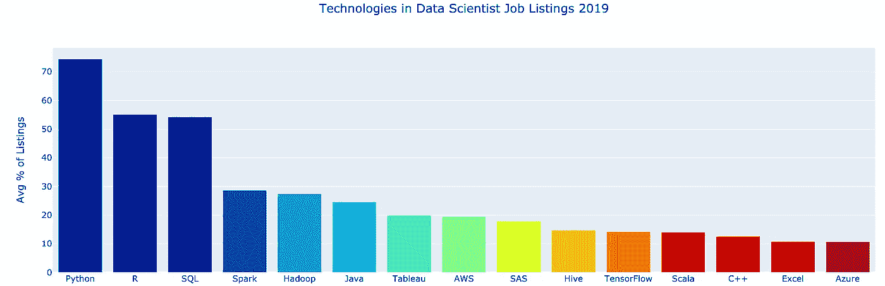
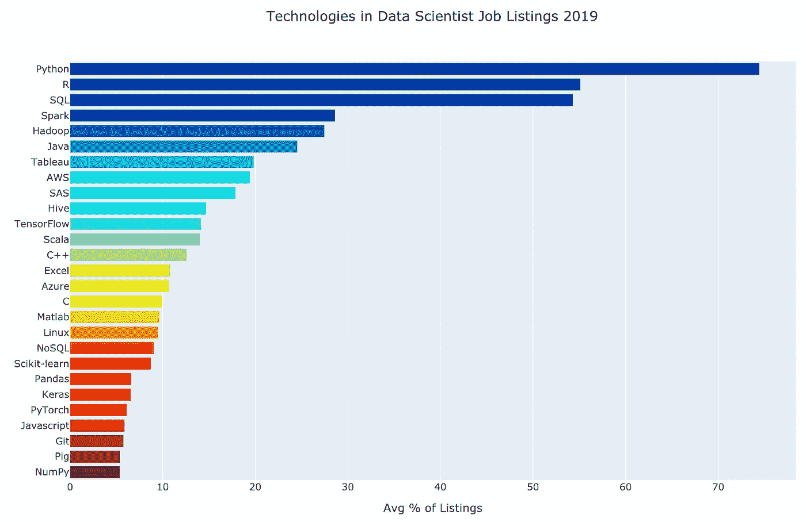
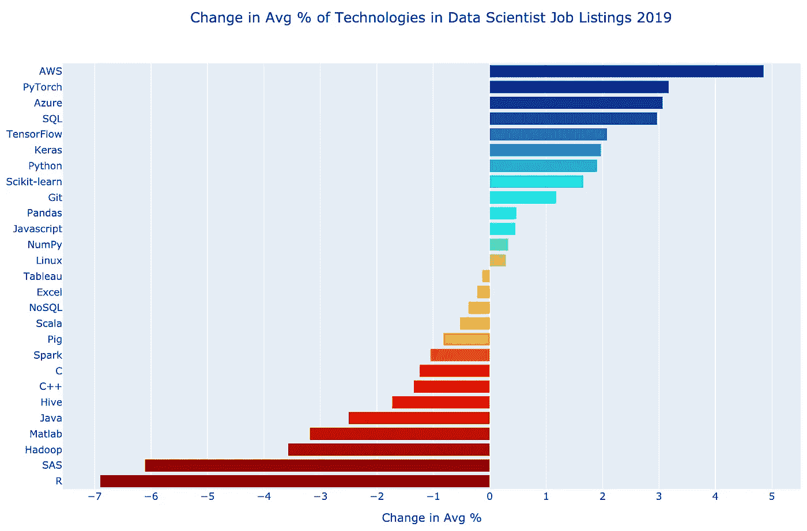
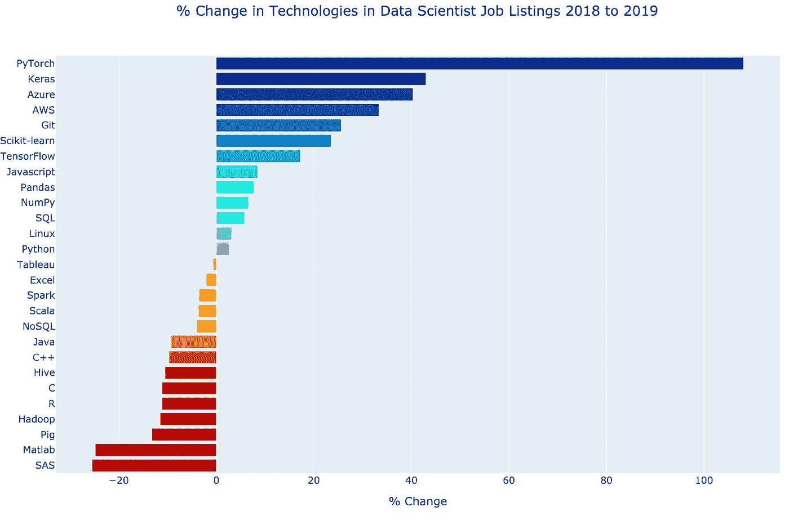
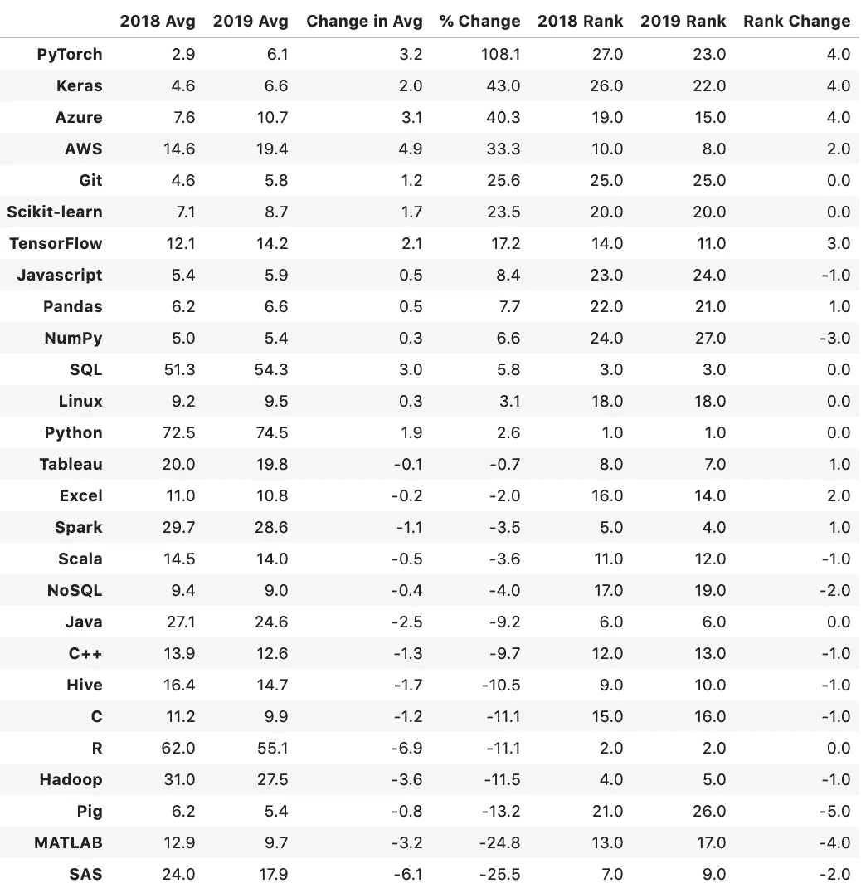
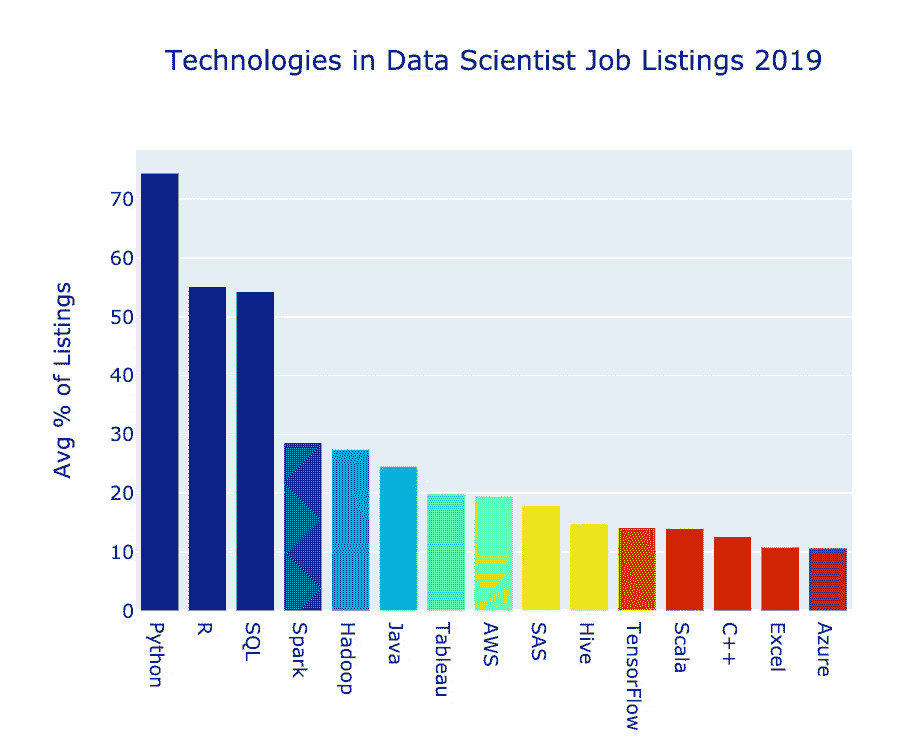

# 数据科学家最需要的技术技能

> 原文：<https://towardsdatascience.com/the-most-in-demand-tech-skills-for-data-scientists-d716d10c191d?source=collection_archive---------0----------------------->

2018 年秋天，我分析了数据科学家最需要的技能和技术。那篇文章引起了人们的共鸣。它在 Medium 上获得了超过 11，000 次掌声，被翻译成多种语言，是 2018 年 11 月 KD Nuggets 上最受欢迎的故事。

一年多一点过去了。让我们看看有什么新的。🎉

到本文结束时，你会知道哪些技术越来越受雇主欢迎，哪些技术越来越不受欢迎。

在我的【2018 年原创文章中，我考察了对统计和沟通等通用技能的需求。我还研究了对 Python 和 r 等技术的需求。软件技术的变化比一般技能的需求快得多，因此我在这次更新的分析中只包括技术。

我搜索了[简单雇佣](https://www.simplyhired.com/)、[确实](https://www.indeed.com/)、[怪物](https://www.monster.com/)、 [LinkedIn](https://www.linkedin.com/) ，看看在美国的职位列表中，哪些关键词出现了“数据科学家”。这一次，我决定编写代码来抓取工作列表，而不是手动搜索。事实证明，这种努力对“简单雇佣”和“怪物”来说是卓有成效的。我能够使用[请求](https://requests.readthedocs.io/en/master/)和[美汤](https://www.crummy.com/software/BeautifulSoup/bs4/doc/) Python 库。你可以在[我的 GitHub repo](https://github.com/discdiver/2019-in-demand-ds-tech-skills) 看到 Jupyter 笔记本，上面有抓取和分析的代码。

事实证明，清除 LinkedIn 要困难得多。要查看职务列表的准确数量，需要进行身份验证。我决定使用 Selenium 进行无头浏览。2019 年 9 月，美国最高法院的一个[案件](https://www.vice.com/en_us/article/9kek83/linkedin-data-scraping-lawsuit-shot-down)判决 LinkedIn 败诉，允许 LinkedIn 的数据被抓取。尽管如此，在几次抓取尝试后，我还是无法进入我的账户。这个问题可能源于速率限制。😟更新:我现在回来了，但担心我会被锁在外面，如果我试图再次刮它。

不管怎样，微软拥有 LinkedIn，Randstad Holding 拥有 Monster，Recruit Holdings 拥有 Indeed 和 SimplyHired。

无论如何，LinkedIn 的数据可能没有提供从去年到今年的比较。今年夏天，我注意到 LinkedIn 的一些科技求职术语开始每周都有大幅波动。我假设他们可能已经通过使用自然语言处理来测试意图，试验他们的搜索结果算法。相比之下，其他三个搜索网站在这两年中出现的“数据科学家”职位列表数量相对相似。

由于这些原因，我在本文中对 2019 年和 2018 年的分析中排除了 LinkedIn。

对于每个求职网站，我计算了每个关键词出现在该网站上的数据科学家职位列表的百分比。然后，我计算了三个网站上每个关键词的平均百分比。

我手动调查新的搜索词，剔除那些看起来有希望的。2019 年，没有新词达到平均百分之五的上市率，这是我在下面的结果中使用的截止值。

让我们看看我们发现了什么！🔭

## 结果

至少有四种方法可以查看每个关键字的结果:

1.  对于每一个工作站点，每年，将包含关键字的列表数除以包含 data scientist 的搜索项总数。然后取三个工作地点的平均值。这就是上面描述的过程。
2.  做了上面的第 1 条，再来看看 2018 年到 2019 年的平均房源百分比变化。
3.  做了上面的 1 号后，取 2018 年到 2019 年的房源平均百分比的百分比变化。
4.  完成上面的第一步后，计算出该年每个关键词相对于其他关键词的排名。然后计算排名从一年到下一年的变化。

让我们用条形图来看看前三个选项。然后我会用数据展示一个表格，讨论结果。

这是 2019 年第一张图表，显示 Python 出现在近 75%的列表中。

这是上面第二张图表，显示了 2018 年至 2019 年期间上市平均百分比的得失。AWS 显示增加了 5 个百分点。它出现在 2019 年平均 19.4%的房源中，2018 年平均 14.6%的房源中。

这是上面第三个数字的图表，显示了每年的百分比变化。PyTorch 与 2018 年出现的平均上市百分比相比增长了 108.1%。

这些图表都是用[精心制作的](https://plot.ly/)。如果你想学习如何使用 Plotly 制作交互式可视化，请查看[我的指南](/its-2019-make-your-data-visualizations-interactive-with-plotly-b361e7d45dc6)。如果你想看交互式图表，可以查看[我的 GitHub repo](https://github.com/discdiver/2019-in-demand-ds-tech-skills) 中的 HTML 文件。用于抓取、分析和可视化的 Juptyer 笔记本也在那里。

以下是以上图表中的信息，仅以表格形式，按 2018 年至 2019 年房源平均百分比的百分比变化排序。

我知道这些不同的衡量标准可能会让人感到困惑，所以这里有一个指导，让你看看上面的图表。

*   *2018 Avg* 是从 2018 年 10 月 10 日起，SimplyHired，Indeed 和 Monster 的平均房源百分比。
*   *2019 年平均*与 *2018 年平均*相同，除了是 2019 年 12 月 4 日。该数据显示在上面三个图表的第一个中。
*   *平均值变化*为 *2019* 栏减去 *2018* 栏。如上面三个图表中的第二个所示。
*   *%变化*是从 *2018* 到 *2019* 的百分比变化。它显示在上面三个图表的最后一个中。
*   *2018 排名*是 2018 年相对于其他关键词的排名。
*   *2019 排名*是 2019 年相对于其他关键词的排名。
*   *排名变化*是 2019 年到 2018 年排名的上升或下降。

# 外卖

在不到 14 个月的时间里，发生了一些相当大的变化！

## 获胜者

**Python** 还在上面。这是目前最常用的关键词。将近四分之三的清单上都有。Python 从 2018 年开始有了可观的增长。

**SQL** 为升序。平均分第二差点超过 R。如果趋势继续下去，它将很快成为第二。

最突出的**深度学习框架**越来越受欢迎。PyTorch 是所有关键词中增幅最大的。Keras 和 TensorFlow 也大幅上涨。Keras 和 PyTorch 的排名都上升了 4 位，TensorFlow 上升了 3 位。请注意，PyTorch 是从较低的平均值开始的— TensorFlow 的平均值仍然是 PyTorch 的两倍。

**数据科学家越来越需要云平台技能。AWS** 出现在近 20%的列表中，Azure**出现在约 10%的列表中。Azure 在排名中上升了四位。**

这些是最活跃的技术！🚀

## 失败者

**R** 整体平均降幅最大。鉴于来自[其他调查](https://insights.stackoverflow.com/survey/2019)的发现，这一发现并不令人惊讶。Python 显然已经取代 R 成为数据科学的首选语言。尽管如此，R 仍然非常受欢迎，出现在大约 55%的列表中。如果你知道 R，不要绝望，但如果你想要一个更受欢迎的技能，也可以考虑学习 Python。

许多**阿帕奇**产品人气下滑，包括**小猪**、**蜂巢**、 **Hadoop** 、 **Spark** 。Pig 在排名中下降了 5 位，比其他任何技术都多。Spark 和 Hadoop 仍然是普遍想要的技能，但我的发现显示出远离它们并转向其他大数据技术的趋势。

专有统计软件包 **MATLAB** 和 **SAS** 出现了大幅下滑。MATLAB 在排名中下降了四位，SAS 从最常见的第六位下降到第八位。与 2018 年的平均水平相比，这两种语言都出现了较大比例的下降。

# 建议

这个列表上有很多技术。😀你当然不需要知道他们所有人。神话中的数据科学家被称为独角兽是有原因的。😉

我建议，如果你刚开始从事数据科学，你应该专注于那些有需求且正在增长的技术。

专注。
开。
学习。
一个。
技术。在。
A.
时间。

(这是非常好的建议，尽管我并不总是遵循它。😁)

以下是我推荐的学习路径，按顺序排列:

*   学习 Python 进行通用编程。如果你是新手，可以看看我的书《难忘的 Python》。

*   学习熊猫进行数据操作。我相信一个招聘 Python 数据科学家的组织会希望应聘者了解 pandas 和 Scikit-learn 库。Scikit-learn 出现在名单上，熊猫刚好错过了截止日期。在学习熊猫的同时，你将学习一些 Matplotlib 和 NumPy 的可视化。我正在完成一本关于熊猫的书。订阅我的邮件列表，确保你不会错过。😀
*   使用 Scikit-learn 库学习机器学习。推荐 Müller & Guido 的《用 Python 学习机器 入门》这本书。

*   学习高效查询关系数据库的 SQL。我那本令人难忘的 SQL 书是为初学者设计的，在预发布版[这里](https://memorablesql.com)有售。

*   了解数据可视化的 Tableau。清单上的技术可能是学习起来最有趣和最快的。👍点击这里，查看我在 Medium 发表的一篇关于基础知识[的六分钟介绍文章。](/tableau-basics-in-six-minutes-35b50ec9ae9b)

*   适应云平台。由于其市场份额，AWS 是一个很好的选择。微软 Azure 稳坐第二。尽管它不太受欢迎，但我还是偏爱谷歌云，因为我喜欢它的 UX 和机器学习功能。如果你想熟悉谷歌云的数据摄取、转换和存储选项，请参见[我的关于成为谷歌云认证专业数据工程师的文章](/10-days-to-become-a-google-cloud-certified-professional-data-engineer-fdb6c401f8e0)。
*   学习深度学习框架。TensorFlow 最受欢迎。Chollet 的书 [*用 Python 进行深度学习*](https://www.amazon.com/Deep-Learning-Python-Francois-Chollet/dp/1617294438) 是学习 Keras 和深度学习原理的绝佳资源。Keras 现在与 TensorFlow 紧密集成，所以这是一个很好的起点。PyTorch 也在迅速发展。关于不同深度学习框架的流行程度，请查看我的分析[这里](/which-deep-learning-framework-is-growing-fastest-3f77f14aa318)。

这是我的一般学习路径建议。根据你的需求定制它，或者忽略它，做你想做的事情！😁

# 包装

我希望这篇数据科学家最需要的技术指南对你有用。如果你有，请在你最喜欢的社交媒体上分享，这样其他人也可以找到它。👍

我写关于 [Python](https://memorablepython.com) 、 [SQL](https://memorablesql.com) 、 [Docker](https://memorabledocker.com) 、数据科学和其他技术主题的文章。如果你对此感兴趣，请关注我，在这里阅读更多。

快乐学习！💻😀