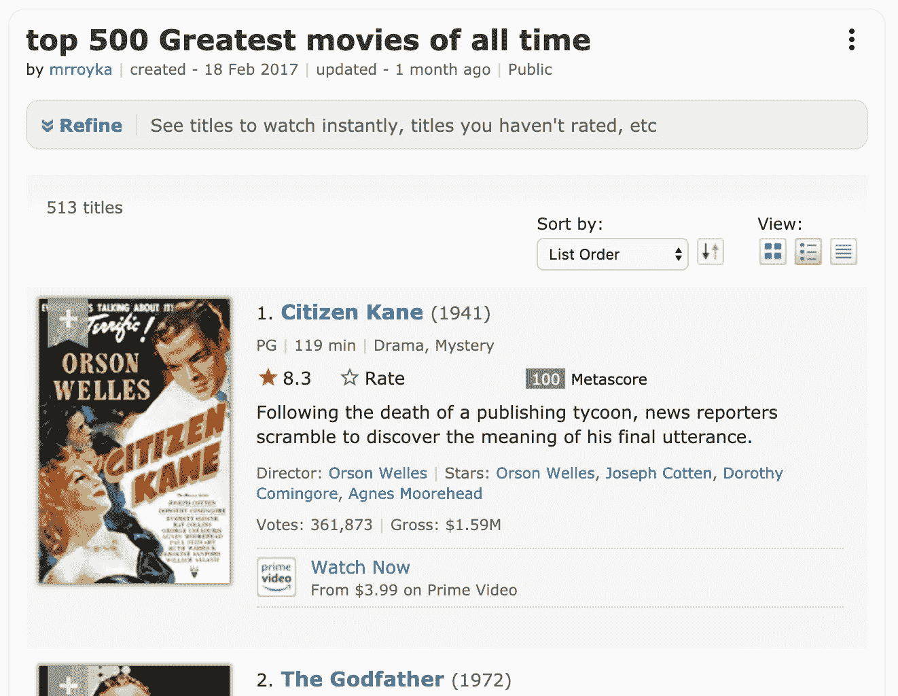
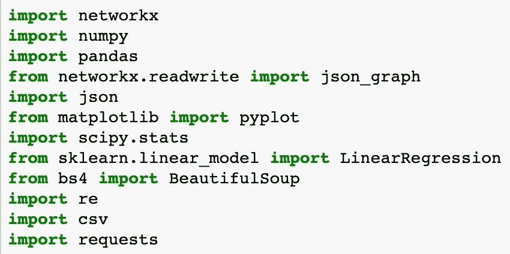
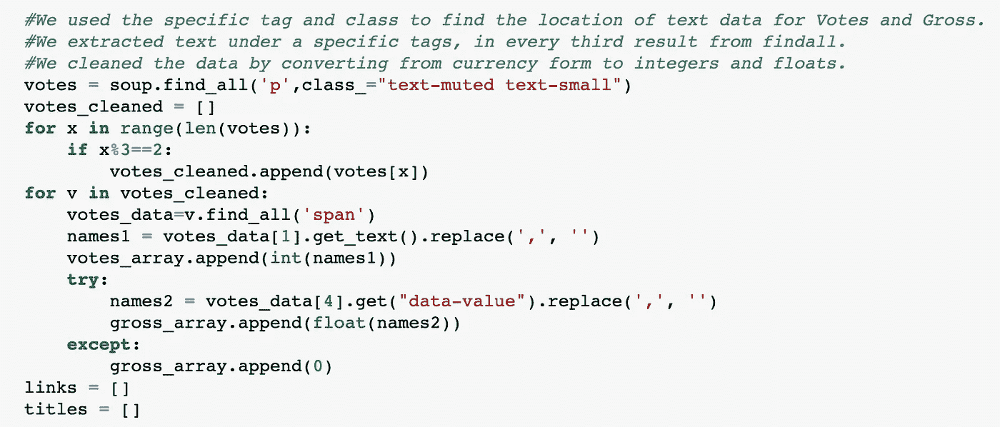
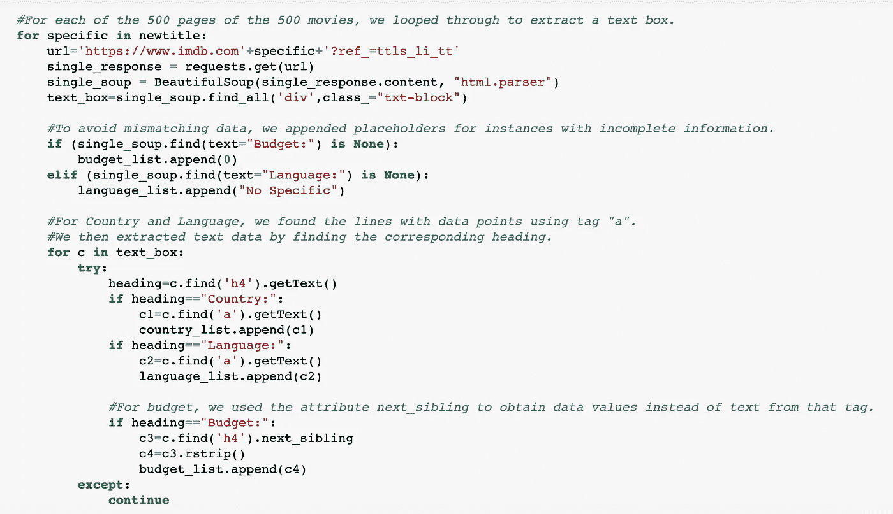

# IMDB 电影评分的最大影响因素——第一部分:数据抓取

> 原文：<https://towardsdatascience.com/the-most-influential-factor-of-imdb-movie-rating-part-i-data-scraping-61dc0c4dd518?source=collection_archive---------23----------------------->

我一直是一个狂热的电影迷，我喜欢通过查看不同的电影评级/评论网站来探索伟大的电影，如 IMDb，烂番茄等。当我看那些顶级电影名单时，我总是想知道，**影响电影成功的主要因素是什么**，是预算、票房、语言还是电影类型？

一个偶然的机会，我和另外三个电影爱好者(也是数据爱好者)决定进行一项关于电影成功影响因素的统计研究。我们决定看 IMDb 的“[有史以来最伟大的 500 部电影”](https://www.imdb.com/list/ls062911411/?st_dt=&mode=detail&page=1&sort=list_order,asc)；我们使用 movie 作为实例来收集与每个电影相关的各种数量，并随后对数据集进行统计分析。

## 我们的目标是:

> 1.使用数据抓取技术从 IMDb 电影列表中提取数据，并创建数据集。
> 
> 2.使用描述性统计和多元回归建模来可视化和分析我们收集的数据。

IMDb top 500 movies

本文将关注这个研究项目的第一部分，即通过数据采集和清理创建数据集。

# 动机

创建这个数据集的**目的**是分析影响电影成功的主要因素，通过电影评级来衡量。我们的团队创建了这个数据库，并使用美丽的汤从 IMDb 在 2017 年创作的页面中获取了该数据集中的信息——有史以来最伟大的电影。

# 作文

## 实例和变量

数据集仅由作为实例类型的**电影**组成。总共有 **500 个实例**(电影)。我们的数据集包含网页中所有可能的实例。

对于每个实例，它由**证书、持续时间、评级、流派、投票、总收入、国家、语言和预算**组成。我们针对每个实例的**分类变量**由关于证书、流派、国家和语言的信息组成，这些信息是作为直接从网页上抓取的**未处理文本**收集的。**每个实例的数字变量**由持续时间、评分、投票、总收入和预算等信息组成，这些信息是作为**未处理的文本和数值**收集的，也是直接从网页上抓取的。没有标签或目标与每个实例相关联。

在我们所有的 500 个实例中，变量的某些数据点**丢失了**，比如一些电影的总收入和预算。对于我们可以在其他地方找到信息的实例，我们将信息添加到 csv 文件(我们的数据集)中。然而，对于没有毛额或预算信息的实例，我们删除了这些实例。我们的原始数据集还包括每个实例的 Metascore，但我们最终决定删除它，因为许多电影的 megascore 都丢失了。这些数据点丢失的原因是因为它们在原始的 IMDB 网站上不可用，因为一些电影非常古老，因此很难收集六十年前的数据。我们最初收集的数据在各个实例之间没有明确的联系，因为我们希望客观地分析这个数据集。

## 噪音

数据集中有一些**噪声源**。例如，一些外国电影的总收入和预算是以外币计算的，我们用当前的汇率将这些外币手动转换成美元。它可能不准确，因为汇率总是在波动，它可能不会准确地反映外国电影的确切总额和预算。还有一些老电影，很久以前就有票房和预算了。我们没有根据通货膨胀和折旧调整总额和预算。

## 包含来自 IMDb 的信息/数据

数据集是**部分自包含的**。对于证书、持续时间、评级、流派、投票和总值等变量，未处理的文本和值直接从网页中抓取，因此是独立的。其他三个变量——国家、语言和预算——不是独立的，是从 IMDb 网站上每个电影实例的网页中搜集来的。例如，为了找到关于第一部电影*公民凯恩的国家、语言和预算的信息，*我们访问了*公民凯恩*的网页来抓取未处理的文本和值。数据集不包含机密或攻击性的信息。

由于评级是众包意见，数据与人 T10 部分相关。收视率可以反映公众如何看待电影的质量。然而，有一些特定的人群更有可能评分。例如，真正喜欢或不喜欢这部特定电影或演员的人更有可能通过评级来表达他们的强烈意见。电影爱好者也更有可能评分，但更客观。

# 收集过程

我们所有的变量都可以作为原始文本和值在 IMDb 的各个页面上直接观察到。

the packages that our team has utilized for data collection

我们利用 Python 库 BeautifulSoup 从 IMDb 网页中抓取数据。如所提供的 Python 文件所示，对于每个变量，我们确定了表示为 html 的文本或值的模式。然后，我们通过识别网站上每个变量的标签和类别来获取每个变量的信息。

**对于独立信息:**

*   电影名:我们发现电影名在标签“h3”和类“lister-item-header”下。我们简单地使用 getText()获得文本数据，并使用正则表达式去掉多余的空格。

obtain Movie Names

*   证书:我们发现证书上的信息在标签“p”和类别“文本-静音文本-小”下我们发现每个电影实例需要的信息是每三个标签中的一个，所以我们将每三个标签中的 getText()值附加到我们的证书数组中。

Obtain Certificate

*   持续时间:我们发现我们需要的关于持续时间的信息在标签“span”和类“runtime”下。与 certificate 类似，为每个实例返回大量文本信息。我们需要这个数据集的持续时间总是这个标签和类下返回的第一个文本，所以我们只追加了索引 0 的信息。

Obtain Duration

*   评级:我们需要的信息在标签“div”和类“ipl-rating-star small”下的信息部分中在该部分中，等级值位于标签“span”和类别“ipl-rating-star__rating”下我们对循环使用 2 来获得评级值。

Obtain Rating

*   流派:获取关于流派的信息更加简单。所有的流派信息都在标签“跨度”和类别“流派”下我们简单地使用 get_text()来获取我们需要的文本。

Obtain Genre

*   投票:投票遵循与证书相似的模式。我们首先在标签“p”和类“text-muted text-small”下找到包含投票数据的信息部分。这一部分包括三种重复的信息类型，我们收集的信息在每三个组块中。我们循环遍历每三个块，并在标签“span”下寻找信息，这是我们想要的文本信息。
*   总量:总量信息也取自用于提取投票数据的“span”下的相同信息。总数据总是该信息块下的第五个数据值，所以我们简单地在数据块的索引 4 上使用 get("data-value ")提取数据。

Obtain Vote and Gross

**外部链接数据:**

对于下面的变量，我们必须遍历每个电影实例的网页。我们发现这些网页的模式由标题“https://www . IMDB . com/title/TT”+代表电影 ID 的数字组成。我们首先使用美汤 find_all 函数找到主主页中的所有链接。后来，我们发现了 IMDB 如何用一系列数字来标识每部电影的特定模式。然后我们使用带有正则表达式模式'/title/(tt\d{5，7})/'的 re.compile()函数来查找任何与该模式匹配的链接。然后我们过滤掉那些有用的链接并附加到一个新的列表中。在打印出新的列表后，我们发现每个电影名称实际上重复了两次。然后，我们使用 for 循环函数提取奇数位置的每个链接。

Find Movie IDs

在每个实例中使用 for 循环，我们首先在标签“div”和类“txt-block”下提取一个包含所需信息的文本框。在文本框中，为了防止每个实例的信息不匹配，我们使用 if-elif 结构为没有预算信息的电影附加 0，为没有语言信息的电影附加“No Specific”。我们认识到，每种信息类型都有一个说明该信息类型的标题。例如，标题“预算:”后面的预算数据，所以我们使用这些标题来识别没有这些信息的电影，方法是检查是否可以在每个实例中找到这些标题。

对于大多数具有所有可用信息的实例，我们使用 try-except 和 if 函数来收集以下信息:

*   国家:国家信息在标签“h4”下，所以我们使用 getText()提取标题“国家:”后的文本数据。
*   语言:与国家类似，语言信息也在标签“h4”下，所以我们也使用 getText()提取标题“语言”后的文本数据
*   Budget: Budget 是相似的，但是不同的是，Budget 信息也在标签“h4”下，但是我们不能使用 getText()，因为 Budget 信息不是文本形式的。预算信息存储为数据值，所以我们使用了属性”。next_sibling”来提取标题“预算:”后的数据值。

Extract data from all 500 movies

*注意:数据集不是来自大型数据集的样本* *。我们团队* *无偿参与了数据收集。没有进行* *的伦理审查流程。当人们向 IMDB 发布他们的评级时，数据集只与人们相关。*

# **预处理/清洁/贴标**

为了在 csv 中创建数据集，我们为每个变量创建了空白数组，并将提取的数据附加到这些数组中，以便清理和创建最终的 csv 文件。以下是我们用来清理数据的一些方法:

*   正则表达式:对于电影名，我们使用了“\\n.+\\n(。+)\\n.+\\n "去掉字母前后和字母之间的空格。
*   Rstrip:我们使用了属性 rstrip 来消除类型和预算字符串末尾的空白。
*   货币换算:在某些情况下，总值是以其他货币计算的。我们手动将这些货币转换成美元。
*   将字符串转换为浮点数或整数:对于持续时间，我们首先使用 get_text()来查找标签后的字符串。然后，我们将 duration 的类型字符串转换为 float。对于 Year，在通过 get_text()函数从网站中提取年之后，我们将年的类型从 string 转换为 int。对于 Vote，在通过 get_text()从网站中提取投票并用空格替换逗号(因为文本处于货币模式，包括美元符号和逗号)之后，我们将投票类型从 string 转换为 int。
*   修改缩放单位:我们将总量数据除以一百万，以更好地缩放评级。

# 数据集的使用

我们的数据集可以通过这个[链接](https://www.dropbox.com/s/b315qz7l1c9ld3r/data_3.csv?dl=0)来访问。

该数据集已被用于一些分析电影的类似任务。有许多关于电影的数据分析，但其中一些已经过时，而且不全面。例如，许多数据分析侧重于特定年份的电影，或者专门针对流派和电影类型的分析。我们的数据集还可以用来分析人们对电影的口味在过去几年中如何变化，或者通过插入该电影在未来的其他事实来预测预期的总收入和预算。我们的数据集组成可能不会影响未来的用户，并且没有任何任务需要使用该数据集。

# 结论

在我们研究的第一部分，我们使用了数据抓取和正则表达式等技术来创建数据库。在[第二部](https://medium.com/@yd334/the-most-influential-factor-of-imdb-movie-rating-part-ii-data-analysis-and-statistical-modeling-c6300b8d7d4d?source=friends_link&sk=265b02d344272c68e66c6bbc0ff26501)中，我们将分析从电影列表中获得的数据集，并进行进一步的统计建模和研究。

*_
这是一个由康乃尔大学的四名学生组成的小组项目，他们是:尤里·戴、芹那·李、楼可欣、吴尚珍。*

*_
该数据集是为研究目的而创建的，没有相关的拨款或资助。*