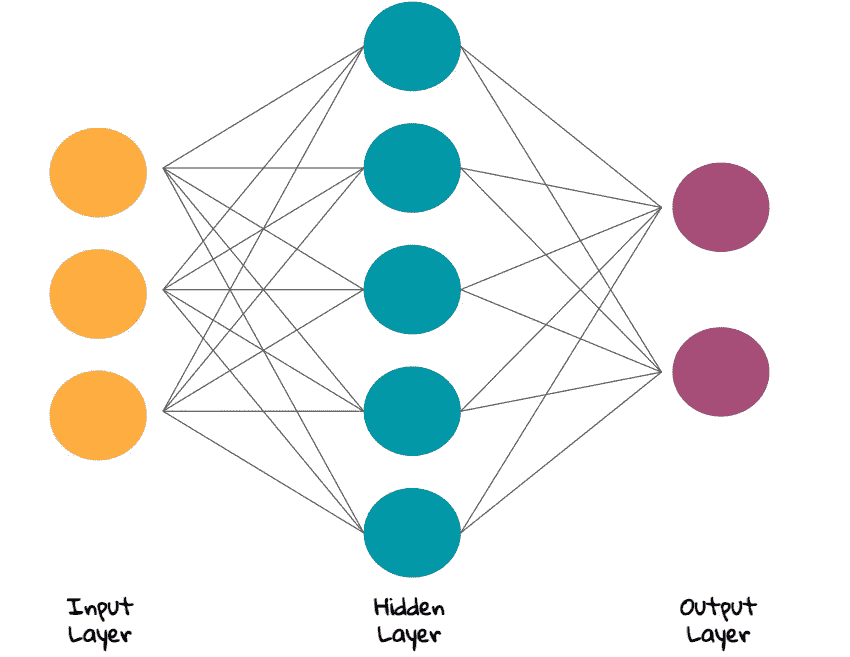
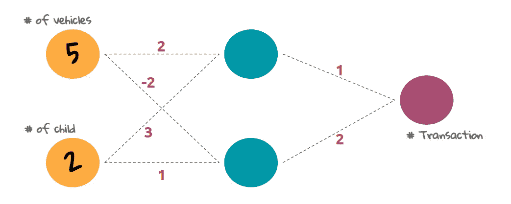
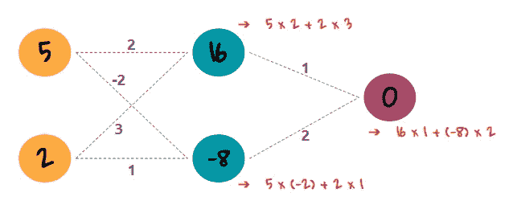
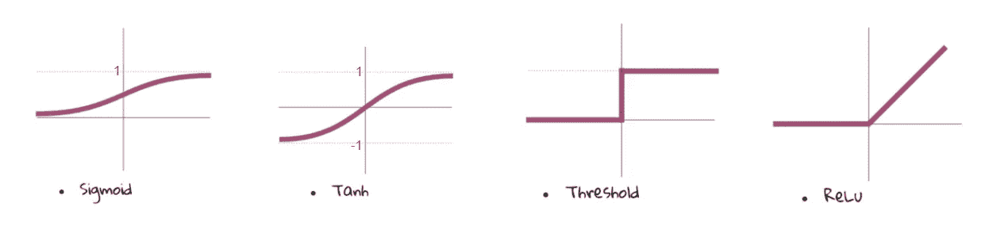
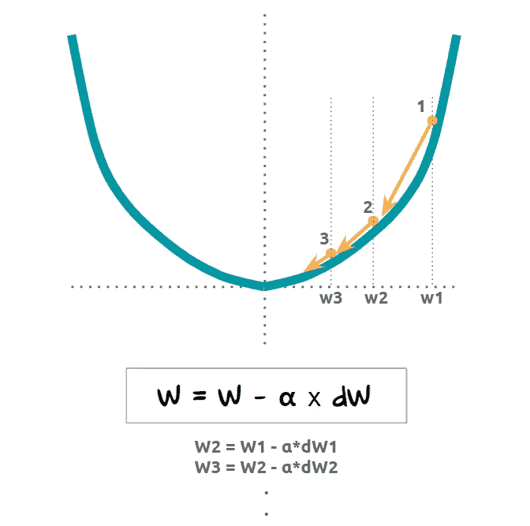
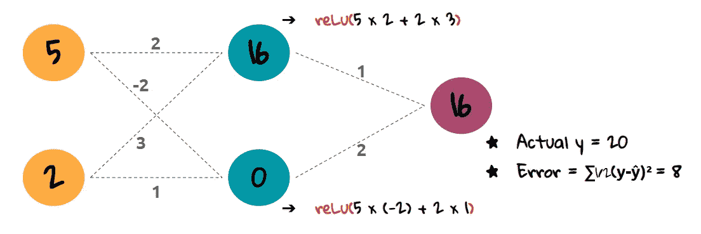
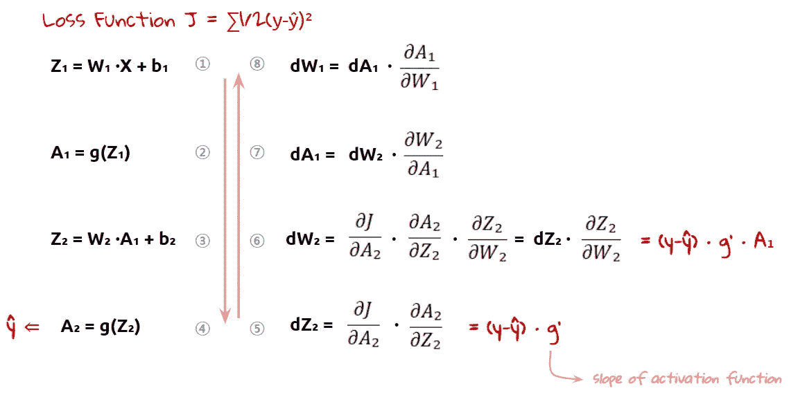
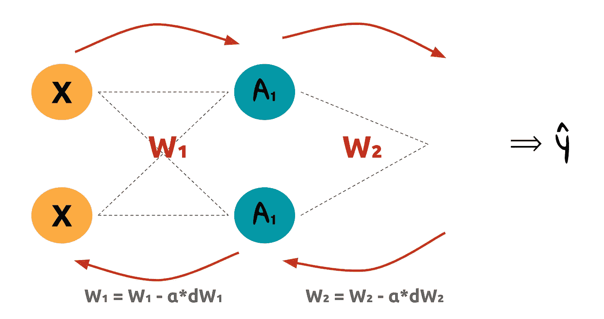
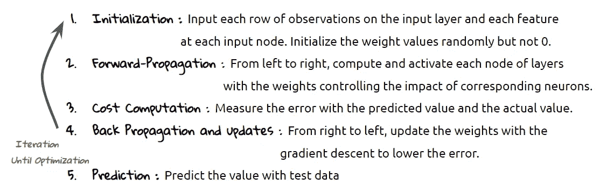

# 人工神经网络最直观和最简单的指南

> 原文：<https://towardsdatascience.com/the-most-intuitive-and-easiest-guide-for-artificial-neural-network-6a3f2bc0eecb?source=collection_archive---------12----------------------->

## 揭开神经网络的神秘面纱

*神经网络！深度学习！人工智能！*

任何生活在 2019 年世界的人，都会不止一次听说过这些词。而且你大概也看过图像分类、计算机视觉、语音识别这些牛逼的作品。

所以你也有兴趣建立那些很酷的人工智能项目，但仍然不知道什么是人工神经网络？已经有数百篇文章以“人工神经网络反向传播初学者指南”或“人工神经网络简介”的名义解释了人工神经网络的概念它们真的已经很棒了，但是我发现对于那些不习惯数学表达的人来说可能还是很难。

这是神经网络的“最直观和最容易的指南”的第一个系列。本帖的全套如下:

1.  人工神经网络最简单的指南
2.  [卷积神经网络最简单指南](/the-most-intuitive-and-easiest-guide-for-convolutional-neural-network-3607be47480)
3.  [递归神经网络最简单的指南](/the-most-intuitive-and-easiest-guide-for-recurrent-neural-network-873c29da73c7)

今天，我将用最少的数学来解释人工神经网络(ANN)的基础知识。这可能是有史以来最简单和最直观的解释，所以如果你讨厌数学或者对线性代数有困难，来看看吧！今天的关键词是正向传播、激活函数、反向传播、梯度下降和权重更新。我还会留下额外的资源，在你完成这篇文章后，这些资源可以成为你的下一步。听起来不错？让我们完成它！

# 那么究竟什么是神经网络呢？

你可能已经看过很多文章，从什么是神经元以及它们是如何构成的开始。是的，人工神经网络的‘神经’来源于人脑的神经元。1943 年，沃伦麦卡洛克和沃尔特皮茨首次尝试从人类神经网络中创建一个计算模型。他们想将大脑中的生物过程应用于数学算法，从那一点开始，神经研究领域分成了两个方向。今天人工智能中的神经网络与真正的认知科学领域走的路线有点不同。所以我宁愿把人工神经网络的框架看作某种结构或图表，而不是神经元。因为它和大脑的生物神经元没什么关系。

就从这张图开始吧。有起点(输入层)和终点(输出层)。假设这些是岛，我们从“输入层”岛到“输出层”岛。从开始到结束，我们可以采取不同的方式。每条路线都有不同的点。当我们接近目的地时，我们将汇总所有可能的分数，并确定哪个岛屿是我们要寻找的最佳岛屿。所以这就像是派出我们的探测船队去为我们的下一个假期寻找一个完美的岛屿。

这里一个有趣的部分是，当船队接近输出层时，他们又回到输入层。然后，我们重复这个过程，将它们发送到输出层，并回调到输入层。对于每次试验，每次试验都将有一个结果分数，我们将使用它们来计算预测的准确程度。就像我们在线性回归中对 RMSE 或梅所做的一样。

# 正向传播和权重

我上面拿的比喻就是神经网络做的事情。这次让我们进行一些真正的计算。这是一个更简化的神经网络图。

假设我们的输入数据是 **5** 和 **2** 。因此，我们将把这些值传递给输出层。先从 **5** 说起吧。正如你所看到的，有两种不同点的可能方式。如果 **5** 走上路线，则点为 **10** 。如果 **5** 走下路线，则为 **-10** 。那么输入值 **2** 会是什么样子呢？是的。 **6** 为上层路线， **2** 为下层路线。因此，如果我们总结每种可能的情况，隐藏层的值将如下所示。

我们可以很容易地用同样的方法得到最终值。你大概知道这里发生了什么。这就是所谓的*。它从左向右移动。这里的要点是将左图层的结果作为下一个右图层的输入值。*

*图中的圆圈被称为 ***节点*** ，我将其描述为岛屿。我们使用的相乘值称为 ***权重*** 。权重是数据科学中非常常用的术语。我们用它来表示某些特征或样本的力量。因此，如果一个特征获得了很高的权重值，那么该特征将对结果产生很大的影响。通过给特征赋予不同的权重，我们可以训练我们的模型以获得更好的预测。这个词对你来说可能听起来很陌生，但我们已经将它们用于其他机器学习算法，如 lasso 回归或 boosting 算法，控制其他回归中的特征系数。*

# *激活功能*

*还有一个新概念你可能到现在都没听过，就是激活功能。 [***激活功能***](https://en.wikipedia.org/wiki/Activation_function) 在提交结果值之前对值进行非线性改变。为什么我们需要它？如果我们只是使用线性计算而没有激活函数，就像我们上面所做的那样，我们不能给我们的模型任何'隐藏层效应'。它与其他回归模型没有太大的不同。为了“激活”神经网络的真正力量，我们需要应用一个“激活函数”原因激活函数有助于模型捕捉数据中的非线性。*

*有几个激活函数，我们需要根据问题选择一个合适的。方程可以在维基百科上找到，但是我想让你在方程前看到每个函数的图形。每个函数有什么样的形状或特征。因为这种了解会给你选择什么的线索。*

**

****sigmoid 函数*** 适用于二值分类的情况。它只转换 0 和 1 之间的值。输入值越高，越接近 1。输入值越小，越接近 0。 ***双曲正切函数*** (正切双曲线)类似于 sigmoid 函数，但它的下限这次去了 **-1** 。由于 Tanh 将数据中心设置为 0，因此它比 sigmoid 函数更受欢迎。 ***阈值函数*** 和 ***ReLu*** (整流器)有一个确定的点，值从这个点开始变化。由于斜率的原因，ReLu 在大多数情况下都是有效的。但是为什么是斜坡呢？神经网络和斜率有什么关系？这就是梯度下降发挥作用的地方。*

# *梯度下降*

*[梯度下降](https://en.wikipedia.org/wiki/Gradient_descent)就是寻找一个函数的最小值。我们假设成本函数有一个凸形，如下图所示。我们的目标是使价值尽可能小。*

*如果第一次试验在曲线的某处得到了误差，比如说点 1。我们将进行另一场审判。随着多次尝试和比较结果，该点将像图片一样下山，并最终接近最低点。(但不完全是 0)*

**

*我们移动该点的量由损失函数的斜率 **dW** 决定。并且 **α** 是我们必须选择的学习速率。所以权重更新的快慢取决于 **dW** 和 **α** 的乘积值。如果学习率过大或过小，模型将无法学习正确的权重值。因此，给梯度下降赋予正确的值和正则化是非常重要的。*

*这里有如此多的故事，但我不认为一次拥有它们是好的。对于愿意更深入研究的人，我将在最后留下其他高级资源。*

# *反向传播和更新*

*好了，让我们回到我们的故事，这些概念:激活函数和梯度下降。如果我们对我们的数据应用 reLu 激活函数，输出层将是 **16** 。如果实际值是 **20，**我们预测的误差将是 **8** 。*

**

*从现在开始，我们将向后移动并更改权重值。这就是所谓的*。这一次我们从右到左，从输出层到输入层。倒退的意义是什么？它得到每一步的梯度。根据斜率，我们将更新权重，就像我们上面讨论的那样。**

****

**我们目前所经历的是从 **①** 到 **④** 阶段。我们输入 x 值，通过前向传播得到预测值 **ŷ** 。有一个 **b** 术语叫做 **bias，**但是我们这里只是把它叫做 **0** 。从阶段 **⑤** 开始，反向传播开始。如果你熟悉连锁规则，你会很容易理解这个概念。如果没有，也不用担心。就像咬上一个方程的尾巴。我想让你看看 **dW₂** 的结局。它采用给定点的激活函数的误差和斜率与输入值的乘积。**

**就像正向传播通过隐藏层向输出层传递输入数据一样，反向传播从输出层获取错误，并通过隐藏层将其反向传播。并且在每一步中，权重值将被更新。**

****

**将整个过程重复几次，该模型找出最佳权重和具有最佳准确度的预测。当指标收敛到一定水平时，我们的模型就可以进行预测了。**

# **摘要**

**让我们回顾一下到目前为止我们所讨论的内容。我们在 ANN 中讨论了 5 个步骤。**

****

**当通过隐藏层并更新每层的权重时，神经网络所做的是在内部表示数据的模式。其他深度学习算法都是从这个基本结构开始的。它们是添加了特殊技术的修改版本。因此，对于初学者来说，对神经网络的基本结构有一个坚实的理解应该是首要的事情。**

**这篇文章的重点是用最少的数学知识获得神经网络的基本直觉。这可能是一个有点简化的案例，但对初学者来说确实很有效。如果你准备好进入高级阶段，我建议你也阅读许多其他资源。这些是我的选择。**

*   **Shirin Glander 写的这么棒的帖子。这涵盖了如何用正则化和优化的额外概念在 R 中构建一个 ANN:[‘神经网络如何学习？’使用 H2O 深度学习算法的逐步解释](https://shirinsplayground.netlify.com/2018/11/neural_nets_explained/)**
*   **也许这是由 [James Loy](https://medium.com/u/e7803b4cff21?source=post_page-----6a3f2bc0eecb--------------------------------) 撰写的关于数据科学的最受欢迎的文章。虽然已经有一段时间了，但是从头开始理解深度学习仍然很棒:[https://towardsdatascience . com/how-to-build-your-own-neural-network-from-scratch-in-python-68998 a08e 4 F6](/how-to-build-your-own-neural-network-from-scratch-in-python-68998a08e4f6)**
*   **在 DataCamp 上获得神经网络直觉的优秀课程。甚至对于不懂线性代数和导数的人:[https://www.datacamp.com/courses/deep-learning-in-python](https://www.datacamp.com/courses/deep-learning-in-python)**

**感谢您的阅读，希望您对这篇文章感兴趣。我总是乐于交谈，所以请在下面留下评论，分享你的想法。我还每周在 [LinkedIn](https://www.linkedin.com/in/jiwon-jeong/) 上发布其他有价值的 DS 资源，所以请关注我，联系我，伸出援手。我会回来讲另一个关于深度学习的激动人心的故事。在那之前，机器学习快乐！**