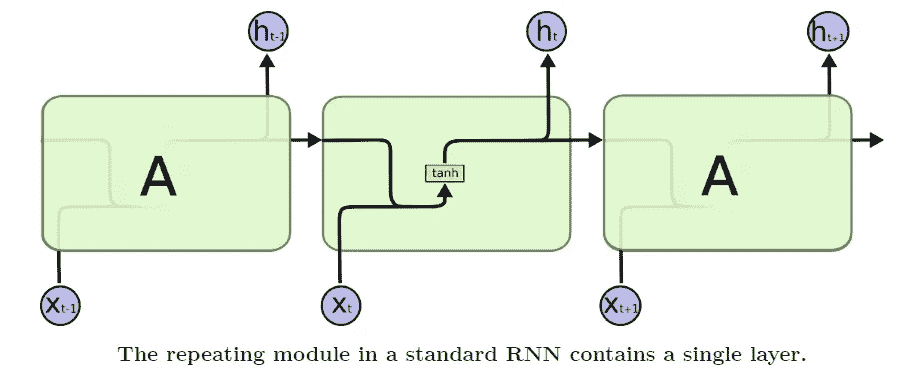
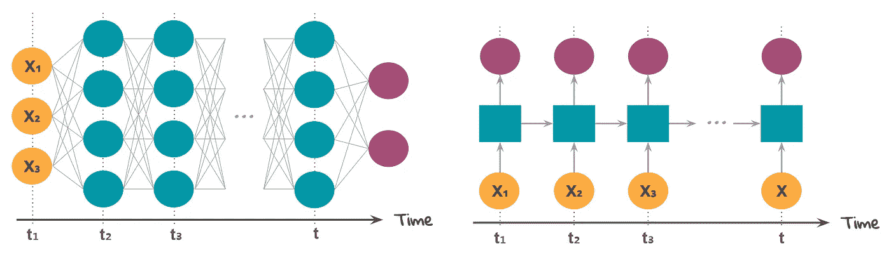
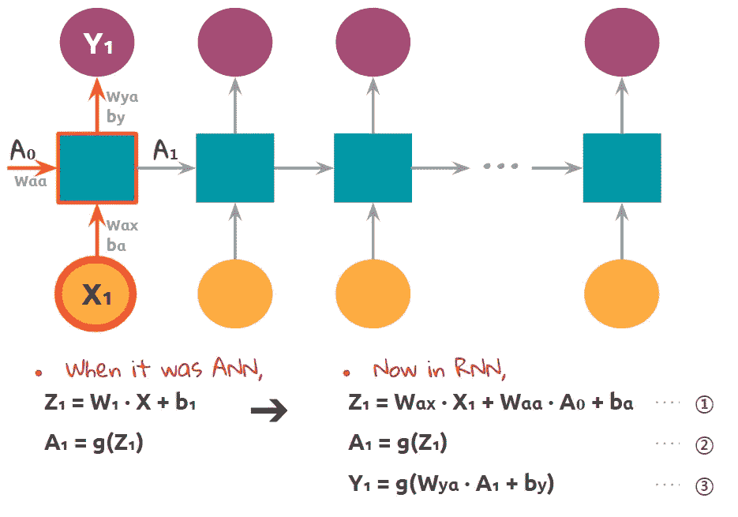
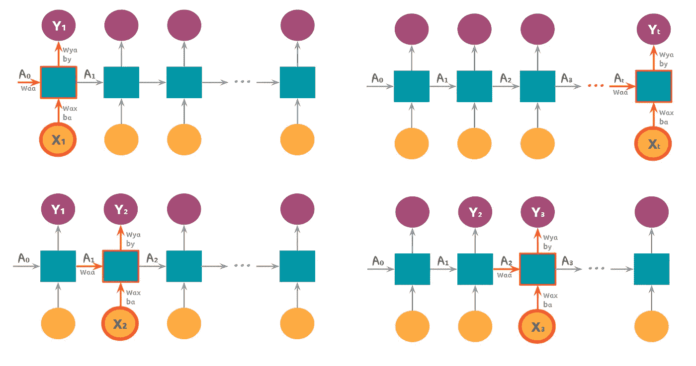
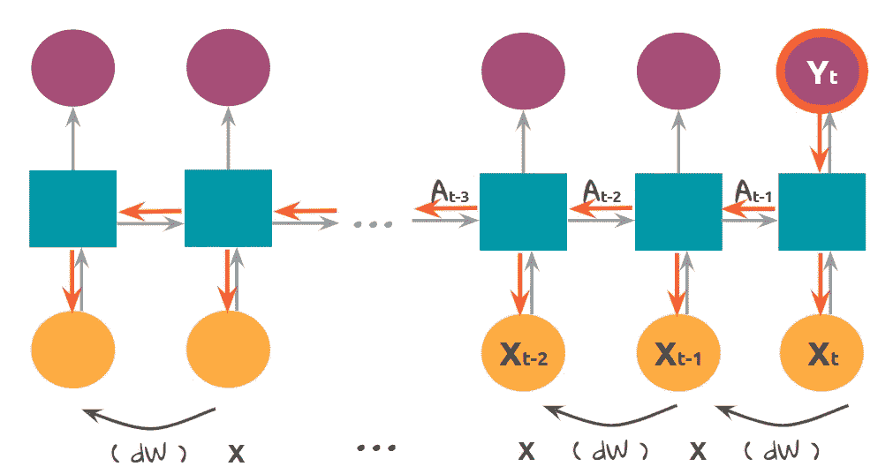
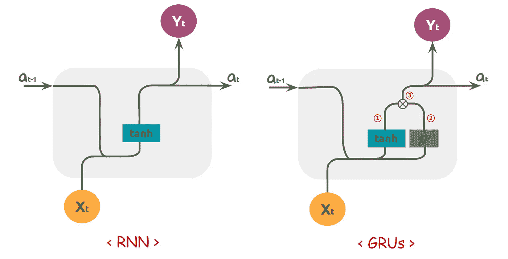
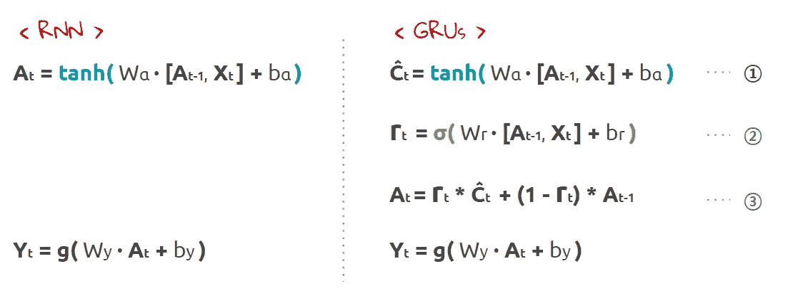
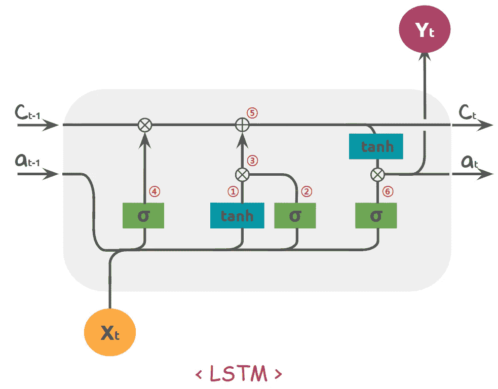
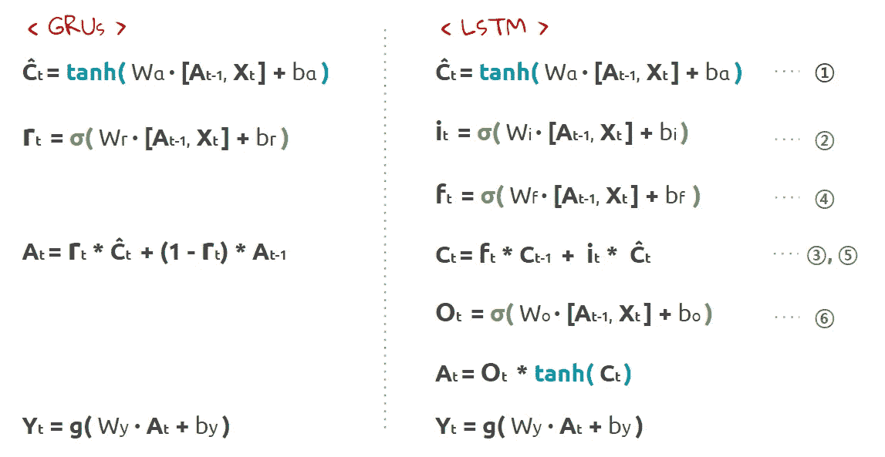
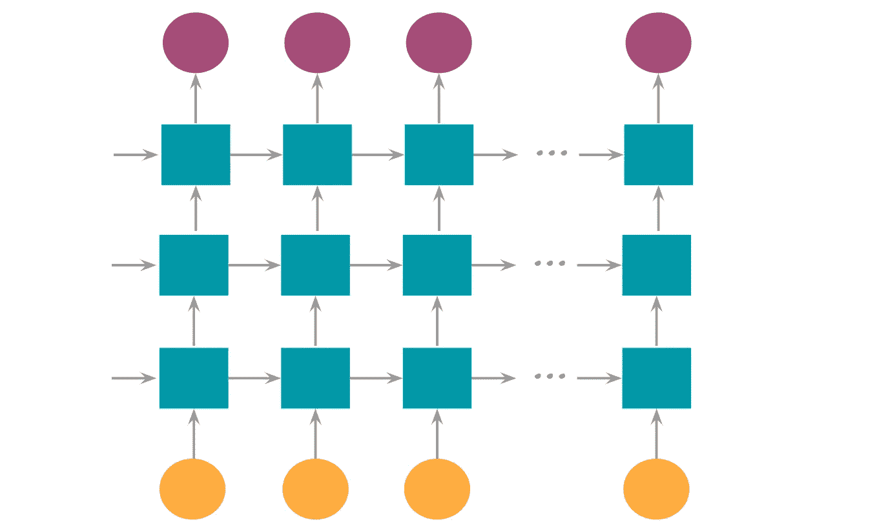

# 递归神经网络最直观和最简单的指南

> 原文：<https://towardsdatascience.com/the-most-intuitive-and-easiest-guide-for-recurrent-neural-network-873c29da73c7?source=collection_archive---------3----------------------->

## 揭开 RNN 的神秘面纱

一切都有过去。有时候过去定义了我们。我们走过了什么路，一路上做了什么选择。它们像我们的历史一样弯曲，告诉我们过去是什么样的人，我们将走向何方。这也适用于数据。他们可以拥有自己的过去，而那段历史可以用来预测接下来会发生什么，未来。正如我们有一个算命师，同样的数据，这被称为序列模型。

这是神经网络“最直观和最容易的指南”系列的第三部分。本帖全套如下:

1.  [安最简单的指南](/the-most-intuitive-and-easiest-guide-for-artificial-neural-network-6a3f2bc0eecb)
2.  [CNN 最简单的指南](/the-most-intuitive-and-easiest-guide-for-convolutional-neural-network-3607be47480)
3.  RNN 最简单的指南(本帖)

这篇文章假设你有神经网络的基础知识。如果你对这个完全陌生，请随意查看第一个系列。今天的关键词是序列，消失梯度，记忆和门。很难理解递归神经网络的结构和数学表达式。所以这篇文章将集中在最少数学量的基本直觉上，就像我们在上一篇文章中对 ANN 所做的那样。

# 这里有什么新鲜事？

如果你听说过序列模型，那么你可能会看到下面这种图表。这是很自然的，你不会一眼就看到图中描绘的概念。这是因为序列模型与前面讨论的其他神经网络有点不同。

[Colah’s blog](http://colah.github.io/posts/2015-08-Understanding-LSTMs/)

所以在深入这个神经网络之前，我们为什么不谈谈序列模型在现实世界中的应用。这是因为它可以帮助我们通过从这些例子中得到提示来理解这个概念。那么，RNN 在哪里受到数据科学家的关注呢？

语音识别可以是一个典型的例子，我们可以找到最近的距离。Alexa、Siri 和 Google home。这些设备响应我们的呼叫，并可以完成一些简单的任务，如设置闹钟或向其他人发送消息。我们也可以通过谷歌翻译或聊天机器人找到它。

序列模型在遗传学领域也很流行。如果你有一点 DNA 方面的背景知识，理解这里的序列的含义会容易得多。在人类分子中， [DNA](https://en.wikipedia.org/wiki/DNA) (脱氧核糖核酸)由 4 种不同类型的核苷酸链组成: **A** 、 **C** 、 **G** 和 **T** 。遗传信息存在于核苷酸的连续组合中。因此，这些序列对于所有种类的生物都是必需的，并且序列模型在预测基因的未覆盖部分中具有很高的使用价值。

时间序列分析呢？这种神经网络还能够预测股票市场价格或温度数据的下一个值。例如，我们收集 30 天的温度数据，并使用这一系列数据来预测 31 日的温度。

你注意到这些例子的共同特征了吗？言语、DNA 链和时间序列。答案是“循序渐进”数据不是静态的或不连续的，而是前赴后继的。但是当涉及到数据时，我们所说的*连续*或*连续*是什么意思呢？

让我们回忆一下我们对像 ANN 这样的其他模型所做的工作。我们有样本数据，并通过从左到右的层传递它们。这意味着我们将一次输入数据，然后它们将向输出层传输。它是前馈传播，只有一个流动方向。

然而，在 RNN 的情况下，数据不是同时输入的。如右图所示，我们先输入 **X1** ，然后输入 **X2** 得到 **X1** 的计算结果。同理， **X3** 用 **X2** 计算阶段的结果计算。

因此当谈到数据时，*‘时序’意味着我们在数据之间有一个时间顺序。当它是安的时候，在 X1，X2 和 X3 没有任何秩序的概念。我们只是立刻输入它们。然而，在 RNN 的情况下，它们是在不同的时间输入的。因此，如果我们改变顺序，它会变得明显不同。一句话就会失去意义。当涉及到 DNA 时，这种变化可能会产生…一种突变体。*

*因此，RNN 的吸引力在于我们可以将数据与之前的数据联系起来。这意味着模型开始关心过去和未来。由于递归单元保存过去的值，我们可以称之为内存。我们现在能够考虑数据中“上下文”的真正含义。*

# *递归神经网络的结构*

*现在有了这个基本的直觉，让我们更深入地了解 RNN 的结构。这是一个简单的 RNN，只有一个浅层。我们的模型现在将取两个值:在时间 **t** 的 **X** 输入值和来自前一个单元的输出值 **A** (在时间 **t-1** )。*

**

*请看一下方程式 **①** 。和简单人工神经网络一样，存在权重和偏差。只是多加了一个输入值 **A0** 。细胞有两种不同的输出。下一个单元的 **A1** 的输出( **②** )和单元电池的最终输出**Y1**(**③**)。不要因为这些下标而紧张。它们只是表明重量属于什么值。现在我们来看下一个单元。*

**

*简单又酷吧？现在我们可以预测未来。如果是关于股市，我们可以预测一家公司的股价。然后我们猜测，如果有一个大的数据集，比如 10 年前的历史数据，我们会得到更好的准确性。所以数据越长，结果越好，对吗？但事实是，这个模型并不像我们预期的那样理想。*

# *真正的事情从这里开始*

*回忆过去的想法太棒了。但是反向传播有一个关键问题。反向传播是向后更新每一层的权重的步骤。为了更新权重，我们获得成本函数的梯度，并使用链式规则在给定的层上不断乘以梯度。RNN 的实际反向传播比这张图要复杂一些，但为了简单起见，我们跳过它们。(例如，真实的反向传播不仅采用最终输出 **Yt** 而且采用成本函数使用的所有其他输出 **Y** 。)*

**

*想象一下当梯度大于 1 时。更新后的值变得如此之大，以至于无法用于优化。这叫做 ***爆炸渐变*** 。但这并不是一个严重的问题，因为我们可以固定梯度不能超过的范围。真正的问题发生在梯度小于 1 的时候。如果我们一直乘以小于 1 的值，结果会变得越来越小。经过一些步骤后，结果不会有明显的差异，并且它不能在权重上进行任何更新。它叫做 ***消失渐变。*** 表示反向传播效应不能达到层的早期。*

*这就是为什么人们说 RNN 记性不好。如果输入值的长度变得更长，我们就不能期待实际的优化。这是一个非常关键的问题，因为神经网络的能力来自于更新权重。还有其他方法可以解决这个问题吗？*

# *让我们忘掉它吧！*

*说实话，记性不好的人很难得到好的回忆。我们都知道。太多的东西我们记不住。我们的模型也是如此。与其拖着所有的过去，也许选择性的回忆会更好。这就像只选择了重要的信息，而忘记了其他的。拥有所有这些过去的值会导致渐变消失。因此我们给简单 RNN 增加一个步骤，称为*。**

****

**左图显示了 RNN 晶胞内的计算。这里没有什么新东西。它只是显示了它接受两个输入值，并在计算后返回两个输出值。在右边，你可以看到盒子里有一个小小的变化。绿色盒子。这是什么？这是一个 ***门控制器*** 。这个盒子决定了我们是否应该记住。**

****

**我们将像对 RNN 那样计算 tanh 激活( **①** )，但这不会马上用到前面。就像一个候选人。在这里，我们还将获得门的新值( **②** )。因为它采用 sigmoid 函数，所以输出值总是在 0 到 1 之间。因此，通过将它乘以 **①** 值，我们将决定是否使用它。当 **0** 的时候， ***没有用*** 或者 ***没有更新。*** (本例使用以前的值)当 **1** ， ***使用*** 或 ***更新*。**“这就像打开和关闭一扇大门。**

# **大门和大门**

**现在我们终于来到了 LSTM， ***长短期记忆网络*** 。实际上，LSTM 比格鲁什更早被提出。但是我首先带来了 GRUs，因为 LSTM 的结构比 GRUs 的结构更复杂，多了两个门。此外，这里还会有一个新概念，叫做“ ***细胞状态*** ”但是你已经习惯了这个概念。它将包含内存的值与隐藏状态值 **A** 放在一起。让我们详细看看 LSTM 有什么。中间的蓝框和绿框( ***输入门*** )与 GRUs 相同。这里有两个额外的绿色方框: ***遗忘门*** 和 ***输出门*** 。**

****

**计算也是一样的，所以我们将从双曲正切函数( **①** )获得输出，从 sigmoid 函数( **②** )获得输入门值。但是这次乘法步骤有点不同。除了只取输入门的结果，我们还考虑来自左边的遗忘门值。**

****

**让我们看看右边第三行的等式。我们有一个遗忘门，它将用于更新单元状态值，如第 4 行所示。最后还有一个门，输出门。如第 6 行所示，我们通过将时间 **t** 处的 **C** 的输出门值和 tanh 激活值相乘，得到时间 **t** 处的 **A** 值。**

**有了这三个额外的门，LSTM 可以有更强的记忆能力。这些都是关于控制它应该记住的部分或数量。它是如此健壮和有效，以至于在序列模型中非常流行。那么我们能说它在所有情况下都比 GRUs 好吗？正如我们一直说的，没有灵丹妙药，GRUs 也有自己的优势。它的结构比 LSTM 简单，所以有时用 GRUs 做一个大模型是合适的。**

# **结论**

**到目前为止，我们讨论的是具有一个浅层的序列模型。那么当我们增加更多的层时会是什么样呢？如果我们说在 ANN 或 CNN 中增加更多层是水平的，那么在 RNN 是垂直的。但是序列模型已经是一个有一两层的大模型了，如果我们在其上再增加几层，它可能会过度拟合。因此，需要应用归一化技术，如丢弃或批量归一化。**

****

**这篇文章主要是关于理解从简单的 RNN 到 LSTM 的每个模型的结构。我们走过的数学表达式乍一看可能很复杂。然而，在您熟悉了模型的整体结构之后，就很容易理解了。因为数学只是一个数字表达式，以清晰有效的方式表达概念。如果你能看到这些数字背后的含义，那么数学也会变得有趣。**

**我还一如既往地带来了其他额外的资源。当您准备好进一步使用序列模型时，我强烈建议您也阅读这些文章。**

*   **[**了解 LSTM 网络**](http://colah.github.io/posts/2015-08-Understanding-LSTMs/) 克里斯托弗·奥拉:这样一篇关于了解 RNN 和 LSTM 结构的伟大文章。Colah 的博客很受欢迎。你可以看到许多其他的资料都有这个博客作为参考。**
*   **[**学习序列建模的必读教程**](https://www.analyticsvidhya.com/blog/2019/01/sequence-models-deeplearning/)**by[pul kit Sharma](https://medium.com/u/50dc5f8ee633?source=post_page-----873c29da73c7--------------------------------):我在之前的博客里已经贴出了他的作品，这是针对序列模型的系列。如果你还没有看过，强烈推荐你去看看其他的系列。****
*   ****[**递归神经网络示例在 Python**](/recurrent-neural-networks-by-example-in-python-ffd204f99470) 中由 [Will Koehrsen](https://medium.com/u/e2f299e30cb9?source=post_page-----873c29da73c7--------------------------------) 撰写:来自 Medium 顶级作家的温和指导。这将是用 Python 构建第一个 RNN 的良好开端。****

****感谢您的阅读，希望您对这篇文章感兴趣。如果有什么需要改正的地方，请和我们分享你的见解。我总是乐于交谈，所以请在下面留下评论，分享你的想法。下次我会带着另一个令人兴奋的项目回来。在那之前，机器学习快乐！****