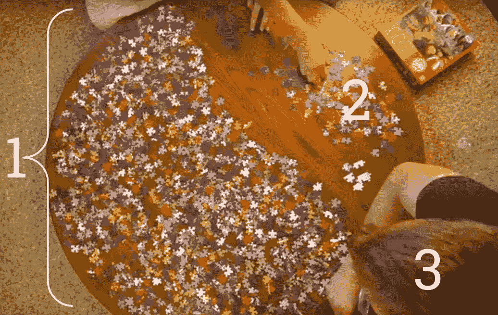
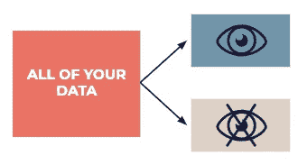

# 数据科学中最强大的想法

> 原文：<https://towardsdatascience.com/the-most-powerful-idea-in-data-science-78b9cd451e72?source=collection_archive---------1----------------------->

## 从有用的模式中分离出不必要信息的快速解决方案

如果你上一门统计学入门课程，你会学到一个 T2 数据点 T3 可以用来 T4 激发灵感或者测试一个理论 T5，但不能两者兼而有之。为什么不呢？

人类有点太擅长在一切事物中寻找模式了。真图案，假图案，应有尽有。我们是那种在薯片中找到猫王脸的生物。如果你想将模式等同于洞察力，请记住有三种[数据](http://bit.ly/quaesita_hist)模式:

*   存在于您的[数据集中](http://bit.ly/quaesita_hist) *及其以外*的模式/事实。
*   仅存在于数据集中的模式/事实。
*   只存在于你想象中的模式/事实(*)。*

**

*A data pattern can exist (1) in the entire [population](http://bit.ly/quaesita_popwrong) of interest, (2) only in the [sample](http://bit.ly/quaesita_vocab), or (3) only in [your head](http://bit.ly/quaesita_inkblot). Image: [source](https://www.youtube.com/watch?v=DMA95nAfIHw).*

*哪些对你有用？这取决于你的目标。*

## *灵感*

*如果你追求纯粹的灵感，它们都很棒。即使是古怪的阿波菲斯——来自术语 [*阿波菲斯尼亚*](http://bit.ly/quaesita_inkblot) *(人类倾向于错误地感知不相关事物之间的联系和意义*)——也能让你的创造力源源不断。创造力没有正确的答案，所以你需要做的就是看看你的数据，并从中获得乐趣。作为一个额外的奖励，[试着不要在这个过程中浪费太多的时间](http://bit.ly/quaesita_speed)(你的或者你的利益相关者的)。*

## *事实*

*当你的政府想向你征税时，它根本不在乎你这一年的财务数据之外的模式。有一个基于事实的决定要做，关于你欠了多少，做决定的方法是分析去年的数据。换句话说，看看数据，应用一个公式。我们需要的是纯粹的描述性分析，这种分析只局限于手头的数据。前两种模式都有利于这一点。*

> *坚持手头数据的描述性分析。*

*(我从未放错过我的财务记录，但我想，如果我丢失这些记录后的反应是用我在研究生院学到的数据估算技术来统计纳税，美国政府会不高兴的。)*

## *不确定情况下的决策*

*有时候，你所拥有的事实与[你 ***希望*** 你拥有](http://bit.ly/quaesita_vocab)的事实并不相同。当你没有[你想要做的决定所需要的](http://bit.ly/quaesita_popwrong)所有信息时，你需要在*不确定性*中导航，努力选择一个合理的行动方案。*

*这就是[统计学](http://bit.ly/quaesita_statistics)——*在不确定的情况下改变想法的科学*——的全部意义。这个游戏是要像伊卡洛斯一样超越你所知道的…而不是以啪啪声结束。*

> *这是数据科学核心的巨大挑战:如何不因为查看数据而变得“信息不足”。*

*在你离开那个悬崖之前，你最好希望你在对现实的局部一瞥中发现的模式确实能超越它。换句话说，模式必须*概括*对你有用。*

**

*Source: [xkcd](http://bit.ly/xkcdextrap)*

*在这三种模式中，如果你在不确定的情况下做决定，那么只有第一种模式是安全的。不幸的是，你还会在你的数据中发现其他类型的模式——这是数据科学核心的巨大挑战:如何不因为查看数据而导致信息不足。*

## *一般化*

*如果你认为从数据中提取无用的模式纯粹是人类的特权，那你就大错特错了！如果你不小心的话，机器会自动为你做同样的蠢事。*

> *人工智能的全部意义在于正确地概括新的情况。*

*[机器学习](http://bit.ly/quaesita_simplest)是一种做出许多类似决策的方法，包括从算法上发现数据中的模式，并使用这些模式对全新的数据做出正确的反应。在 [ML/AI](http://bit.ly/quaesita_ai) 行话中， ***泛化*** 指的是你的[模型的](http://bit.ly/quaesita_emperor)能力，能够很好地处理它之前没有见过的数据。基于模式的食谱只在旧的东西上成功有什么好处？你可以使用一个[查找表](http://bit.ly/wiki_lookup)来实现。ML/AI 的整个要点是正确地概括出新的情况。*

**

*这就是为什么我们列表中的第一种模式是唯一一种对机器学习有益的模式。那是 ***信号*** 的部分，其余的只是 ***噪音*** (只存在于你的旧数据中的转移注意力的东西，让你无法得出一个可概括的模型)。*

> *信号:存在于你的数据集中的模式*和超出它的*。*
> 
> *噪声:只存在于数据集中的模式。*

*事实上，获得一个处理旧噪声而不是新数据的解决方案就是机器学习中术语 ***过拟合*** 的意思。(我们用你最喜欢咒骂的语气说出这个词。)几乎我们在机器学习中所做的一切都是为了避免过度拟合。*

## *那么，这是哪种模式呢？*

*假设你(或者你的机器)从你的数据中抽取出来的模式存在于你的想象之外，是哪一种？是存在于你的[兴趣人群](http://bit.ly/quaesita_vocab) ( *“信号”*)中的真实现象，还是你当前数据集的一种特质(*“噪音”*)。如何判断在研究数据集的过程中发现了哪种模式？*

*如果你已经查看了你所有的可用数据，你不能。你被困住了，没有办法知道你的模式是否存在于其他地方。统计[假设检验](http://bit.ly/quaesita_fisher)的全部修辞在于[惊喜](http://bit.ly/quaesita_puppies)，假装对你*已经*知道的数据中的模式感到惊讶是没有品位的。(本质上就是 [p 黑](http://bit.ly/quaesita_needles)。)*

**

*这有点像在云中看到一个兔子形状，然后测试是否所有的云看起来都像兔子…使用同一个云。我希望你意识到你需要一些新的云来测试你的理论。*

> *你用来启发一个理论或问题的任何数据点都不能用来测试同样的理论。*

*如果你知道你只能访问一张云的图片，你会怎么做？在扫帚间沉思，就是这样。在你查看数据之前 [*提出你的问题。*](http://bit.ly/quaesita_inspired)*

> *数学从来不是基本常识的对立面。*

*我们正被引向一个最不愉快的结论。如果你在寻求灵感的过程中用完了数据集，你就不能再用它来严格测试它所启发的理论(不管你拿出多少数学魔术柔术，因为数学从来都不是基本常识的对立面)。*

## *艰难的选择*

*这意味着你必须做出选择！如果你只有一个数据集，你会被迫问自己:*“我是不是在壁橱里沉思，建立我所有的统计测试假设，然后小心翼翼地采取严格的方法，这样我就可以认真对待自己了？或者我只是从数据中挖掘灵感，但同意我可能在骗自己，并记得使用“我觉得”或“这激发了”或“我不确定”这样的短语？艰难的选择！**

*或者有没有一种鱼和熊掌兼得的方法？这里的问题是，你只有一个数据集，而你需要不止一个数据集。如果你有很多数据，我有一个方法可以帮你。吹。你的。介意。*

**

## *一个奇怪的把戏*

*要赢得数据科学，只需通过拆分数据将一个数据集(至少)变成两个。然后用一个做启发，一个做严格测试。如果最初启发你的模式也存在于没有机会影响你的观点的数据中，那么这是一个更有希望的投票，支持模式是你从猫砂盒中挖出数据的一般东西。*

> *如果两个数据集中存在相同的现象，也许这是一个普遍现象，无论这些数据集来自哪里，它都存在。*

## *西德妮。*

*如果一个未经审视的人生不值得活下去，那么这里有四个词值得你去活下去:*拆分你该死的数据*。*

*如果每个人都把自己的数据分开，世界会变得更好。对于更好的问题(来自[分析](http://bit.ly/quaesita_analysts))，我们会有更好的答案(来自[统计](http://bit.ly/quaesita_history))。人们不把数据分割视为强制性习惯的唯一原因是[在上个世纪](http://bit.ly/quaesita_history)这是很少有人能负担得起的奢侈品；数据集如此之小，以至于如果你试图分割它们，那么可能什么都没有了。(点击了解更多关于数据科学的历史[。)](http://bit.ly/quaesita_history)*

**

*Split your data into an exploratory dataset that everyone can dredge for inspiration and a test dataset that will later be used by experts for rigorous confirmation of any “insights” found during the exploratory phase.*

*今天，一些项目仍然存在这个问题，特别是在医学研究领域(我曾经从事神经科学，所以我非常尊重处理小数据集的困难)，但是你们中的许多人拥有如此多的数据，以至于你需要雇用工程师来移动它们……你的*借口是什么？！不要吝啬，拆分你的数据。**

> *如果你没有拆分数据的习惯，你可能会停留在 20 世纪。*

*如果你有大量的数据，但你看到的是未分割的数据集，那么你所在的地方就受到了老式观点的困扰。每个人都习惯于陈旧的思想，忘记了与时俱进。*

## *机器学习是数据分裂的产物*

*归根结底，这里的想法很简单。使用一个数据集来形成一个理论，发号施令，然后表演魔术，证明你知道你在一个全新的数据集中谈论什么。*

> *数据分割是建立更健康的数据文化的最简单快捷的方法。*

*这就是你如何在统计中保持安全，也是你如何避免在 [ML/AI](http://bit.ly/quaesita_emperor) 中因过度适应而被生吞活剥。其实机器学习的[历史](http://bit.ly/quaesita_history)就是一部数据拆分的历史。(我在 [*中解释为什么机器学习是自动化灵感*](http://bit.ly/quaesita_history) *)。*)*

## *如何在数据科学中使用最佳理念*

*为了利用数据科学中最好的想法，你所要做的就是确保你把一些测试数据放在别人窥探不到的地方，然后让你的[分析师](http://bit.ly/quaesita_versus)去研究剩下的数据。*

> *要赢得数据科学，只需通过拆分数据将一个数据集(至少)变成两个。*

*当你认为他们给你带来了可操作的“洞察力”,超越了他们探索的信息，使用你的秘密测试数据来检查他们的结论。就这么简单！*

# *感谢阅读！人工智能课程怎么样？*

*如果你在这里玩得开心，并且你正在寻找一个为初学者和专家设计的有趣的应用人工智能课程，这里有一个我为你制作的娱乐课程:*

*Enjoy the entire course playlist here: [bit.ly/machinefriend](http://bit.ly/machinefriend)*

# *喜欢作者？与凯西·科兹尔科夫联系*

*让我们做朋友吧！你可以在 [Twitter](https://twitter.com/quaesita) 、 [YouTube](https://www.youtube.com/channel/UCbOX--VOebPe-MMRkatFRxw) 、 [Substack](http://decision.substack.com) 和 [LinkedIn](https://www.linkedin.com/in/kozyrkov/) 上找到我。有兴趣让我在你的活动上发言吗？使用[表格](http://bit.ly/makecassietalk)联系。*