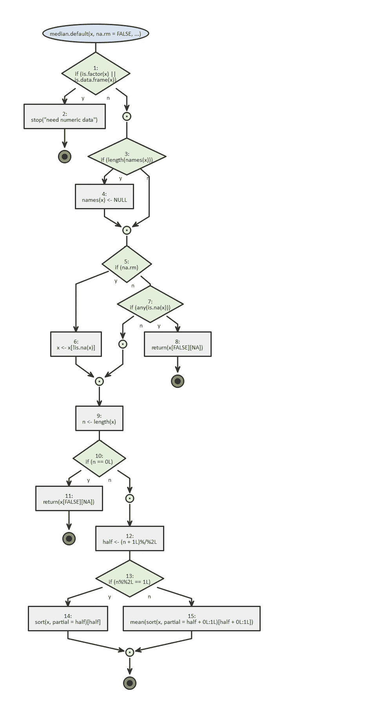
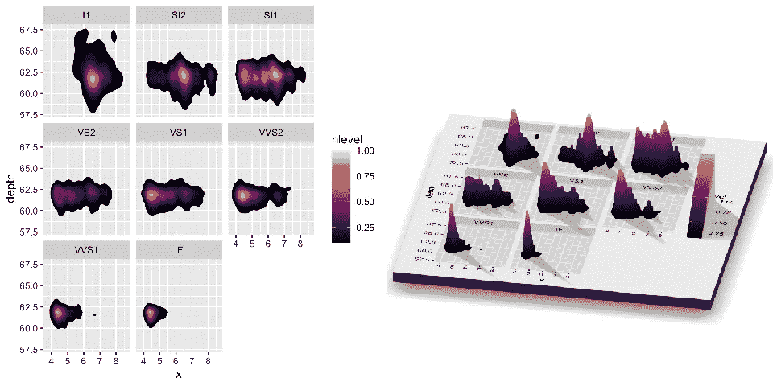
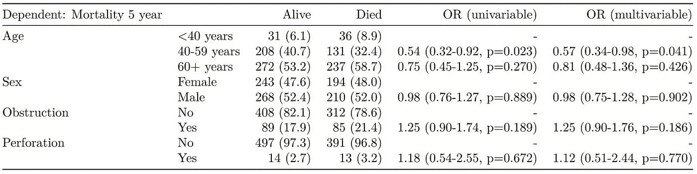

# 最被低估的 R 包:2020 版

> 原文：<https://towardsdatascience.com/the-most-underrated-r-packages-254e4a6516a1?source=collection_archive---------8----------------------->

## 令人敬畏的和不太为人所知的 R 库的精选列表


Photo by [Safar Safarov](https://unsplash.com/@codestorm?utm_source=medium&utm_medium=referral) on [Unsplash](https://unsplash.com?utm_source=medium&utm_medium=referral)

在我作为 R 用户的经历中，我遇到过很多不同的包和管理列表。有些在我的书签里，比如伟大的 [awesome-R](https://github.com/qinwf/awesome-R) 榜单，或者由 R 工作室策划的[月度“最佳”](https://rviews.rstudio.com/)榜单。如果你不认识他们，尽快去看看。

在这篇文章中，我想向你展示一些别的东西。这些是深夜浏览 GitHub/Reddit 的结果，以及同事们分享的很酷的东西。

其中一些包非常独特，另一些只是用起来很有趣，在我共事过的数据科学家/统计学家中，它们是真正的失败者。

# 开始吧！

## 💥杂项(奇怪的)💥

*   [**BRRR**](https://github.com/brooke-watson/BRRR) **和 b**[**eepr**](https://cran.r-project.org/web/packages/beepr/index.html)**:**你有没有想过知道——并庆祝——你的模拟最终在 R？你有没有因为完成了一点棘手的代码而感到骄傲，以至于你希望 Flavor Flav 大喊“耶啊啊啊，boi！!"一旦成功完成？
*   [**calendR:**](https://github.com/R-CoderDotCom/calendR)**准备打印用 ggplot2 制作的月历和年历。**
*   **[**检查点:**](https://github.com/RevolutionAnalytics/checkpoint) 可以安装过去某个特定日期的包版本，就好像你有一台 CRAN time machine 一样。**
*   **[**DataEditR:**](https://cran.r-project.org/web/packages/DataEditR/vignettes/DataEditR.html)DataEditR 是一个轻量级的包，用于交互式地查看、输入或编辑 r 中的数据。**
*   **[**德雷克:**](https://github.com/ropensci/drake) It [分析你的工作流](https://books.ropensci.org/drake/plans.html)，用最新的结果跳过步骤，用[可选的分布式计算](https://books.ropensci.org/drake/hpc.html)协调其余的步骤。最后，`drake`提供了你的结果与底层代码和数据相匹配的证据，这增加了你信任你的研究的能力**
*   **[**流程:**](https://github.com/moodymudskipper/flow) 将函数、表达式或脚本的逻辑可视化为流程图，方便调试。**

****

**From “flow” Github. Look at this beauty.**

*   **[**generative art:**](https://github.com/cutterkom/generativeart)**美丽的数学启发的抽象艺术****
*   ****[**here:**](https://github.com/r-lib/here)here 包的目的是实现简单的文件引用。与使用`setwd()`不同，它很脆弱并且依赖于你组织文件的方式，这里使用一个项目的顶层目录来容易地构建文件的路径。****
*   ****[**installer:**](https://github.com/talgalili/installr)**它允许用户只需一个命令就可以更新 R 和所有已安装的软件包。******
*   ******[**mailR:**](https://github.com/rpremraj/mailR) 从 r 内部发送邮件。******
*   ****[**plumber:**](https://www.rplumber.io/) 一个 R 包，把你现有的 R 代码转换成 web API。****
*   ****[**pushoverr:**](https://github.com/briandconnelly/pushoverr) 从 R 向移动设备或桌面发送推送通知。****
*   ****[**statcheck:**](https://github.com/MicheleNuijten/statcheck)**`statcheck`是一个免费的开源 R 包，可以用来从文章中自动提取统计零假设显著性测试(NHST)结果，并根据报告的测试统计和自由度重新计算 *p* 值，以检测可能的不一致。******
*   ******[**用途这:**](https://github.com/r-lib/usethis) 用途这是一个工作流包:它自动化了项目设置和开发过程中出现的重复性任务，包括 R 包和非包项目。******

## ****✨Data 可视化✨****

*   ****[**bayesplot:**](https://github.com/stan-dev/bayesplot) 一个 R 包，提供了一个扩展的绘图函数库，供拟合贝叶斯模型(通常用 MCMC)后使用。bayesplot 创建的地块是 ggplot 对象，这意味着在创建地块后，可以使用 ggplot2 包中的各种函数对其进行进一步自定义。****
*   ****[**cowplot:**](https://github.com/wilkelab/cowplot) 对齐图形到网格的牛逼。****
*   ****[**Esquisse:**](https://github.com/dreamRs/esquisse) 基本上是为 ggplot 创建一个 drag & drop GUI，所以你不用编写大部分的剧情。****
*   ****[**hrbr Themes:**](https://github.com/hrbrmstr/hrbrthemes/blob/master/README.md)' gg plot 2 '的附加主题和主题组件。****
*   ****[**gganatogram:**](https://github.com/jespermaag/gganatogram) 使用 ggplot2 创建 anatogram。是啊，真的。****
*   ****[**gg annotate:**](https://github.com/MattCowgill/ggannotate)gg annotate 是一个点击式工具，可以帮助您将注释准确地放置在您想要的位置。****
*   ****[**golem:**](https://github.com/ThinkR-open/golem)**这个包使得创建现成的闪亮应用程序变得轻而易举。******
*   ******[**拼拼凑凑:**](https://github.com/thomasp85/patchwork) 拼拼凑凑的目的是让把独立的 ggplots 组合成同一个图形变得简单得可笑。******
*   ****[**ray shader:**](https://www.tylermw.com/3d-ggplots-with-rayshader/)**不烂的 3D 剧情。******

************

******From “Rayshader” Github.******

*   ******[**见:**](https://github.com/easystats/see) 简易黑板背景为 ggplots。******
*   ****[**sjplots:**](https://strengejacke.github.io/sjPlot/) 用于数据可视化的绘图和表格输出函数的集合。****
*   ****[**tmap:**](https://github.com/mtennekes/tmap)r 中惊人的专题地图****
*   ****[**vapor wave:**](https://github.com/moldach/vapoRwave)A E S T H E T I C S ' time。美化你的情节，就像它仍然是 80 年代。****
*   ****[**visreg:**](https://pbreheny.github.io/visreg/) 根据预测变量 x 如何影响结果 y 来显示拟合模型的结果****
*   ****[**wesanderson:**](https://github.com/karthik/wesanderson) 用于 R 的韦斯·安德森调色板****

## ****🛁数据清理和操作🛁****

*   ****[**看门人:**](https://github.com/sfirke/janitor) 很多很酷的清理数据的功能，去 github 链接上查查他们的例子吧。****
*   ****[**sqldf:**](https://github.com/ggrothendieck/sqldf) 使用 SQL 语法进行数据管理。如果您需要加载超过您的机器所能处理的数据，那么就应该这样做。您可以对其进行过滤，并只加载选定内容。****
*   ****[**naniar**](https://github.com/njtierney/naniar)**:**所有你需要的缺失数据。****
*   ****[**Tidylog:**](https://github.com/elbersb/tidylog) 提供关于基本 dplyr 操作的反馈。非常适合长管道链。****
*   ****[**validate:**](https://github.com/data-cleaning/validate) 一个伟大的软件包，检查您的数据是否符合预定义的规则(由同一作者与 [errorlocate](https://github.com/data-cleaning/errorlocate) 一起使用)。同样是同一作者，去查一下[演绎](https://github.com/data-cleaning/deductive)和 [dcmodify](https://github.com/data-cleaning/dcmodify) 。****

## ****💻数据探索和建模💻****

*   ****[**data explorer:**](https://cran.r-project.org/web/packages/DataExplorer/vignettes/dataexplorer-intro.html)用于探索性分析的强大功能。****
*   ****[**dlookr:**](https://github.com/choonghyunryu/dlookr) 几个数据质量诊断和 EDA 的定制函数，形式简洁。****
*   ****[**达摩:**](https://github.com/florianhartig/DHARMa)GLMMs 残差诊断的一个有趣的 R 包。****
*   ****[**final fit:**](https://github.com/ewenharrison/finalfit)`finalfit`包提供了在 r 中建模时帮助您快速创建优雅的最终结果表格和绘图的功能。这些可以很容易地导出为 Word 文档、pdf 或 html 文件。下面的例子。****

```
**explanatory = c("age.factor", "sex.factor", 
  "obstruct.factor", "perfor.factor")
dependent = 'mort_5yr'
colon_s %>%
  finalfit(dependent, explanatory, metrics=TRUE) -> t2
knitr::kable(t2[[1]], row.names=FALSE, align=c("l", "l", "r", "r", "r", "r"))
knitr::kable(t2[[2]], row.names=FALSE, col.names="")**
```

********

****Super clean, publication ready table. From “finalfit” Github.****

*   ****[**LongCatEDA:**](https://www.ncbi.nlm.nih.gov/pmc/articles/PMC5000555/#!po=21.4286) 用于可视化分类变量的纵向变化。****
*   ****[**【jtools:**](https://github.com/jacob-long/jtools)**这个包由作者(Jacob)创建的一系列函数组成，用来自动化原本繁琐的研究任务。此时，统一的主题是回归分析的更有效的表示。******
*   ******[**modelbased:**](https://github.com/easystats/modelbased) 这是一个轻量级的软件包，有助于基于模型的估计，用于边际平均值的计算、对比分析和预测。******
*   ****[**性能:**](https://github.com/easystats/performance) 性能包的主要目标是提供计算模型质量和拟合优度指数的工具。这包括像 r 平方(R2)、均方根误差(RMSE)或组内相关系数(ICC)这样的度量，还包括检查(混合)模型的过度分散、零膨胀、收敛或奇异性的功能。****
*   ****[**skimr:**](https://github.com/ropensci/skimr) 一种无摩擦、可管道化的处理汇总统计的方法。****
*   ****[**speed glm:**](https://cran.r-project.org/web/packages/speedglm/speedglm.pdf)**Fast**针对大数据的 glm。********
*   ******[**syuzhet:**](https://cran.r-project.org/web/packages/syuzhet/vignettes/syuzhet-vignette.html)**易观情感分析在 r********

******我希望你找到了对你的工作有用或有趣的东西。如果你有什么酷的东西要添加到列表中，请在评论区告诉我！******

******编辑 2022:查看本文的第 2 部分！******

******[](/the-most-underrated-r-packages-part-2-decdc753205c) [## 最被低估的 R 包:第 2 部分

### 令人敬畏的和不太为人所知的 R 库的精选列表

towardsdatascience.com](/the-most-underrated-r-packages-part-2-decdc753205c)******