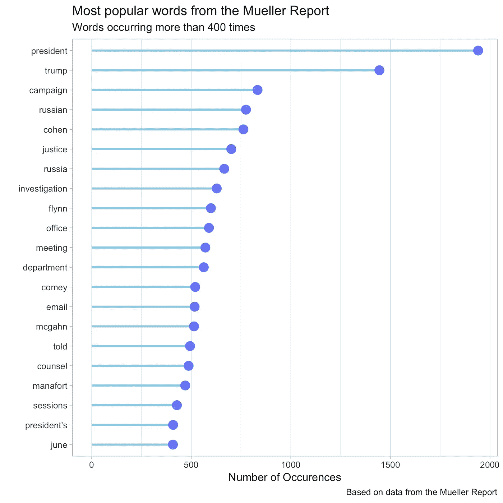
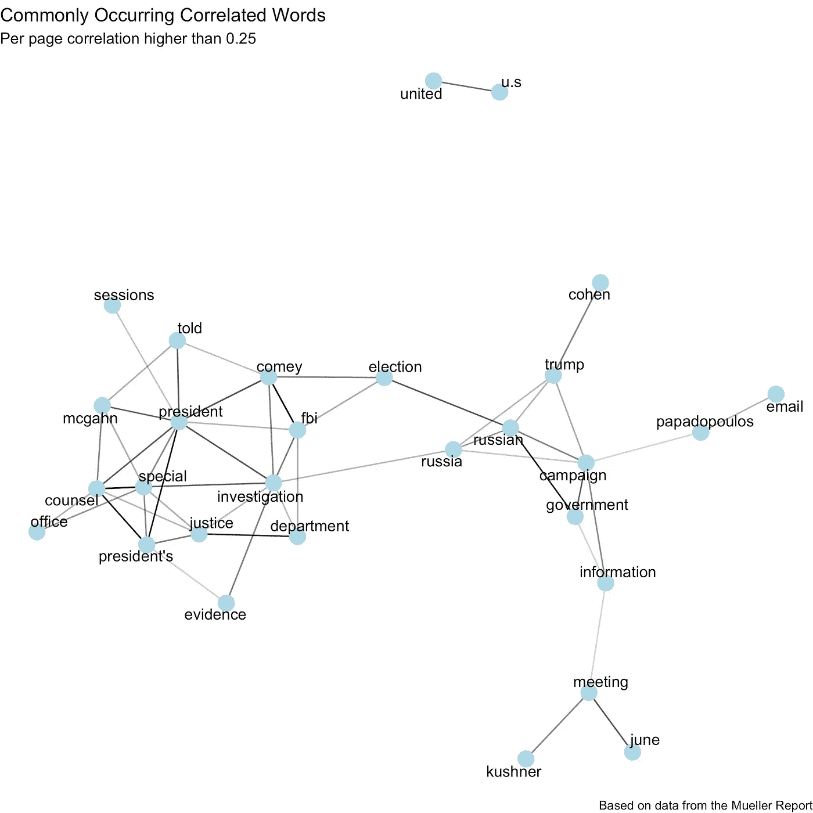

# 穆勒报告:在美国的调查

> 原文：<https://towardsdatascience.com/the-mueller-report-an-investigation-in-r-40f7e0f219ef?source=collection_archive---------15----------------------->


Photo by [David Everett Strickler](https://unsplash.com/@mktgmantra?utm_source=medium&utm_medium=referral) on [Unsplash](https://unsplash.com?utm_source=medium&utm_medium=referral)

随着最近穆勒报告的发布，我认为对 r .的调查进行研究是一个有趣的想法，即对穆勒报告进行探索性分析。所以现在开始。

# **环境设置**

让我们首先加载本次探索所需的所有库。

```
rm(list = ls())
library(tidyverse)
library(pdftools)
library(tidylog)
library(hunspell)
library(tidytext)
library(ggplot2)
library(gridExtra)
library(scales)
```

# **获取数据即米勒报告**

这份报告可以在司法部的网站[这里](https://www.justice.gov/storage/report.pdf)免费获得，我们可以作为 R 对象访问它，就像这样-

```
download.file("[https://www.justice.gov/storage/report.pdf](https://www.justice.gov/storage/report.pdf)", "~/Downloads/mueller-report.pdf")report <- pdf_text("~/Downloads/mueller-report.pdf")
```

我将在这里使用报告呈现的预转换 CSV 格式。

```
report <- read_csv("[https://raw.githubusercontent.com/gadenbuie/mueller-report/master/mueller_report.csv](https://raw.githubusercontent.com/gadenbuie/mueller-report/master/mueller_report.csv)")
```

# **清理数据**

由于实际的报告从几页开始，pdf 到文本的解析返回一些失败(也是报告的修订部分)，所以数据中有一些空行。让我们把这些过滤掉。

```
report %>% 
  filter(page >= 9) -> content
content %>% 
  filter(!is.na(text)) -> content
```

此外，由于解析错误，我们在数据中看到许多拼写错误的单词。让我们用 hunspell 找到并删除大部分单词拼写错误的行。

```
content %>% 
  rowwise() %>% 
  mutate(num_misspelled_words = length(hunspell(text)[[1]]),
         num_words = length(str_split(text, " ")[[1]]),
         perc_misspelled = num_misspelled_words/num_words) %>% 
  select(-num_misspelled_words, -num_words) -> contentcontent %>% 
  filter(perc_misspelled <= 0.5) -> content
```

使用 [**tidytext**](https://www.tidytextmining.com/) 规格化线条

```
content %>% 
  unnest_tokens(text, text, token = "lines") -> content
```

# **最流行词汇**

让我们看看穆勒报告中最受欢迎的词是什么

```
tidy_content <- content %>%
  unnest_tokens(word, text) %>%
  anti_join(stop_words)tidy_content %>% 
  mutate(word = str_extract(word, "[a-z']+")) %>%
  filter(!is.na(word)) %>% 
  count(word, sort = TRUE) %>% 
  filter(str_length(word) > 1,
         n > 400) %>% 
  mutate(word = reorder(word, n)) %>%
  ggplot( aes(x=word, y=n)) +
  geom_segment( aes(x=word, xend=word, y=0, yend=n), color="skyblue", size=1) +
  geom_point( color="blue", size=4, alpha=0.6) +
  coord_flip() + 
  theme(panel.grid.minor.y = element_blank(),
        panel.grid.major.y = element_blank(),
        legend.position="none") +
  labs(x = "",
       y = "Number of Occurences",
       title = "Most popular words from the Mueller Report",
       subtitle = "Words occurring more than 400 times",
       caption = "Based on data from the Mueller Report")
```



从上面的图中我们可以看出，报告中最受欢迎的词是“总统”和“特朗普”。另一个值得注意的词，“科恩”、“弗林”、“科米”和“麦克加恩”。

# **最常见的相关词**

让我们建立一个在报告中高度相关的词的网络

```
word_cors <- tidy_content %>% 
  add_count(word) %>% 
  filter(n > stats::quantile(n, 0.7)) %>% 
  pairwise_cor(word, page, sort = TRUE)set.seed(123)word_cors %>%
  filter(correlation > 0.25,
         !str_detect(item1, "\\d"),
         !str_detect(item2, "\\d")) %>% 
  graph_from_data_frame() %>%
  ggraph(layout = "fr") +
  geom_edge_link(aes(edge_alpha = correlation), show.legend = FALSE) +
  geom_node_point(color = "lightblue", size = 5) +
  geom_node_text(aes(label = name), repel = TRUE) +
  theme_void() + 
  labs(x = "",
       y = "",
       title = "Commonly Occuring Correlated Words",
       subtitle = "Per page correlation higher than 0.25",
       caption = "Based on data from the Mueller Report")
```



正如我们所料，最常见的相关单词是“meeting”和“kushner”&“comey”和“investigation”等等。

# **总结**

正如我们所看到的，我们可以使用 r 快速对 Mueller 报告进行探索性分析。点击这里查看我关于穆勒报告的详细博文

[](https://www.adityamangal.com/2019/04/the-mueller-report/) [## 穆勒报告

### 介绍分析加载库下载报告清理页面范围文本 NA 拼写错误的单词正常化大多数…

www.adityamangal.com](https://www.adityamangal.com/2019/04/the-mueller-report/) 

我将讨论如何使用 python 的 NLTK 库和 R 来分析报告中的情感，并使用我们自己定制的搜索引擎对报告进行事实核查。

让我在这里或者在[博客](https://www.adityamangal.com/2019/04/the-mueller-report/)上知道你的想法。

干杯！