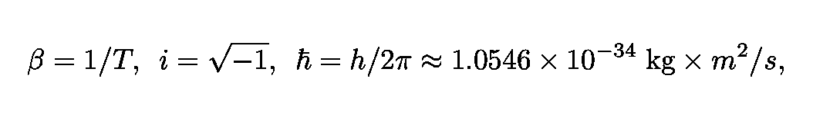
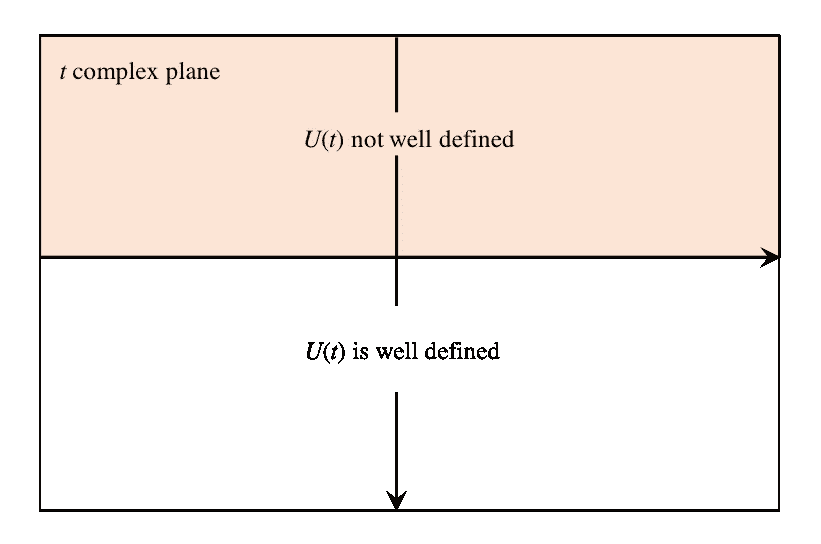
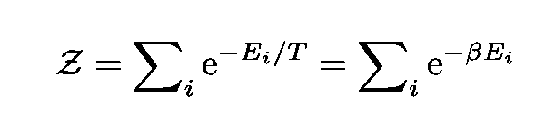
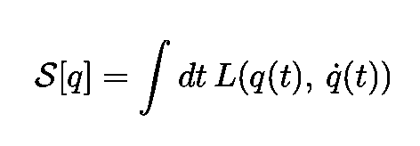
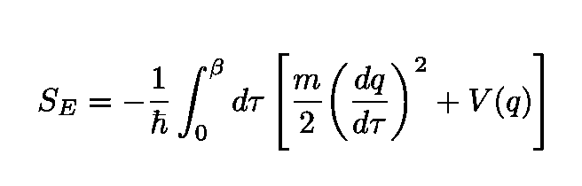

# 循环虚时间和温度之间的神秘联系

> 原文：<https://towardsdatascience.com/the-mysterious-connection-between-cyclic-imaginary-time-and-temperature-c8fb241628d9?source=collection_archive---------5----------------------->

Image by [prettysleepy1](https://pixabay.com/fr/users/prettysleepy1-2855492/?utm_source=link-attribution&utm_medium=referral&utm_campaign=image&utm_content=3160715) from [Pixabay](https://pixabay.com/fr/?utm_source=link-attribution&utm_medium=referral&utm_campaign=image&utm_content=3160715)

## 一个显而易见的事故可能蕴含着物理学上的一个巨大谜团

当人类知识分支中完全不同的概念、理论显示出它们实际上是紧密相连的时候，就会产生一种特殊的美。阿尔伯特·爱因斯坦在给他的朋友、数学家马塞尔·格罗斯曼的信中写道:

> “发现一系列起初似乎完全分离的现象的统一是一种光荣的感觉。”
> —阿尔伯特·爱因斯坦

在这篇文章中，我将描述理论物理的两个基本分支之间一些令人难以置信的优雅联系，即[量子力学](https://en.wikipedia.org/wiki/Quantum_mechanics) (QM)，它在原子和亚原子粒子的水平上代表宇宙，以及[统计力学](https://en.wikipedia.org/wiki/Statistical_mechanics) (SM)，它应用统计方法来描述粒子集合的行为。

从数学上讲，这些联系是一个简单的算术替换的结果，它使循环虚时间等同于温度。换句话说，虚时间中的周期性等同于温度(的倒数)。

> "隐藏的联系比明显的联系更强."
> 
> —以弗所的赫拉克利特

同样值得注意的是，如果我们简单地把我们的理论扩展到包括虚数时间，许多惊人的结果会很直接地得到。不仅如此，一些数学对象的表现也变得更好了(这导致了一些关于“时间的真实性”的问题，我将在本文的结尾提到)。

一个著名的例子(稍后将更详细地描述)是计算黑洞辐射(所谓的[霍金辐射](https://en.wikipedia.org/wiki/Hawking_radiation))的温度，这是通过简单的算术运算轻松获得的！

Figure 2: An illustration of the Hawking radiation from a black hole, to be discussed later on ([source](https://www.skyandtelescope.com/astronomy-news/stephen-hawking-1942-2018/)).

# “偶然”的通信

我们可以通过将支配量子系统如何随时间演化的[算符](https://en.wikipedia.org/wiki/Operator_(physics))、[时间演化算符](https://en.wikipedia.org/wiki/Time_evolution)和[密度算符](https://en.wikipedia.org/wiki/Density_matrix)联系起来，后者是一个*与时间无关的*对象，它描述了处于平衡状态(温度为 *T* )的多粒子系统的统计状态。

Figure 3: The correspondence between QM and SM. The leftmost object is the time evolution operator from QM and the rightmost object is the density operator from SM. The Euclidean time τ is cyclic with period β.

其中 *τ* ，称为欧几里得时间(原因很快就会搞清楚)*，*是循环的(或周期性的)，周期为 *β，*其中

Equation 1: Definition of inverse temperature β, the imaginary unit i, and the Planck constant.

表达式中的因子 *h* 就是量子力学中的基本参数[普朗克常数](https://en.wikipedia.org/wiki/Planck_constant)。下图是[复平面](https://en.wikipedia.org/wiki/Complex_plane)，实数位于横轴，虚数位于纵轴。

Figure 1: The complex plane showing the imaginary units i and -i [(source)](https://en.m.wikipedia.org/wiki/Imaginary_unit).

用更专业的术语来说，我们说在量子力学(或量子场论)中，哈密顿量充当时间平移的李群的生成器，而在统计力学中，同一个哈密顿量的角色是系综中的玻尔兹曼权重。

Figure 4: The Petrie projection of the [exceptional Lie group](https://en.wikipedia.org/wiki/Exceptional_Lie_group) of type E8 ([source](https://en.wikipedia.org/wiki/Lie_group)).

# 灯芯旋转

转变

Equation 2: The replacement of the time variable t by -iτ is called a Wick rotation.

被称为[的灯芯旋转](https://en.wikipedia.org/wiki/Wick_rotation)。新变量 *τ* 被称为[虚数或欧几里得时间](https://en.wikipedia.org/wiki/Imaginary_time)，子索引+表示 *τ* 为正。使用术语“欧几里得时间”的原因将在下面解释。

Figure 5: The imaginary/Euclidean time axis and a Wick rotation ([source](https://link.springer.com/chapter/10.1007/978-3-319-10539-0_2)).

当把论点 *t* 推广到复数值时，对于 *U* ( *t* )保持解析或全纯函数(一个[函数](http://mathworld.wolfram.com/ComplexFunction.html)在复平面的某个区域 *R* 上是解析的，如果它在 *R* 内的每一点上是[复可微的](http://mathworld.wolfram.com/ComplexDifferentiable.html))。

为了更详细地了解这一点，让我们首先根据哈密顿量的本征态写出时间演化算符:

Equation 3: Time evolution operator written in the energy eigenbasis.

旋转复平面中的时间 *t* 并将其写成实部和虚部，和内的指数变为:

只有当虚部 Im( *t* )满足以下条件时，该表达式才不发散:

Equation 4: The imaginary part of the complexified time must be negative or zero for the evolution operator to be bounded over the Hilbert space of the system (see figure below).

等式右边的符号“||”是算符的范数(这里的定义见)。

Figure 6: Time complex space. The evolution operator is well-defined only if the imaginary part of t is positive.

密度算符，一个静态对象，可以作为一个演化算符在[虚数时间](https://en.wikipedia.org/wiki/Imaginary_time)内给出一个“伪动态”解释，只要进行如下替换

Equation 5: The Wick rotation that “takes” quantum mechanics into statistical mechanics.

> 虚数循环时间和逆温之间显然有简单的对应关系。

换句话说，在循环时间和温度倒数之间有一个明显的简单对应关系。

Figure 7: The link between quantum mechanics and statistical mechanics.

# 假想时间

在爱因斯坦的[狭义相对论](https://en.wikipedia.org/wiki/Special_relativity)中，[事件](https://en.wikipedia.org/wiki/Event_(relativity))的概念至关重要。它可以被[定义为](https://en.wikipedia.org/wiki/Event_(relativity))“与时空中的一点相关的瞬时物理情况或事件”。两个事件之间的不变间隔由下式给出:

Equation 6: The expression for the invariant interval in Minkowski spacetime.

另一种写区间的方法是使用[球坐标](https://en.wikipedia.org/wiki/Spherical_coordinate_system)，如下图所示。将我们自己限制在 *x* - *y* 平面，空间元素变成:

Equation 7: The metric in 2D space expressed both in Cartesian and spherical coordinates.

当我们讨论黑洞和宇宙学时，坐标的这种替代用法将会很重要。

Figure 8: Spherical coordinates (r, θ, ϕ) ([source](http://mathworld.wolfram.com/SphericalCoordinates.html)).

使灯芯旋转 *t* → - *iτ* 这个间隔变成

Equation 8: This spacetime metric is called Euclidean since it has the same form as the usual metric in Euclidean 3D space.

它具有欧几里得几何中常见的毕达哥拉斯距离的形式。这就是我们把虚数时间称为“欧几里得时间”的原因。

Figure 6: Points in 3D space and determined by three numbers, or coordinates ([source](https://en.wikipedia.org/wiki/Euclidean_space)).

区间的“欧几里德化”起源于德国数学家赫尔曼·闵可夫斯基于 1908 年发表的一篇开创性论文。在那里，他著名地宣称

> “从今以后，空间本身和时间本身注定要消失在阴影中，只有两者的某种结合才能保持独立的现实。”
> 
> — **赫尔曼**闵可夫斯基(1908)

正是在这篇文章中，他实际上把时间和空间“焊接”成了我们称之为[时空](https://en.wikipedia.org/wiki/Spacetime)的四维结构。

Figure 7: Transparency from Minkowski’s famous talk, “*Space and Time”* given in September of 1908.

# 一些重要概念的鸟瞰图

为了使这篇文章尽可能地自成一体，我将首先解释一些重要的物理概念，然后更深入地探究这个神秘的“巧合”背后的本质。

## 玻尔兹曼分布和最大熵原理

让我们考虑一个系统 *A* ，其能级由下式给出

其中 *T* 和 *V* 为其温度和体积。该系统通过与一个大容器*A’*(与它进行热交换)接触而保持恒温 *T* 。系统处于某种状态 *i* 的概率为:

Equation 9: The probability that a system is in a state with energy E(i).

Figure 8: System A is kept at fixed temperature T by exchanging heat with the reservoir A’.

玻尔兹曼分布可以用不同的方法导出。一个特别有趣并且与[信息论](https://en.wikipedia.org/wiki/Information_theory)中的概念相关的推导使用了所谓的最大熵原理[。这个原理是由美国物理学家 T21 提出的，它指出最能代表系统知识的概率分布是具有最大熵的概率分布。应用于统计力学，它给出了玻尔兹曼分布。](https://en.wikipedia.org/wiki/Principle_of_maximum_entropy)

## 时间演化算子

量子系统的时间演化由[时间演化算符](https://en.wikipedia.org/wiki/Time_evolution) *U* ( *t* )生成:

Equation 10: The time evolution of a quantum state, generated by the time evolution operator.

如果 *U* ( *t* )遵守一些基本性质(更多细节见[本参考文献](https://www.amazon.com/Modern-Quantum-Mechanics-Revised-Sakurai/dp/0201539292/ref=asap_bc?ie=UTF8))它可以写成，对于一个无穷小的区间 *dt* ，如下:

Equation 11: The quantum time evolution operator for small time intervals.

其中ω原则上是一个未知的厄米算符。在牛顿力学中，产生时间演化的算符 *u* ( *t* )可以写成[如下泰勒展开](https://www.amazon.com/Classical-Mechanics-3rd-Herbert-Goldstein/dp/0201657023)

Equation 12: The operator that generates time evolution in classical dynamics.

事实上，这个表达式是象征性的，因为在这个上下文中 *H* 是由[泊松括号](https://en.wikipedia.org/wiki/Poisson_bracket)给出的运算符

比较两种表达式并引入因子

源自经典力学和量子力学之间的标准对应，我们获得了我们正在寻找的表达式，即:

Equation 13: The operator that generates time evolution in quantum dynamics.

## 拉格朗日函数

拉格朗日方法最初被认为是牛顿力学的重新表述。尽管它产生了与牛顿方法相同的结果，但它强调了一套完全不同的观点。此外，它有两个显著的优点:它在数学上更优雅，同时在处理更复杂的系统时更强大。

Figure 9: Joseph-Louis Lagrange was responsible for several seminal contributions to both pure mathematics and mathematical physics ([source](https://en.wikipedia.org/wiki/Joseph-Louis_Lagrange)).

尽管这种方法是在考虑经典(非量子)物理学的情况下引入的，但直到很久以后，在 20 世纪量子场论的背景下，它才显示出它的全部威力。事实证明，人们可以使用“最小作用原理”推导出目前已知的所有基本物理定律，正如我们将在下面看到的，这取决于拉格朗日量。

拉格朗日函数 *L* 定义在所谓的[位形空间](https://en.wikipedia.org/wiki/Configuration_space_(physics)) *C* 上(技术上讲， *L* 定义在数学家所谓的 *C、*的[切丛](https://en.wikipedia.org/wiki/Tangent_bundle)上，但我们暂且忽略它)。

Figure 8: Illustration of the concept of configuration space for a system with N particles. Each point Q represents a configuration of the system.

让我们考虑一个由 N 个粒子组成的系统。每个点 *Q* ∈ *C* 对应 *N* 粒子的某种构型(见上图)。注意 *Q* 的运动包含了*全 N 粒子系统*的动态。具体来说，你可以想到太阳-地球-月亮系统，在这种情况下 *N* 是 3。每个*Q*∑*C*代表三个物体的位置和速度。

Figure 10: Illustration showing the view of the moon from space during sunrise. The coordinates of the Sun, Earth, and Moon are represented by a single point Q in the configuration space of the system. As the three bodies move in space, Q moves in the configuration space. Figure by [sdecoret](https://www.shutterstock.com/g/sdecoret)/shutterstock.com.

点 *Q* 围绕 *C* 运动遵循一定的规律，这个规律可以从[拉格朗日函数](https://en.wikipedia.org/wiki/Lagrangian_mechanics)l*中得到，拉格朗日函数一般是一个多元函数，可以写成:*

**

*Equation 14: The Langrangian function which depends on positions and velocities. From this function the equations of motion of physical systems are obtained.*

*函数参数的第一个子集*

**

*是 N 个粒子的位置。第二子集*

**

*是它们的速度。注意，这些变量不一定是普通的笛卡尔坐标。因此，它们被称为[广义坐标](https://en.wikipedia.org/wiki/Generalized_coordinates)，可以是沿着粒子轨迹的任何角度到弧长(见下图)。*

**

*Figure 11: The arc length *s* along the curve on the left figure is an example of a generalized coordinate. The angle θ on the second figure is also an example of a generalized coordinate ([source](https://en.wikipedia.org/wiki/Generalized_coordinates)).*

*系统[的拉格朗日量等于](https://en.wikipedia.org/wiki/The_Road_to_Reality)其动能 *K* (由于其[运动](https://en.wikipedia.org/wiki/Motion_(physics)))和其势能 *V* (由于其相对于其他系统的位置)之差:*

**

*Equation 15: The Langrangian function expressed as the difference between the kinetic and potential energies*

*一个简单的例子是一个在势能 *V* ( *q* )中坐标为 *q* ( *t* )的粒子:*

**

*Equation 16: One of the simplest possible Lagrangians, of a 1D particle moving in a potential V.*

**

*Figure 12: Animation showing the orbital motion of a satellite around the Earth ([source](https://en.wikipedia.org/wiki/Classical_mechanics)).*

## *哈密尔顿函数*

*还有第二种方法，它也精致而有力地重新表述了经典力学。正如在拉格朗日图中一样，这种方法基于一个单一的函数，称为哈密顿量 *H* ，从中可以推导出物理系统的动力学(描述其运动的方程)。哈密顿量在[相空间](https://en.wikipedia.org/wiki/Phase_space)中定义。类似于配置空间，[人们可以将](https://en.wikipedia.org/wiki/Phase_space)相空间定义为“一个空间，在该空间中，系统的所有可能状态被表示，每个可能状态对应于相空间中的一个唯一点。”*

**

*Figure 13: The Irish mathematician Sir William Rowan Hamilton made fundamental contributions to several fields including algebra, optics and classical mechanics ([source](https://en.wikipedia.org/wiki/William_Rowan_Hamilton)).*

*在相空间中，点由粒子的位置和(广义)动量(而不是位置的时间导数)来描述:*

**

*在这里，动量是从拉格朗日中获得的(你可以在这里阅读更多关于它的内容:*

**

*Equation 17: The momentum is obtained by differentiating the Lagrangian function with respect to the velocity.*

**

*Figure 14: The motion of a mass-spring system shown in real space and phase space ([source](https://en.wikipedia.org/wiki/Phase_space)).*

## *量子态*

*在量子力学中，描述经典相空间中运动的坐标 *q* 和动量 *p* (见上项)，变成了[算符](https://en.wikipedia.org/wiki/Hermitian_operators)。例如，动量变成以下微分算子:*

**

*Equation 18: Momentum becomes a differential operator in quantum mechanics.*

*物理系统用[量子态](https://en.wikipedia.org/wiki/Quantum_state)来表示。使用由[保罗·狄拉克](https://en.wikipedia.org/wiki/Paul_Dirac)引入的符号，我们可以通过以下对象来表示系统的状态:*

**

*Equation 19: Initial state of a quantum system.*

*如果系统的哈密顿量是某个(为简单起见与时间无关)算符 *H* ，经过一段时间 *t* 后系统的最终状态是:*

**

*Equation 20: Final state of a quantum system after evolving for some time t. The evolution is generated by the Hamiltonian H.*

*记住我们已经在介绍中遇到了时间演化算符。*

*众所周知，量子力学是以概率为基础的。爱因斯坦有句名言:*

> *这个理论说了很多，但并没有真正让我们更接近“旧理论”的秘密。"无论如何，我相信他不会掷骰子."*
> 
> *阿尔伯特·爱因斯坦*

*在量子力学中，概率是被称为[量子概率振幅](https://en.wikipedia.org/wiki/Probability_amplitude)的某些量的[模平方](https://en.wikipedia.org/wiki/Square_(algebra))。下面的动画显示了一种非常特殊的量子态(或波函数)的时间演化，这种量子态被称为[相干态](https://en.wikipedia.org/wiki/Coherent_states)(非常类似于经典物体):*

**

*Figure 14: Illustration of the time evolution of a quantum probability distribution associated with a [coherent state](https://en.wikipedia.org/wiki/Coherent_states) ([source](https://en.wikipedia.org/wiki/Coherent_states)).*

## *传播者*

*一个粒子(比如说一个电子)从初始时刻 *I* 的初始状态传播到时刻 *F* 的最终状态的概率幅度称为[传播子](https://en.wikipedia.org/wiki/Propagator)，读作:*

**

*Equation 23: Quantum probability amplitude or propagator for a system to evolve from the state at time I into that at time F.*

*相应的转移概率就是:*

**

*Equation 24: Quantum transition probability.*

## *配分函数*

*在统计力学中，该理论的基本对象被称为[配分函数](https://en.wikipedia.org/wiki/Partition_function_(statistical_mechanics))。它的重要性源于这样一个事实，即描述一个系统的几乎所有相关变量都可以从*Z .**Z*对于a 经典具有离散谱的正则系综的数学表达式为:*

**

*总和是系统的状态，而 *T* 是温度。更多详情见[此链接](https://en.wikipedia.org/wiki/Partition_function_(statistical_mechanics))。热平衡系统在温度为 *T* 时处于能量为 *E* 的状态的概率与[玻尔兹曼因子](https://en.wikipedia.org/wiki/Boltzmann_distribution)成正比:*

**

## *作用和最小作用原理*

*在物理学中，[作用](https://en.wikipedia.org/wiki/Action_(physics)) *S* 是一个与系统动力学相关的量。从 *S* 中，可以推导出系统的运动方程。从数学上讲，它是一个[函数](https://en.wikipedia.org/wiki/Functional_(mathematics)),以系统的历史(或路径)为自变量，并输出一个实数。更具体地说，该动作由拉格朗日函数对时间的积分来表示*

**

*Equation 25: The definition of the action.*

*物理学中最强有力的观点之一被称为最小作用量的[原理，根据该原理，系统采取的实际路径是作用量 *S:* 的极值或](https://en.wikipedia.org/wiki/Principle_of_least_action)[驻点](https://en.wikipedia.org/wiki/Stationary_point)*

**

*Equation 26: The action is stationary when the path is the classical trajectory.*

## *量子力学中的路径积分*

*作为由[薛定谔](https://en.wikipedia.org/wiki/Erwin_Schr%C3%B6dinger)和[海森堡](https://en.wikipedia.org/wiki/Werner_Heisenberg)开发的量子力学形式主义的替代方案，美国物理学家[理查德·费曼](https://en.wikipedia.org/wiki/Richard_Feynman)创造了所谓的[路径积分公式](https://books.google.com.br/books?id=JkMuDAAAQBAJ&printsec=frontcover&dq=feynman+hibbs&hl=en&sa=X&ved=0ahUKEwiq46zr5cvgAhW1I7kGHT9lAzQQ6AEIKjAA#v=onepage&q=feynman%20hibbs&f=false)。在这样的公式中，用于计算粒子从点 I 到点 F 的概率幅度的路径积分必须考虑字面上*所有可能路径*。例如，这些路径包括在时间上向前和向后的轨迹！为了获得总的概率幅度，人们给每个可能的路径分配一个幅度 *q* ( *t**

**

*Equation 26: Exponential weight assigned to a path q(t).*

*总结一下:*

**

*Equation 27: The path integral representation of the propagator.*

*更准确地说，总振幅是无限数量的轨迹或路径上的[函数积分](https://en.wikipedia.org/wiki/Functional_integral)。当振荡的贡献在路径积分中求和时，我们预期会发生抵消。更准确地说，当我们取极限时，得到的路径接近经典路径*

**

*具有很强的同相贡献，这意味着稳定路径占主导地位，量子波动(或校正)主要与接近经典路径的路径相关(更多细节见[参考文献](https://www.amazon.com/Quantum-Field-Theory-Gifted-Amateur/dp/019969933X))。*

**

*Figure 15: [Richard Feynman](https://en.wikipedia.org/wiki/Richard_Feynman) and an illustration showing different ways that a particle can go from I to F ([source](https://en.wikipedia.org/wiki/Path_integral_formulation)).*

*我们应该指出，当我们将建立替代路径和导出路径积分所需的增量时间步长增加到∞时，由曲线 D 给出的路径积分积分度量具有严重的收敛问题。我们将回头讨论这个问题。*

## *欧几里德路径积分*

*执行灯芯旋转 *t* =- *iτ，*以上路径积分变为:*

**

*Equation 28: The transition probability amplitude written in Euclidean or imaginary time.*

*其中积分内的指数是欧几里德[作用](https://en.wikipedia.org/wiki/Action_(physics)):*

**

*Equation 29: Euclidean action.*

*具体来说，让我们考虑后者的一个简单例子。自由粒子的拉格朗日(左边)给出了下面的欧几里德作用(右边):*

**

*Equation 30: A simple example of Euclidean action, for a free particle.*

*这可以概括为包括一个势能项:*

**

*Equation 31: Example of Euclidean action.*

*正如费曼和希布斯在经典著作中指出的那样，*

> *“这是一个非常有趣的结果，因为它给出了一个量子力学系统的完整统计行为，而没有出现量子力学无处不在的 i so 特性……”*
> 
> *—费曼和希布斯*

## *量子场*

*宇宙中的所有粒子都是量子场的激发，任何解释基本粒子行为的基本定律的努力都必须考虑量子场论或 QFT 的基本原则，这是基本粒子(如夸克和电子)物理学所基于的概念框架。此外，许多科学家认为万物理论(TOE)将是某种量子场论(类固醇)。*

> *宇宙中所有的粒子都是量子场的激发。*

*QFT 的基本数学对象是所谓的[生成泛函](https://en.wikipedia.org/wiki/Partition_function_(quantum_field_theory)) *Z* 。也许最简单的生成泛函是描述自旋为 0 的粒子，这对应于[标量场](https://en.wikipedia.org/wiki/Scalar_field)(希格斯玻色子[就是这样一种粒子)。](https://en.wikipedia.org/wiki/Higgs_boson)*

**

*Figure 16: The Higgs field is an example of a scalar field. Particles that interact with the Higgs field “acquire” mass. This figure shows a computer image of one such interaction ([source](https://simple.wikipedia.org/wiki/Higgs_field)).*

*它由下式给出:*

**

*Equation 32: Minkowski generating function in QFT.*

*如果我们旋转灯芯，功能 *Z* 变为:*

**

*Equation 33: Euclidean generating function.*

*被称为[欧几里得泛函积分](https://www.tpi.uni-jena.de/qfphysics/homepage/wipf/lectures/pfad/pfad6.pdf) (EFT)。定义能量泛函*

**

*Equation 34: Energy functional of the ϕ field.*

*路径积分变成:*

**

*Equation 35: Euclidean generating function expressed in terms of the energy functional E[ϕ].*

*上面的表达式非常类似于统计力学的配分函数。量子场论和统计力学之间的联系以不同的方式发生，这取决于人们是在考虑经典系统(遵守牛顿定律及其扩展的系统)还是量子力学系统。*

*也可以写出对应于场而不是位置 *q* ( *t* )的状态的传播子(见上面的解释):*

**

*Equation 37: The transition probability amplitude or propagator for field-states, expressed as a path-integral.*

*跃迁振幅连接两个量子场状态。我们可以将这个欧几里德传播子示意性地表示为:*

**

*Figure 17: Transition amplitude between two fields during a time interval β. The space here (represented by the dashed lines) is a plane with dimension d-1.*

*这种表示可以适用于不同的时空拓扑。上图中描绘的振幅对应于时空区域上的路径积分*

**

*Equation 38: The spacetime over which the path integral of Figure 14 occurs.*

*空间不一定需要是平面。如果它是一个球体，我们会画:*

**

*Figure 18: Transition amplitude between two field-states during a time interval β which differs from Figure 14 by the fact that space here (represented by the dashed lines) is a sphere with dimension d-1.*

## *灯芯旋转的有用性*

*在灯芯旋转之后，路径积分中的配置 *q* ( *τ* )的权重变为*

**

*Equation 39: The Euclidean weight of the configuration q(τ).*

*其中指数包含欧几里德作用。后者通常是非负的，暗示着如果某个配置对应的动作 *q* ( *τ* )很大，其贡献很小。这极大地改善了路径积分的收敛性。*

*使用灯芯旋转的另一个优点是，在通常的量子场论中发散的环路费曼图计算变成了良好的动量积分。*

*在非微扰物理学中，欧几里德化带来了许多有趣的应用(它们将在下面详细描述)。*

# *连接*

*在下文中，我将讨论应用灯芯旋转后获得的几个重要联系，即:*

*   *量子力学/量子场论与经典统计力学的联系*
*   *量子力学/量子场论与量子统计力学的联系*
*   *经典系统中从静力学到动力学的转化*

## *量子力学和量子统计力学*

*经典统计力学在非常低的温度下不适用。在这个极限下，量子效应变得很重要。这种系统的例子包括低温稀释原子或多原子气体。*

**

*Figure 19: These are three views of the velocity distribution for a gas of rubidium atoms. The distribution in the middle shows the appearance of a [Bose-Einstein condensate](https://en.wikipedia.org/wiki/Bose%E2%80%93Einstein_condensate), a new phase of matter ([source](https://en.wikipedia.org/wiki/Bose%E2%80%93Einstein_condensate)).*

*让我们考虑一个非常简单的量子力学系统:零温度下的一维简谐振子(SHO)*T*= 0。下图显示了谐振子的一个例子。*

**

*Figure 21: An example of a quantum oscillator is the diatomic molecule dinitrogen. The vibrational motion of the two atoms can be described using only one degree of freedom, namely, the distance its two nuclei ([source](https://www.thoughtco.com/what-are-diatomic-molecules-608496)).*

*在我以前的一篇文章中可以找到关于 quantum 版本的更详细的讨论(见下面的链接)。本节大量基于这个[在线课](https://www.youtube.com/watch?v=v_FmiMaiciA&t=1239s)，我强烈推荐。*

* [## 神经量子态

### 神经网络如何解决量子力学中高度复杂的问题

towardsdatascience.com](/neural-quantum-states-4793fdf67b13) 

该系统完全由单个坐标(或自由度)来表征，我将用 *q* 来表示。现在考虑同一个系统，SHO，但是现在假设粒子交换能量，并且与一个大的热源(或恒温器)处于热平衡，如下图所示，在某个有限的温度下 *T* > 0。我们说粒子与储层纠缠在一起。

Figure 22: Quantum simple harmonic oscillator in contact with a large heat reservoir.

在这种情况下，粒子处于混合热态(而不是纯态)，由密度矩阵或密度算子 *ρ* 描述，在温度 *T* =1/ *β* 下表示:

Equation 40: The mixed thermal state of the particle in contact with the heat reservoir

其中量子力学配分函数为:

Equation 41: The partition function.

如前所述， *ρ* 内的指数与虚数时间内的演化算符成比例，前提是我们用欧几里得时间或虚数时间替换时间，并且我们确定:

换句话说:

Equation 21: Boltzmann factor correspondence with the evolution operator at imaginary time.

我们使用了下面的定义:

Equation 22: Euclidean evolution operator.

密度算符可以写成:

Equation 23: The density operator in terms of the Euclidean evolution operator.

其中配分函数为:

我们还可以定义欧几里得传播子:

Equation 24: The Euclidean propagator.

我们可以构造欧几里得传播子的路径积分表示。我们在上面看到了传播子和路径积分之间的对应关系。为了方便起见，我将在这里重写:

Equation 25: The transition amplitude expressed as a path integral.

例如，在配分函数中，可以根据位置追踪:

Equation 26: The partition function using the position basis for the tracing.

我们可以表示一个类似于被积函数的物体

选择初始时间为零。配分函数可以从等式的左手边快速得到。26 遵循三个步骤。首先，我们替换

然后我们用一个通用的位置状态来标识初始和最终状态

最后，我们对 *q.* 进行积分，对等式左侧的路径积分执行相同的变换。25，对变量进行方便的改变，从时间到虚数时间 *t* → - *iτ* 和 *i* 对哑元积分，变量 *q* 我们得到:

Equation 27: Partition function expressed as a path integral where paths obey periodic boundary conditions.

对 *q* 的积分意味着，对于 *τ* ∈ (-∞，∞)，我们必须只对路径积分中服从周期性边界条件的轨迹(或配置)求和。

等效地，传播器读取:

Equation 28: Euclidean propagator expressed as a path integral with paths obeying periodic boundary conditions.

泛函积分中的指数是欧几里得作用:

Equation 29: This is the Euclidean action associated with a single path in imaginary time.

如果我们认为玻尔兹曼因子是虚时间中的演化算子，在这种情况下，它将状态 *q* 带回到自身，那么这个 *q* 积分可以在物理上变得直观:

我们的结论是，与我们一般的*基本原理一致，*统计力学[发生在循环虚时间](https://books.google.com.br/books?id=Y-0kAwAAQBAJ&printsec=frontcover&dq=quantum+field+theory+gifted+amateur&hl=en&sa=X&ved=0ahUKEwj7rMHQqdLjAhV0D7kGHff9DysQ6AEIKjAA#v=onepage&q=quantum%20field%20theory%20gifted%20amateur&f=false)中。

Figure 20: Periodic imaginary time.

## 量子力学和经典统计力学

量子力学和经典统计力学之间的第二种对应关系，仅仅是对上一节所得结果的另一种解释。我们可以把欧几里得作用解释为一维封闭弦的微观状态的能量:

Equation 30: The Euclidean action as the energy of a microstate of a one-dimensional string.

注意，该字符串是一个*扩展经典*对象。其他的对应关系可以从方程中得到。27，29 和 Eq。30:

*   欧几里德动作中的积分参数 *σ* 对应于沿着字符串的位置
*   经典系统(弦)的温度是

*   量子系统的温度 1/ *β* 对应于弦的长度

Figure 21: A closed string in a potential V(q).

## 经典场论和经典统计力学

人们可以用这个表达式来描述磁场。为简单起见，我们只考虑标量场。程序简单明了，并且解释得很清楚[在这里](https://www.amazon.com/Quantum-Field-Theory-Nutshell-nutshell/dp/0691140340)。结果是:

Equation 31: Generating function for a classical field theory

其中指数中的能量是

Equation 32: Energy functional E[ϕ] for a classical scalar field.

这与上面给出的欧几里得生成泛函具有相同的形式，只要我们确定:

因此，在一个 *d* 维时空里的欧几里得经典场论在形式上等价于一个 *d* 维空间(不是时空)里的经典统计力学。

## 量子场论和量子统计力学

让我们考虑一个绝对温度为 T 的量子场。为了简单起见，我们可以选择一个标量场*ϕ*(***x***， *t* )。热 QFT 适用的两个相关背景是宇宙学和涉及重离子碰撞的实验。

Figure 23: Ions colliding in the [CMS detector](https://home.cern/science/experiments/cms) at the Large Hadron Collider ([LHC](https://home.cern/science/accelerators/large-hadron-collider)).

然后我们解析地将时间变量延续到纯虚数时间，并将该场写成*ϕ*(***x***， *τ* )。

现在，由于这是一个具有正温度 *T* 的量子系统，或者等价地，具有逆温度 *β* ，我们将它的配分函数 *Z* 写成量子态的总和，这相当于对玻尔兹曼因子进行追踪。选择[场本征态](http://eduardo.physics.illinois.edu/phys582/582-chapter5.pdf)的基，配分函数读作:

Equation 33: Partition function of a thermal QFT using a basis of field eigenstates.

按照与前面相同的步骤，被积函数可以明确地写成:

Equation 34: Integrand of Eq. 22.

选择初始和最终状态为相同的场本征态

Equation 35: Identification of initial and final states of a quantum system.

读者可能会注意到在 ***x*** 积分中引入了空间体积 *V* (通常省略并假设为无穷大)。配分函数是通过对 *ψ* 态积分得到的:

Equation 36: Partition function for Euclidean quantum field theory.

注意，尽管*ψ*-场基从方程中消失了，但场在初始和最终时间仍然是相同的，并且积分在所有具有周期性边界条件的“路径”上进行计算。

注意，这个物体不过是一个(欧几里德)量子标量场理论*在零温度下的生成泛函*生活在( *d* - *1* )空间维度(体积 *V* ) ，其中 *τ* 被限制在区间【0，1/ *T* )。标量场系统遵循沿 *τ* 维度*的周期性边界条件。*因此，我们断定这个配分函数可以描述两个系统:

*   在尺寸为( *d* -1)的*空间*中的温度 *T* =1/ *β* 的*热*系统
*   零温度下的标量场系统*在*时空*内，维度为( *d* -1)× *β**

我们的结论是，在一个空间维度为 *d* 空间维度为并且“时间” *τ* 维度限制在区间[0， *β* 的**时空**中，温度为 *T* = *0* 的欧几里德场论在形式上等价于温度为 *T* =1/ *β* 的量子统计力学

## 从拉格朗日动力学到静力学

我们看到的所有对应都包含了量子力学或者量子场论。事实证明，仅仅局限于经典力学，灯芯旋转之后已经发生了更奇怪的事情。正如我们在下面展示的(在这个分析之后)拉格朗日动力学变成了静力学！

考虑这个例子[这里](http://math.ucr.edu/home/baez/classical/spring.pdf)。与固定端点保持平衡的 n 维弦的能量受某些外场的影响为:

第一项是弹性势能(由于弹簧被拉伸) *k* 是胡克常数。变量 *s* 只是对字符串进行参数化。如果弦处于平衡状态，它的总能量会最小，这意味着

注意，该微分方程仅描述了串的*静态*配置，不涉及时间。如果我们执行一个灯芯旋转，用*代替 *s* ，则*能量变成(正比于)质量 *k* 的*移动*粒子的动作:

因此，通过能量最小化寻找平衡弦构型的问题，这是一个静态问题，变成了通过最小作用量原理寻找质量运动方程的问题，这是一个动态问题。综上所述，我们看到:

*   最小能量原理变成最小作用原理
*   所描述的系统从一根固定的弦变成了一个运动的质点
*   弹性能变成动能
*   外部势能变成了影响质点运动的势能
*   胡克弹簧常数变成了粒子质量

# 路径积分和量子引力

我现在将描述在广义相对论(GR)的背景下使用 Wick 旋转获得的一些惊人的结果，广义相对论是爱因斯坦的引力理论。欧几里得时间中热状态和周期性之间的对应[在 GR](https://www.sciencedirect.com/science/article/abs/pii/0370157387901360) 中特别值得注意，在 GR 中，周期性被几何地*解释*，正如我们将看到的。

欧几里得量子引力(EQG)是一种利用灯芯旋转的量子引力方法。正如在欧几里得量子场论中，人们基于引力场的[拓扑](https://en.wikipedia.org/wiki/Topology)是必需的这一信念，在正定度量上定义虚时间中的路径积分。

EQG 是将物理简化为几何的一个例子，它提供了一种有效且非常优雅的方式来获得量子引力的非微扰信息。它取得了一些成功，包括:

*   黑洞辐射和 Unruh 辐射温度的[导数](https://www.amazon.com/Nature-Space-Newton-Institute-Lectures-ebook-dp-B003VPWWC0/dp/B003VPWWC0/ref=mt_kindle?_encoding=UTF8&me=&qid=)
*   宇宙膨胀膨胀理论中扰动性质的推导(参见[本参考文献](https://www.amazon.com/Nature-Space-Newton-Institute-Lectures-ebook-dp-B003VPWWC0/dp/B003VPWWC0/ref=mt_kindle?_encoding=UTF8&me=&qid=)
*   描述宇宙起源的物理学提案(更多细节见下文)
*   [引力瞬子](https://en.wikipedia.org/wiki/Gravitational_instanton)

## 黑洞、量子效应和霍金辐射

在[黑洞](https://en.wikipedia.org/wiki/Black_hole)的物理学中，这种对应有着清晰的几何解释。我现在将简要说明如何使用欧几里得时间计算黑洞发出的辐射温度。

Figure 24: This is the first picture ever taken of a black hole ([source](https://www.bbc.com/news/science-environment-47873592)).

1974 年，[斯蒂芬·霍金](https://en.wikipedia.org/wiki/Stephen_Hawking)发表了一篇[开创性论文](https://www.nature.com/articles/248030a0)(见下图)，他在论文中表明，当在[事件视界](https://en.wikipedia.org/wiki/Event_horizon)附近考虑量子力学效应时，黑洞会发出辐射(所谓的[霍金辐射](https://en.wikipedia.org/wiki/Hawking_radiation#cite_note-1))。

Figure 25: Stephen Hawking’s paper where he showed the existence of what eventually became called Hawking radiation.

在[静态黑洞](https://en.wikipedia.org/wiki/Schwarzschild_metric)附近，时空度规变成了所谓的[史瓦西度规](https://en.wikipedia.org/wiki/Schwarzschild_metric):

Equation 37: The [Schwarzschild metric](https://en.wikipedia.org/wiki/Schwarzschild_metric) describing a static black hole.

其中，*d*ω表示小立体角(见下图)。

Figure 26: Illustration of a solid angle Ω ([source](https://marine.rutgers.edu/dmcs/ms552/2009/solidangle.pdf)).

远离黑洞，度量变成

这是球坐标中的闵可夫斯基度规。

Figure 27: An artistic depiction of a black hole. Picture by [vchal](https://www.shutterstock.com/g/vchal)/[Shutterstock.com](https://www.shutterstock.com).

黑洞的视界位于由下式给出的[史瓦西半径](https://en.wikipedia.org/wiki/Schwarzschild_radius)

Equation 38: The Schwarzschild radius.

在事件视界，意想不到的事情发生了:第一和第二个系数的符号改变了。这意味着空间和时间被有效地互换了。

> 在黑洞的视界，空间和时间被有效地互换了。

现在，由于黑洞附近的真空中存在[量子波动](https://en.wikipedia.org/wiki/Quantum_fluctuation)，这是虚拟粒子-反粒子对的产物，经常发生的是这对粒子中的一个粒子落入黑洞，而另一个粒子没有。

Figure 28: An artistic depiction of quantum fluctuations ([source](https://en.wikipedia.org/wiki/Quantum_fluctuation)).

这里有一个明显的警告。量子力学的主要原则之一，测不准原理，限制了虚拟对可以存在的时间。粒子-反粒子对的这种行为似乎与之相矛盾。空间和时间的交换伴随着相应的能量和动量的交换，这一事实解决了这个明显的矛盾。因此，能量的意义改变了，不违反测不准原理。

## 找到辐射的温度

我们首先在上面几行给出的史瓦西度规中代入 *t* → - *iτ* 。然后我们定义一个新的变量 *x:*

在史瓦西度规中代入 *x* ，它变成:

将我们自己限制在 *x* - *τ* 平面，这与上面显示的二维元素具有相同的形式。换句话说，上面的度量定义的空间是平面欧氏空间，用极坐标表示。

Figure 29: Polar coordinates ([source](https://en.wikipedia.org/wiki/Polar_coordinate_system)).

由于在 *r* → 0 处，该度量通常具有圆锥奇点，为了保持度量规则，必须使 *τ* /(4 *GM* )的周期等于 2π:

由于 *τ* 具有周期性 *β* = 1/ *T* 我们在事件视界得到如下结果:

Equation 39: The temperature of the Hawking radiation.

其中 *T* ( *H* )是霍金辐射的温度。

# 量子宇宙学和宇宙的诞生

在把宇宙解释为一个量子力学系统时，它必须有一个波函数ψ。类似于普通量子力学中的薛定谔方程，ψ服从所谓的[惠勒-德威特方程](https://journals.aps.org/pr/abstract/10.1103/PhysRev.160.1113)，由下式给出:

Equation 40: The Wheeler–DeWitt equation. The operator H is the Hamiltonian constraint and Ψ is the wave function of the universe.

在这个看似简单的方程中，算符 *H* 在广义相对论的量子化版本中被称为[哈密顿约束](https://en.wikipedia.org/wiki/Hamiltonian_constraint)。算符 *H* 不支配时间演化，因此[薛定谔方程](https://en.wikipedia.org/wiki/Schr%C3%B6dinger_equation)无效。此外，波函数不是来自普通量子力学的传统波函数，而是整个时空场组态的函数(更多细节见[参考文献](https://en.wikipedia.org/wiki/Wheeler%E2%80%93DeWitt_equation))。

尽管惠勒-德威特方程在总体上是病态的，但在一些重要的案例中它被很好地定义。

## 路径积分解

尽管一个成熟的量子引力理论还不完全为人所知，物理学家们相信它将包含费曼路径积分公式作为其组成部分之一。洛伦兹路径积分(在虹吸芯旋转之前)具有以下形式:

Equation 27: The amplitude to go from an initial three-dimensional metric to a final three-dimensional.

该积分是从在 *t* =0 处具有三度规 *h* ( *I* )的某个初始三几何图形到在 *t* = *T* 处具有三度规 *h* ( *F* )的最终几何图形的概率幅度，并且该积分在连接这些边界几何图形的[洛伦兹四度规](http://mathworld.wolfram.com/LorentzianSpace.html)上。我们可以证明，通常人们能够从这个路径积分中恢复惠勒-德威特方程。

如果被积分的几何图形由度量张量 ***g*** 识别，则上面的振幅将被写成:

Equation 28: The amplitude to go from an initial three-geometry to a final three-geometry, written as a functional integration over the spacetime metric tensor.

Figure 30: The quantum transition amplitude between two three-dimensional geometries is obtained by summing over the four-dimensional metrics that connect both geometries.

然而，这种计算遇到了严重的技术问题。正如在非引力的情况下，时间坐标到虚时间的 Wick 旋转可能是有帮助的。复化之后，所涉及的几何变成欧几里得的(或者更精确地说是黎曼的)。事实上，为了获得广义相对论真空方程的一个明确定义的经典边值问题(一个微分方程和一组边界条件),人们可以证明欧几里得四个几何是需要的，而不是洛伦兹几何。

在欧几里得情况下，跃迁振幅变为:

Equation 29: The Euclidean amplitude from Equation 28 using Riemannian four-geometries.

欧几里得动作 *I* 将具有以下形式:

Equation 30: Euclidean action for gravity.

在动作 *I* 的表达式中，有一些极其重要的对象需要定义:

*   在第一个积分中， *R* 是[曲率标量或 Ricci 标量](https://en.wikipedia.org/wiki/Scalar_curvature)，它测量黎曼空间中的小(测地线)球的体积偏离标准小球的程度。
*   在第二积分中 *K* 是边界面的[第二基本形式](https://en.wikipedia.org/wiki/Second_fundamental_form)。

原则上，人们可以通过将虚时间旋转回实时坐标来恢复洛伦兹几何。

这种欧几里德传播子的选择有几个原因，其中有:

*   路径积分的收敛性提高了，因为它变成了实数(正如我们已经看到的)
*   它适用于杨-米尔斯理论，这些理论是我们目前理解粒子物理的标准模型的基础。
*   人们可以通过以下结果来近似总振幅，欧几里得作用对应于经典情况:

这些结果[是](https://books.google.com.br/books?id=yLy4b61rfPwC&printsec=frontcover&dq=future+theoretical+physics+hawking+60th&hl=en&sa=X&ved=0ahUKEwjBkYLz44XkAhVgK7kGHSyLDpwQ6AEIKjAA#v=onepage&q=future%20theoretical%20physics%20hawking%2060th&f=false)“将热力学简化为几何学”的例子。

## 从无到有创造宇宙

那么，惠勒-德威特方程的边界条件是什么？它们是量子条件，比较流行的两个是“无边界提议”和“隧道提议”。让我们把讨论限制在斯蒂芬·霍金和美国物理学家詹姆斯·哈特尔的“无边界提议”上。

斯蒂芬·霍金和罗杰·彭罗斯证明的[奇点定理](https://en.wikipedia.org/wiki/Penrose%E2%80%93Hawking_singularity_theorems)预言，在一定条件下，经典时空在时间原点是奇异的。这意味着广义相对论不是一个完整的理论，当奇点被击中时会发生什么必须提供一些规范。

在一篇著名的论文中，霍金和哈特尔提出了一种处理这个问题的方法。他们所谓的[哈特尔-霍金态](https://en.wikipedia.org/wiki/Hartle%E2%80%93Hawking_state)，由，

是宇宙的[波函数](https://en.wikipedia.org/wiki/Wave_function)，它是通过欧几里德路径积分获得的。他们提出了宇宙初始状态的边界条件，被称为[无边界提议](https://journals.aps.org/prd/abstract/10.1103/PhysRevD.28.2960)。

Figure 31: The Hartle -Hawking instanton. This is a singularity-free four-geometry. This HH instanton demonstrates the no-boundary proposal at imaginary time τ=0 ([source](http://inspirehep.net/record/782729/plots)).

这个路径积分的解释是，它给出了一个具有特定特征的宇宙从无到有被创造出来的概率。

> 哈特尔-霍金波函数给出了从无到有创造出具有特定特征的宇宙的概率。"

# “物理学的一大谜团？”

许多 [物理学家](https://books.google.com.br/books?id=5ZWZRpvZzUEC&printsec=frontcover&source=gbs_ge_summary_r&cad=0#v=onepage&q=deeper&f=false)强烈怀疑这种对应关系背后隐藏着某种我们还无法完全理解的东西。例如，美籍华人物理学家[黄国光](https://en.wikipedia.org/wiki/Kerson_Huang)认为这是“物理学的一大奥秘”。根据另一位著名的安东尼·齐(Anthony Zee)的说法，另一位美籍华裔物理学家在他的量子场论书(T8)中说:“这里可能有一些我们还没有完全理解的深刻的东西。”[根据英美学者](https://books.google.com.br/books?id=I5TVjwEACAAJ&dq=idea+makers+wolfram&hl=en&sa=X&ved=0ahUKEwiEptu3p-LjAhWILLkGHZzGAF8Q6AEIKjAA)史蒂夫·沃尔夫勒姆[的说法](https://en.wikipedia.org/wiki/Stephen_Wolfram)，他和伟大的美国物理学家[理查德·费曼](https://en.wikipedia.org/wiki/Richard_Feynman)经常讨论“这种对应是否是一种巧合”

Figure 32: The young Stephen Wolfram and Richard Feynman circa 1982 ([source](https://www.wired.com/2016/07/my-time-with-richard-feynman/)).

# “现实世界”？

如果时空距离具有这种形式，我们称之为[欧几里得时空](https://en.wikipedia.org/wiki/Minkowski_space#Four-dimensional_Euclidean_spacetime)。对于扁平时空，亚瑟·s·威格特曼[给出了一个严格的框架。然而，在弯曲时空中(例如，在大质量物体附近)，相关的对称群会出现问题。](https://en.wikipedia.org/wiki/Arthur_Wightman)

尽管如此，一些物理学家认为，在某种意义上，“真实世界”是由欧几里得时空所代表的。

> 一些物理学家认为，在某种意义上，“现实世界”是由欧几里得时空来表示的。

正如文章中所讨论的，有许多理由可以证明这一观点。斯蒂芬·霍金在他的《时间简史》一书中做了如下陈述:

> “有人可能会认为这意味着虚数只是一个与现实世界无关的数学游戏。然而，从实证主义哲学的观点来看，人们无法确定什么是真实的。我们所能做的就是找到描述我们生活的宇宙的数学模型。事实证明，一个包含虚时间的数学模型不仅预测了我们已经观察到的效应，还预测了我们还无法测量却因为其他原因而相信的效应。那么什么是真实的，什么是想象的呢？区别只是在我们的头脑中吗？”
> 
> ——斯蒂芬·霍金

然而，这种观点对于时间属性的基本概念和因果关系的概念有一些麻烦的暗示。此外，将时间视为空间维度与[广为接受的量子力学定理](https://en.wikipedia.org/wiki/Kochen%E2%80%93Specker_theorem)相冲突。

也许有一天我们会知道这个问题的答案。也可能不是！* 

*感谢您的阅读，再见！一如既往，我们随时欢迎建设性的批评和反馈！*

*我的 [Github](https://github.com/marcotav?source=post_page---------------------------) 和个人网站 [www.marcotavora.me](https://marcotavora.me/?source=post_page---------------------------) 有(希望)一些其他有趣的东西。看看吧！*