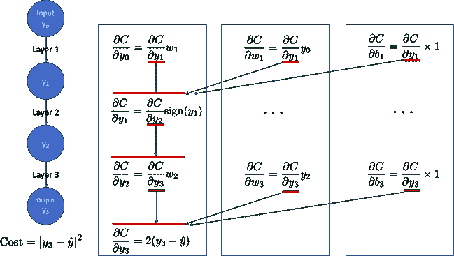
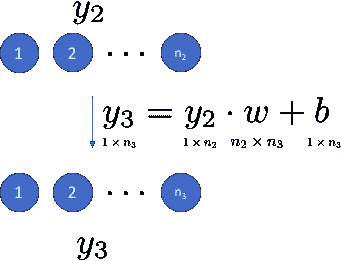
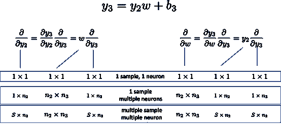

# 反向传播背后的“奥秘”

> 原文：<https://towardsdatascience.com/the-mystery-behind-back-propagation-2ad97d1cf700?source=collection_archive---------19----------------------->

## 外行对神经网络最基本方面之一的理解

警告:如果你已经理解了反向传播背后的数学原理，就不要浪费时间读这篇文章了。

## 问题陈述—神经网络的训练

这个帖子是由 fastai 深度学习课程的[第八课激发的。正如我在](https://course.fast.ai/videos/?lesson=8)[药物激酶相互作用](/collaborative-filtering-to-predict-the-efficacy-of-a-drug-c863ba21eddc)的帖子中提到的，fastai 是一个非常有用的深度学习库，只需几行代码就能让你入门。然而，为了最大限度地利用其灵活性，有必要更深入地理解背后的数学原理。fastai 的深度学习课程在解开神经网络黑盒方面做得非常好。它演示了如何从头开始构建深度学习库。另外，它也是科学计算环境中优秀软件工程实践的极好展示。作为一名理科出身的人，我有时会因缺乏软件工程方面的适当培训和适用于理科应用的有用资源的稀缺而感到沮丧。

回到我在这里试图讨论的问题。神经网络只不过是一个可以优化以进行预测的模型。优化或学习的过程是调整模型参数，以使预测误差最小化。优化过程基于梯度下降。简单地说，如果模型参数增加，误差增加，我们应该在一定程度上减少模型参数，反之亦然。因此，问题的核心是计算误差如何随着模型参数的变化而变化。

这是神经网络的典型描述。它接受一个输入(在本例中是一个三元素向量)，通过首先计算隐藏层(一个四元素向量)来计算输出(一个两元素向量)。每个隐藏元素的值取决于每个输入元素，每个输出元素的值取决于每个隐藏元素。


Reference: [https://en.wikipedia.org/wiki/Artificial_neural_network](https://en.wikipedia.org/wiki/Artificial_neural_network)

现代神经网络一般涉及两种关系——线性和非线性。以一个隐藏元素的值为例。首先，计算来自前一层的所有元素的**值的“加权”和加上常数“偏差”。然后，总和经过非线性转换，以提供隐藏元素的值。*我们需要一种方法来计算输出值如何根据所有层中调用的线性变换中的“权重”和“偏差”的变化而变化。*这就是问题所在。**

## 这篇文章的目的——试图重建导致反向传播的思维过程

鉴于“神经元”之间复杂的连接性，对导数进行强力评估似乎非常困难。人们总是声称这个解决方案只基于微积分中众所周知的链式法则。事实上，不到一页就可以得到它，如维基百科中所示。它的关键实现也出奇的简单如下图(抄袭深度学习类)。请注意，没有调用外部例程，所以这就是全部内容。

```
**def** bwd(self, out, inp):
        inp.g = out.g @ self.w.t()
        self.w.g = inp.t() @ out.g
        self.b.g = out.g.sum(0)
```

但是，至少对我来说，从数学推导到实际代码是非常困难的。有可能理解最终结果，但不清楚人们最初是如何到达那里的。在试图重建我能接触到的思维过程中，我希望对反向传播有更深入的了解。当然，这不太可能是先驱们为发现反向传播而进行的实际脑力锻炼，但他们的经历可能不为我这样背景的人所理解。

我将在下面描述的思考过程包括三个步骤。这个想法是分解问题，这样每一步都是可管理的，也是重要的。这样，每一步的障碍都降低了，而不影响总的成就。

## 步骤 1 —单个样本、单个神经元

让我们考虑一个三层神经网络，每层有一个神经元。取一个输入，第一层执行简单的线性变换，第二层是常用的非线性变换，对于任何负值输出零，否则不做任何事情，第二层线性变换提供输出。模型的成本就是输出和目标值之间的平方误差。这个过程，即从输入值计算输出值，称为正向传递。


我们希望计算与模型参数(即 w 和 b)相关的成本变化。链式法则来了。模型参数通过 y 影响成本。举个例子，


第二步的简化是由于线性模型的使用。这种关系表明，我们需要计算并跟踪成本相对于所有 y 的导数。幸运的是，y 对成本的影响也以线性方式从输入传递到输出，允许连续使用链式法则。对于我们的简单模型，导数总结如下。



假设我们想计算对 w1 的导数，那么我们需要知道对 y1 的导数，这取决于对 y2 的导数，这取决于对 y3 的导数，这是已知的。为了计算关于 w 和 b 的所有导数，保存关于 y 的所有导数是有意义的，因为它们可能被多次使用。在我们的简单模型中，相对于 y3 的导数使用了四次，实际上只需要一次计算。在实践中，对于模型的每一层，我们计算关于其输入变量的导数，并且结果被用于前一层中导数的计算。首先，为了开始这个递归，我们从关于输出的导数开始。因为我们从输出开始，然后返回到输入，这个过程被称为反向传播或反向传递。

当计算导数时，我们还需要知道在正向传递中得到的 y。

现在，我们可以总结出使反向传播可行的实现的重要技巧。

*   *保存 y 的导数以备后用。*对于熟悉软件工程的人来说，这是动态编程的一个典型应用。
*   *向前传递提供 y 的值。由于采用了线性模型，我们不需要更复杂的衍生产品。*
*   *非线性层模型的选择也使得计算导数变得容易。*除了 ReLu，人们习惯用 sigmoid 函数，它的导数也很容易得到。

应该注意的是，ReLu 被认为是一个单独的层，以使事情更加清楚。虽然它是非线性的，但在概念上比线性层简单。通常，线性层在不同层的神经元之间引入了复杂的互连，但 ReLu 只将单个神经元的值作为输入。

现在直接提出一种模式，说明如何计算线性层的各种导数。下一步是将它扩展到多个神经元，然后是多个样本。


## 步骤 2 —单个样本，多个神经元

上面已经确定导数可以以逐层的方式计算。同样显而易见的是，只要选择诸如 ReLu 或 sigmoid 之类的性能良好的函数，非线性层就很容易处理。我们只需要考虑单个线性层，并计算出 w 和 b 相对于输入的导数，因为输出的导数已经存在。

特别地，我们考虑具有不同数量神经元的输入层和输出层。输出层中每个神经元的值由输入层中所有神经元的加权和加上一个偏差决定。如下图所示，这种关系在形式上类似于单个神经元的情况，但是 y 变成了向量，w 变成了矩阵，b 变成了向量。因此，我们需要一个工具将链式法则从单变量扩展到多变量。有多种方法可以做到这一点，在这篇文章中我将使用爱因斯坦符号。在流体力学和广义相对论等张量起重要作用的物理学中，爱因斯坦符号被广泛使用。看到它在机器学习中的运用，我觉得很神奇。



使用爱因斯坦符号以分量格式编写的线性模型如下


导数可以用链式法则直接得到。记住，我们想要利用输出层的导数是已知的这一事实。这个等式可能看起来很可怕，但它遵循了既定的惯例。我们的目的是用一种可以转换成向量或矩阵的格式，写出关于分量的导数。


回到向量格式，其中关于分量的导数被统称为梯度向量或张量，


就输入、输出和模型参数而言，结果是


除了较高的维度，它遵循步骤 1 中观察到的相同模式。

## 步骤 3 —多个样本、多个神经元

最后一步是考虑多个样本的情况。对于每一层，输入和输出是来自每个样本的向量的集合。成本函数就是每个样本的误差平方和。这种扩展可以通过将输入/输出向量扩展为矩阵来实现。由于多个样本，梯度在维度增长后几乎保持相同的形式。梯度公式复制如下，其尺寸用下标表示。这里，样本大小表示为 *S.*


这些表达式可以很容易地转换成实际代码。

```
**def** bwd(self, out, inp):
        inp.g = out.g @ self.w.t()
        self.w.g = inp.t() @ out.g
        self.b.g = out.g.sum(0)
```

## 摘要

此时，我们已经完成了任务—计算成本函数如何随模型参数而变化。通过采取三个步骤，现在更容易理解看似简单的代码实现是如何从数学中得出的。

应该强调的是，步骤 1 包含了反向传播中最关键的见解。步骤 2 和 3 是维度常规扩展。当反向传播首次被引入时，其性能随着网络深度(层数)的增加而迅速恶化。原因之一是消失或爆炸梯度问题。通过检查步骤 1 中的图表，可以直观地解释这个问题。事实上，随着深度的增加，相对于早期模型参数的导数是许多导数的乘积。不足为奇的是，梯度可能非常小或非常大，从而妨碍模型参数的适当训练。

一开始，我把目标定为重建反向传播发明者的思维过程。他们可能通过跳过前两步解决了这个问题，因为他们对数学工具很熟悉。但对我来说，我发现这三步走的方法非常有价值。对于更复杂的网络体系结构，在尝试全面解决问题之前，先解决一个简单的问题(如步骤 1 中的问题)可能更有指导意义。这种三步法也类似于代码重构过程。它可以作为反向传播算法进化史的一个版本。就像一段聪明的代码可能经历了非常戏剧性的重构步骤一样，一个漂亮的等式也必须经历多个细化步骤。跟随这一切是如何从一个卑微的起点开始的，不是更鼓舞人心吗？

步骤 2 和 3 是向量微积分中众所周知的技术。事实上，步骤 2 中的爱因斯坦符号练习基本上证明了向量微积分中一些有用的公式。就我个人而言，我在不同的场合至少学过两次，但是重温它仍然给了我一些以前没有意识到的有用的见解。例如，如何在多个维度上理解链式法则？每次都要经过第二步的推导，无疑会分散我们对更重要问题的思考。在写帖子的同时，我意识到维度的成长来得非常自然。以一个特定的层为例，下面显示了如何将维度从标量增长到矩阵。



为了使等式两边的维数匹配，需要应用转置操作，并且可能需要调整乘法的顺序。当然，这不是一个“证明”，但它肯定能加快我们的思维。输入/输出变量被假定为行向量。如果它们是列向量，类似的推理也适用。

看着这些步骤，人们可以看到许多来自其他领域的类似操作。例如，输出层的元素对输入层的每个元素的线性依赖本质上是坐标系的变换。通常，一个输入层被转换成一个更大尺寸的隐藏层，可能还有几个更大尺寸的隐藏层。这表明我们试图将输入(问题的有形部分)分解到更高维度的空间。因此，隐藏层类似于量子力学中的隐藏变量理论。在一段成功的训练期之后，高维空间并不是一个黑箱；相反，它有望揭示输入层没有捕捉到但已经隐藏在训练样本中的微妙关系(参见[我以前关于药物-蛋白质相互作用预测的帖子)](/collaborative-filtering-to-predict-the-efficacy-of-a-drug-2-f151956315b7)。

最后，我希望这个练习可以帮助那些试图了解反向传播的人。