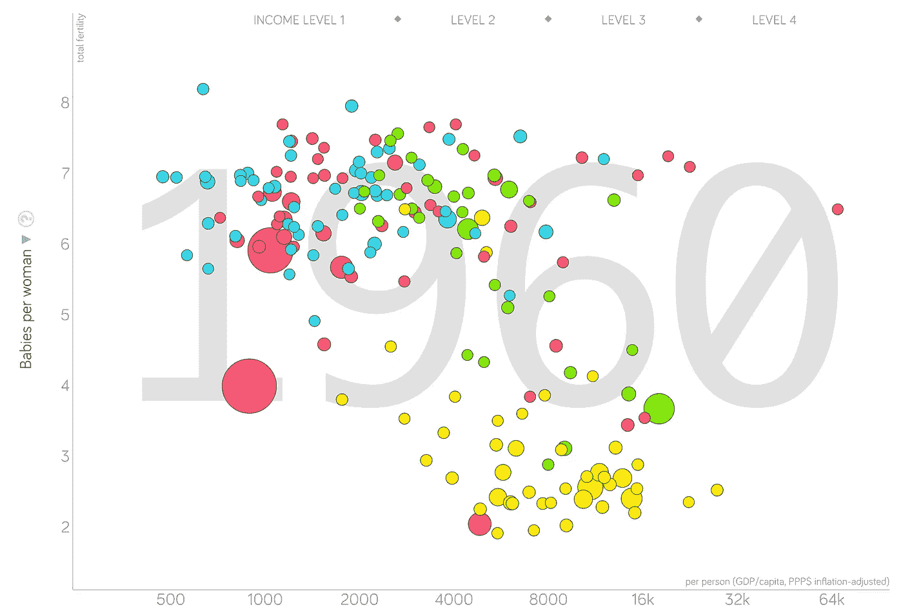
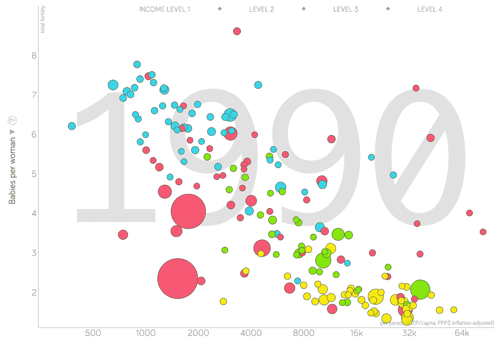
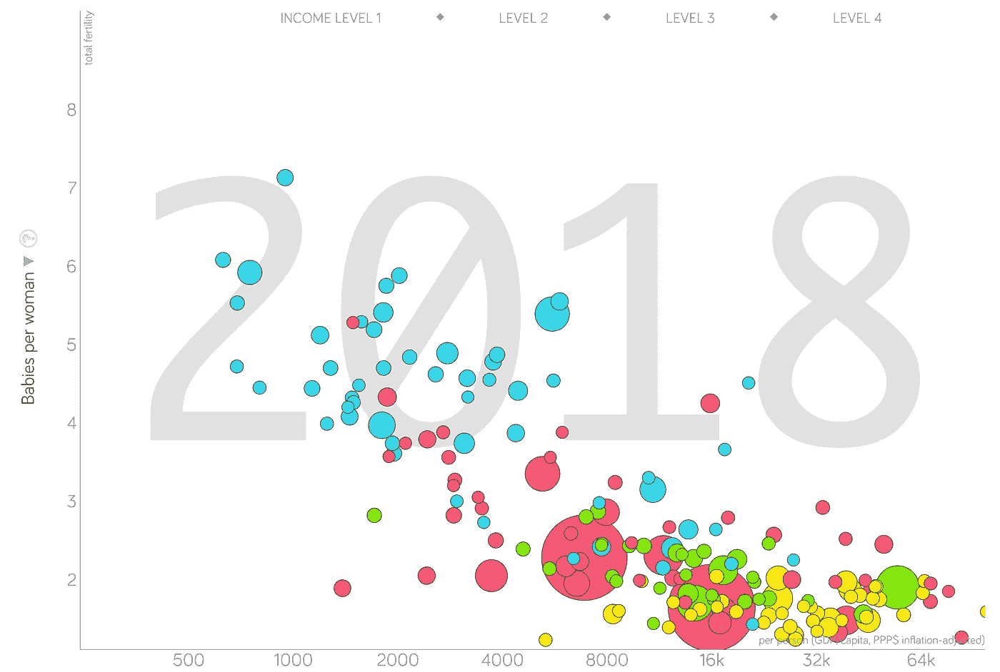
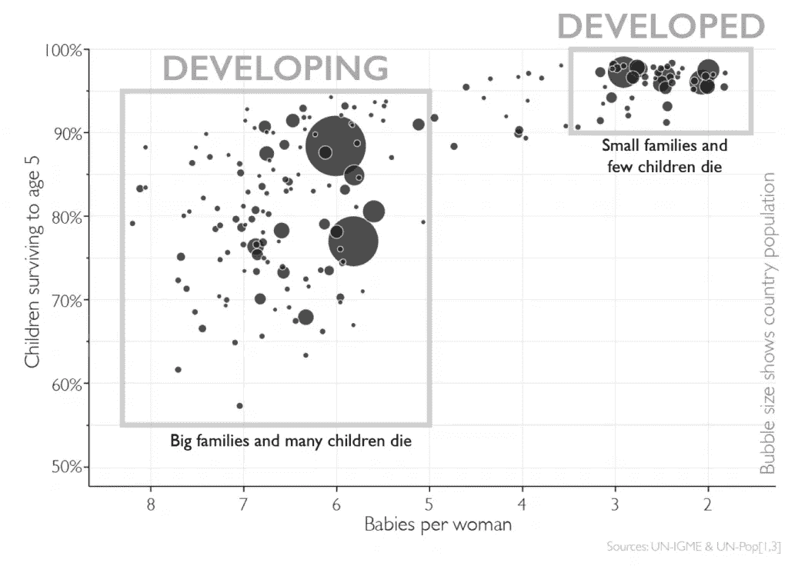
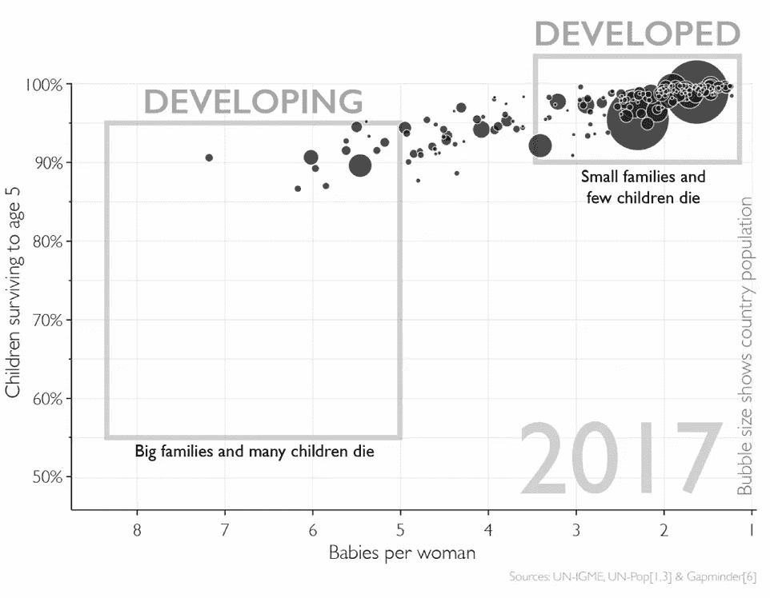
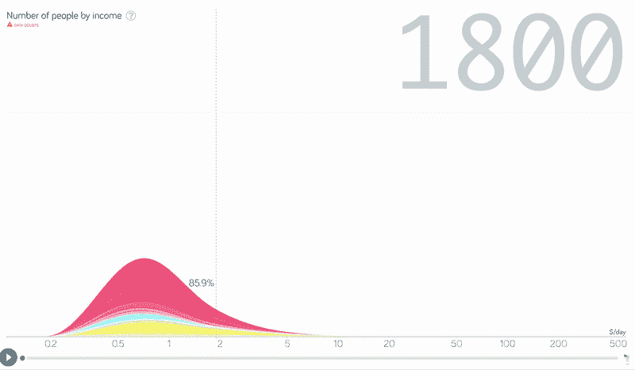
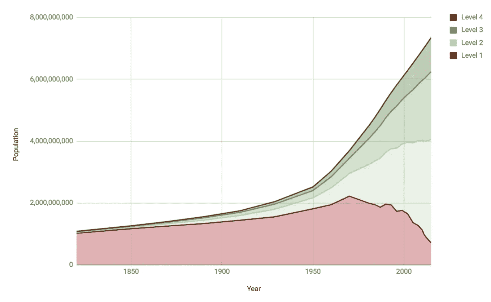
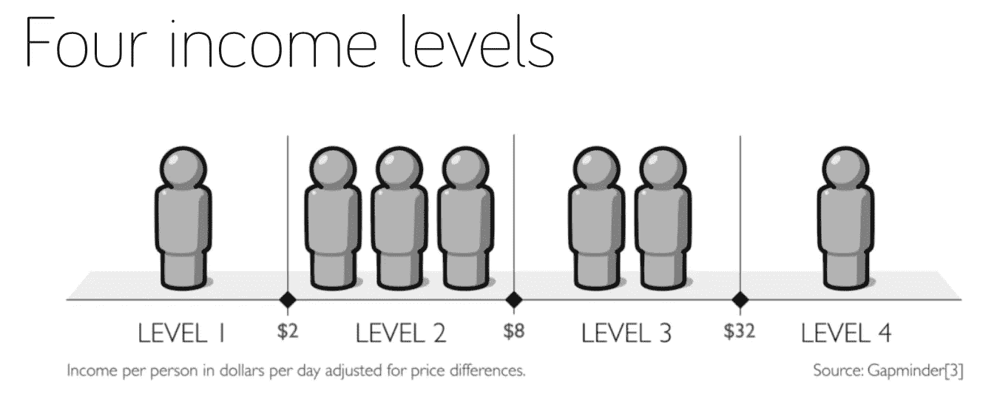
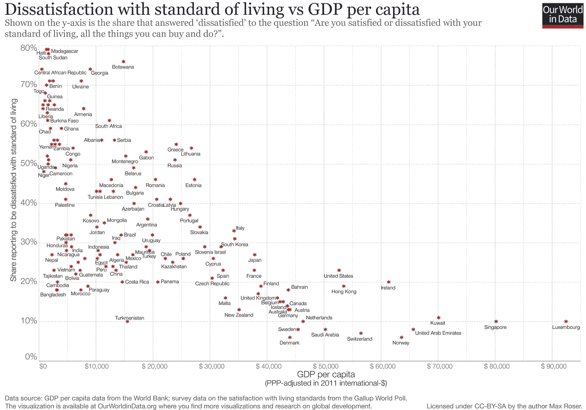
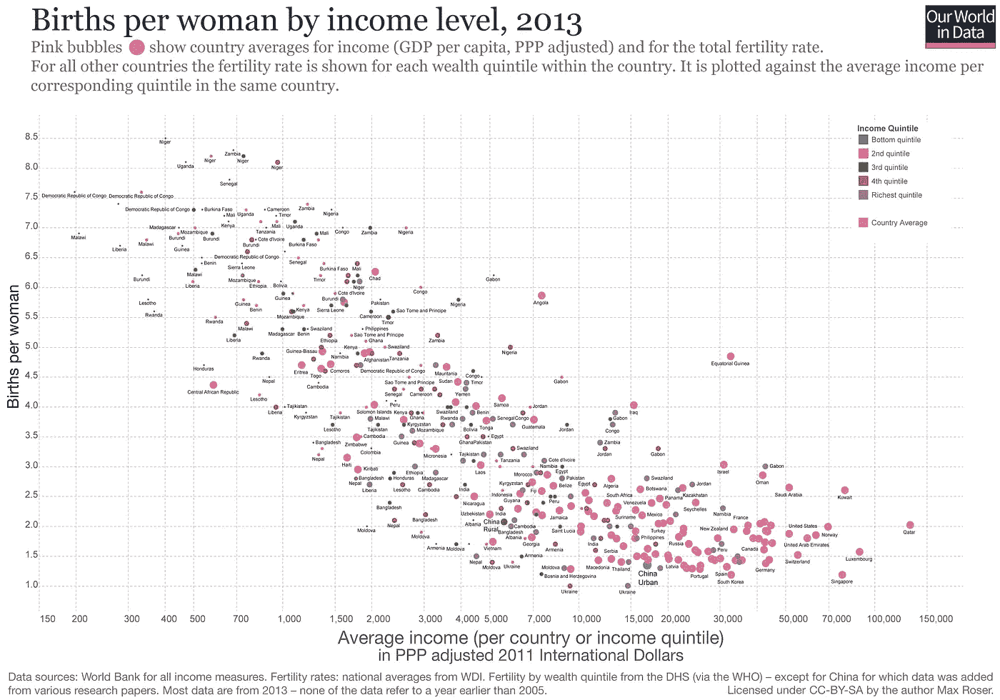

# 我们对他们的神话

> 原文：<https://towardsdatascience.com/the-myth-of-us-vs-them-e0bfccb62f41?source=collection_archive---------10----------------------->

([Source](https://www.pexels.com/photo/nature-red-forest-leaves-33109/))

## 为什么“发达国家和发展中国家”的区别不再有效:现实项目第 4 集

在媒体传播的所有神话中，也许没有比**我们对他们**更有害的了:这种观点认为世界分为两个群体——一个是善，一个是恶——所有事件都可以被视为两者之间的斗争。[这种对世界的两面性观点利用了](https://theconversation.com/why-our-brains-see-the-world-as-us-versus-them-98661)我们形成部落的自然趋势，并在许多情况下得到应用，从政党到经济体系，以及“发达国家与发展中国家”的形式在最后一种情况下，这表现为:发达国家=低出生率的富裕国家(假设是美国)对发展中国家=高出生率的贫穷国家(他们)。

二元观点可能会成为引人注目的新闻(冲突和部落主义肯定会引起我们的注意)，但这是错误的。所有的人类生活，从个人的收入、身高、性别，到国际的政府体系、经济体系、国家财富，都不存在于两种状态中，而是沿着一个连续体存在。此外，我们通过将人们分成两组来使他们失去人性[让我们的本能和认知偏见替我们思考，而不是使用我们的理性。](https://bigthink.com/videos/robert-sapolsky-us-vs-them-thinking-is-hardwired-but-theres-hope-for-us-yet)在这篇文章中，第四集的[现实项目致力于用数据减少对世界的误解](/announcing-the-reality-project-e16cc71abb64)——我们将看到为什么发展中国家和发达国家之间的区分不再适用，而是看看看待国家的真实方式。

现实项目的前一集，关于全球核武器的[在这里](/the-reality-of-global-nuclear-weapons-and-how-russian-nukes-turned-on-your-lights-6d55e056b516)。你可以通过在媒体上搜索标签找到[所有的现实项目。](https://towardsdatascience.com/tagged/the-reality-project)

# 数据

对于这篇文章，我们将主要依靠汉斯·罗斯林的书:*事实:我们对世界误解的十个原因。*其他来源包括[世界银行贫困页面](https://www.worldbank.org/en/topic/poverty/overview)，YouTube 视频[“用你从未见过的最佳数据揭穿第三世界的神话”](https://www.youtube.com/watch?v=RUwS1uAdUcI)，以及文章[“我们应该继续使用‘发展中世界’这个词吗？”](https://blogs.worldbank.org/opendata/should-we-continue-use-term-developing-world)。我用 [Gapminder 数据探索工具](https://www.gapminder.org/tools-offline/)制作了这些图表，你可以免费下载(它包括数据)。

首先，我们有必要看看这种适用于国家的二元观念起源于何处。“发展中国家”一词可能是从“第三世界”演变而来，后者最初指的是在 20 世纪 50 年代既不与共产主义的苏联集团结盟也不与资本主义的北约结盟的国家。这些国家往往是前殖民地，努力为公民提供体面的生活水平，而“第三世界”很快就意味着高出生率的贫穷国家，现在被称为发展中国家。

诚然，在 20 世纪 60 年代的某个时候，这种区分确实有意义——或者至少符合现有的数据。在下面的图表中，我们可以看到 y 轴上的生育率(每个妇女的生育数)和 x 轴上的收入(人均 GDP ),这是所有有数据的国家 1960 年的数据。

Fertility Rate vs Income in 1960 (created with Gapminder Data Exploration tool).

(颜色代表世界地区:黄色=欧洲，蓝色=非洲，绿色=美洲，红色=亚洲+澳大利亚)。有一个相对明确的分组，因为欧洲国家加上一些美洲和亚洲国家往往更富裕，每个妇女生育的孩子更少(右下)。另一方面，非洲国家几乎全都有高出生率和低收入。[发展援助在二战后开始兴起](https://en.wikipedia.org/wiki/Development_aid#Postwar_expansion)，因此，在当时，这种分类允许非政府组织和政府集中精力。

然而，自 1960 年以来，世界形势发生了巨大变化。让我们看看 1990 年的同一张图表，当时苏联刚刚解体。

Fertility Rate vs Income in 1990

现在我们看到的不是分组，而是线性过渡。国与国之间仍然存在差异，但存在的明显差距已经让位于一条平滑的线。1960 年，全球生育率极高，每名妇女生育 5 个婴儿，但 1990 年已降至 3 个。极端贫困率——每天不到 2 美元——也同样下降了，从 1960 年的 60%下降到 1990 年的不到 40%。

这些趋势——生育率下降和贫困减少——自 1990 年以来有增无减。下面是最新的世界图片:

Fertility Rate vs Income in 2018

我们在这里看到的被命名为“大融合”虽然仍有分歧，但没有一条鸿沟将国家分开；相反，他们沿着一条连续的收入线排列。在这个图中画一条单独的分隔线是不可能的，因为只有一个平滑的过渡。世界各地的国家都变得更加富裕，因此寿命更长，儿童死亡率降低，每个妇女生育的孩子更少。

值得注意的是，中国和印度(可见的大红色气泡)经历了极端贫困的减少，导致 2018 年极端贫困率低于 9%的[世界新低](https://www.worldbank.org/en/news/press-release/2018/09/19/decline-of-global-extreme-poverty-continues-but-has-slowed-world-bank)。新的全球出生率为每名妇女生育 2.5 个婴儿，接近 2.1 的替代率。

当我们看一个类似的儿童存活率与生育率的图表时，我们可以看到同样的趋势。在 1960 年，发展中国家和发达国家之间的差距更加明显(左图)，但自那以后，世界再次趋同(右图)。

Children surviving to age 5 vs fertility rate in 1960 (left) and 2017 (right)

旧盒子显然不再合适了。我们将在下一节讨论更精确的特性。

我们将以最后一个画面来结束这一部分:自 1800 年以来全球收入分配的变化。从新闻中获得你对世界的看法是一回事，但用真实的数据观察发生在你眼前的变化是完全不同的。随着世界各地收入的增加，全球极端贫困率(垂直线)从 86%下降到 15%以下(2018 年，世界银行报告该比率低于 10%)。

如果你仔细观察，你会发现在 1960 年左右出现了一个缺口——这正是“发展中”和“发达”这两个词首次出现的时间。然而，随着动画的继续，差距慢慢消失，直到收入沿着一个连续的分布存在。收入的分离——被称为“大分化”——是一个真实的现象，但新的情况是一个大趋同，因为几乎所有地方的收入都在增加。

两组不同国家之间“差距”的消失意味着“发展中国家”和“发达国家”不再准确地代表国家。如果我们使用这种区分，这意味着将人均国内生产总值为 17，000 美元的墨西哥和人均国内生产总值为 1，200 美元的莫桑比克归入同一类别。换句话说，二元区分太宽泛了。尽管如此，正如在 20 世纪 60 年代，某种形式的国家分裂是有用的，因为它让我们找到有类似需求的国家。如果两部分模型坏了，用什么来修复它？

# 更好的系统

在《事实真相》一书中，汉斯·罗斯林提出了一个四层的方法，根据相似的收入需求对国家进行分组。这些概述如下([摘自比尔盖茨关于这个话题的精彩文章](https://www.gatesnotes.com/Books/Factfulness))。

*   第一级:每天少于 2 美元。大约有 10 亿人处于这一水平，每天获得食物可能是一场斗争。
*   第二级:每天 2 到 8 美元。大约有 30 亿人处于这个水平，孩子们可以去上学，而不是去工作。
*   第三级:每天 8 美元到 32 美元。大约有 20 亿人在这一层，包括机动交通和高中。
*   四级:每天 32 美元以上。大约有 10 亿人处于这一水平，拥有省力的设备和可靠的医疗保健。

如果一定要这么想的话，一级是“下层”，二级、三级是全球“中层”，四级是“上层”。在这个体系中，世界上绝大多数人口被正确地归类为中产阶级或以上，反映了最近收入的大幅增长。

下面是随着时间的推移，世界人口在各个层次上的分布情况:

Raw number of people on each level over time ([Source](https://medium.com/@RhysLindmark/a-critique-of-hans-roslings-factfulness-why-we-should-use-5-levels-instead-of-4-dccaac0440b4))

在 1800 年，几乎全世界的人口(85%)都生活在第一层。2018 年，只有 15%的世界人口仍在那里，中产阶级的增长速度远远超过极端人群。

每个人代表大约 10 亿人，实际水平和美元数额如下:

Four Income Levels Proposed by Hans Rosling at Gapminder

四层体系是对二分制的改进。罗斯林的方法是有用的，因为它比二元分类更准确地抓住了不同国家的需求，它使我们能够清楚地看到随着时间的推移取得的进展，并防止我们陷入美国与他们的思维类型。(更不用说这些数字计算得非常好)。虽然这个论点看起来像是语义学，但它实际上很重要，因为我们如何衡量决定了我们如何行动。

(还有其他系统可以解决同样的问题。国际货币基金组织仍然使用先进与新兴经济体的二元对比(T1)，联合国开发计划署(T2)使用连续人类发展指数(T3)，世界银行(T4)最近已经停止使用“发展中国家”和“发达国家”的术语(T5)。还有一个令人信服的理由是将四个类别扩展到五个类别，第五个代表富足。)

# 为什么这很重要

为什么任何测量都很重要？答案是:通过观察原因和结果，它帮助我们找出解决问题的方法。考虑一个典型的连续人体测量，体重。如果你正在努力减肥，最好的开始之一是[简单地每天称体重](https://www.cbsnews.com/news/simple-habit-to-lose-weight-weigh-yourself-daily-study-says/)，这样你就可以知道你是否走在正确的方向上。否则你怎么知道你的(非)干预是否有任何影响？行动——衡量结果——调整行动的过程是我们个人在任何追求中提高的方式。全球发展也是如此:按照连续或四级尺度进行衡量，可以让我们清楚地看到一段时间内的进展，并将具体的改进与原因联系起来。

当我们开始考虑使用二进制还是多类别时，权重的比喻也成立。如果只有两种状态——胖和瘦——我们对很多人的分类是不准确的，如果你的状态年年都没有变化，就很难保持动力。我们最好按照类别来思考——肥胖、超重、健康、体重不足——这样我们就可以向个人(或我们自己)提出重要的建议，来指导他们的减肥行动。

谈到全球贫困，似乎有理由感到绝望。目前有 7 . 5 亿人——大部分在撒哈拉以南非洲——处于极端贫困之中。然而，我们不应该就此止步，一旦我们开始挖掘数据，情况会变得好得多:[在过去 30 年里，超过 12 亿人摆脱了极端贫困](https://ourworldindata.org/extreme-poverty)以及在未来几十年内消除极端贫困的真正可能性。在二元世界观下，我们冒着失去所有这一切的风险，因为我们把与我们收入水平不同的人都归为发展中国家。在四层框架中，我们可以看到，实际上约 85% (6/7 亿)的人生活在第二层或更高层，最大一部分人口生活在全球中产阶级(第二层和第三层)。如果我们再看一下一段时间内的水平分布图，我们会看到很多充满希望的理由:

Number of people on each income level over time. [(Source)](https://medium.com/@RhysLindmark/a-critique-of-hans-roslings-factfulness-why-we-should-use-5-levels-instead-of-4-dccaac0440b4)

中产阶级正在壮大，而第一层(“下层”)正在迅速萎缩。这不仅对那些国家的人民有好处，而且对全世界的每个人都有好处。随着国家变得越来越富裕，公民对生活的满意度也越来越高(这是一个比日常幸福更好的衡量标准):

Dissatisfaction with life versus GDP per capita ([Source)](https://ourworldindata.org/extreme-poverty).

此外，随着收入的增加，生育率下降，因为更好的保健导致更少的儿童死亡，因此，妇女生育更少的婴儿:

Fertility rate versus average income [(source)](https://ourworldindata.org/fertility-rate#)

(生育率下降还有许多其他原因，你可以在[我们的世界数据生育率页面](https://ourworldindata.org/fertility-rate#)上读到。)有些人担心人口过剩(根据数据和最佳估计，我不是其中之一[)如果你是其中之一，限制人口增长的最佳方式就是让所有国家的人民摆脱贫困。随着家庭的孩子越来越少，他们可以在每个孩子身上花费更多的资源，让他们有更好的机会取得成功，然后他们可以将这种成功传给他们的孩子，减少贫困和降低生育率的良性循环将继续下去。](https://ourworldindata.org/world-population-growth)

# 结论

你可能会说，归根结底，这只是语义上的。然而，“发达国家与发展中国家”的二分法不仅仅是一个词语的选择，它是一种思维模式。从本质上来说，二元世界观在智力上是懒惰的，因为它意味着不看数据；它是不人道的，因为它让我们把个人视为可怕的他者，而不是和我们一样为健康、繁荣和下一代更好的生活而奋斗的人。

“现实项目”不是为了了解事实让你觉得高人一等，而是用事实鼓励人们为人类的长期发展做出贡献。“发达国家对发展中国家”的神话是一个很好的起点，因为它提供了一个展示乐观数据的机会，谈论我们对世界的看法是如何错误的，并做出温和的纠正。一旦我们理解了世界变得更好的原因和方式，我们就可以确保它继续这样下去。作为第一步，从看待事情开始——在你的个人生活中和在国际层面上——不要非黑即白，而是要有一个尺度，即使存在分歧，也要显示出进步及其原因。

一如既往，我欢迎反馈和建设性的批评。可以通过推特 [@koehrsen_will](http://twitter.com/@koehrsen_will) 联系到我。