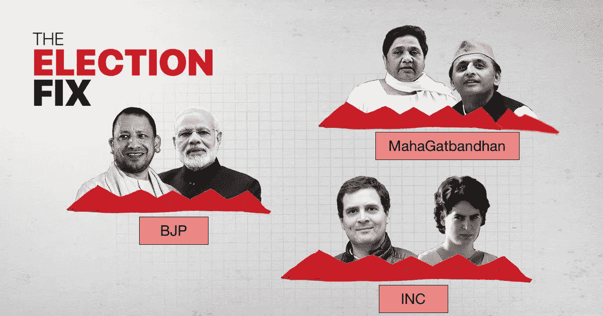

# 十亿选民的国家

> 原文：<https://towardsdatascience.com/the-nation-of-a-billion-votes-election-visualizations-41a9dae303c7?source=collection_archive---------28----------------------->

## 繁荣的印度选举管窥

这是印度的选举月，拉哈特·印多利博士的一句话很好地总结了这一点。

> “सरहदों**पर**बहुत**तनाव**हैक्या，पता तो करो **चुनाव है** क्या！”

对于说英语的人来说，这意味着:边境的紧张局势是否很严重？问问选举是否开始了。

这次选举印度谈了很多问题。新闻频道谈论爱国主义、社会主义、宗教以及恐怖主义。

你可能已经听说了印度和巴基斯坦之间的紧张局势。

这个选举季节也被刺耳的辱骂声所破坏。政客们似乎已经忘记了基本的礼仪。

称总理为卖茶的和守夜的。首相优雅地接受了这两个头衔，并在推特上把一个 Chowkidaar 放在他的名字前面。这是纯粹的天才。

现在选举终于结束了，新闻频道正在发布投票后民意调查。这是非常好的数据。

***又何必浪费好数据呢？***

因此，这里是一个努力显示一些选举数据使用一些互动的可视化使用繁荣。

# 印度政治概述

举个小例子，在印度，中间派由 BJP(Bhartiya Janta Party)把持，纳伦德拉·莫迪(Narendra Modi)是印度现任总理。

印度政治史上的大部分时间都是由 INC(印度国大党)主导的。 ***这是圣雄甘地的聚会。*** 公司的掌门人拉胡尔·甘地，这个有时被称为*的 50 岁青年，可能是王朝政治的完美范例。*

****还有很多其他的地方州党，我就称之为 OTH(其他)****

*给美国观众一个视角(非常宽泛):***BJP =右翼，INC =左翼。****

*印度有 28 个邦，每个邦都有一定数量的选举席位。这是每个州的座位分布。*

*下面我们来简单说说 ***摇摆州*** 。*

*第一个邦是 ***北方邦*** 。一个基于种姓政治的地区。占据了 543 个席位中的 80 席。一个可能左右整个选举的州。这个州是一个名为“MahaGatbandhan”(字面意思是大联盟)的大联盟的所在地。这个联盟是由两个重量级人物——Akhilesh Yadav 和 Mayawati 建立的。两人的观点完全相反，但他们一起将 BJP 政府赶出了中心。*

*然后就是西孟加拉邦 42 席的情况，由 ***玛玛塔·班纳吉*** 把持。有时人们会说这可能是一个独裁政权，在过去的几天里，这个国家发生了很多暴力事件。她也可能在后期与 INC 组成联盟，推翻现政府。*

*总而言之，INC，MahaGatbandhan 和所有其他人都是为了推翻 BJP(莫迪政府)*

# *出口民调*

**

*经过 7 个阶段的投票，选举已经结束。今天是印度的投票后调查。*

*这意味着所有新闻频道都将在 28 个州的 542 个 Loksabha 席位中进行单独调查。*

*让我们不要再等了，看看各种新闻渠道的投票后调查数据。*

*这是:*

*看起来 BJP 和联盟大获全胜。*

*这是一个相同的赛车条形图。*

*唯一不动的似乎是 BJP+ 并且似乎会有第二个基于这一形象化的术语。*

*议会看起来有点像橙色(BJP 色)，虽然没有上次那么多。*

*和摇摆州。我将通过 TimesNow 查看民意调查数据。*

*虽然这看起来像是 BJP+在西孟加拉邦的失败，但根据左派的国家政治，在 WB 超过 10 个席位实际上是很多的，应该被归类为一场胜利。*

*在北方邦，BJP+也能够以 Mahagatbandhan 的形式应对强大的反对派，这似乎也是一场胜利。*

# *结论*

***2019 年的任务似乎有利于 BJP 及其盟友。***

*这是对宣扬种姓政治、王朝统治和少数民族绥靖政治的人的一个笼统的回答。*

*这里有一条推文显示了西孟加拉邦现任 CM 的一些沮丧。*

*虽然数据似乎显示了 BJP+的许多前景，但我们仍然需要看看这些新闻频道的预测是否符合实际情况。选举结果将于 5 月 23 日公布。*

*我还想在这里强调一下[floride](https://app.flourish.studio)，它让创建可视化变得轻而易举。*

****易于制作、发布和分享的可视化效果。****

*如果你想了解创建可视化的最佳策略，我想从密歇根大学调用一门关于 [**数据可视化和应用绘图**](https://www.coursera.org/specializations/data-science-python?ranMID=40328&ranEAID=lVarvwc5BD0&ranSiteID=lVarvwc5BD0-SAQTYQNKSERwaOgd07RrHg&siteID=lVarvwc5BD0-SAQTYQNKSERwaOgd07RrHg&utm_content=3&utm_medium=partners&utm_source=linkshare&utm_campaign=lVarvwc5BD0) 的优秀课程，它是一个非常好的 [**数据科学专业的一部分，本身带有 Python**](https://www.coursera.org/specializations/data-science-python?ranMID=40328&ranEAID=lVarvwc5BD0&ranSiteID=lVarvwc5BD0-SAQTYQNKSERwaOgd07RrHg&siteID=lVarvwc5BD0-SAQTYQNKSERwaOgd07RrHg&utm_content=3&utm_medium=partners&utm_source=linkshare&utm_campaign=lVarvwc5BD0) 。一定要去看看*

*将来我也会写更多可视化的帖子。在 [**媒体**](https://medium.com/@rahul_agarwal) 关注我，或者订阅我的 [**博客**](http://eepurl.com/dbQnuX) 了解他们。一如既往，我欢迎反馈和建设性的批评，可以通过 Twitter [@mlwhiz](https://twitter.com/MLWhiz) 联系。*

*PS:我是 BJP 的支持者，但我尽量保持客观。*