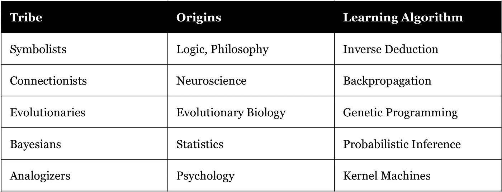

# 人工智能的自然根源

> 原文：<https://towardsdatascience.com/the-natural-roots-of-artificial-intelligence-b76468e512e2?source=collection_archive---------16----------------------->

## 建立对人工智能的共同理解的挑战可以追溯到对智能本质的辩论。

Credit: Marcus Bengtsson (Unsplash)

在这篇文章中，我分享了我对人工智能(AI)基础及其与智能相互关系的文献的探索。我将概述人工智能如何不同于“自然”智能的概念，但却植根于其中。我已经尽了最大努力以一种简化的、有代表性的方式来呈现技术概念。

# 一、自然智能的概念

为了开始我们对人工智能的探索，我们从定义智能开始。《T2 牛津通用词典》(T3)(1955 年)很大程度上依赖于这个词的拉丁词根“T4”(intelligere)，将智力定义为理解的能力；智力；理解是承认程度的一种品质；*规格*超群的悟性；思维敏捷；睿智。虽然这种对“理解”的关注确实强调了感知意义的能力，但它过于宽泛；我们需要进一步寻找更清晰的答案。

在学术界，研究人员对智力没有一个普遍认同的定义。从广义上讲，有四种关于智能的主要观点延续到人工智能研究中——每种观点都有支持者和批评者。前三组——都与人类有关——有一个共同点:智力*取决于*但*不同于*认知。认知指的是大脑的基本过程，而智力是用它可以达到的。智力使用认知能力来达到规定的目的。第四类人持另一种观点，认为智力不仅仅局限于人类和动物，可以在生物学中观察到。我来详细说明一下。

***一般智力阵营:*** 这第一派认为智力是一般的心智能力；即处理认知复杂性的能力。Linda Gottfredson 在*Why G Matters:The Complexity of daily*(1997)中提出了一个相当简洁的定义，并得到了其他 52 名研究人员的赞同，该定义指出:

> “智力是一种非常普遍的心理能力，其中包括推理、计划、解决问题、抽象思考、理解复杂想法、快速学习和从经验中学习的能力。这不仅仅是书本知识、狭隘的学术技能或应试技巧。相反，它反映了一种更广泛、更深刻的理解我们周围环境的能力——“理解”、“理解”事物，或者“弄清楚”该做什么。

这些研究人员认为，一般智力，也称为 g 因子，可以通过经验测试推理、记忆、知识、处理速度和空间能力来衡量。这些测试的结果并不表明智力本身，但给出了智力的近似值——类似于测量身体各方面的健康测试可以给出整体健康的想法。从 19 世纪末开始，心理学家弗朗西斯·高尔顿爵士、詹姆斯·麦肯·卡特尔和阿尔夫莱德·比奈将大规模智力测试系统化——其有效性至今仍有争议。

***多元智能阵营:*** 第二组认为有不同类型的智能。研究人员认为一般智力不能完全解释认知能力，他们指出了人身上出现的不同形式的智力。在极端的情况下，出现了一些特定的术语，如德语中的 *fachidiot* 和法语中的*白痴学者*来指代那些仅在狭窄领域显示智力的人。

研究人员提出了不同的理论来解释如何对智力进行细分。在《心智框架:多元智能理论》(1983)中，哈沃德·加德纳认为有七种类型的智能:视觉空间智能、语言智能、逻辑数学智能、音乐智能、人际智能、内省智能和身体动觉智能。他后来又增加了三个:存在主义、激光和精神探照灯。或者，罗伯特·J·斯滕伯格在《超越智商:人类智力的三级理论》(1985)中提到了一般智力的各个方面，将它分为三个亚理论:成分(分析)、经验(创造)和实践(情境)智力。

此外，情商的存在是一个流行但在科学上有争议的观点。最早出现在 20 世纪 60 年代 Michael Beldoch 和 B. Leaner 的论文中，后来在 Daniel Goleman 的*情绪智力:为什么它比智商更重要* (1995)中得到推广，情绪智力是识别和管理自己和他人情绪的能力。支持者将情商与职业结果相关联，而批评者指出，当控制一般智力和人格特质时，情商的重要性较低。

***行为阵营:*** 第三类人不再试图将智力与认知能力联系起来。相反，它将智力定义为解决问题的能力。因为智力是认知的动员，它专注于实现表面上可观察到的结果。正如 S. S .科尔文在剑桥大学的*智力手册* (2000 年)中所引用的，“一个人拥有智力，只要他已经学会或者能够学会调整自己以适应环境。”虽然这种观点在对智能的封装上显得狭隘，但出于我们将在后面看到的原因，它是人工智能研究人员最喜欢的术语。

***进化阵营:*** 最后，第四派认为所有生物都表现出某种智能行为。Cianciolo 和 Sternberg 在《智力:简史》中指出，智力最终可以归结为生物体适应环境和从经验中学习的能力。这种定义经常被生物学家使用——尽管小心翼翼地与智能设计保持距离。在进化的推动下，在文化的影响下，自然产生了适应生存和繁衍环境的有机体。在《自然中的智慧:对知识的探究》(2005 年)中，人类学家杰里米·纳比使用了日语表达 *chi-sei* ，大致翻译为“知识”或“知道的能力”。自然界中有无数智能行为的例子，例如植物整天弯曲它们的茎，细菌在寻找食物时采用独特的游泳策略，或者猴子对每种类型的捕食者发出独特的警告信号。对这个群体来说，智力是安静的和无意识的，与环境相关，关注生存而不是解决问题，并建立在偶然性的基础上。

这四个观点是对智力的静态定义。但是随着时间的推移，人类的智力也会发生变化:让·皮亚杰发现了智力是如何从婴儿期和儿童期发展并过渡到青春期和成年期的。智力也会随着文化的变化而变化:詹姆斯·弗林注意到智力随着时间的推移而增加，他发现环境的认知复杂性增加了思维的复杂性。换句话说，基因和环境相互作用影响智力。此外，整体来看，智力变化的影响:在《蜂群思维:你的国家的智商如何比你自己的智商重要得多》(2015)中，加勒特·琼斯探索了集体范围内的智力如何转化为现实世界的结果。

# **二。人工智能的起源和定义**

希尔伯特·西蒙的自然与人为的二分法在艾的历史中起了重要的作用。正如西蒙在**人工科学* (1969)中所写的，自然是由自然产生的，而人工是由艺术产生的。尽管“人工”带有贬义，但人工过程涉及到将现有情况改变为更好的情况。通过设计的过程，人类生产出利用自然世界来满足特定目的的物质人工制品。我们可能会想到空调、飞机、砖块、面包、摩天大楼、智能手机等等。*

*1956 年夏天，人工智能领域在达特茅斯学院诞生。由约翰·麦卡锡领导的一项为期两个月的研究聚集了著名的数学家和科学家，研究“猜想，学习的每一个方面或智力的任何其他特征原则上都可以如此精确地描述，以至于可以制造一台机器来模拟它。人们将试图发现如何让机器使用语言，形成抽象概念，解决现在留给人类的各种问题，并自我完善。”这是一项雄心勃勃的事业，反映了其参与者的乐观主义和早期里程碑:希尔伯特·西蒙预测“机器将能够在 20 年内做任何人类可以做的工作”，而马文·明斯基写道“在一代人之内……创造‘人工智能’的问题将得到实质性解决。”坦率地说，这并没有发生。*

*正如它确实发生的那样，该领域谨慎地集中在围绕目标实现的更温和的人工智能定义上——这与我们的行为主义阵营的智能概念没有什么不同。专家们提出了一些不太具体的定义，如“解决难题的能力”(马文·明斯基)、“以最佳方式利用有限资源(包括时间)来实现目标的能力”(雷·库兹韦尔)、“在复杂环境中实现复杂目标”(本·戈泽尔)、“在各种环境中产生适应行为以实现目标的任何系统”(大卫·福格尔)，以及“将科学和工程结合起来，以建造具有智能行为能力的机器”(乔安娜·布莱森和杰里米·怀亚特)。*

*使用这些定义，我们看到 AI 是方法不可知的；它没有规定必须使用哪些方法来解决问题。此外，我们看到它有解决我们不再认为是人工智能的问题的历史，例如设计井字游戏策略，创建数学证明，识别手写文本，或优化机票价格。我们现在认为人工智能只关心解决计算机目前无法解决的问题。正如道格拉斯·霍夫施塔特(Douglas Hofstadter)讽刺的那样，“(人工智能)是任何还没有被做的事情。”同样，在《T2 心理学会》(T3)(1967)中，明斯基评论道“智力的概念就像舞台魔术师的把戏。就像‘非洲未开发地区’的概念一样，一旦我们发现它，它就消失了。”*

*总而言之，人工智能中的“智能”，如果有的话，是指其制造者在机器中表现出来的智能。*

# ***三世。AI 的不同部落***

*每一个人工智能实例的核心都有一个算法——一组交付给计算机的指令，用于从输入生成输出。人工智能算法围绕着我们:城市中的交通灯根据交通模式自行协调；智能手机根据应用程序的使用情况节能；飞机根据大量的飞行数据自动驾驶飞行；脸书基于用户数据黑箱生成个性化新闻源。是什么统一了这些离散的算法，它们是如何分类的？*

*有许多方法来分类和组织人工智能内部的思维。例如，任务可以分解为分类问题，以识别给定观察的组(或类)，或者分解为回归问题，以生成定量预测。或者如果根据口径对 AI 进行分类，有专攻一个领域的人工狭义智能(ANI)，可以将智能应用于任何问题的人工广义智能(AGI)，还有超越人类智能的假想人工超级智能(ASI)。我们的重点是亚 AGI 类别，因为大多数专家预测将 AGI 置于未来几十年，而 ANI 研究是中间步骤。参考 Pedro Domingo 在他的书 *The Master Algorithm* (2015)中对该领域的简洁回顾，我将粗略回顾一下关于创建人工智能的方法的主要观点。*

*我们首先需要知道，在最高层面上，有两种生成人工智能的竞争方法:机器学习(ML)和知识工程(KE)。机器学习是教计算机学习的过程。它采用了*学习算法*——生成其他算法的算法。通过从一组输入及其相应的输出开始，然后传递给计算机一个学习算法，它编写一个程序，可以根据一组新的输入产生正确的输出。对于知识工程师来说，这仅仅是模式识别，而不是真正的*知识。知识工程采取了一种不同的方法，让专家将他们的领域知识编码成计算机能理解的语言。当面临问题时，*专家系统*引用专家赋予的逻辑和规则来解决问题。机器学习的倡导者反驳说，创造一个智能代理所需的想法数量是无限的。对知识进行编码仅仅是集邮，如果机器不能学习，当面对新的情况时，它就会变得脆弱。曼梯·里和柯之间的竞争持续了几十年。随着时间的推移，曼梯·里在取得了许多重大成功后成为了占主导地位的思想流派。尽管如此，一些知识工程师相信，ML 的局限性最终会让自己变得清晰，为 ke 的复兴扫清道路。**

*创造潜伏在外围的人工智能的另一种方法是模仿人类大脑，这种方法由雷·库兹韦尔提出，并由罗宾·汉森在 2016 年的《Em 时代》中进行了深入探索。大脑仿真本质上是将大脑的“软件”移植到机器上，而不是担心制作软件来完成人类执行的各种功能。虽然本质上是推测性的，但其倡导者认为，在下个世纪，我们将能够以空间和化学分辨率扫描大脑，模拟单个脑细胞的信号处理功能，并在人工硬件中创建一个逐个细胞的大脑可执行模型。这种模拟可以展示类似人类的输入输出行为。*

*尽管人工智能是人工智能的一个子领域，但它已经成为人们关注的焦点。多明戈斯把 ML 社区分成五个主要的部落:象征主义者、联结主义者、进化论者、贝叶斯主义者和类比主义者。每个部落设计学习算法的方法都可以追溯到自然智能、自然科学和数学。*

**

*象征主义者认为所有的智能都可以简化为操纵符号——每个符号都是一个想法、物体或关系的抽象表现。与数学家通过牛顿万有引力定律等方程解释宇宙的方式类似，符号主义者将现实简化为由符号组成的方程。虽然知识工程通过手动编码知识来采用这种方法，但符号主义机器学习通过采用一种根据经验自行构建知识的学习算法来避免这种“知识瓶颈”。这种学习是通过一个逆向演绎的过程来完成的:传递一个计算机数据，并在知识中归纳出缺口，从而得出概括的结论。这种对符号的操纵可以被看作是对 Gottfredson 的智力定义的一种松散的重新诠释。*

*连接主义者对大脑进行逆向工程。受我们大脑的生物神经网络如何通过加强神经元之间的连接来产生学习的启发，连接主义者通过人工神经网络对此进行建模。这是通过创建多层人工神经元来实现的，这些人工神经元利用一种称为反向传播的学习算法，该算法连续改变每一层中的连接，以使程序的输出符合预期。迄今为止，大脑是终极的学习机器；也许它*有*一个我们可以借鉴的通用学习算法。有趣的是，灵感是双向的:一些人认为人类的大脑是一个信息处理系统——其中认知*和意识*是一种计算形式。*

*进化论者认为智慧之母是自然选择。大自然的学习算法是一种适应度函数，通过基因的选择和重组产生复杂的有机体，这些基因也会随着时间的推移而变异。进化者通过遗传算法来模拟这一点，在遗传算法中，程序目的的实现取代了“生存”作为适应度的衡量标准，通过遗传算法，程序通过随机突变和/或繁殖进行世代进化。经过多次迭代，这种学习算法产生越来越好的程序，模仿我们在智能进化阵营中概述的那种智能行为。*

*贝叶斯主义者认为所有学到的知识都是不确定的，学习就是处理不确定性的能力。程序经历一个循环过程，从先验概率开始——在看到证据之前的信念——变成包含新证据的后验概率。贝叶斯主义者使用概率推理作为他们的学习算法，这严重依赖于贝叶斯定理，该定理现在指导将新的证据纳入程序的信念。基于数学和统计学，它提供了一种获取和提炼知识的直观方法。*

*类比者认为，学习是识别情境之间的相似性，从而推断其他相似性。类比推理者是一个松散的部落，他们只在把相似性判断作为学习的基础上团结一致。他们领先的学习算法基于支持向量机，帮助判断不同事物之间的相似性。道格拉斯·霍夫施塔特等一些认知科学认为类比是认知的核心。*

*值得注意的是，每种类型的机器学习都需要程序员某种程度的监督，程序员提供训练数据来生成程序，并对其参数进行调整以改进模型。这种监督可以以*监督学习*的形式出现，其中程序员为每个输入提供正确的输出，*强化学习*其中程序员为学习算法采取的行动定义奖励，以及*无监督学习*其中学习算法在没有已知输出或奖励的指导下对输入数据进行操作。一旦程序员认为生成的程序令人满意，就可以更广泛地部署它。*

*Domingos 推测这五个部落可能会联合成一个能够学习任何东西的“主算法”——他最喜欢的 AGI 之路。在未来，有了足够的数据和知识作为输入，这样的主算法就可能存在。与此同时，现有部落将推进他们的学习算法，将它们彼此结合，或者看到新部落形成学习算法的新范式。无论如何，机器学习将继续在解决问题方面取得令人眼花缭乱的进展，让我们重新思考机器的能力。*

*随着人工智能的不断进步，我们可能不可避免地在自然和人工智能的各种根源之间循环，以阐明新的能力。人工智能经常被拟人化的问题将继续存在，因为我们几乎自动地认为它是我们所知道的智能类型:我们自己。虽然人工智能采用了一系列受自然智能启发的问题解决技术，但它与生物大脑的运作有着有限的相似之处——生物大脑涉及意识、感觉和意志等。直到有一天智能代理实现了这些更高阶的特征——这种可能性正在激烈辩论——人工智能最具生产力、最具反思性和最诚实的表现是将其视为另一个人工制品家族；人类使用的一套工具，可以达到积极或消极的目的。*