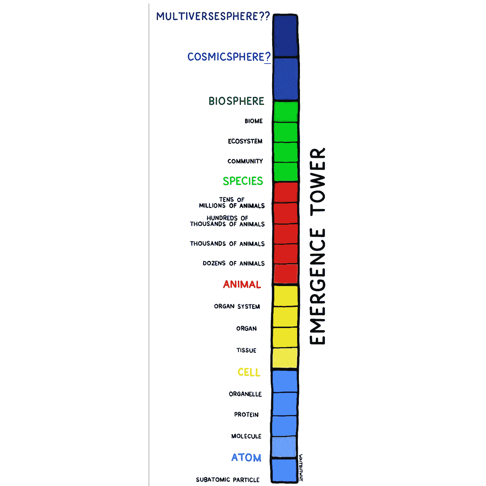
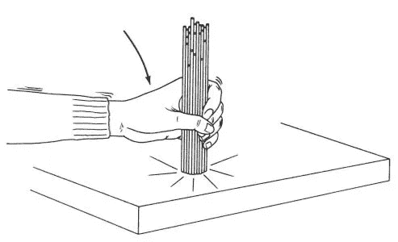

# 从计算机科学的角度看人类智能的本质

> 原文：<https://towardsdatascience.com/the-nature-of-human-intelligence-from-a-computer-science-perspective-30f6e9c09146?source=collection_archive---------21----------------------->

我对人工智能的长期未来非常好奇。更好地理解人类智能可能是预测人工智能未来的关键。多亏了旧书和最近的研究，我的想法和预测在过去几年里有了很大的发展。我现在相信强 AI 会实现。

关于人类的智力，我现在认为下面的陈述可能是正确的。其中一些只是猜测。(为了简洁起见，在本文的其余部分，我将省略“可能”和“依我看”这两个词。)

*   所有或几乎所有的人类智能都可以被认为是某种形式的计算或数据输入/输出/存储。
*   人类的智力不仅仅来自大脑。实际上，几乎人体的每一部分(甚至细菌等。)在人类智力中起作用。
*   整体远大于部分之和。例如，每个细胞本身的智能有限，但结合在一起，就可以实现巨大的智能。
*   **多级并行**计算是关键，这种并行性甚至比全是 GPU 的数据中心更令人印象深刻。
*   计算是**分布式**和**分散式**(像区块链😜);没有集中的组件。人类无法模拟 CPU 控制整台计算机或主节点控制一群计算机。
*   **递归/反馈** **循环/自我提升**在多个层面上也很重要
*   **注意**和**抽象**机制大大减少了所需的计算量(即，它们提高了每个计算单元的性价比)
*   人类大脑/身体的部分执行计算机科学算法或数学运算的方式有很多
*   人类智能利用机器学习算法和逻辑推理([符号计算](https://en.wikipedia.org/wiki/Computer_algebra)等)。)
*   使用当前的计算机硬件架构很难实现人类智能；一定有更好的方法。人类的身体/大脑以一种普通计算机(目前)无法做到的方式利用生物、化学和物理。

让我们更详细地探讨这些要点。

## 智能只是计算和数据输入/输出/存储

换句话说，我相信 [**功能主义**](https://en.wikipedia.org/wiki/Functionalism_(philosophy_of_mind)) 。我认为拒绝功能主义意味着你需要相信一些灵魂的概念或者其他一些非有形/非物理现象(你永远无法证实)。这关系到人类意识的本质。一个很好的概述，见 [*我们正在解释意识吗？*(丹尼尔·丹尼特 2001 年论文)](http://omgwai.com/itsdho/Dennett_2001.pdf)。

## 智力不仅仅来自大脑

我过去认为所有的智力都来自大脑，但现在我认为那是错误的。让我们来考虑一个思维实验:如果我们能够通过外科手术取出我的大脑，并将其植入一个机器人的体内，我会有同样的思维/行为/感觉吗？不，我不这么认为(除非我们有先进的技术，可以合成功能和人体完全一样的机器人)。

换句话说，我们的身体是我们智力的一部分。例如，最近的研究表明[肠道及其微生物群对大脑和人类行为有重大影响。在任何电信号到达大脑之前，触摸热表面的手指会立即缩回。白细胞在没有大脑指令的情况下对入侵者发动战争。细胞四处移动，释放化学物质，并遵循类似计算机程序(DNA)的东西进行复制。细胞无意识也没关系；它们有助于提高人类的整体智力。另外，你知道吗](http://The whole is much greater than the sum of its parts.)[一个单细胞可以解决迷宫和困难的计算机科学问题](https://www.youtube.com/watch?v=ooA0J6DWWTM&t=13m19s)？

人类不仅仅是通过读书或听讲座来获得智力。通过所有感官和感觉(有意识地和无意识地)来感受世界，有助于人类理解世界并在世界中明智地行动。

## 整体远大于部分之和

一个人仅仅是 [**应急塔**](https://waitbutwhy.com/2019/10/idea-labs-echo-chambers.html) 的“动物”级别，其中每个级别都是由它下面的级别的几个实例组合而成的。

from [https://waitbutwhy.com/2019/10/idea-labs-echo-chambers.html](https://waitbutwhy.com/2019/10/idea-labs-echo-chambers.html)

一个有趣的类比是，一个蚁群总体上比每个组成蚂蚁的智力总和要聪明得多；这也许是在著名的《德尔、埃舍尔和巴赫》一书中最有趣的描述。

相关的概念有 [**群体智慧**](https://en.wikipedia.org/wiki/The_Wisdom_of_Crowds) 和计算机科学概念，如**进化算法**、**、**、[、**计算社会选择**、**图形计算**和**神经网络**(其中](https://www.lamsade.dauphine.fr/~lang/papers/sofsem07.pdf)[多个神经网络组合](https://medium.com/intuitionmachine/the-end-of-monolithic-deep-learning-86937c86bc1f)可以比每个组成网络的智能的简单总和更“智能”或更有用，一个网络可以被认为比

## 并行计算

如果我们假设人体中的大多数[细胞都可以被视为具有某种计算能力](https://www.ncbi.nlm.nih.gov/pmc/articles/PMC3842595/)(单个细胞本身可能是愚蠢和缓慢的，但这不是重点)，那么这意味着一个人可以同时进行数十万亿次计算(在**并行**)。与传统计算机相比:

*   传统的 CPU 一次只能处理一件事情。
*   多线程 CPU 可能能够同时处理 64 次计算。
*   一个像样的图形处理器可能能够处理成千上万的同时计算。
*   一个装满 GPU 的数据仓库可能能够同时处理 1 亿次计算。

并行计算是关键，因为它允许人类例如非常快速地对事物做出反应。例如，如果你看到一个物体朝你的头部飞来，你会立即试图躲闪，而不是在行动前逐个处理每个视网膜细胞的数据。当然，人类无法将高效的并行处理应用于任何任意计算；人类(通过进化)被设定为只在特定类型的任务中很好地使用并行处理。

## 分布式和分散式计算

这对整个身体和大脑都是正确的。如果我们把每一个计算单元(例如，一个细胞、一个器官、一片大脑)看作一个个体代理，那么这些代理既是**竞争**又是**合作**。在任何给定的时间，你的直觉可能会与你大脑的一部分竞争，以决定下一个感觉/想法/行动，而你大脑的一部分可能会与另一部分合作，以形成更完整的思想，然后与大脑的另一部分竞争，以进入你的意识并主导你的思想。这种合作和竞争机制使得整体大于部分之和(如上所述)。

有些人会认为丘脑/前额叶皮层充当中央处理器，但这是[有争议的](https://www.researchgate.net/post/Is_the_thalamus_REALY_the_CPU_of_the_Brain)。

## 递归/反馈循环/自我提升

至少有两种方法可以应用这个概念。

1.  大脑似乎[被设置来执行需要递归逻辑的任务](http://www.letras.ufrj.br/poslinguistica/recursion/papers/17-friederici.pdf)(例如，说出或理解像“彼得知道爱汉斯的玛丽亚联系了约翰”这样的短语)
2.  大脑能够[自我提高](https://www.bbc.com/future/article/20151123-the-brains-miracle-superpowers-of-self-improvement)。即部分神经可塑性是通过大脑改变自身(间接？).例如，有一些想法可以[导致一些酶被释放，然后导致突触数量和突触连接的变化](https://www.scirp.org/journal/PaperInformation.aspx?PaperID=73936)。

我有一种感觉，反馈回路也在其他方面发挥作用。

顺便说一下，很多人认为自我完善的 AI 是更好的 AI(以及有意识的 AI 和强 AI)的关键。从实用的角度来看，编写或帮助编写人工智能软件的人工智能是一个很好的例子(正如 Keras 的创造者 Franç ois Chollet 所认为的那样)。

## 注意力和抽象

人类擅长最小化浪费的计算。这是进化的自然结果。一个人的视野中可能有 10 个物体，以及关于这些物体中每一个的 10 个细节。但是人类自然会 1。将**注意力**限制在这些物体中的一个上(例如，有吸引力的潜在伴侣或飞向某人面部的危险岩石)和 2。对物体做一个简单的**抽象**，同时忽略细节(例如，理解它是一个危险的、快速移动的物体——无需考虑岩石上的确切形状或图案)。注意力和抽象机制有时可能是弱点(例如，有时人类过早地得出结论或掩盖重要的细节)，但大多数时候它们对人类的智力有积极的贡献。

计算机可以使用类似的方法。著名的 2017 年论文 [*注意力是你所需要的全部*](https://arxiv.org/abs/1706.03762) 引领了自然语言处理的巨大进步。2018 年的论文 [*世界模型*](https://arxiv.org/abs/1803.10122) 描述了使用神经网络创建**抽象的**世界模型的进展，这些模型在计算上是可处理的，并与其他神经网络相结合，以很好地执行任务。

## 计算机科学算法和数学运算

例如，[耳朵放大某些声音频率，然后充当多个带通滤波器](/human-like-machine-hearing-with-ai-1-3-a5713af6e2f8)将声音分离成分量。视觉皮层执行多层卷积(有点像将像素汇集在一起)，这启发了卷积神经网络(CNN)，它是现代人工智能图像处理的核心部分。(参见深度学习书籍第 358 页的[卷积网络的神经科学基础。)](http://www.deeplearningbook.org/contents/convnets.html)

你可以将这种现象视为“身体使用这种数学方法”，或者反过来，你可以说“这些数学模型描述了身体的功能”或者“这些算法受到生物学的启发”，但我认为你选择哪种观点并不重要；我的主要观点是，身体可以做有助于人类智力的很酷的事情。

关于这方面的更多信息，请查看 2012 年的论文 [*受生物过程*](https://www.currentscience.ac.in/Volumes/103/04/0370.pdf) 启发的计算算法。

## 机器学习算法和符号推理

概括地说，有两种主要的人工智能方法:

1.  统计机器学习(从数据中学习，例如通过查看许多带标签的照片的像素来学习区分猫和狗)
2.  符号 AI /逻辑推理/ [计算机代数](https://en.wikipedia.org/wiki/Computer_algebra)(例如将 2y=x 操纵成 y=0.5x 或者从“所有人都会死”和“约翰是人”推导出“约翰是人。”)

我认为人类使用以上两者的某种形式。仅用上述之一不足以解释人类所展示的智慧。如今，统计机器学习通常通过受人脑启发的神经网络来实现。至于符号人工智能，我想人类也必须能够使用类似的东西，因为人类显然能够进行代数运算，并很快进行逻辑推理。

问题是，我们到底如何结合#1 和#2？有许多可能的方法。比如看这个视频:[通过溯因学习桥接机器学习和逻辑推理](https://www.youtube.com/watch?v=ETHrFxiFIUM) (2019)。在这种方法中，“机器学习模型学习从原始数据中感知原始逻辑事实，而逻辑推理能够纠正错误感知的事实，以改进机器学习模型。”人类的大脑也做类似的事情吗？也许吧。另一种方法是 [OpenCog](https://medium.com/@ybergquist/opencog-vs-openai-2-different-paths-to-human-level-ai-d36deafbf966) ，它包括符号人工智能和神经网络，作为一个更大的连接“超图”的一部分

## 利用现实世界中的生物、化学和物理

一个可笑但很能说明问题的例子是[意大利面条分类算法](https://en.wikipedia.org/wiki/Spaghetti_sort)，它可以由人来实现，但不能由没有实体的计算机来实现。该算法包括拿着一串不同长度的未煮过的意大利面条棒，然后将这串棒重重地摔在桌子上。人类可以以 O(n)时间复杂度按长度对棒进行排序。相比之下，对一列数字排序最快的计算机算法是 O(n log n)，这就更差了。计算机不能利用例如重力，重力持续地同时作用在所有的杆上(**平行**)。当然，你可以用计算机来模拟重力对所有物体的影响，但是这在计算上是很昂贵的。

A human performing Spaghetti Sort

类似于意大利面条的是 DNA 计算。“DNA 计算的力量来自于它能够对试管中的内容同时执行相同的操作**……操作可以并行执行**而不会增加成本”(摘自[本文](http://www.cim.mcgill.ca/~scott/RIT/dna_computing.html))。****

****换句话说，现实世界(人体内)发生的事情(被认为是计算)自然是大规模并行的(全部同时发生)，这是人类相对于传统计算机的巨大优势**(传统计算机自然会一个接一个地处理事情，并产生成本来实现并行性——与现实世界相比，并行性相形见绌)。******

******以上可能是通过电子硬件实现强 AI 的最大挑战(如果我们不去猜测[用量子计算实现 AI](https://www.quora.com/Can-quantum-computers-help-with-developing-strong-AI) )。******

# ******关闭******

******我对人类智慧了解得越多，我就越欣赏它所能做的一切。但是随着与神经科学和人工智能相关的令人敬畏的研究的泛滥(我们才刚刚开始)，并且由于我们对人类智能机制的理解越来越好，**我确实相信机器智能最终将能够复制或取代人类智能的许多方面。不确定确切时间。********

# ****放弃****

*   ****我不是这些话题的专家。我只是一个随机好奇的家伙。****
*   ****我有意避免讨论智力的定义；这可能是一场漫长的哲学辩论。你可以选择它对你意味着什么，希望以上仍然有意义。****