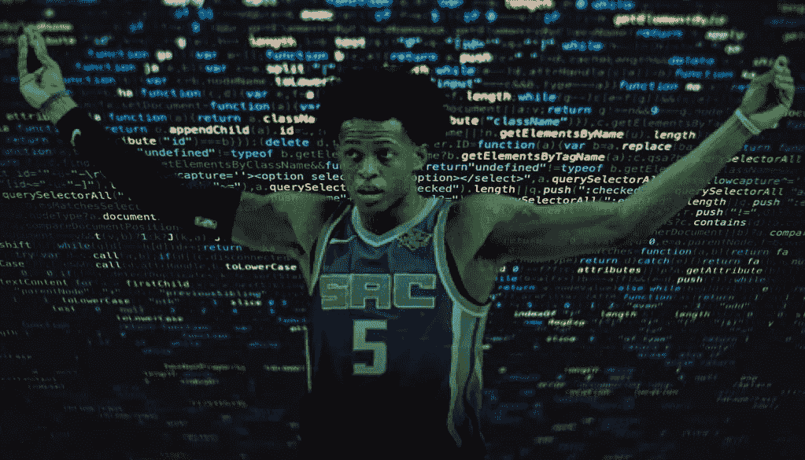
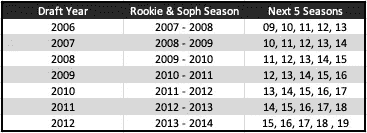
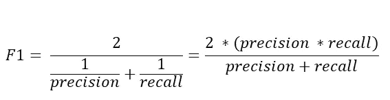
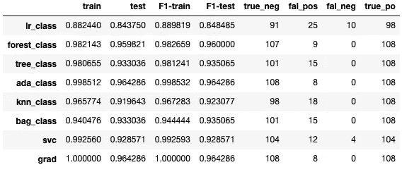
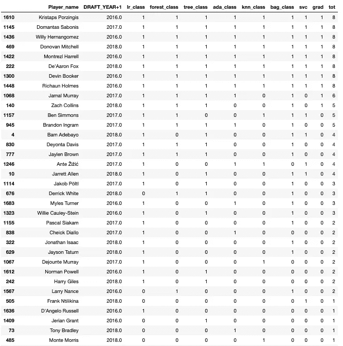
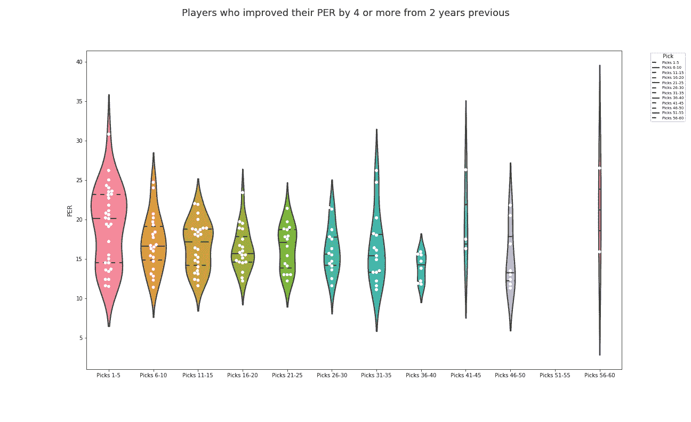

# NBA 的下一代

> 原文：<https://towardsdatascience.com/the-nbas-next-generation-ca1f06d8c660?source=collection_archive---------21----------------------->

利用数据和机器学习分类建模预测下一代 NBA 球星。数据能告诉我们一些我们的眼睛看不到的东西吗？

Sacramento’s De’Aaron Fox is quickly becoming the NBA’s best PG.

在这篇文章中，我将看看分类模型在试图预测某个特定的 NBA 球员是否可能达到某个基准时的表现。这是我用数据预测 NBA 球员表现系列的第二篇文章。在我之前的文章中，我观察了某些球员如何从缓慢的起步到他们的 NBA 职业生涯，再到成为爆发的明星。我进行了一些基本的探索性数据分析，以了解一名球员的选秀状态(轮次和选秀权)与他未来的表现有何关系。我使用诸如 [PER(球员效率等级)](https://www.basketball-reference.com/about/per.html)和 [win share](https://www.basketball-reference.com/about/ws.html) (更具体地说是每 48 分钟比赛的 win share)等指标来衡量未来的表现。我观察了这些从第一轮选秀权到第二轮选秀权的变化，以及它们从一个选秀班到下一个选秀班的变化。从那里，我们能够做出一些统计推断，关于球员如何进步，球队如何根据他们在哪里被选中来对待和评估球员，以及在分析中是否有一些偏见。我想扩展这些发现，更具体地说，看看我是否能预测一个特定的球员在给定的赛季中是否会达到特定的上场时间和场均得分。我选择检查的阈值如下:我想预测一个给定球员在一个赛季中打超过 1000 分钟并达到 20 的 PER 的概率，假设他在他的前两个 NBA 赛季中没有达到这些基准。

让我们花一分钟思考一下，对这种类型的结果进行建模可以实现什么。让我们以斯蒂芬·库里为例。如果模型预测斯蒂芬·库里永远不会打满 1000 分钟，并且 PER > 20 **和**，那么我们观察到他永远不会打满 1000 分钟(这被归类为真阴性)……好的，模型做得很好。但它应该能够做到这一点，事实证明，在数据集中，只有 8%的玩家做到了这一点(稍后将详细介绍)。因此，该模型可以很容易地预测玩家永远不会达到阈值，并且在 92%的情况下都是正确的。因此，高度准确地预测负面结果是毫无意义的。现在，如果模型预测斯蒂芬·库里**将**达到 1000 MP，并在未来的某个时间点有一个 PER > 20，而他实际上**没有**达到那个值(这是一个假阳性)。这在 NBA 是很平常的事情。一个队在一个球员身上打赌，他没有实现他们的希望。这并不理想，但也在意料之中。这是我们想要最小化的东西，但它不是最坏的结果。我们真正想要避免的是假阴性。这是当我们预测斯蒂芬·库里**不会**达到 1000 MP 并有一个 PER > 20，然后他就变成了，…斯蒂芬·库里。这是我们需要训练模型不惜一切代价去避免的。让一个超级巨星出现在你的花名册上已经够难了，但是把他误认为超级巨星，然后把他交易走或者不让他辞职是灾难性的。

因此，我现在需要设置参数来衡量球员，然后尝试看看是否有可能创建分类模型，让我们预测某个特定球员是否可能达到分类阈值。首先让我简单描述一下分类模型中发生了什么，然后我可以讨论我在创建模型时所做的一些假设。

分类模型通常(在这种情况下)用于预测特定目标变量的二元结果。如果模型为相应的目标变量生成了超过阈值(在此特定情况下为 0.5)的概率，则它将该目标变量的实例分类为 1。如果生成的概率小于阈值，则它将目标分类为 0。然后，我们可以检查这些分类与实际观察数据的匹配程度，以了解模型的准确性。

退一步说:我正在看 2007-2019 NBA 赛季的高级指标数据。我选择那个时间段的原因是因为 2006 年是 NBA 第一年要求进入选秀的球员必须高中毕业一年。我想找到一种有趣的方式来研究如何预测那些在进入联盟时不是“立竿见影”的球员在接下来的赛季中会如何提高。从那里，我观察了哪些球员在前两个赛季中上场时间超过 1000 分钟，PER > 20。如果一个球员在联赛的前两个赛季取得了这样的成绩，我认为他们是有直接影响力的球员。自 2007 年以来，只有 6 名球员在新秀赛季取得过这样成绩:[凯里·欧文](https://www.basketball-reference.com/players/i/irvinky01.html)、[安德烈·德拉蒙德](https://www.basketball-reference.com/players/d/drumman01.html)、[安东尼·戴维斯](https://www.basketball-reference.com/players/d/davisan02.html)、[卡尔-安东尼·唐斯](https://www.basketball-reference.com/players/t/townska01.html)、[米切尔·罗宾逊](https://www.basketball-reference.com/players/r/robinmi01.html)和[迪安卓·艾顿](https://www.basketball-reference.com/players/a/aytonde01.html)。对于二年级球员来说，名单略显强劲:欧文、德拉蒙德、戴维斯和唐斯都重复了这一壮举(罗宾逊和艾顿是 2019 年的新秀)，凯文·杜兰特、凯文·乐福、布鲁克·洛佩斯、布雷克·格里芬、格雷格·门罗、德马库斯·考辛斯、鲁迪·戈贝尔、尼古拉·约基奇、约翰·科林斯和托马斯·布莱恩特都加入了这一组合。我从我的数据集中删除了这 16 名球员，然后看看哪些球员能够在职业生涯的后期达到这一指标(> 1000mp & > 20 PER)。然后我找来所有其他球员，查看他们未来 5 年的比赛数据。这是第 3-7 季，决定了他们是否能够在特定的季节达到 1000mp 和> 20 PER 基准。(注意，我希望所有玩家都有一个一致的时间表)。我发现还有 82 名球员在第一年或第二年后达到了这些里程碑。然后，这些玩家在我的目标栏中被标记为 1。这意味着他们是能够达到这个标准的玩家。

使用这些参数，我创建了数据集来训练和测试我的模型。这个数据集只包含 2007-2019 年所有其他 NBA 球员的新秀和大二赛季，但是为了保持一致，并允许每个被测试的球员都有五年的数据来达到基准，我只能使用 2006-2012 年选秀的球员。因此，2013 年还是新秀的球员将在 2019 年完成他们的第 7 个赛季(新秀和大二赛季+ 5 年额外时间)。下面是它是如何分解的。

这渲染了 490 个独特的玩家来建模。在这一点上，需要注意的是，我从 2015 年、2016 年和 2017 年的草案中删除了所有球员，并将他们放在另一个数据集中，我稍后将使用该数据集为我的模型提供真正的测试样本。(在这一点上，如果对数据细节感到陌生或不知所措，可以跳过建模部分的细节，直接进入下面的结果部分)

## **建模**

现在我开始建模过程。我将 PER 从数据框中移除，并进行简单的逻辑回归。很明显，我的数据在我的目标少数群体和目标多数群体之间太不平衡了。因此，我决定使用一个[随机通用采样器](https://imbalanced-learn.org/en/stable/generated/imblearn.over_sampling.RandomOverSampler.html)来平衡我的班级。在平衡了少数群体和多数群体之后，我调整了我的数据，并开始训练八个不同的分类模型。

*   逻辑回归
*   随机森林分类器
*   决策树分类器
*   装袋分级机
*   k 近邻分类器
*   AdaBoost 分类器
*   梯度推进分类器
*   支持向量分类器

正如我们上面谈到的，当进行预测时，一个特定的玩家有四种可能的结果。玩家可能以真阴性、真阳性、假阳性或假阴性结束。我们应该被提醒，我们正试图将假阴性最小化。我们如何测试这个？通过使用所谓的[F1-分数](https://en.wikipedia.org/wiki/F1_score)。F1 分数计算精度和召回率之间的[调和平均值](https://en.wikipedia.org/wiki/Harmonic_mean)，并由以下公式表示:

此时你可能会问。假阴性真的比假阳性更糟糕吗？我认为这是一个见仁见智的问题。当与一位朋友讨论结果时，她指出每个假阳性都是从一个潜在的真阳性中获得一个名册位置，因此在合计假阳性的真实成本时，需要考虑机会成本。然而，这似乎是真的，考虑到这种水平的球员是多么的罕见，把他们错误的归类并让他们成为一个错误的否定是更令人震惊的。在这一点上，我认为首要目标应该是确保你确定你的花名册上的所有或大多数球员证明有能力达到> 20%和 1000 MP 的分类水平。

下一步是通过 [GridSearch](https://scikit-learn.org/stable/modules/generated/sklearn.model_selection.GridSearchCV.html) 运行每个模型，以确定最佳调整参数，使每个模型以最高水平运行。(如果这对你来说毫无意义，不要担心，这对理解正在发生的事情和实际结果并不特别重要。)从那里，我通过每个模型运行我们的训练和测试数据(从我们的整个原始数据集中获取的两个不同的样本)，以生成准确度分数、F1 分数以及真阳性、假阳性、真阴性和假阴性的数量。

Results for each classification model: train & test columns correspond to the R² score for each model

上表显示了我们上面列出的不同分类模型的结果。您可以看到，除了[逻辑回归](https://en.wikipedia.org/wiki/Logistic_regression)和[支持向量分类](https://en.wikipedia.org/wiki/Support-vector_machine)之外，所有模型中的假阴性数量都显著减少。所有其他模型没有返回假阴性和梯度增强分类器，并且 AdaBoost 分类器具有最少数量的假阳性。

我们发现了什么？

最后，我想看看这些模型在全新数据上的表现。我回到[真实的测试样本](https://medium.com/ca1f06d8c660#2fc0)，对这组数据运行每个模型。记住这是 2015，2016，2017 选秀的球员。我想看看，模型预测谁会达到我们的分类阈值。在所有被测试的球员中，只有 8 名球员被每个模型预测为真实，1 名球员(贾马尔·穆雷)被 6 个模型预测为真实，本·西蒙斯、布兰登·英格拉姆和扎克·科林斯被 5 个模型预测为真实，而一大批球员被 4 个或更少的模型预测为真实。让我们更详细地看看分类模型的汇总结果。

*Note ignore the index number on the left **Note2 this is showing Draft Year + 1 so a player with a value of 2016 was part of the 2015 NBA Draft.

乍一看，一些有趣的事情跃然而出。所有模型的聚合预测似乎很好地捕捉了所有可能(或已经)达到分类阈值的参与者。接下来，看看所有 8 个模型对 2 个或 3 个模型预测了哪些球员，肯定令人惊讶。像[多诺万·米切尔](https://www.basketball-reference.com/players/m/mitchdo01.html)、[德文·布克](https://www.basketball-reference.com/players/b/bookede01.html)和[克里斯塔普斯·波尔津吉斯](https://www.basketball-reference.com/players/p/porzikr01.html)这样的超级明星在所有车型上都表现出色，而最近的突破明星如[安杰洛·罗素](https://www.basketball-reference.com/players/r/russeda01.html)和[帕斯卡尔·西亚卡姆](https://www.basketball-reference.com/players/s/siakapa01.html)则不那么成功。下一个任务将是更深入一点，找出是什么驱使米切尔比本·西蒙斯表现得更好，或者比杰伦·布朗表现得更好。也许根据每个球员新秀赛季和大二赛季的累计首发次数来建模比仅仅根据大二赛季来建模更有效。也许只使用特定的度量标准会产生更有希望的结果。下一步将是更全面地调查哪些特征在预测结果中起着最大的作用。例如，是什么原因导致 Jakob pltl 被三个模型归类为真，而 Russell 只在一个模型上表现良好。

**最后，**我们需要得出一个结论，在评估一个球员的时候，PER 到底有多有价值或者重要。我们希望确保我们试图预测的指标有价值，它们是重要的，并且它们使我们能够更好地判断球员的表现和价值。下一次，我们将看看数据集构造中的操作和模型使用的特征中的操作如何影响预测。我们也可以试着分析这些类型的预测在球员中是如何变化的，这与他们在选秀中被选中的位置有关，甚至可能与他们被哪个队选中有关。

The chart above shows the distribution of players who improved their annual PER by more than 4 points from year t-2

上面的图表显示了从赛季(t-2)以来 PER 提高了 4 分或更多的球员的分布。你可以清楚地看到，成为前 5 名选秀状元在你的进步可能性中发挥了重要作用，但一旦你超越了前 5 名，这种影响就不那么明显了。这是我们可以看到的更深层次的含义:在第一轮和第二轮的选秀权中，取得这种进步的彩票选秀权的比例是多少。到目前为止，从这项调查中获得了大量有用的见解。请继续关注我，因为我希望在未来的帖子中发现更多的发现。

此外，请随时查看我之前的帖子“何时放弃？”了解更多关于 NBA 数据的灵感来源的信息。

我绝不是想暗示门罗、科比和柯林斯处于其他球员的水平，而是说他们只是碰巧在 PER 指标上表现特别好。我们可以同意或不同意 PER 指标的重要性，但这不是我在这里试图做的