# 数据驱动的必要性:自然语言处理案例

> 原文：<https://towardsdatascience.com/the-necessity-of-being-data-driven-the-natural-language-processing-case-c247770e99b5?source=collection_archive---------27----------------------->

## 算法可以创造奇迹，但前提是你要记得给它们喂食

Photo by [Nick Fewings](https://unsplash.com/@jannerboy62?utm_source=unsplash&utm_medium=referral&utm_content=creditCopyText) on [Unsplash](https://unsplash.com/search/photos/language?utm_source=unsplash&utm_medium=referral&utm_content=creditCopyText)

自然语言处理(NLP)对人类来说非常直观，但对计算机来说并非如此。“计算机能像我们一样理解吗？”这个古老的哲学问题。在 NLP 方面变得非常具体。对于这个具体的例子，我们可以问*“计算机理解‘汉堡’和你尝过并拿在手里的实际美味之间的关系吗？”*或者我们可以更进一步:*计算机能区分“汉堡”和“披萨”吗？它能理解两者之间的相似之处吗？为了给出这个问题的答案，我们需要后退一些步，考虑我们实际上试图告诉计算机什么，以及我们如何告诉它(我们到底能不能称之为“它”?).*

自然语言，在这种情况下是英语，已经将单词“burger”与这道菜联系起来，这就是我们给计算机的输入。这种语言对我们来说是自然的，但对计算机来说不是。总的想法是，单词的转换是将每个字符转换成 ascii 字符，然后转换成 1 和 0 的组合。有人可能会说，现在计算机有了它的 burger 版本，就像从一种自然语言到另一种自然语言的任何翻译一样。如果我们想做更复杂事情，比如创建表达式或短语，甚至更糟:创建整个文档，那么这就足够了。

在我最近被分配到的一个项目中，*简单地说，这是一个基于与单个文档的相似性对一组文档进行排序的问题*，我第一次体验到了应用 NLP 技术解决现实生活中的问题。这是机器学习的一个激动人心的分支，如果不是最激动人心的，但它带来了很多挑战，其中最主要的挑战是正在使用的数据的数量(和质量)，在进行机器学习的激动人心的阴影下，*没有得到足够的重视*。随着项目接近(令人满意的)尾声，我得出了几个我认为值得分享的结论。

# 预处理的常规演练:

如果你曾经读过任何不从预处理开始进行文本分析的文章，请一定把它发给我，因为我还没有找到这样的文章。背后的原因是因为这是基本的，也是整个过程中最重要的步骤之一:清理文本并使其尽可能地更容易被计算机理解是在这个领域取得相当好的结果的关键。

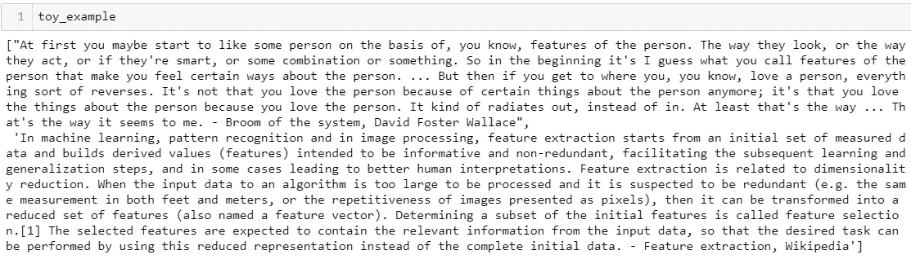

Two documents for the input

*   *转换为小写:*将所有文本转换为小写的简单任务，以使其余的分析更容易
*   标点符号和奇怪字符的去除:这两者都被认为是无信息的，因此从我们要分析的文本中去除
*   *标记化*:将你的文本分割成由单词或句子组成的列表的简单过程
*   *停止单词移除*:在每种语言中都有一组(某种)预定义的单词，这些单词被认为与任何类型的文本分析都无关，例如*‘我自己’*、*、【他们】*、*、【the】*等。NLTK 为不同的语言提供了一个非常通用而有用的停用词列表。

根据手头的任务，您可以添加自己的一组与您的分析无关的关键字，从而消除数据中的一些干扰，这更有可能使您的工作取得更好的结果。事实证明，这也是占用我们大量时间的要点之一:这是一项人工任务，对您正在考虑的文本类型进行阅读和推理，您可以评估哪些单词没有添加任何相关信息，以便机器能够理解。*多花些时间寻找这些关键词，往往会带来更好的表现。*

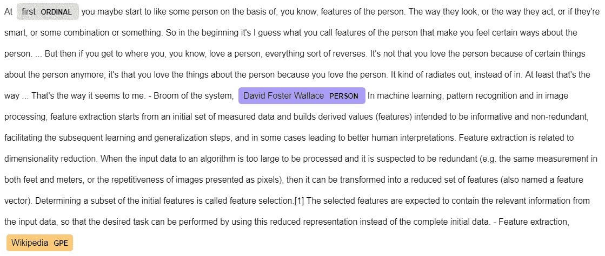

NER visualization

*NER(命名实体识别)*:定位和分类命名实体(如位置、人名、组织、数量等)的子任务。).一些提供这种服务的图书馆有 NLTK、Genism 和 SpaCy。

*   *词干化:*将屈折词或派生词还原到其词根的过程，也称为词干化。例如鱼、鱼、渔夫都沦为干鱼。提供这种服务的图书馆有 NLTK、Genism 和 SpaCy。
*   *词条释义:*是通过对词的形态分析，提取该词的词条的过程，其中词条是该词的词基或词典形式。提供这种服务的图书馆有 NLTK、Genism 和 SpaCy。

The pre-processing steps

*   单词嵌入:这是最棘手也是最关键的部分，但是这个奇特的术语是什么意思呢？这很简单:用数字形式表示一个单词。做这件事的方法有很多。

# 单词嵌入:单词包

The ever classic example of most NLP academic slides

BOW 表示的简单思想是在一个 D 空间中表示一个 D 单词的字典，其中每个单词由一个配置表示，只跟踪多样性。平均而言，每种语言大约有 171，576 个单词。新词产生得相当频繁，这只能意味着一件事:*词空间表征的增加*。这种表示还有另一个流程:考虑 4 个单词的字典[ *猫、女士、胳肢、女王* ]的情况。在 BOW 表示中，我们会有一个类似于[1000，0100，0010，0001]的表示，它看起来是正确的，但事实上它并没有包含任何关于单词语义的信息。从这样的表述中，很难理解“女士”和“女王”这两个词比“猫”和“挠痒痒”更接近。如果我们想增加这些词的运算的复杂性，它只能提供非常有限的表示。然而，这种单词嵌入方法不需要训练，因此也不需要语料库。

> *它的力量在于它的简单。*

# 单词嵌入:TF-IDF

可以认为 BOW 的下一步是语料库文本中单词的 TF-IDF 表示。

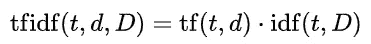

它的主要目标是给出文档(D) 的*集合中*文档(d)* 的*项(t)* 的重要性。*

**词频**:在*文档 d* 中出现一个*词 t*

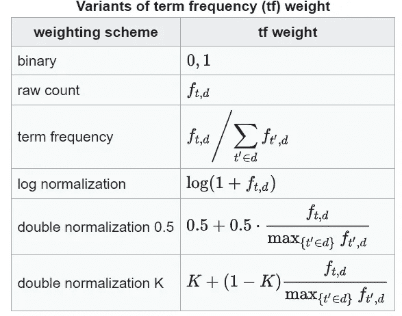

Term frequency

**逆文档频率(IDF)** :用简单的英语翻译，它是考虑到可用于训练的整个文档集合的术语频率的倒数。

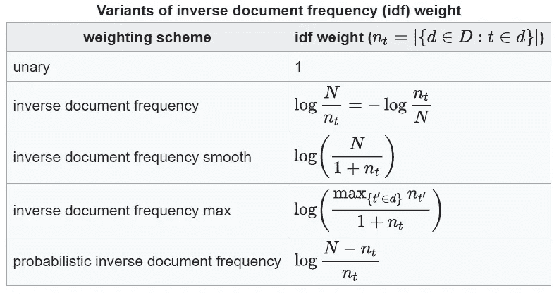

Inverse Document Frequency

知名库 [*sklearn*](https://scikit-learn.org/stable/modules/generated/sklearn.feature_extraction.text.TfidfVectorizer.html) 就有这种单词嵌入的实现。与几乎所有其他实现一样，一旦理解了作为输入给出的参数是什么，就很容易使用了。有趣的是，你可以定义自己的 ***记号化*** 函数并在起点转弯，你可以随心所欲地定制预处理步骤。一旦定义了记号赋予器(也可以使用默认的记号赋予器)，只需两行代码就可以获得数据的数字表示。

在这种情况下，我们只使用 TF-IDF 矢量器的三个特征:我们的*定制标记器*、*术语频率的归一化*和 *max_features* ，换言之，转换的特征数量的上限是我们表示的维度。

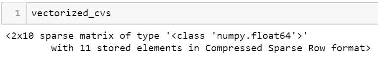

我们得到的输出是一个矩阵，其行数等于训练集上的文档数，列数等于我们保留的特征数(max_features_ = 10)，其中特征是指文档中具有最高 TF-IDF 分数的术语。

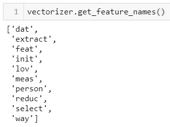

Top 10 features of the training documents

提取的特征是具有最高分数的术语，这意味着这些术语在表示我们提供给模型的文档时是最相关的。一旦你有了这个文档的数字表示，其中每个文档通过这 10 个特征来表示，在我们的情况下，在矢量表示中指示位置 *i* 的特征在文档中出现了多少次，你可以用它做任何事情，在我的情况下，计算文档之间的相似度。

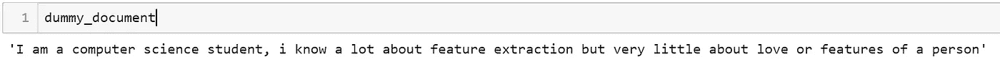

一旦我们有了 TF-IDF 模型，我们就可以通过它向量化任何其他文档。

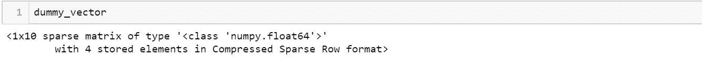

Vectorial representation of the dummy document

虚拟文档的表示是通过 4 个关键字来完成的:*特征*、*提取*、*爱情*、*人物*准确的说是它们各自的权重。

只需两行代码，您就可以计算矢量化文档之间的余弦相似度。

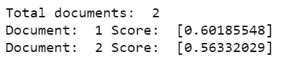

在这种情况下，虚拟文档更类似于 DFW 的经典文章，而不是对我来说听起来相当不错的特征提取解释。

我们比 BOW 更进了一步，我们至少考虑了术语的出现，我们还可以通过 *max_features 参数*控制表示空间的维度。然而，我们还不能把我们教给计算机的术语的意义联系起来。然而，它是文本挖掘任务中使用最多的方法，数字图书馆中超过 83%的基于文本的推荐系统使用 TF-IDF，而不是过于花哨的方法[【1】](https://kops.uni-konstanz.de/handle/123456789/32348)。

# 单词嵌入:Word2Vec

顾名思义，这是一种将单词转换为向量的方法。BOW 和 TF-IDF 的根本区别在于，在这里，我们在将矢量表示与单词相关联时，会考虑单词的含义。简单来说，这种单词嵌入方法是一种只有两层的浅层神经网络，旨在学习单词的语言上下文。在这种情况下，两个词*女士*和*女王*会有相似的表示。然而，这种方法需要一个 ***大型语料库*** 当你有一个特定的问题试图应用它，而几乎没有数据来训练它时，这就成了一个问题。根据所使用的架构，它可以有两种类型:

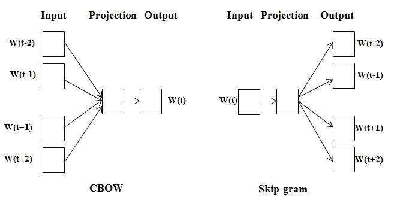

Example with a window of 2

1.  **CBOW(连续单词包)**:给定一个单词周围的那些(窗口)，对该单词的预测。基于期望单词周围的一组单词，它试图预测*期望单词 w(t)* 。这种单词的预测是基于对我们提供给模型的语料库的学习过程，因此模型看到的情况越多，它就越好地理解单词之间的关系，并且此后能够更好地预测可能的 w(t)。
2.  **Skip-grams** :给定单词 w(t)周围单词的预测。在这种情况下，我们做相反的事情:给定一个单词，我们预测可能围绕它的单词。按照同样的推理，即使在这种情况下，我们提供给模型的语料库越大，预测就越好。

*如果你想更多地了解这最后两款* [*这里的*](/neural-networks-and-philosophy-of-language-31c34c0796da) *是一篇有趣的文章。*

当神奇的词“神经网络”被包括在对这种方法的一个短语解释中时，人们不会对随之而来的大量大量数据的必要性感到震惊。即使对一个人来说，学好一个概念，记住趋势和线条，一次又一次地重复它们是关键:这种模型也是如此。

# 现在怎么办？

此时，您已经有了非常强大的 NLP 工具，但是我们该如何利用它呢？如果你是一只好奇的猫，你会从测试一两个库的小代码片段开始，并对人类迄今为止在教机器我们的语言方面取得的成就感到惊讶。大多数情况下，直到你手头有一个具体的问题，你才开始面对现实，这些方法是多么有限。为了能够获得我的项目所需的排名，我首先需要计算文档之间的相似性，并计算相似性，我需要以数字形式显示这些文档。这不仅仅是获得一个文档的数字表示，还需要获得一个优化范围的表示，在我的例子中是为了获得最好的排名。

> 最大的限制是可用的数据量

几乎在任何机器学习算法的每个应用中，都需要大量的数据，这种情况也不例外，如果有什么不同的话，这比大多数情况下更重要。这种大量数据的必要性背后的根本原因是一般化的需要:如果 ML 能够一般化，并且能够正确处理新的、看不见的测试数据，那么它就被认为是一个好的 ML。为了达到一个良好的概括点，模型首先需要看到尽可能多的数据，这样它就不会只关注少数情况，并围绕这几个情况进行自我塑造(你好，过度拟合，是你吗？).

在现实世界中，最具挑战性的问题是经常面临的:手头的数据非常少。手头只有不到 100 个样本需要排序(一旦该解决方案投入使用，至少会达到 1000 个)，我站在一个可能的解决方案板前。第一步，一个非常雄心勃勃的(回头看也相当愚蠢的)是做大:从 Doc2Vec 这样的东西开始，相当于文档的 Word2Vec。从一开始就知道这是一种不可能的方法，训练一个只有 100 点或更少的神经网络，并期望它学习得很好，能够根据这几个案例将文档表示为向量是不现实的。结果你可能想知道:我能够生成我曾经工作过的最不稳定的模型。它不仅不擅长学习我正在寻找的表示，而且也不能产生一个稳定的模型:删除或添加单个文档会导致不同的结果。

意识到这一点后，我回到了可能的解决方案，并开始考虑那些在开始时被丢弃的解决方案，主要是因为它们的简单性，即 TF-IDF。它的效果比我测试过的其他产品都要好:令人震惊，不是吗？谁会想到广泛使用的方法也能很好地解决我的问题。有人可能想知道“工作得更好”是什么意思:对于这个问题，我们没有使用传统的度量标准，所以“99%的准确率”不是我们在这里讨论的。现在，解决方案的评估是基于人的，在某种意义上，结果被呈现给该领域的人类专家，并且他们表达他们对文档的排序有多满意。当然，对于初学者来说，度量标准的定义还有很大的改进空间，因此解决方案的评估甚至可以更加自动化，但是从公司的角度来看，这种解决方案的效率是自动化过程的成本降低:事实上，所提出的解决方案实现了这一点。

# 这个故事的寓意

当事情出了差错或者就在旅程的终点时，最好的办法是找到故事的寓意，从你的错误中学习，这是我从我的错误中学到的:

> 数据的力量不可低估

一个没有数据的数据科学项目就像一条没有水的鱼，这里的数据指的是大量的数据，我指的是成千上万的数据。你可以生存几秒钟，你可以体验这种新的令人兴奋的生活，但就像一条鱼没有水可以生存大约 4 分钟一样，你的项目也是如此。只有很少的数据来应用任何机器学习算法的要点是，你可以尝试，但你也必须知道，失败和获得没有价值的结果的可能性很高，非常非常高。尽管如此，试一试总是没问题的，只要你不在那上面花上几天时间，在那种情况下，那只是浪费时间。

> 简单方法的力量也不可低估

然而，很常见的是，你必须处理很少的数据，这意味着你必须找到一种方法来处理这种情况。除非你有很多很多的数据，或者在一个巨大的语料库上为你工作的预先训练的模型，否则可以被认为是经验法则的是一条: ***先用简单的方法*** 。虽然使用流行词汇可能很时髦，虽然玩这些非常复杂的模型可能很有趣，但如果获得的结果不令人满意，并且您只是在浪费时间，那么这可能会适得其反。使用像 TF-IDF 矢量器这样的简单方法可能听起来非常基础，可能不会引起太多的注意，但大多数情况下它确实有效，最终这才是最重要的。

Photo by [Franki Chamaki](https://unsplash.com/@franki?utm_source=unsplash&utm_medium=referral&utm_content=creditCopyText) on [Unsplash](https://unsplash.com/search/photos/data?utm_source=unsplash&utm_medium=referral&utm_content=creditCopyText)