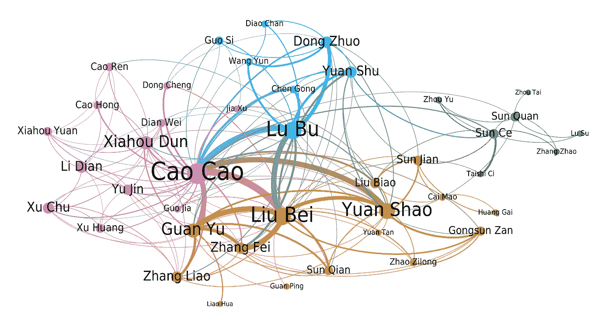
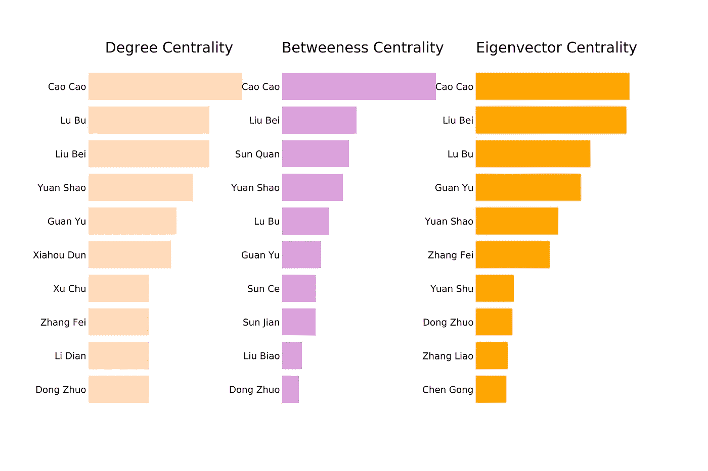
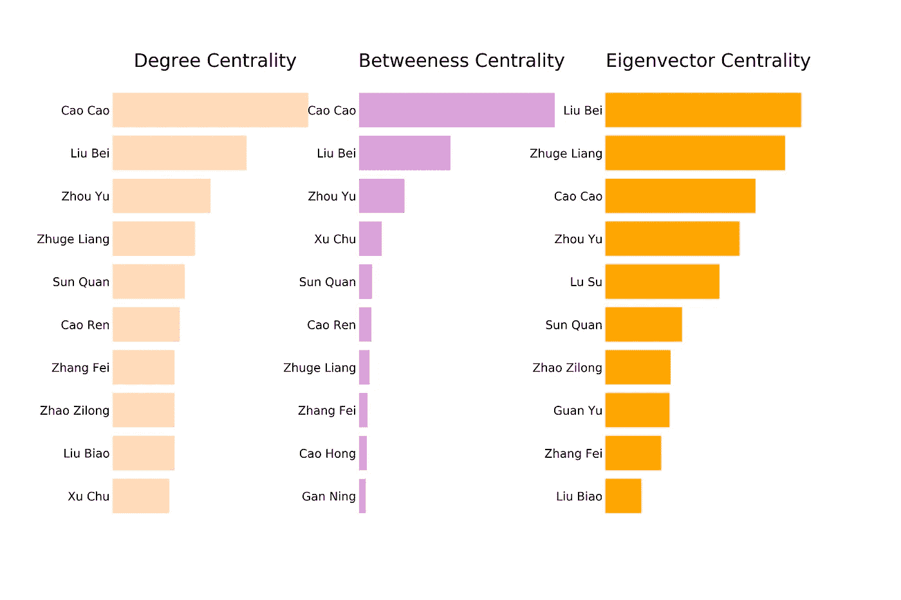
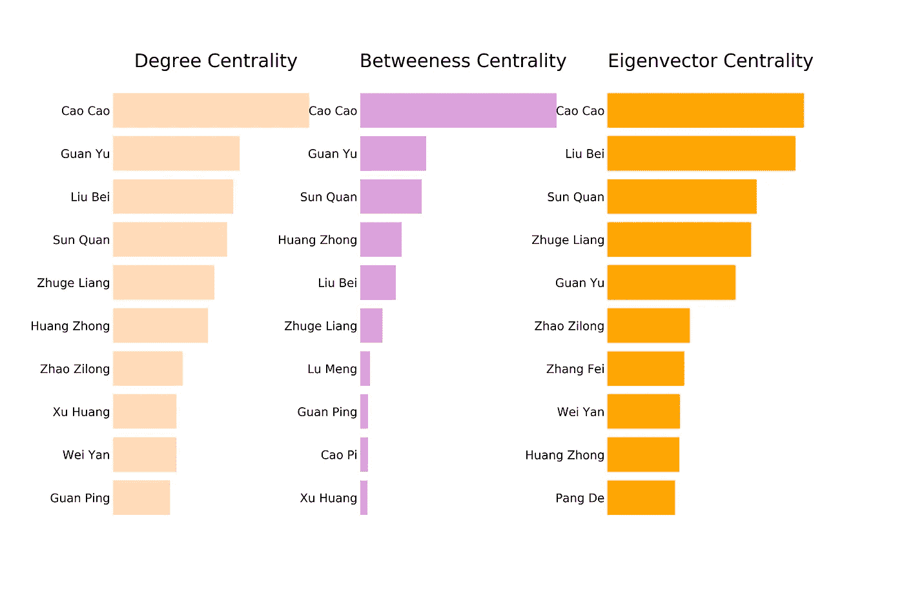
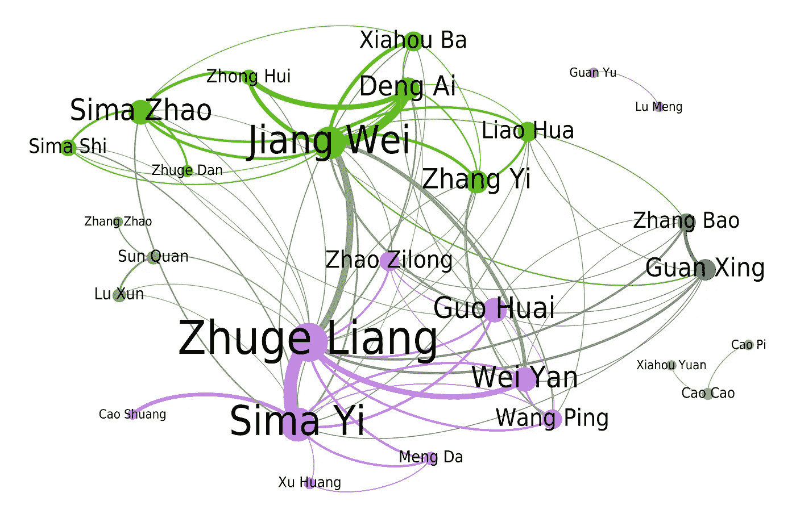
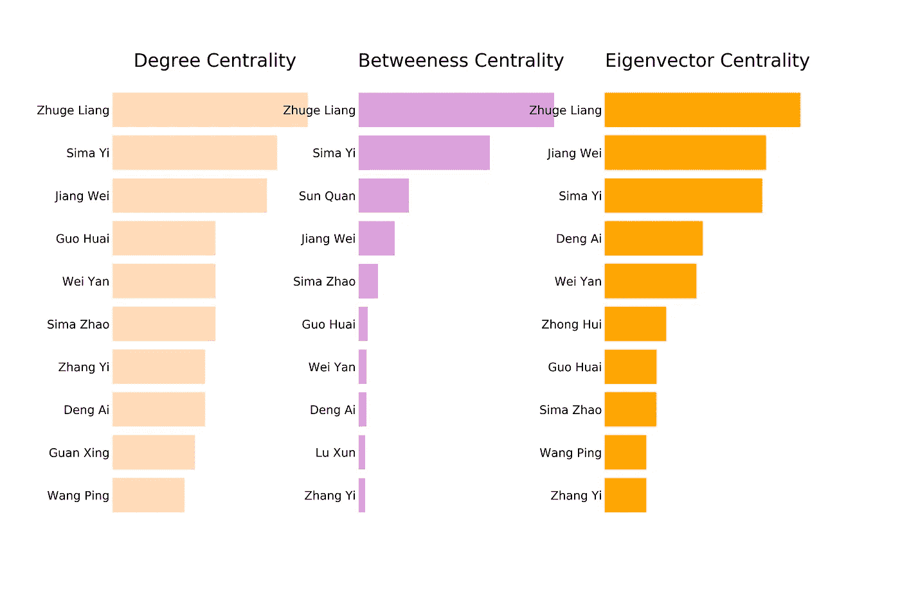
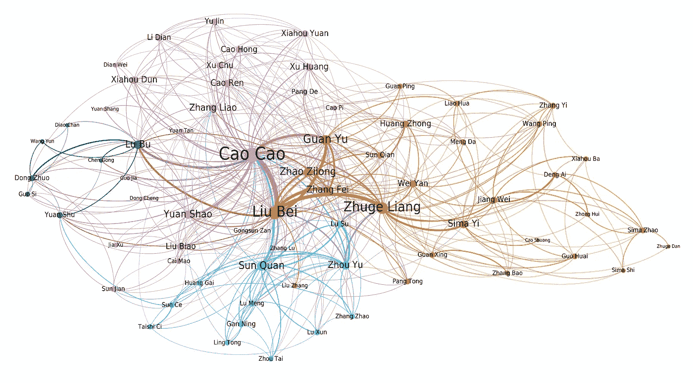

# 三国网络

> 原文：<https://towardsdatascience.com/the-network-of-three-kingdoms-df6f8f8a1263?source=collection_archive---------21----------------------->

*剧透提醒:以下包含关于小说《三国演义》及相关系列的剧透。*

最近，我开始看中国电视剧[三国](https://www.imdb.com/title/tt1514753/)。这部电视剧并不为西方观众所熟知，但我肯定会向任何喜欢历史剧的人推荐它。即使有时表演可能看起来有些夸张，我保证最后，这个系列不会让你失望。

当我第一次听说三国志的时候，我正在寻找《权力的游戏》结束后可以观看的新系列。我找到了几篇比较这两者的文章和帖子，称三国为中国的权力游戏。虽然在艺术基础上比较这两个故事超出了本文的范围，但这两个故事确实有几个共同的特点。两者都有错综复杂的情节，充满了阴谋诡计，辉煌的军事战略和英雄行为。此外，两者都有大量的人物，英雄和反派，他们在几个次要情节中相互作用，最终都与主要情节相连。

看完这部连续剧，我对它所改编的小说产生了兴趣。[三国演义](https://en.wikipedia.org/wiki/Romance_of_the_Three_Kingdoms)是一部 14 世纪的小说，出自中国作家罗贯中之手。与莎士比亚作品对英国文学的影响相比，它是中国最有影响力的文学作品之一。它也很长，英文译本长达 1500 多页。

所有这些都让我想起了安德鲁·贝弗里奇(Andrew Beveridge)和洁珊(Jie Shan)对《权力的游戏》(Game of Thrones)的精彩[社交网络分析。受他们分析的启发，我想分析《三国演义》的社交网络。此外，还有成千上万的人物出现在小说中。我有我最喜欢的，但我想找到谁是真正的主角。这部小说的英文翻译在公共领域，可以下载进行文本分析。](https://networkofthrones.wordpress.com/)

Photo by [Sokoudom Ung](https://unsplash.com/@khunya?utm_source=medium&utm_medium=referral) on [Unsplash](https://unsplash.com?utm_source=medium&utm_medium=referral)

# 分析

我的目标是识别小说中的角色之间的所有互动。利用这些互动，我将创建一个角色的社交网络，它可以用一个图形数学对象来表示。此外，我可以使用这个图表来计算中心性的措施，这将有助于我得出谁是主要人物，非常类似于贝弗里奇和山的分析。

## 相互作用

为了识别角色的交互，首先，我们需要定义什么算交互。在这里，我再次跟踪贝弗里奇和山，计算了当两个人物的名字出现在小说中时，在我们从文本中排除常见的英语单词后，他们之间的相互作用。实际上，我把数字 15，单词 distance，作为一个变量，我尝试了几个值；最后，我得出结论，对于这种分析，15 给出了很好的结果。

## 特性

既然我已经有了交互的定义，我就可以识别出相互交互的角色。但是在我的分析中应该包括哪些角色呢？包括小说的所有 1000+字符是一个选择，但我觉得这样一个大的网络将变得不可读，提供的信息比一个较小的网络少。因此，我找出了小说中 100 个被提及最多的人物。此外，我还列出了在关于这部小说的网站和文章中出现次数最多的人物。此外，我还创建了一个我最喜欢的角色列表。我合并了三个列表，并手动选择了我的最终列表的字符，由 70 个字符组成。

## 部分

正如我已经提到的，这部小说的篇幅很长。有些角色可能在小说的开头很重要，而有些角色可能只在小说的中间，甚至在最后几章才变得重要。为了更好地了解人物的演变，我们应该分章节研究这部小说。这样，读者可以更好地了解人物，并看到他们是如何在故事中发展的。我决定将小说的 120 个章节分成 4 个部分，并为每个部分创建一个网络。每一节由 30 章组成。在某种程度上，每一部分可以被认为是一本书，小说是一系列的 4 本书。

## 网络

文本的分析是用 Python 完成的。我的代码将每个部分的文本作为输入，并产生一个图形对象作为输出。接下来，我使用开放图形工具 [Gephi](https://gephi.org/) 来创建我的网络的美丽可视化。

在每个网络中，字符构成网络的节点。每个角色都和他交往过的角色有联系。每个节点的大小表示该角色与其他角色的链接数量。链接的粗细表示两个字符之间的交互次数，因此交互次数多的字符将被粗链接连接。

此外，该算法识别字符中的社区。图中社区的正式定义超出了本文的范围。一个实用的定义是，一个社区的成员与她的社区的其他成员强烈地互动，但不像与其他社区的成员那样强烈地互动。网络节点的颜色表示角色所属的社区。

我们应该注意到，在小说中，一个群体的成员不一定是盟友或朋友。有时候，角色和敌人的互动比和盟友的互动多，所以被放在敌人社区。

## 中心性

最后，代码计算中心性度量，这有助于根据角色的交互来量化角色的重要性。

*   **度中心性**计算每个角色拥有的链接数量。这是计算角色重要性的最简单的方法
*   **中间中心性**显示了一个字符在多大程度上有助于连接网络中没有直接链接的其他字符。它测量一个字符在连接其他两个字符的最短路径中被找到的次数。
*   **特征向量中心性**通过人物与其他重要人物的互动次数来衡量人物的重要性。因此，一个与*少数重要人物*有许多互动的角色可能会比一个与*许多次要人物* *互动的角色*得到更高的分数。

较高的分数表示所有三个中心性的重要性较高。我们将使用所有三个中心来确定一个角色的重要性，但不是所有的中心都给予相同的权重。我们认为特征向量的中心性更能决定一个字符的重要性。

接下来，对于小说的每个部分，我们展示了网络和中心性度量。我们给出了情节的概要，接着分析了网络和中心性。如果你想更紧密地跟踪故事，看看这个[对所有章节](https://randallwriting.com/three-kingdoms-chapter-summary-1/)的总结。

The network for chapters 1–30

# 第 1–30 章

> 第 1-30 章从刘备、关羽和张飞三兄弟在桃花源的誓言开始。董卓控制了首都，形成了一个反对他的军阀联盟，以袁绍为领袖。最终，将军吕布因为对少女貂蝉的争执杀死了董卓。皇帝落入曹操手中，他迁都于他的省份。另一个军阀袁术宣布自己为皇帝，但他很快被击败。最后，吕布在刘备的帮助下被曹操打败。他很快就被处决了。
> 
> 后来，刘备加入袁绍。曹操与刘备作战，三兄弟一场战斗后失散。关羽，不知道他的兄弟发生了什么事，被说服加入曹操。关羽一听说刘备的下落，就离开了曹操。最终，三兄弟重新团结起来，并加入了赵子龙。袁绍决定进攻曹操，但他的无能使他输掉了战斗和他的庞大军队。

从一开始，我们就看到网络中出现的模式，这些模式在整部小说中反复出现。几个主要角色有最多的联系，他们是塑造网络社区的人。这些通常是争夺统治地位的军阀。次要人物有较少的联系，倾向于在他们的群体内建立强有力的联系，但与其他群体的联系没有那么多。这些都是大军阀的将领和顾问，或者有时候是对故事影响较小的小军阀。

该算法为小说的前 30 章识别 5 个社区。这里要注意的是，社区检测没有人工干预。如上所述，该算法仅基于网络特征的交互来识别社区。让我们仔细看看这些社区。

在第一个群体中(显示为紫色)，曹操与他的顾问和他的将军们聚集在一起。很明显曹操是联系最多，互动最多的人物。这是因为他平等地与他的盟友和敌人互动。同样，其他角色被他吸引是因为他很强大。因此，他们要么想与他结盟分享权力，要么想把他拉下马，为自己夺取权力。

故事的主人公刘备和他的两个结义兄弟关羽、张飞在一起。和他的顾问们一起，他们形成了第二个社区(以橙色显示)。我们还看到，后来加入三兄弟的赵子龙，目前主要与他的第一个主公孙瓒有关。

另一个英雄在第一章中扮演了重要的角色。吕布与这部分故事的大部分主要人物互动强烈。他们和董卓一起组成了貂蝉之争的群体(蓝色部分)。袁术同样被放在群里，主要是因为他和吕布的强互动。

袁绍和其他小军阀组成第四个社区(显示为绿色)。这是参与联盟对抗董卓的军阀集团或者其他不太重要的支线剧情。然而，袁绍是这些章节中最强大的军阀之一，这在网络中可以清楚地看到。

最后一个群体(深绿色部分)是孙氏兄弟群体。在故事的这一点上，孙策和孙权都是重要的人物，但他们在自己的群体之外缺乏重要的联系。我们将在接下来的章节中看到这将如何改变。

Centrality measures for chapters 1–30

接下来，我们来看看中心性度量。不出所料，曹操独霸三大中枢。此外，他异常高的中间性表明他是连接故事各部分的角色。每个社区的军阀可能与其他社区的成员互动不多，但他们都有一个共同的敌人(或盟友)，这就是曹操。

刘备是第二个更有影响力的人物，在所有三个中心性方面得分都很高。虽然在这些章节中他是一个几乎没有领地的领主，但他的特征向量中心性表明他与所有主要人物都有强大的联系。吕布也是如此，他的关系甚至比刘备还多一点，这可以从程度中心性上看出来。另一方面，他的中间中心性相当低，使他的总得分下降。

袁绍排在第四位，与关羽竞争，关羽有更少但更强大的联系。当然，袁绍在这几章之后很快就死了，而关羽在故事的后面会变得更有影响力。这里还应该提到孙权。他的度和特征向量中心性甚至没有进入前 10 名，但他在中间中心性方面排名第三。这意味着他的社区是通过他与其他社区联系在一起的。他显示了潜力，他可以在以后成为一个重要的角色。

总之，从第 1 章到第 30 章，曹操排第一，刘备第三，吕布第四。

The network for chapters 31–60

# 第 31–60 章

> 在第 31-60 章，袁绍对自己的失败感到非常沮丧，不久后就去世了。曹操彻底征服了北方，他的实力大大增长。刘备招募了大学者诸葛亮，他将是下一章的关键人物之一。另一个次要情节是，孙权在他哥哥孙策死后继承了南方。刘表死了，他的省份向曹操投降。
> 
> 诸葛亮出师南国，说服孙权与曹操作战，结成孙刘联盟。果然，孙权心服口服，整装待发，任命周瑜为统帅。赤壁之战的准备工作开始了，而诸葛亮和周瑜正在努力设计巧妙的军事战术来对付敌人。曹操在赤壁大败。关羽虽然下令杀死曹操，却让他过关而逃。
> 
> 曹操战败后，刘备终于可以建立自己的领地，真正的三国时代开始了。曹操让周瑜和刘备反目成仇。周瑜战败，伤重而死。在另一个次要情节中，张鲁在河间地与刘璋对抗。

该算法为第 31-60 章确定了 3 个社区。它们大致对应于互相争斗的三个派别。北有曹操，南有孙权，刘备还在想办法西进。

曹操依然是人脉最广的人物。他的社区(显示为紫色)包含了最多的角色。大部分人物都是他的将领和谋士。他与之战斗的小领主也包括在队伍中。

刘备的群体(橙色部分)由更少但更有影响力的人物组成。其中最重要的是他的结义兄弟关羽和张飞，以及他的将军赵子龙。此外，巡抚刘表也在其中。刘表生前和刘备关系很好，打算封他为省。他们有很多互动，所以算法把他放在了同一个组。

第三个社区是南国(显示为绿色)。尽管孙权是南国之主，但他并不是这个集团中最重要的人物。这个位置要么给周瑜，要么给诸葛亮。这里我们应该注意到，诸葛亮是在刘备的手下，但在这几章中，他大部分时间都在南国，计划赤壁之战。因此，他被归入南国集团。谋士鲁肃在集团内部也起着重要作用。

Centrality measures for chapters 31–60

从中心性来看，曹操仍然是第一名。曹操的中间居中度依然是亚军的两倍多。这意味着不同群体中的人物通过他联系在一起。他仍然是他的敌人和盟友的主要兴趣所在。另一方面，他的特征向量中心性得分不是最好的。反对曹操的主要人物相互之间有很多互动，创造了一个正反馈循环，增强了他们的特征向量中心性。

刘备再次屈居第二。不过这一次，他更接近曹操，他甚至在特征向量中心性方面获得了第一名。他是一个公认的领主，统治着三个王国中的一个，这反映在他的中央集权措施中。

除了顶级人物，最值得注意的是诸葛亮。虽然他在前 30 章中很少被提及，但他在特征向量中心性中排名第二，在其他两个中心性中排名也很好。诸葛亮是一位杰出的学者，所有的主要人物都被他所吸引。在接下来的章节中，他会得到更高的位置。

另一个值得注意的人物是周瑜，他的分数和诸葛亮差不多。他和许多角色都有联系，在这三个中心点上得分都很高。从书的前 30 章来看，他很像吕布。不幸的是，像吕布一样，他在这些章节的结尾失去了生命。

综上所述，还是曹操第一，刘备第二，诸葛亮和周瑜争第三。

The network for chapters 61–90

# 第 61–90 章

> 在第 61-90 章的开头，刘备虽然不情愿，但还是发起了反对刘璋的运动。他赢得了战斗，并将河间地置于自己的控制之下。曹操、刘备和孙权这三个领主现在都拥有重要的领土。三人之间的战斗开始了。首先，当孙权试图入侵魏时，孙权和曹操发生了冲突，但很快就和解了。后来，刘备向自称为魏王的曹操开战。刘备对曹操取得了一些胜利，其中之一是汉中郡。
> 
> 关羽拒绝与南国联姻，这使孙权转而加入曹操而不是刘备。樊城之战，关羽被俘，被孙权处死。关羽死后不久，曹操也死了，留下他的儿子曹丕作为他的继承人，他自称为皇帝。张飞被他的部下暗杀，然后他的部下叛逃到孙权的身边。为了给死去的兄弟报仇，刘备攻打孙权。孙权臣服于曹丕，希望他能帮助对付刘备。刘备继续他的战役，但是被悲伤蒙蔽了双眼，他被打败了。他的健康恶化，他死了。刘备死后，诸葛亮与莽部落发生冲突，并取得了胜利。

该算法识别第 61–90 章的 4 个社区。三大派系几乎保持不变。第一个群体是魏国(显示为紫色)，曹操是其领导人。曹操依然是人脉和互动最多的人物。这里的异类是关羽。关羽效忠的明明是刘备，算法却把他放在曹操的集团里。这是因为，在这几章中，关羽都在不断地与曹操作战。因此，他的大部分交往是与曹操的集团，而不是与他的派系。

第二个群体是刘备领导的蜀国(橙色部分)。显然，刘备是该集团的主要人物，诸葛亮是下一个重要人物。此外，黄忠将军在集团中有着至关重要的地位，主要是因为他在汉中战役中的贡献。

与后 30 章类似，孙权领导吴国，形成了第三个社区(以绿色显示)。除了孙权，梦露将军和谋士鲁肃是这个集团中最重要的人物。

最后，关羽的儿子广兴和张飞的儿子张苞组成了一个共同体(蓝色部分)。这些角色遵循他们自己的支线剧情，彼此之间有很多互动，但不与其他角色互动，因此他们被放在一个独立的社区中。我们还应该注意到，在曹操的派系中出现了一个名叫司马懿的次要人物。司马懿将成为小说最后一部的主要人物。

Centrality measures for chapters 61–90

曹操仍然是无可争议的赢家，在所有三个中心地位中占据首位，即使他在这一节的最后几章中已经死了。与其他人相比，他的居中度仍然非常高。

这一节第二位很难确定。关羽声称他的地位是这个国家的英雄之一。这一次，他在度和中间中心性上得分很高。不幸的是，他的特征向量中心性很低。另一方面，刘备有强大的关系，这使他在特征向量中心性方面得分很高，但他的中间中心性很低。孙权在所有三个中心性方面的得分一直很高，但他的一个竞争对手总是高于他。

此外，我们注意到诸葛亮的分数低于最后一节，他可以声称第三名。这将在小说的最后部分发生巨大变化。

综上所述，曹操仍然是最重要的人物，而刘备、孙权、关羽正在争夺第二的位置。

The network for chapters 91–120

# 第 91–120 章

> 在最后 30 章中，诸葛亮领导了几次反对魏的战役，在那里他反对杰出的司马懿。在第一场战役的开始，诸葛亮会见了他的弟子姜维，他将在最后几章中扮演主要角色。诸葛亮和司马懿都显示了他们敏锐的头脑，能够赢得决定性的胜利。由于他们都是非常优秀的战略家，蜀和魏之间的战争仍然是相持不下。此外，赵子龙、张苞和关兴的死也发生在这些战役中。
> 
> 诸葛亮为没能打败司马懿而感到心力交瘁。他的健康恶化，他去世了，把他所有的知识都留给了姜维。姜维继续讨伐魏。在魏国方面，皇帝曹睿去世，最后司马懿找到机会要求国家，这是通过他的儿子司马师和司马昭。在南国，孙权死了，他的儿子孙良继位。
> 
> 魏健仍在领导反对魏的运动，但另一个伟大的将军，名叫邓艾，能够阻止他。最终司马昭发动反击，蜀国向魏国投降，结束了汉朝的统治。北方和河间地区现在统一了，司马昭的儿子司马燕建立了金朝。几年后，晋国终于入侵了吴国，打败了它的末代皇帝孙皓。金朝征服了所有王国，结束了三国时代。

网络在这一部分看起来有所不同。除了诸葛亮，所有以前的主要人物都死了。以前的社区已经被新的社区取代了。该算法识别网络中的 6 个社区，但是只有两个主要社区。此外，这些社区的形成方式更多地与事件的时间顺序有关，而不是人物的忠诚。

第一个群落(紫色显示)是诸葛亮与司马懿的战斗，发生在这一节的前半段。两个角色属于同一个社区，即使他们是敌人，以及双方的将军。

第二个社区(显示为绿色)是姜维和司马昭之间的战斗，发生在该节的后半部分。参加这些活动的双方将军也加入了他们的行列。

孙权也有自己的社区(橙色部分)。在这一段中，南国的作用不太显著，所以孙权的社区比前面几段要小得多。他和将军张昭、鲁迅归为一类。

此外，网络中还有另外三个小社区。光兴和张宝有他们的二人组(暗绿色显示)，像前 30 章一样。关羽和曹操在这几章中被提及的次数足够多，以至于出现在网络中，但由于联系有限，他们形成了自己孤立的社区。关羽与梦露(红色)在一起，曹操与曹丕和夏侯渊(蓝色)在一起。

Centrality measures for chapters 91–120

诸葛亮是最后几章最重要的人物。他在所有三个中心性方面都名列第一，与第二名有显著差异。他是旧角色和本节出现的新角色之间的纽带。

司马懿和姜维在争夺第二名。他们都是在前几章中没有出现的角色，但在这一节中，他们都在首要位置。最后，司马懿名列前茅，因为他的度和介数中心性远远好于姜维，而他们的特征向量中心性非常接近。

魏延，邓艾等人，都是远低于前三的。这表明，与其他部分不同，最后一部分只有三个主要人物，其余都是次要人物。三国大英雄时代已经结束。

The network of the full text

# 结论

在我们分析《三国演义》的四个章节时，我们看到了人物的兴衰。我们看到一个版块的英雄几乎没有出现在其他版块中，我们看到早期版块中互动最少的角色成为了后期版块中最有影响力的角色。这是小说的主题之一。野心引导人们去追求权力，但是太多的权力使人们盲目并导致他们的堕落。

此外，随着情节的变化，网络的社区也在不断变化。大多数情况下，角色会和他们的主人在一起，但有时会和他们的敌人在一起，因为他们在战斗中有很多互动。最终，社区会看起来完全不同，因为旧的领主和英雄已经被新的取代。这是小说的另一个主题。历史的永恒循环以新角色的出现而重演。这可以通过分析小说的社交网络来看出，而不需要对情节有更多肤浅的了解。

最大的问题依然存在；谁是这部小说最有影响力的人物？看全文的网络和中心性，就清楚了，是曹操。曹操是我在小说中遇到的最聪明、最狡猾、最会骗人的小人之一。纵观他在整部小说中的演变，很明显他会是最有影响力的角色。

刘备位居第二，但他拥有最重要的关系，这从他的特征向量中心性可以明显看出。仁主没有小人厉害，但是他有厉害的朋友。

诸葛亮位居第三。尽管他有较少的联系和重要的互动，他的中间中心性是第二好的。这意味着小说中的许多人物都是通过他联系在一起的。还有，他把小说前 3/4 的老英雄和小说后 1/4 的重要人物联系起来，像司马懿，姜维。

Centrality measures of the full text

关羽第四。他是小说中伟大的战士英雄。尽管他的中间中心性很低，但我们可以从他的特征向量中心性看出，他有强大的联系。

三国之主孙权第五。这也反映了王国的重要性。曹操领导的魏和刘备领导的蜀是最重要的，而孙权领导的吴是最不重要的。当然，这是指它们在小说中的重要性，而不是它们实际的军事或地缘政治重要性。

其他伟大的英雄，如吕布、张飞和赵子龙被放置在下一个位置。这里要注意的是，曹操手下的大将和谋士，没有一个进入前 10 名的。

这是史诗小说的另一个主题。恶棍可能是全能的，但没有值得的盟友。另一方面，英雄会被好的一面吸引。几个好角色的合力，最终战胜了反派的力量。

*关于本次分析中用到的代码，请看一下* [*这篇文章*](/network-analysis-of-the-romance-of-three-kingdoms-5b1c1b84601d) *。*