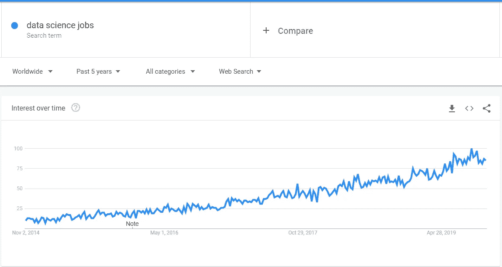
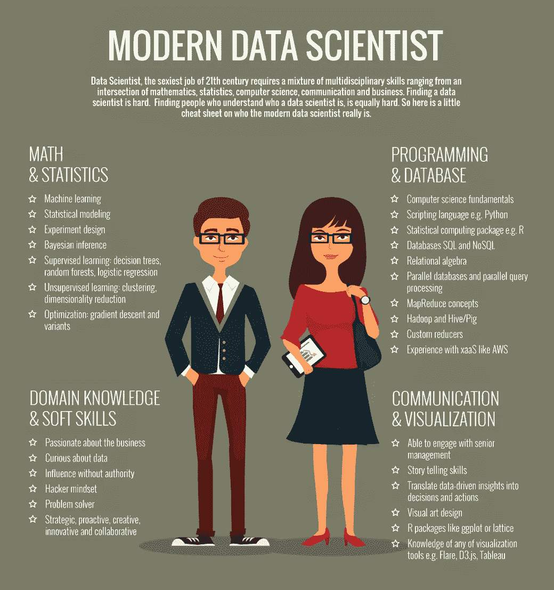
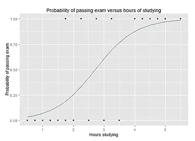
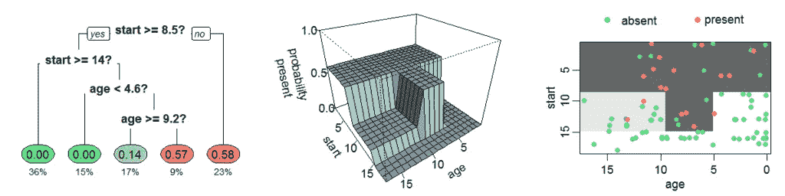
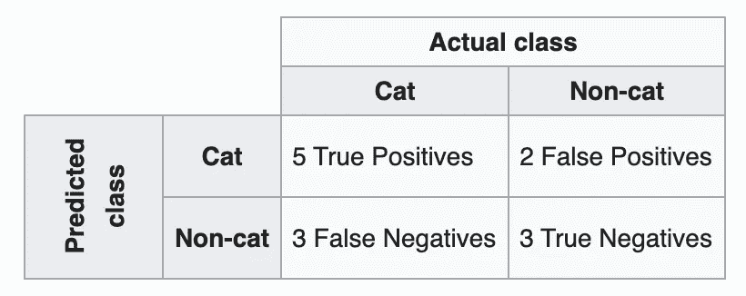
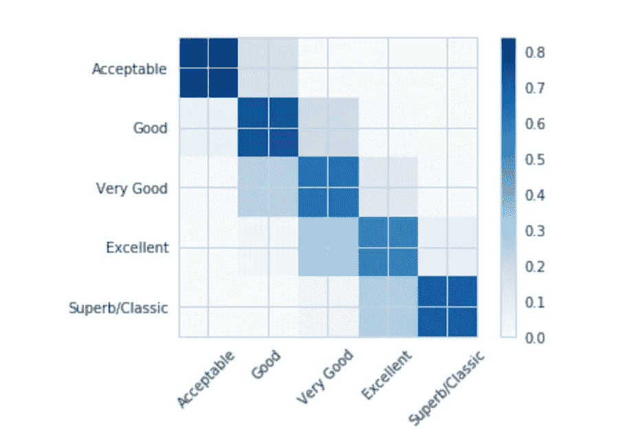

# 新数据科学家术语表

> 原文：<https://towardsdatascience.com/the-new-data-scientist-glossary-4a2c14bf550?source=collection_archive---------24----------------------->

## 数据科学术语和术语的高级解释。

> 我最近做了一个学习数据科学的网站:[https://www.dscrashcourse.com/](https://www.dscrashcourse.com/)。该网站是这篇文章的后续，花了更多的时间深入研究这里探讨的一些算法和概念。

当我第一次开始这个领域的研究时，我对用来描述同一件事情的流行词和术语感到非常困惑。随着数据科学越来越受欢迎，这些术语变得更加模糊和混乱。

Interest in the phrase “data science jobs” increased almost 5 times since 2014 (Google Trends)

我整理了一个小词汇表，那会对我有所帮助。由于这些概念中的大多数本身就很复杂，所以我将只在非常高的层次上描述它们。目标是高层次的定义将提供足够的背景或激发足够的兴趣来保证进一步的阅读。

**我还为 NLP 术语创建了一个单独的词汇表。** [**你可以在这里阅读。**](https://medium.com/learn-nlp/nlp-glossary-for-beginners-c3093529ee4)

# 基础知识

## 数据科学

数据科学是一个多学科领域，结合了统计学、计算机科学和商业智能，从数据中提取有意义的信息。

ah, the unicorn data scientist

## 机器学习

机器学习是一种通过寻找和应用从以前的观察中学习到的模式来构建计算机系统的方法。

## 模型

在机器学习的背景下，模型是使用一组参数(通过训练过程确定)来为新的观察结果生成推理的数学表达式。

## 特征/协变量/解释变量/预测因子/独立变量

这些都是引用传递给模型的变量来接收推理结果的不同方式。

## 目标变量/因变量/响应变量

这些都是引用模型输出的不同方式。

## 超参数

其值在训练过程之前设置的参数。它们与其他参数的区别在于它们不受训练数据的影响(见下文)。例如:学习率。

## 训练集/训练数据

用于开发模型(即确定模型参数)的数据。

## 验证集/验证数据

从模型训练过程中保留的数据，但用于为超参数调整提供模型的无偏评估。

## 测试集/测试数据

训练和验证过程中保留的数据，用于在后续观察中提供模型性能的真实评估。

# 一般概念

## 模型部署

模型部署是将机器学习模型与生产环境相集成的过程，通常是为了使推理可用于其他业务系统。

## 特征工程

在训练阶段之前应用于原始输入变量的一系列变换步骤。

## 过度拟合

过度拟合用于描述与训练数据“拟合得太好”的模型。这些模型不好，因为它们不能很好地概括。

## 欠拟合

欠拟合用于描述从数据集中学习太少的模型，这导致对底层关系的简单化理解。

## 监督学习

当我们有一个明确定义的输入和输出时，我们可以使用一个*监督学习*算法(想想线性回归，支持向量机)根据先前的观察将输入映射到输出。

## 无监督学习

当我们有明确定义的输入，但没有明确定义的输出时，我们需要依靠*无监督学习*算法(如聚类)从我们的数据集得出推断。

## 半监督学习

在半监督学习中，我们给我们的一些观察结果贴上标签*。经典的半监督学习方法是在标记的数据上训练模型，使用该模型来推断剩余的缺失标签，将有把握的预测转换为确定的标签，在新标签上重新训练模型，并重复直到所有数据都被标记。*

## 回归

回归模型解释/预测自变量和一个*连续*因变量之间的关系。模拟房价将是一个回归问题。

## 分类

分类模型解释/预测自变量和*分类*因变量之间的关系。从图片中给动物分类是一个分类问题。

## 使聚集

聚类是一组无监督的学习技术，用于根据每个组内的相似性和组间的不相似性对数据点进行分组。

## 自然语言处理

NLP 是专注于人类语言的机器学习任务领域。这包括书面语和口语。

## 计算机视觉

计算机视觉是专注于图像识别的机器学习任务的领域。

## 特征空间

由模型特征构建的 *n* 维空间。

# 算法

> 在计算或其它解决问题的操作中，尤指计算机所遵循的过程或一套规则。
> 
> -牛津词典定义

## 神经网络

神经网络(有时也称为人工神经网络)是一类类似于🧠.的机器学习模型

**递归神经网络/RNN:** 递归神经网络是神经网络的一个子类，通常用于处理序列数据。

**卷积神经网络/CNN:**CNN 是神经网络的一个子类，通常用于处理图像等空间数据。

## 深度学习

深度学习是使用多层神经网络的机器学习领域。

## 线性回归

线性回归用于模拟连续标量响应变量和至少一个解释变量之间的*线性*关系。在其他用例中，线性回归可用于预测货币估值。

source: Wikipedia

## 逻辑回归

逻辑回归用于模拟二元响应变量和至少一个解释变量之间的*概率*关系。逻辑回归模型的输出是*对数比值，*，可以对其进行转换以获得概率。逻辑回归可用于预测其他用例中客户流失的可能性。

source: Wikipedia

## 支持向量机(SVM)

支持向量机是一种二元分类器，用于在特征空间中寻找最佳超平面来分离这两类。新的观察值根据它们属于超平面的哪一侧来分类。

## 决策图表

决策树将特征空间分成不同的子集。新的观察结果根据它们所属的子集进行分类。

source: Wikipedia

## 集成建模

集成建模是聚合多个模型以进行单一预测的过程。成功集成背后的关键是选择使用不同算法的不同模型。使用多种模型选择预测有几种方法，最简单的是:

*   取最常见的预测值
*   对每个模型的分数进行平均/加权，并根据总分数预测结果

# 模型开发工具

## 开源代码库

GitHub 是一个用于软件开发的网络平台。它提供了版本控制和其他协作特性，比如任务管理和代码审查。

## 码头工人

Dockers 用于部署应用程序，包括机器学习模型。

# Python 库

毫无疑问，Python 是最受数据科学家欢迎的编程语言。

## NumPy

`NumPy`是一个数值计算库，用于结构化和操作数据。它是许多其他开源数据科学库的构建块。

## 熊猫

`pandas`使读取、导出和处理关系数据变得容易。核心的`pandas`数据结构(dataframes)将数据组织成表格格式，使得执行索引、过滤、聚集和分组操作变得容易。

## Scikit-Learn/sklearn

`sklearn`是一个用于数据分析、特征工程和开发机器学习模型的综合库。

## 张量流

TensorFlow 是谷歌大脑团队开发的机器学习框架。TensorFlow 的主要用途是开发和生产深度学习模型。

## 克拉斯

`Keras`是用 Python 写的深度学习库。它是一个高级 API，可以在几个深度学习框架之上使用，包括 TensorFlow。

## PyTorch

PyTorch 是由脸书人工智能研究小组开发的机器学习库。它也主要用于开发深度学习模型。

# 韵律学

这些是评估模型性能的一些常用指标。当交流模型性能时，除了指标本身，我们还需要指定*我们从哪个数据集*获得这些指标。95%的训练准确率和 95%的测试准确率是不一样的！

## 二元分类的度量

我们通常对一个类的存在比对另一个类的存在更感兴趣。例如，我们更关心客户是否“欺诈”，而不是他们是否欺诈。在定义以下术语时，让我们坚持这个例子。

**假阳性/类型 1 错误(FP):** 这是我们*误将*分类为我们感兴趣的类别的观察结果(例如:一个非欺诈性客户被误分类为欺诈性客户)。

**假阴性/2 型错误(FN):** 这是我们*误将*归类为*而不是*的观察结果，是我们感兴趣的类别(例如:一个欺诈客户被误归类为非欺诈客户)。

**真阳性(TP):** 这是一个我们*正确分类的欺诈客户*

**真阴性(TN):** 这是我们*正确分类的非欺诈客户*

**精度:**精度按`TP/(TP+FP)`计算，其中 TP 是真阳性的数量，FP 是假阳性的数量

**召回:**召回计算为`TP/(TP + FN)` ，其中 TP 是真阳性的数量，FN 是假阴性的数量

**F1-Score:** 从上面我们可以看到，针对精度的优化意味着减少误报的数量，而针对召回的优化意味着减少漏报的数量。我们使用 F1 分数来组合这些指标。f1-分数计算为`2 * (precision * recall) / (precision + recall)`

**混淆矩阵:**混淆矩阵是 TP、FP、FN、TN 的可视化表示。

Confusion Matrix as shown on Wikipedia

## 多类分类的度量

用于二进制分类的大多数度量可以用于评估多类场景中每个类的*的性能。如果我们有 3 个类，我们将得到 3 个精度分数。对于每个精度分数，TP 将是我们对该类做出的正确预测的数量，而 FP 将是我们将其他两个类之一错误分类为该类的次数。*

混淆矩阵也可以概括为一个 *n* x *n* 矩阵，其中 *n* 是类的数量。具有行 *i* 和列 *j* 的单元表示被预测为类别*j*的类别 *i* 的数量

Confusion Matrix Visualization from [one of my other articles](/predicting-wine-quality-using-text-reviews-8bddaeb5285d)

**准确率:**正确预测的百分比。当班级规模相当平衡时，这是模型性能的一个很好的表示。

## 回归度量

**均方误差(MSE):** 均方误差对实际值和预测值之差的平方进行平均。这是评估回归模型最常用的指标之一。

**均方根误差(RMSE):** RMSE 是 MSE 的平方根。MSE 通常选择 RMSE，因为它更容易操作(少一个操作)。

**平均绝对误差(MAE):** MAE 是实际值和预测值之间绝对差值的平均值。

**R 平方/决定系数:** R 平方是在数据中发现的可以被模型“解释”的方差百分比的统计度量。

**调整后的 R 平方:**调整后的 R 平方通过惩罚参数个数来调整 R 平方。

# 感谢您的阅读！

如果你喜欢这篇文章，可以看看我关于数据科学、数学和编程的其他文章。请通过 Medium 关注我的最新消息。😃

作为一个业余爱好项目，我还在[www.dscrashcourse.com](http://www.dscrashcourse.com/)建立了一套全面的**免费**数据科学课程和练习题。

如果你想支持我的写作，下次你报名参加 Coursera 课程时，可以考虑使用我的[会员链接](https://click.linksynergy.com/fs-bin/click?id=J2RDo*Rlzkk&offerid=759505.198&type=3&subid=0)。完全公开—我从每一次注册中获得佣金，但不会对您产生额外费用。

再次感谢您的阅读！📕