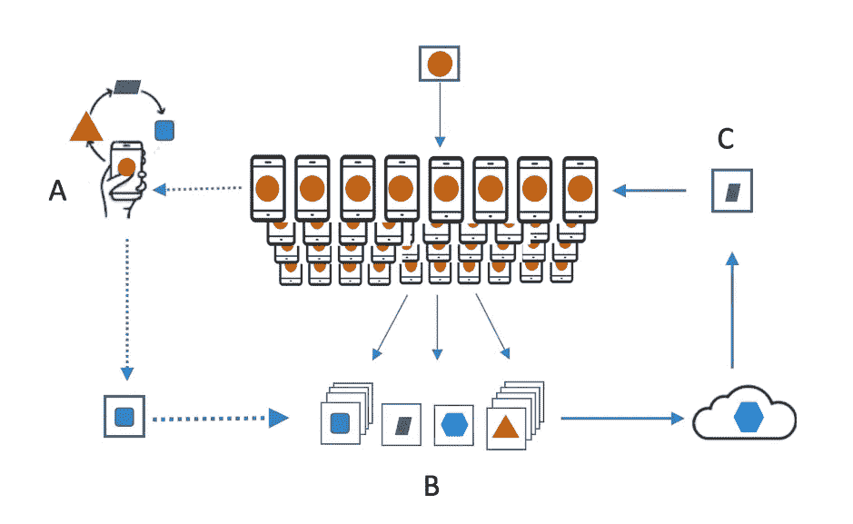
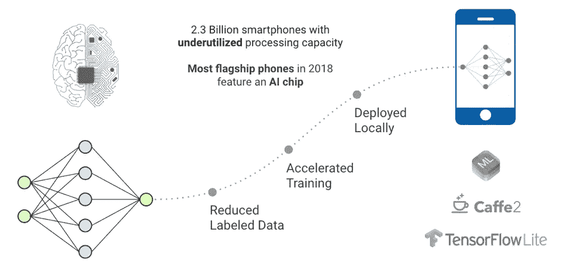

# 人工智能的新曙光:联邦学习

> 原文：<https://towardsdatascience.com/the-new-dawn-of-ai-federated-learning-8ccd9ed7fc3a?source=collection_archive---------6----------------------->

## 民主化和个性化的人工智能，通过设计实现隐私

我们预测联合学习的增长和采用，这是一种新的人工智能(AI)模型开发框架，分布在数百万个移动设备上，提供高度个性化的模型，并且不会损害用户隐私。不直接访问或标记原始用户数据的模型开发、培训和评估。在印度等市场，超个性化和情境推荐将是推动应用采用或电子商务购买的关键，打赌联合学习将在 2019 年发挥关键作用。人工智能世界的新黎明和新希望！

**免责声明**:作者是联合学习初创公司 S20.ai 的投资者和顾问，如果你想知道，S20 代表“软件 2.0”。

新兴的人工智能市场模式由谷歌、亚马逊和微软等科技巨头主导，这些公司提供基于云的人工智能解决方案和 API。这种模式让用户无法控制人工智能产品的使用以及从他们的设备、位置等收集的数据。从长远来看，这种集中化的模式对社会或市场都没有好处，因为它可能导致少数强势参与者的垄断。最终，它将限制小公司甚至大企业对人工智能创新的参与，以及人工智能系统驱动的决策缺乏互操作性和可解释性。幸运的是，随着人工智能的春天在 2019 年出现，我们看到了一个分散式人工智能市场的开始，它诞生于设备上人工智能、区块链和边缘计算/物联网的交汇点。

*Figure 1: The new dawn of AI: a new hope. Photo Credit: Lucasfilm/ Disney*

标准的机器学习模型要求将训练数据集中在一台机器或数据中心。例如，当一家电子商务初创公司希望开发一个模型来了解其消费者购买产品的倾向时，它会根据从其网站或应用程序收集的数据来运行模型。这种数据可以包括在特定产品页面上花费的时间、一起购买的产品、浏览但购买的产品等。通常，在一段时间内，每个用户身上会收集 50 到甚至 1000 个数据点。这些数据被传递并发送到中央数据中心或机器进行计算。

最近，一种新的方法被考虑用于通过用户与移动设备的交互来训练模型:它被称为*联合学习*。联合学习将机器学习过程分布到边缘。它使移动电话能够使用设备上的训练数据并在设备上保存数据来协作学习共享模型。它将进行机器学习的需求与将数据存储在云中的需求分离开来。

# 什么是联合学习？

虽然这种比较可能有些简单化，但计算的历史可能是联合学习的一个很好的代理。在信息技术的早期，我们让大型主机承担大部分计算的重担。最终，我们转向了客户端服务器框架，在这个框架中，计算分布在中央服务器和多个客户端计算机之间。

联合学习架构部署了一个类似的模型。机器学习模型不是在大型集中式机器上进行计算，而是分布在移动设备上进行计算。这种计算模型虽然在理论上是可行的，但在过去是不可行的，因为移动电话的计算能力对于运行任何 ML 模型都是非常有限的。

*Figure 2: A user’s phone personalizes the model locally, based on her usage (A). Many users’ updates are then aggregated (B) to form a consensus change © to the shared model. This process is then repeated*

然而，2018 年中后期发生了一些变化。从三星 S9 或苹果 X 系列开始，未来 3-5 年将有超过 10 亿部配备人工智能芯片和强大计算能力的智能手机上市，许多 ML 机型将能够在这些移动设备上运行。

从功能上来说，作为 FL 计算架构一部分的移动设备下载一个旨在运行在移动设备上的模型。然后，它在手机上本地运行该模型，并通过学习存储在那里的数据来改进它。随后，它将更改总结为一个小的更新，通常包含模型参数和相应的权重。

然后，使用加密通信(例如，同态加密(he ))将模型的更新发送到云或中央服务器。然后，将此更新与其他用户更新进行平均，以改进共享模型。最重要的是，所有的训练数据都保留在用户的设备上，没有单独的更新可识别地存储在云中。

联合学习允许更快地部署和测试更智能的模型，降低延迟和功耗，同时确保隐私。此外，除了提供共享模型的更新之外，您的手机上的改进(本地)模型也可以立即使用，通过您使用手机的方式来提供个性化的体验。

# 什么将推动联合学习的发展？

在未来几年，基于联邦学习和同态加密的边缘建模和计算将取得重大进展。随着未来 3-5 年超过 10 亿部配备人工智能芯片并拥有强大计算能力的智能手机进入市场，许多 ML 模型将能够在这些移动设备上本地运行。与中央计算设施相反，在智能手机的“边缘”分布重型分析和计算将大大减少开发超个性化推荐引擎、电子商务定价引擎等数据产品的时间。企业将采用分布式机器学习模型构建框架，以利用更快的模型部署，并对快速变化的消费者行为做出更快的响应，同时大幅降低成本。

*Figure 3: As a billion plus smartphones being equipped with AI chips and significant computing power get shipped in the next 3–5 years, Federated learning applications will grow*

对于机器学习从业者和爱好者来说，这种范式转变为民主化人工智能提供了一个令人兴奋的机会。它还为采用新工具开辟了新的途径，最重要的是，为解决大规模 ML 问题开辟了新的思路。

没有直接访问或标记原始数据的模型开发、训练和评估在开始时将是具有挑战性的。然而，在印度等新兴市场，超个性化和高度关联的推荐引擎将成为推动应用采用或电子商务购买的关键，我们打赌联合学习将在未来发挥关键作用。我们相信联合学习给用户带来的好处使得应对技术挑战变得值得。

***下一个故事:*** [***印度贫穷地址的影响:一年 100-140 亿美元***](/economic-impact-of-poor-addresses-in-india-10-14-billion-a-year-11cc97cb40fc)

***往期剧情:*** [***AI 对 2019 年的预测***](/ai-predictions-for-2019-610b8de56aad)