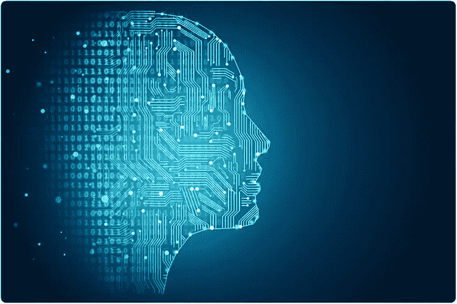
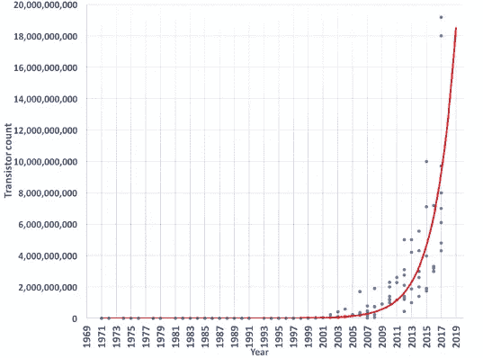

# 新弗兰肯斯坦的怪物:进入人工通用智能时代

> 原文：<https://towardsdatascience.com/the-new-frankensteins-monster-entering-the-age-of-artificial-general-intelligence-df15cb27cd60?source=collection_archive---------28----------------------->

*Credit: Peshkova/Shutterstock.com*

我可以告诉你未来十年 10 万家风投支持的初创企业的商业计划:利用现有的东西，添加人工智能，盈利。希望这次不会有人丢了内裤。

抛开流行文化不谈，人工智能和机器学习的发展已经并将继续极大地改善我们使用的软件，塑造我们的偏好，改变我们与其他人的互动，并扩展我们对宇宙的看法。NPR 在一篇关于机器人如何成为新的太空探险者的文章中说，人们与被送入太空的机器人的关系就像我们过去与宇航员的关系一样，当任务结束时会哭泣，当好奇号自拍时会高兴得跳起来。

这些我们发送到小行星的机器人和我们用来定制新闻和推荐的算法不是我们的朋友，他们也不是人类。[我们在制造工具，而不是同事](https://www.wired.com/story/will-ai-achieve-consciousness-wrong-question/)。在个人电脑普及之前，人类喜欢使用的几乎所有服务都来自另一个人为我们提供的价值，因此可以理解的是，我们提及这些服务的语言没有发生巨大变化。随着我们的机器学习算法和人工智能更多地了解我们，了解我们的偏好，并可以向我们推荐我们最喜欢的东西，我们必须摆脱对这些工具的拟人化观点，因为在今天的人工智能之后，接下来发生的事情很可能是我们在意识层面上与之互动的事情。今天，许多研究人员称之为下一级人工智能。

我们在这个机器学习和人工智能(我从现在开始将它们合称为人工智能)的世界中创造的大部分东西都属于狭义人工智能领域。这意味着我们有一个我们想要解决的特定问题，我们建立了一个可以分析、学习和优化特定领域的人工智能。这种狭隘的人工智能将在未来几十年推动企业的发展，[尽管这些企业不太可能创造许多新的就业机会](https://medium.com/@jeremy.traber.owens/american-labor-is-in-free-fall-without-a-parachute-and-we-think-were-still-safely-in-the-plane-173a30b1b9bd)。将特定的人工智能知识集应用到另一个领域，即使是密切相关的领域，也是一项艰巨的任务，需要几乎从零开始。跨学科工作的最有效的人工智能是我们最喜欢的 Jeopardy-stumping Watson，它现在被用于医学领域，用于分析肿瘤的 MRI 扫描和无数其他可以利用大数据的医学分析。问题是，如果你让沃森去测试一个冒烟的引擎，并找出问题所在:它就是不起作用。从生活的一个领域获取知识，转化它，并在一个前所未见的全新场景中应用它的能力是人类独有的能力。致力于人工通用智能或 AGI 的人们正试图改变这一点。他们想建立一种类似于人类经历的那种有意识思维的东西，但我们为什么要实现这一点，这可能吗？

我们能够，或者说我们是否应该，努力建设这样的 AGI？让我们首先解决“我们能不能”这个问题。从纯计算的角度来看，人脑的精确重建(如果这是我们有意识的机器所需要的)[是可能的，只是时间问题](https://www.amazon.com/dp/B074ZQ62FW/ref=dp-kindle-redirect?_encoding=UTF8&btkr=1)。计算能力方面最有影响力的观点之一是摩尔定律，即计算机的速度和能力每两年翻一番。

Moore’s Law past and projections

一些制造商开始怀疑摩尔定律是否会继续成立，因为我们的晶体管尺寸越来越接近原子水平，在原子水平上，电子开始在我们不希望它们跳跃的时候跳跃。然而火车还没有停下来，因为英特尔最近宣布了他们将于 2019 年发布的[芯片堆叠技术](https://www.wired.com/story/intel-lakefield/)，这将继续这种计算能力的趋势。量子计算也在路上，虽然它的应用不会对所有目的都完美，但对于并行处理来说，它将提供更大的处理能力。

在“我们能不能”这个问题的更哲学的一面，从定义的角度来看，Spark Cognition 的首席执行官 Amir Husain，[这样描述意识](https://singularityhub.com/2019/03/26/what-would-it-mean-for-ai-to-become-conscious/):“正是这种自我意识，这种我独立于其他一切而存在的想法，以及我可以模拟自己…人类的大脑有一个奇妙的模拟器。他们可以在头脑中虚拟地提出一个行动方案，然后看看事情如何发展。将自己作为演员的能力意味着你在对自己的想法进行计算。”通过这一点，我们非常接近 AGI 的发展，因为我们已经运行算法来进行这种思考，尽管通常没有机器本身的参与。如果我们为人工智能设定一个目标来提高它自己的计算能力和速度，这难道不符合侯赛因的定义吗？许多人不同意这个定义包含了所有的意识体验，我们稍后会讲到。

“我们是否应该”的问题要复杂得多，但很多问题将归结为商业(或军事)的增长和发展。如果它可以帮助一个企业做得更多、更好、更快，或者可以拯救人类的生命，它就有可能到来。尽管有很多理由认为，在 AGI 问题上，我们应该划清界限。然而，自治的 AGI 实体可能会变得(考虑到他们可以学习和适应的速度，这是相当自治的)，[他们不会经历我们有意识的人类所共有的脆弱或死亡](https://www.wired.com/story/will-ai-achieve-consciousness-wrong-question/)。死亡是所有人类最大的均衡器。如果 AGI 能够在一系列服务器上保存数据，并且当前系统被卡车或“蓝屏”击中，其记忆和优化的过程可以被带回一个新的物质实体(如果它真的想要一个的话)。它将 AGI 从弱势群体的世界中移除，让他们成为事实上不朽的存在。

无论我们是否应该朝着 AGI 的方向努力，[一群不同的研究人员和实践者——计算机科学家、工程师、动物学家和社会科学家等——正聚集在一起发展“机器行为”领域……该领域不仅仅将机器人视为人造物品，而是一类新的社会行为者](https://www.theatlantic.com/magazine/archive/2019/04/robots-human-relationships/583204/)。即使我们不都同意我们会到达那里，这个问题至少有了解决的开端。那么这些有意识的存在到底有多大的可能性呢？有意识的机器会不会到来，更多的是人们对人类的信念，而不是对 AI 方向的信念。看看你自己的信念，我们是什么？人类是什么？

我会列出几个选项供你考虑:机器、动物或人类。我们是机器，纯粹的机械生命，仅仅是我们每天产生和响应的各种化学反应、信息素和神经元相互作用的产物吗？或者，我们是动物，不仅仅是一台机器，而是一种具有生命力的东西，因此科学家们无法理解它(尽管不能说它将永远如此)。如果我们是动物，机械的东西能获得生命的火花吗？或者，我们是人类吗，这里我指的是超越我们智人形态描述的区别。我们不仅仅是动物世界的顶级掠食者吗？我们对自己的看法与对他人的看法是否不同？这些观点是我们意识的体现吗？除了人类之外，它对任何事物都是不可知的吗？没有正确的答案，但一个人对人类的总体看法与他是否认为我们可以实现 AGI 有很大关系(机器可以，动物可能，人类不太可能)。

一个有意识的机器会是什么样子，如果我们看到它，我们会知道吗？许多人将意识视为二元选项，要么一个有，要么一个没有，但意识可能实际上存在于一个连续体上。如何定义这个连续体的界限仍有待讨论，但在这个滑动尺度上有几点需要考虑。在低端，镜像测试的通过可以作为意识的基本水平。如果你把一个有生命的实体放在一面镜子前面，把镜子拿走，在那个实体的(等价的)前额上放一个点，然后把镜子放回去，这个实体会试图去掉这个点吗？这样做意味着存在一个持续的观点，即实体所拥有的“自我”,它认识到在第一次和第二次迭代之间，在镜子中看到的自己已经发生了变化。这个实验有一些问题(定义‘生活’；视觉要求；能够去除圆点等的运动。)，但至少给了我们一个视角，除了人类之外，什么样的生物可能对它们有一定程度的意识。意识阶梯上的一个层次可能是语言的使用。有些人认为，在我们给它一个词之前，世界上没有任何东西实际上是存在的，因此超出我们自己对现实的解释的其他人可以分享那东西是什么。意识本身是一个共享的实体。可能直到你有了语言来决定自我和他人，就没有这种区别了。在阶梯的更高处，我们有元认知，或思考思考的能力。冥想的人经常这样做，注意到他们自己的思想经过，但即使不冥想的人也有这种能力，注意到他们何时生气或悲伤，或在他们分析另一个人的统计证据时。如果你愿意更多地展示你的意识肌肉，你也应该看看约翰·塞尔的中文室思维实验(通常用来反驳 AGI 的可能性)，该实验探索了知道和理解之间的差异，后者迄今为止一直是人类的唯一领域。

随着人们看到人工智能变得越来越聪明，围绕 AGI 的对话已经加速。理论上，这意味着我们将达到人工智能接近人类智能的程度，当人工智能达到人类智能水平时，它很可能也是有意识的，或者就像我们一样。这是一个相当大的跳跃，因为我们不知道如何开始制作 AGI，这条路可能只是多余的。我们社会的道路可能根本不需要人工智能。我们为更好的人工智能所做的许多工作都是为了实现超级智能，知道并有能力知道远远超过我们在当前状态下可能想象的事情。有意识、有智慧的生物并不是达到信息顶峰的唯一选择，正如尤瓦尔·赫拉利在《德乌斯人》中所说，“可能有几种通往超级智慧的替代方式，其中只有一些通过了意识的限制。几百万年来，有机进化一直沿着有意识的路线缓慢前行。无机计算机的进化可能会完全绕过这些狭窄的海峡，为超级智能开辟一条不同的、更快的道路。”

对于世界上我们需要解决的许多问题，对于我们想要进行的许多探索，虽然卓越的智力是一项要求，但意识不是。艾未未能否毕业进入 AGI，最终可能并不重要。人工智能的发展导致了智能和意识之间的分离。以前，我们依靠人类来引领我们走向一个更加稳定、更加先进的社会，而现在，很多工作都转移到了我们自己创造的东西上，这些东西超出了我们的能力范围，但我们已经相信它们会比我们自己做得更好。

很少有人研究这个问题，试图解决意识的问题，新的意识形式会是什么样子，以及我们如何确保我们创造的东西不会让人类望尘莫及。80000hours.org(一个基于一个人一生中平均工作时间的名字)，不断更新他们的问题档案，并对社会中需要解决的各种问题的规模、忽视程度和可解决性进行评级。人工智能发展的积极塑造被[列为当前我们社会中最紧迫的问题之一](https://80000hours.org/problem-profiles/positively-shaping-artificial-intelligence/):事情变得真正失控的风险很高，这是一个目前非常被忽视的问题。

80000 Hours Assessment of the Positive Development of AI

谢天谢地，这意味着个人在这个领域的努力可以产生巨大的影响。如果这是一个让你振奋的领域，我敦促你考虑一下你能做些什么来促成这次对话和发展。拜伦·里斯的《第四时代》是一个很好的起点，它告诉了机器、动物和人类上面的问题。这会让你开始问一些你不知道是这场辩论的一部分的问题。[、尤瓦尔·赫拉利](https://www.amazon.com/Homo-Deus-Brief-History-Tomorrow-ebook/dp/B01BBQ33VE/ref=sr_1_1?crid=2HV6VX6YUN4P6&keywords=homo+deus&qid=1562860168&s=gateway&sprefix=homo+d%2Caps%2C139&sr=8-1)的《德乌斯人》是一个很好的下一步，或者是一些更幽默和插图的东西，[蒂姆·厄本关于超级智能的两篇文章](https://waitbutwhy.com/2015/01/artificial-intelligence-revolution-1.html)。

随着人工智能做出比我们更明智的决定，考虑到它拥有大量人类无法想象的数据，我们将把什么样的控制权交给它？它将仍然由我们来管理，还是由我们来创造全新的东西？如果我们不小心，它可能会失去控制，我们需要更多知情的人问正确的问题来塑造这个未来。