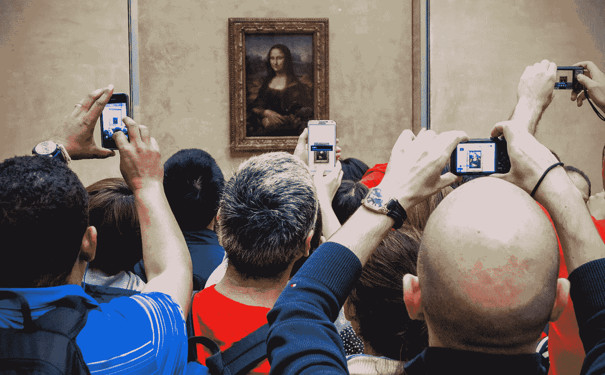

# 新摄影——是什么？

> 原文：<https://towardsdatascience.com/the-new-photography-what-is-it-268582e57a86?source=collection_archive---------26----------------------->

Image by [Thomas Staub](https://pixabay.com/users/thomasstaub-551392) from [Pixabay](https://pixabay.com/photos/paris-louvre-art-monalisa-tourism-1325512/). Mona Lisa speaks! See #14 below.

他关于摄影和成像的三集系列研究了许多最近的技术和社会发展。在[第一部分](https://medium.com/@ted.tuescher/photographys-brave-new-world-241833e2c947)中，我们回顾了摄影发明以来的 190 年历史，记录了媒体的快速变化，从电影到数字的突然转变以及智能手机的兴起。

在这一部分(第 2 部分)中，我们将调查一些最近的技术发展，努力为理解新功能构建一个更大的环境，并考虑下一步的发展。

术语*计算机视觉*和*计算摄影*经常互换使用。然而，计算机视觉是一个更广泛的学科，涵盖了一系列数字捕捉和处理技术。它指的是计算机理解图像的能力，通常与人类的理解方式相似。通常这是通过表征内容、颜色、色调值、形状或边缘数据来实现的。但是它也可以应用于其他元数据，例如嵌入的位置或时间数据。当分析非常大的图像集时，获得模式和洞察力，并随后应用于组织、验证甚至修改图像。

更具体地说，计算摄影是一门学科，涉及使用算法而不是光学方法对图像进行计算、分析和处理。我们不会为这两个学科之间的区别烦恼，而是考虑更大的计算机视觉流派。

# 眼睛机器人

这不一定是一个新领域。计算机视觉的最初例子已经伴随我们有一段时间了，比如:

*   光学字符识别(OCR)支持条形码和 QR 码扫描，并将基于文本的打印输出转换为机器可读文档。
*   高动态范围(HDR)成像，将多幅图像组合起来描绘高对比度设置，通常超出相机传感器甚至人眼的范围。最近的更新极大地提高了质量，帮助 HDR 摆脱了早期忧郁和超现实的“哈利波特”外观。
*   全景图像，其中多个图像对齐并缝合在一起，图像之间的接缝自动混合。
*   上下文图像替换，Adobe 软件中杜撰的内容感知填充，使用周围的数据替换图像的部分。一种常见的用法是从照片中移除电源线。Adobe 在 2010 年发布了这一功能，但最近，随着基于其人工智能平台的更复杂算法的应用，该功能在质量和功能方面都有了显著改善。

我们已经看到了计算机视觉的大量新发展，涵盖了摄影和视频的一系列应用。最近的例子包括:

1.  将不断改进的硬件和强大的软件交给严肃的爱好者，使安德鲁·麦卡锡能够使用各种技术(包括将瓷砖拼接在一起以降低传感器噪音)将 50，000 张图像组合成一张高清的月球图像。
2.  同样，艾伦·弗里德曼通过组合成千上万张图像来平均处理地球大气层引起的失真，创造了令人难以置信的太阳高清[图像。](https://www.thisiscolossal.com/2013/02/alan-friedmans-astonishing-hd-photographs-of-the-sun/)
3.  [Light 的 L16](https://light.co/camera) 相机在相当于智能手机的外形中提供了令人印象深刻的质量、文件大小和创意空间。使用 16 个传感器，相机立即评估一个场景，产生 10 多个图像，这些图像组合成一个惊人的最终图像，与许多单反相机相同或更好，但价格更低。
4.  艺术家 [Pep Ventosa](https://www.pepventosa.com/gallery.html?folio=the%20photographs&sortNumber=&gallery=The%20Collective%20Snapshot&skipno=0&loadedNumber=0) 和 [Corinne Vionnett](https://www.danzigergallery.com/artists/corinne-vionnet?view=slider#16) 各自收集了网络图像，并将它们组合成熟悉的地标的新表现。Vionnet 注意到游客如何从相似的有利位置重新拍摄这些地标，加强视觉模式，并为现有的集体指数添加微妙的变化。通过社交网络访问来自世界各地的美丽图像产生了意想不到的巨大影响，如知名旅游目的地的过度拥挤和环境问题。
5.  Remove.bg，一个为 Photoshop 设计的插件，[只需轻轻一点就能从一张图片中移除背景](https://www.remove.bg/)。当然，这已经手动执行了多年，但当这个插件的速度和质量与下一步描述的重新照明技术相结合时，将人和物体放入全新的图像环境将变得快速而容易(只要视角相似)。
6.  照明在定义图像时起着关键作用。谷歌的一个团队已经发现了一种方法，使用单幅图像理解面部地形，再加上一幅单独的源图像来模拟光照风格，从而为一幅肖像重新照明。
7.  谷歌对 ARCore 进行了一次令人印象深刻的更新，在其光照估计 API 中启用了[环境 HDR](https://developers.googleblog.com/2019/05/ARCore-IO19.html) 。通过对单个图像应用机器学习，可以理解阴影、高光和反射，因此可以重新照亮场景，这是一种开发 AR 的有用技术。
8.  另一项名为[全球定位](https://ai.googleblog.com/2019/02/using-global-localization-to-improve.html)的谷歌技术将实现更精确的定位和方向。它利用了谷歌街景中的全景图组合，谷歌街景是一种视觉定位服务，可以实时将你主动智能手机摄像头拍摄的图像与已知位置的图像进行比较。机器学习用于过滤掉非永久性的结构，以便更好地了解你更精确的位置。
9.  Airbnb 已经使用机器学习来识别和[调整图像的顺序](https://youtu.be/tPb2u9kwh2w)来呈现他们的住处，以便走廊或浴室图像不会首先出现。
10.  认识到制作多个版本的视频以适应不同显示器(笔记本电脑、电视、一系列智能手机)的挑战，Adobe 将发布[人工智能驱动的视频裁剪](https://www.adobe.com/sensei/ai-innovations.html#smooth-operator-spotlight)以优化每个纵横比的视频，以便重要元素保留在帧中。
11.  Adobe 正在应用他们的人工智能平台来简化静态图像视频制作中使用的技术，使静态图像具有变化的[维度质量](https://www.youtube.com/watch?v=dM-lX9c3Pqw)，其中项目滑过彼此，就像观众的眼睛改变位置一样，类似于视频镜头。
12.  同样，Adobe 的人工智能平台很快将启用[视频遮罩](https://www.youtube.com/watch?v=GPVx4Tg9EZ0)，这是一种快速更新，对于每秒 24 帧的视频来说，这种更新对于单个图像来说非常耗时，并且非常耗费劳动力。
13.  Adobe After Effects 中的[视频内容感知填充](https://theblog.adobe.com/explore-new-content-aware-fill-in-after-effects/)将进一步丰富这一主题，支持从帧中移除所选项目。一旦一个对象被选中，它的替换将通过连续的视频帧被跟踪。
14.  三星人工智能中心的机器学习研究人员开发了一种技术，通过建立面部标志为人脸添加逼真的动作。这并不一定是新的，但这种方法通过使用一张*单幅*图像取得了显著的效果，并通过额外的参考图像进行了改进。
15.  这种能力对人类来说很容易，但对机器来说很难，谷歌在计算机生成的对移动中的人的[深度感知](http://ai.googleblog.com/2019/05/moving-camera-moving-people-deep.html)方面取得了良好的进展，这将是一项强大的使能技术。
16.  华盛顿大学艾伦学院图形和图像实验室的研究人员开发了一种技术，可以对视频中的假唱进行整形，以匹配特定的音轨。他们分析了奥巴马总统的口型，并将其应用到他的另一个视频中。
17.  同样，加州大学伯克利分校的一个团队已经能够使用姿势检测将舞蹈动作从专家转移到新手，为我们所有人带来了希望！
18.  中国公司 Kandao、谷歌和英伟达(NVIDIA)都在探索视频补间的人工智能，这是一种在帧之间进行插值以平滑动画的过程。这将[改善慢动作](http://jnack.com/blog/2019/04/24/ai-30fps-300fps/)镜头的渲染，而不是出于此目的拍摄。
19.  谷歌的 [PlaNet](https://ai.google/research/pubs/pub45488) 引用了 9000 万张地理标记图像，以便为图像识别服务的早期阶段提供动力，确定图像拍摄的地点。
20.  利用更快的处理器，谷歌的像素相机具有[夜视](https://www.blog.google/products/pixel/see-light-night-sight/)功能，通过采用 1 的更好结果来实现更好的夜间摄影。稳定的手持照片，长时间曝光，以收集光线并减少噪音或 2。如果相机不稳定，可以连拍并组合几张照片以获得更好的效果。

# 人工脑

新闻中充斥着虚假图像和视频的故事，通常涉及上面提到的一些技术——而这只是刚刚开始成熟。对这种方法的基本理解有助于理解它的能力和它的发展方向。虽然它可以用来生成新的、合成的或虚假的图像，但它也可以用来识别、分类、跟踪或创造性地修改图像，如流行的 [Prisma](https://prisma-ai.com/) 应用程序，该应用程序使用了一种称为[风格转移](https://www.cv-foundation.org/openaccess/content_cvpr_2016/papers/Gatys_Image_Style_Transfer_CVPR_2016_paper.pdf)的技术，通过使用卷积神经网络(CNN)实现。此外，这些高度自适应的方法是创造自动驾驶汽车的一大焦点。

一般来说，要取得好的结果，需要利用模仿生物系统的神经网络，在生物系统中，刺激上升到更高的水平，产生更有意义的脉冲。在非常基本的层面上，神经网络是通过寻找数据之间的关联来训练计算机模型的优化方法。强关联更重要，弱关联价值较低。这是一种有点蛮力的方法，但速度快且不知疲倦的计算机可以处理大量数据，以达到令人惊讶的好结果。

*   一种方法是让两个神经网络在一种称为生成对抗网络(GAN)的优化方案中相互对抗。一个网络基于数据集的学习生成图像，另一个网络评估图像以确定它是否真实。被拒绝的图像被改进，直到鉴别器不能再确定图像是否是假的。
*   卷积神经网络(CNN)通常用于对图像进行分类或寻找模式。分析数据时，卷积层会转换数据，并将信息传递给下一层进行进一步分析。为每一层指定多个过滤器，例如边缘、形状和角，用每一层表示更复杂的信息或对象。随着数据进一步进入网络，更复杂的层能够识别更复杂的对象，如眼睛、面部或汽车，因为来自先前层的数据被合并。
*   感知损失函数也用于训练 CNN 的速度。这种方法认识到，两幅图像对人类来说可能看起来一样，但对计算机来说在数学上是不同的——例如将同一幅图像移动一个像素或更多。分析的数据越多，结果越好。

这些解释代表了这些技术的冰山一角。实现还很粗糙，但他们正在迅速改进。然而，即使有这种有限的理解，也不难看出神经网络如何用于生成令人印象深刻的真人动画模型，尤其是我们在新闻中多次听到的名人。例如，每秒 24 帧的高清视频可以从 YouTube 上下载，以训练网络了解特定人如何说话和移动。这些学习然后可以用来产生新的或改变的图像，比如这个例子，在这个例子中[琼恩·雪诺为*得到*第八季的](https://www.youtube.com/watch?v=4GdWD0yxvqw)道歉。

这些方法计算量非常大。更快的处理器和可用于图案化的大量数字图像的可用性，使得更复杂和开源的算法在此时激增。有趣的是，尽管图像数据很复杂，但 ML/AI 方法比文本方法取得了更大的进展，这主要是由于图像的客观性质。另一方面，单词和文本可以基于上下文、个性、文化和其他因素(如讽刺)有不同的解释，这对机器理解构成了更大的挑战。

我们上面提到的例子并不全面。软件和硬件公司继续他们积极的发展，同时许多大学已经在他们的课程中增加了这个科目，并成立了计算机视觉系。很明显，我们将继续看到被操纵的图像在数量和质量上的增长。对大型图像数据集的进一步表征自然会带来洞察力和知识，同时也会带来一些弊端。

在本系列的[最后一集](https://medium.com/@ted.tuescher/photography-imaging-the-good-the-bad-and-the-oh-dear-29be5f45b9d6)中，我们将考虑这些技术带来的一些社会和伦理挑战，以及一些关于缓解的想法。我们还会看看地平线上有什么。