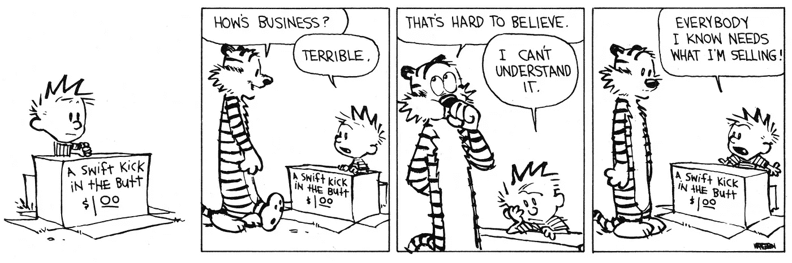

# 大数据分析的下一个前沿

> 原文：<https://towardsdatascience.com/the-next-frontier-in-big-data-analytics-2b327454fd75?source=collection_archive---------26----------------------->

## 跨行业分析及其三大支柱

Feel like you have all the data on exactly what your customer needs?

在我们的世界里，数据无处不在，但边际收益递减。

> 更多的数据并不一定转化为新的信息，事实上，它有时可能只是用来重申现有的偏见。

那么，我们到哪里去寻找更好的、更新的、令人惊讶的见解呢？超越行业孤岛是发现有价值见解的下一个前沿。就消费者数据而言，行业从业者忽略了一个微妙的事实，即我们都在为同一个客户服务——购买移动计划的同一个人也在寻找抵押贷款，或许还在计划去夏威夷度假。然而，正如我在去年多伦多机器学习峰会上分享的那样，数据分析团队只从他们特定的行业环境中分析数据。

即便如此，在准备、促成和说服行业参与者合作方面，仍有许多工作要做。

> *让协作在实践中发生需要三大支柱**——*数据估值模型、隐私保护机制和可解释性。

数据评估让公司明白，他们的数据集的价值是与环境相关的，它会根据我们打算与谁合作以及针对什么具体分析或产品而变化。隐私机制允许这种协作，这种协作总是涉及使用来自两个或更多不同公司甚至行业的数据集，同时维护数据集提供信息的个人的隐私。可解释性是一门艺术和科学，能够确定你的机器学习模型计算什么，它如何计算，最重要的是，知道所使用的假设和数据中对结果影响最大的特征。致力于这三大支柱将允许公司释放其数据集中的潜在价值。

2018 年末，我在多伦多参加了由[创造性破坏实验室](https://www.creativedestructionlab.com)组织的一个大型年度机器学习会议。我的计划是寻找与我所在行业以外的组织的潜在合作伙伴关系，提议我们将他们来自电信行业以外的数据集与我们的移动使用数据集相结合，共同执行高级分析，跨越我们的行业孤岛。那天我的钥匙来自一个意想不到的地方。我发现自己在和主讲人交谈，他是一位著名的物理学家和作家杰弗里·韦斯特教授。就在他的主题演讲前聊天时，我不经意地提到他在完全不相关的弦理论方面的背景，“通常，解决方案是在学科的交叉点上，不是吗？”他温和地纠正了我—

> "解决方案总是并且只有跨学科的."

对于机器学习，我会说，最好的见解将是跨行业的。