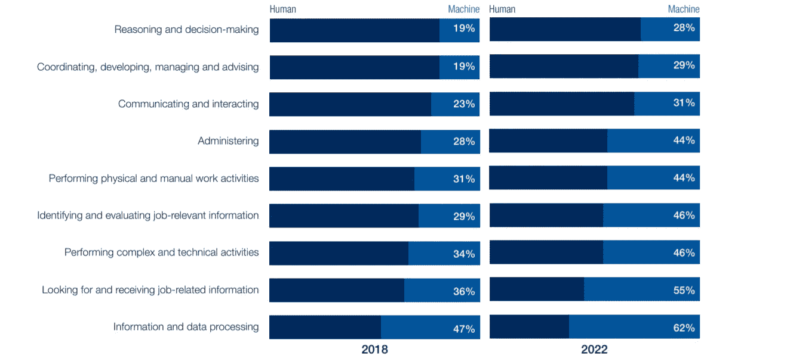

# 下一代工人

> 原文：<https://towardsdatascience.com/the-next-generation-of-workers-4df1e29f0195?source=collection_archive---------38----------------------->

## 人工智能和数字平台如何改变我们的工作方式

SOURCE: © ISTOCK/GETTY IMAGES PLUS

在数字时代，新的工作形式已经出现。这些新的工作形式在许多方面定义了劳动力市场的未来，尽管人们担心非技术工作濒临消失，但技术已经证明，其目的不是消除工作岗位，而是补充工作岗位。

# 技术对劳动力市场的影响

> “我们的工作方式正在终结”。“数百万工作岗位将会消失”。

随着新技术重塑我们的工作方式，人们越来越担心技术对劳动力市场的影响。这些新的技术进步可能导致许多工作岗位的丧失，然而，许多政府和工会似乎仍然不认为这些技术进步旨在改变我们的工作方式。

例如，世界经济论坛(WEF) [**关于就业前景的报告**](https://www.weforum.org/reports/the-future-of-jobs-report-2018) 预测，到 2022 年，技术将创造超过**1 . 33 亿个就业岗位，几乎是被淘汰岗位数量的两倍。**

> 但是，许多工人将失去工作，无法适应这些新的技术工作

技术的全球化使得来自世界各地的人们可以在线提供服务。印度的网站开发者可以为西班牙的人创建一个网站。但是，关于新型数字作品的出现，更有趣的是**创造的** **面向所有技能水平的本地作品**。如今，优步、Glovo、Rover、Deliveroo、TaskRabbit 和许多其他数字平台提供的技术为许多非熟练工人创造了工作机会。

无数的数字平台正在创造本地工作，其中许多不需要熟练劳动力，没有技术，这些新形式的工作就不会像今天这样存在

> “人工智能迟早会取代我们”

会的，至少在某些领域会，但不代表人力资本会被取代。人工智能(AI)将继续增长，积极刺激生产力。生产率的影响将意味着产业将增长、扩张并创造更多的工作岗位——这些工作岗位将向所有技能水平的人开放。我们必须考虑的是，这些工作中的许多将是完全不同的，并将需要新的技能。因此，提高技能至关重要，我们需要一个新的教育体系来适应这些新角色。

然而，人工智能是一把双刃剑——尽管它似乎正在创造更难执行的工作，但它也打算补充人类的技能和逻辑。这意味着，有了人工智能推动的锻造教育系统，我们将能够更容易、更快地打磨和学习新技能。

人工智能更有趣的地方在于，现有劳动力将得到更有效的利用，工人们将能够专注于他们最擅长的事情:

## 想象一下。创造。创新。

几十年来，许多技术创新的目的都是为了取代人类劳动。在过去的 50 年里，世界人口翻了一番，然而就业率却上升了。

人工智能将增强人类的工作，补充我们的智力并涵盖基本任务，使我们能够更快地工作，并给我们更多的时间专注于增值任务和学习。此外，对人类工作的需求将最看重机器不擅长的技能，如**创造力和社交/情感技能。**

世界经济论坛提供的一份[报告](http://Ratio of human-machine working hours, 2018 vs. 2022 (projected))显示了 2018 年至 2022 年间人机工作时间比率的演变(见下图)。

**Source:** Future of Jobs Survey (2018), World Economic Forum

人工智能将补充人类的技能，从数据处理到复杂的技术技能，甚至更多的体力和体力工作。

最后，AI 可能比我们想象的更伟大；我们期待着每个人都有更好的生活质量，工作周减少，甚至可能在某一点上，每个人都有有保障的收入。

## 拥抱新的工作形式

试图阻止这些新工作形式的发展不是解决办法。政府、工会、教育工作者和个人对于下一代工人和未来的许多挑战还有很多要学习的。

因此，政策制定者应该接受这些新型工作，采取必要措施建立具有全球竞争力的教育基础设施。

也有例外，应该把它们当作例外，而不是一般结论的基础。