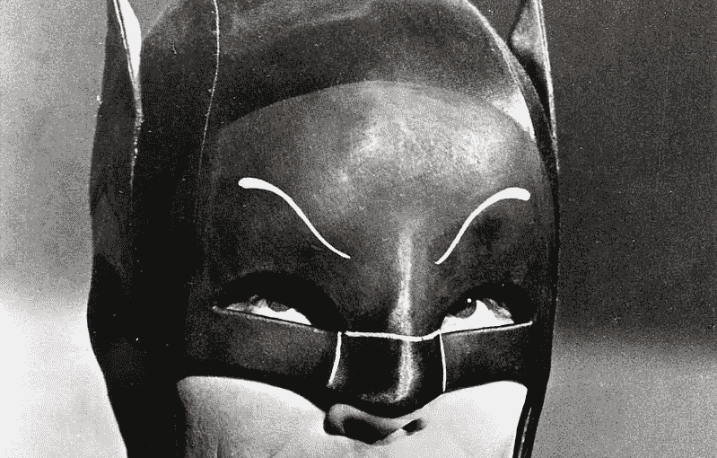
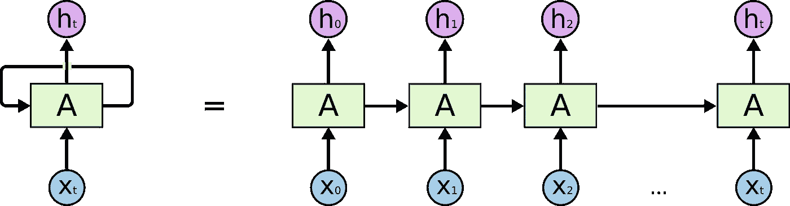
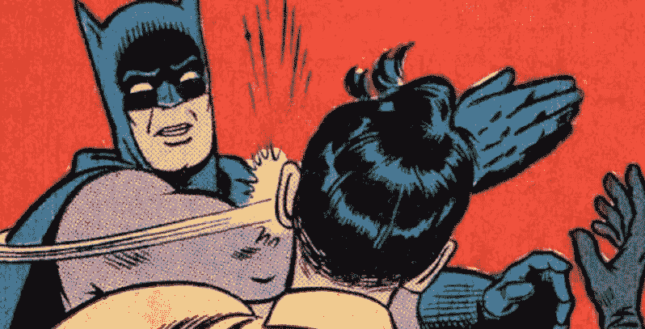
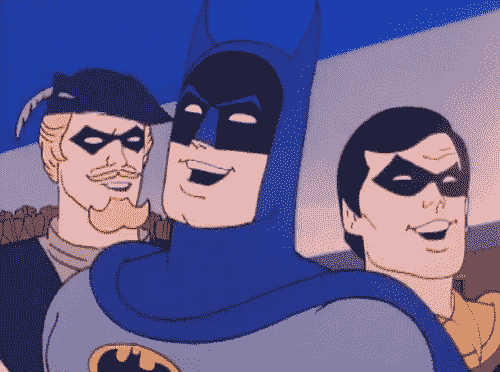
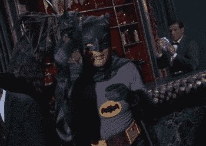

# 下一个最伟大的蝙蝠侠故事——生成

> 原文：<https://towardsdatascience.com/the-next-greatest-batman-story-generated-d58cf6753607?source=collection_archive---------24----------------------->

## Tensorflow 和 GPT-2 的文本生成实验



今年是美国最伟大的人物之一——蝙蝠侠的 80 周年纪念。几十年来，这个百万富翁-孤儿-义警-侦探-英雄的故事吸引了公众的想象力。我们可能会惊叹于其他超人英雄的壮举，但出于某种原因，他的故事和性格经久不衰，仍然能引起观众的共鸣。你可能不理解一个拥有所有想象得到的力量的英雄有益健康的善良(对不起，超人！)，但你可能会理解《破碎世界》中的损失和争取某种秩序或正义感，蝙蝠就是在那里以自己最了解的方式生活和继续战斗。

正如大多数经历了这么长时间的事物一样，蝙蝠侠也被以无数种方式重新创造和讲述。他在电影、漫画和动画方面有无数的创新。从 20 世纪 60 年代蝙蝠侠的傻乎乎的纯洁到 21 世纪初蝙蝠侠的坚韧不拔的绝望，粉丝们在描述中并不缺乏选择。当我写这篇文章的时候，有一个更新的蝙蝠侠故事即将被拍成电影，我们对此知之甚少。

那么过了这么久，哥谭骑士的下一步会是什么呢？也许一个神经网络可以决定！在这个有点徒劳的实验中，我试图给披着斗篷的十字军战士带来一个新的故事，并在这个过程中学习递归神经网络&长期短期记忆网络。

# 一个非常简短的递归神经网络解释器



至于没有很好解释的主题，有很多很好的资源可以让你对神经网络中发生的事情有一个很好的基础理解，但是这里有一个简单的介绍，看看它们和循环变化之间的区别。传统的神经网络将接受一系列输入，并在计算后提供相当直接的输出。它基于用来创建静态模型的信息来创建静态模型。相比之下，递归网络创建了一个动态模型，它使用来自上一次计算的反馈来帮助确定下一次计算。从本质上来说，它们在某种意义上形成了一种记忆，这种记忆通过模型得到反馈，以帮助改进它，如上图所示，它以短形式(左)和展开的长形式(右)显示。当处理依赖于理解特定系列的信息(如文本)时，递归网络表现得特别好。尽管有时你可能害怕它的结果，文本自动完成是一种循环网络的形式。它不仅仅是基于一个以前的单词来选择下一个单词，而是潜在地基于过去的几个单词，建立在它们之间的关系上。

试着为下面的交流填空:

***蝙蝠侠闯入仓库，他大喊“站住！”。小丑笑着说“永远不要 _____！”***

虽然你可能有想法，但空白可能是任何单词。根据句子前面的上下文，我们可以猜测他说的是“蝙蝠侠”或“蝙蝠”。正是这种通过序列的流动，是循环网络能够发光的地方。

# 搬到 LSTM


[From Understanding LSTM Networks](http://colah.github.io/posts/2015-08-Understanding-LSTMs/)

我们可能会遇到递归网络的一个主要问题，其中考虑到那些可能使梯度下沉或爆炸的额外步骤(本质上，这些微小分数的过多乘法确实会把事情搞砸)。回忆以前发生的一切可能会过于繁琐，但我们确实想利用一些学到的东西。长短期记忆单元(被称为 LSTM)是一种帮助解决这个问题的逻辑形式。LSTMs 创建一个单独的存储器，用于存储和临时用于计算。当决定一个新的输出时，模型考虑当前的输入、先前的输出和它存储的先前的记忆。一旦产生新的输出，它就更新内存。您可以想象，在处理文本时，这样的东西会有多么有用，因为它在很大程度上依赖于跟随文字的流动。关于这个过程内部功能的另一个很好的资源，请点击图片标题中的链接。

# 让我们进入时代吧！

文本生成可以在字符或单词级别上工作。一旦对一组输入数据进行了训练，它就会试图学习一种模式，以便能够有效地预测接下来会发生什么。与任何试图根据输入要素找到最佳输出的数值模型类似，该模型将单词或字符存储在它可以理解和解释的数值上下文中。


正如您可能猜到的，问题可能是单词或字符的数字表示可能并不总是创建非常符合逻辑的文本流。在这个练习中，我尝试了几种不同的方法来把事情做好。

我的意见:

*   收集了所有蝙蝠侠电影、漫画和漫画小说的维基百科情节摘要(共 49 篇)。

我正在尝试的循环神经网络模型:

*   字符级 LSTM 模型
*   具有预训练单词向量的单词级 LSTM 模型
*   GPT-2 模型

# 字符级 LSTM 模型

这种方法的工作原理是根据单个字母建立索引，学习每个单词的构成模式。首先，我们将文本按单个字符分解，并为它们创建一个索引:

```
chars = sorted(list(set(all_plots)))
print('total chars:', len(chars))
char_indices = dict((c, i) for i, c in enumerate(chars))
indices_char = dict((i, c) for i, c in enumerate(chars))
```

然后，我们将整篇文章分成几块，模仿句子:

```
maxlen = 100
step = 3
sentences = []
next_chars = []
for i in range(0, len(all_plots) - maxlen, step):
    sentences.append(all_plots[i: i + maxlen])
    next_chars.append(all_plots[i + maxlen])
print('nb sequences:', len(sentences))
```

从那里，我们需要做的就是用我们创建的字符索引对这些句子进行矢量化:

```
x = np.zeros((len(sentences), maxlen, len(chars)), dtype=np.bool)
y = np.zeros((len(sentences), len(chars)), dtype=np.bool)
for i, sentence in enumerate(sentences):
    for t, char in enumerate(sentence):
        x[i, t, char_indices[char]] = 1
    y[i, char_indices[next_chars[i]]] = 1
```

维奥拉。所有的细节都设置好了，我们现在要做的就是创建我们的 LSTM 模型并运行:

```
model = Sequential()
model.add(LSTM(128, input_shape=(maxlen, len(chars))))
model.add(Dense(len(chars), activation='softmax'))optimizer = RMSprop(lr=0.01)
model.compile(loss='categorical_crossentropy', optimizer=optimizer)
```

## 结果:

不太好。我没有时间或处理能力来运行这个模型超过几百个纪元，到最后，我仍然以乱码字母和偶尔的专有名称结束。我们的文本虽然不是一本书，但仍然有 211，508 个字符长，处理起来相当复杂。它变得非常擅长使用正式的角色名，但这是它成功的主要原因。以下是仅输入“Batman”提示时返回的文本类型的示例:

> 而蝙蝠信号，被一个谋杀他父亲的炸弹的内奸杀死了一个蝙蝠侠，他渗透到蝙蝠侠里面去攻击黑暗的敲门者，唤醒了蝙蝠侠，并引发了犯罪文章，他是蝙蝠洞的所有人，站在看台上的戈登，头儿哈维·登特的故事，他也有一些故事，他将会被故事所玷污



GIBBERISH!!!

# 具有预训练单词向量的单词级 LSTM 模型

接下来，我升级到单词级的 LSTM 模型。在我之前按单个字符分解文本的地方，也许只使用单词会更容易些。为了帮助我更好地连贯措辞，我加入了预先训练好的单词向量。预训练向量所做的是将单词的特定嵌入权重作为开始计算，并从那里开始工作。我们可能不知道该如何措辞，但我们知道一些词之间的关系，比如“热”和“冰”没有很高的相关性。所以，我们从引入预先训练好的模型开始:

```
word_model = gensim.models.Word2Vec(sentences, size=100, min_count=1, window=5, iter=100)
pretrained_weights = word_model.wv.syn0
vocab_size, emdedding_size = pretrained_weights.shape
```

类似地构建我们的功能:

```
max_sentence_len = 40
sentences = [[word for word in sen.split()[:max_sentence_len]] for sen in all_plots.split('.')]def word2idx(word):
  return word_model.wv.vocab[word].index
def idx2word(idx):
  return word_model.wv.index2word[idx]print('\nPreparing the data for LSTM...')
train_x = np.zeros([len(sentences), max_sentence_len], dtype=np.int32)
train_y = np.zeros([len(sentences)], dtype=np.int32)for i, sentence in enumerate(sentences):
  for t, word in enumerate(sentence[:-1]):
    train_x[i, t] = word2idx(word)
    train_y[i] = word2idx(sentence[-1])
```

去训练吧！

## 结果

一般般。我让它运行了 500 个时代，但这仍然不足以接近一些良好的连贯措辞。我得到的结果是不是更有趣，更有用，绝对是！它们听起来像自然语言吗？差远了。这应该是有意义的，我们的模型让它受益于向量空间中的单词关系，并从情节的结构中学习，但不涉及正确的语法。更多的纪元可能会开始变得更近(我见过几个运行了几千个纪元并变得更近的)，但我没有时间。一些突出显示，以粗体输入文本:

> **小兵打架**为了城堡飞机才勉强野蛮多了。
> 
> **蝙蝠侠揭秘**圣诞节中途时刻观众罗宾，抵达逃亡疯狂火把结构。
> 
> **小丑尝试**以毒素蒙面长期遗弃确认承诺附妇女孤儿院介绍兄弟。
> 
> **小兵打架**探子老师，工程博士开关过关，制裁棺材悬浮术吗？



Ha! Close. But, no.

# 开放 GPT-2 模型

当常规训练和向我们的模型添加一些基本的预训练向量还不够时，你必须引入大人物。 [OpenAI GPT-2](https://openai.com/blog/better-language-models/) 是来自 OpenAI 的创成式预训练[变压器](http://jalammar.github.io/illustrated-transformer/)。如果在 GPU 上运行，它的速度相当快，相比之下，它模仿语言的能力令人印象深刻。它暴露自己的程度因文本而异。如果你想快速浏览一下，请查看[与变形金刚](https://talktotransformer.com/)的对话。对于这个例子，我使用了 [gpt-2-simple](https://github.com/minimaxir/gpt-2-simple) ，这样我可以很容易地微调我的模型。

## 结果

哇！这是一些奇妙的东西。完全是原创的吗？不，该文本大量借用了原文中的措辞，因此有时可能有些过了。好消息是，这是一个相当可读的形式和一个令人愉快的奇怪的故事情节组合。这些片段读起来几乎像电影剧本，来自阅读不同漫画的维基百科的人，所以相当准确！

从以下 400 个时期取样:

> 莎拉讲述了在她与杰森结婚之前，她是如何杀死虐待她的丈夫并继承罗宾衣钵的故事。尽管最初被这个头衔所冒犯，莎拉后来还是接受了它，尽管实际上是蝙蝠侠犯了谋杀罪。故事开始后，罗宾渗透到一个高层次的军事阴谋召开，以解决世界各国政府的安全恶化后，很久以前的军事将军詹姆斯加文死亡。该阴谋的成员包括:小丑，巫师，巫医，撒旦仪式携带者，以及他们的领导人，艾伦麦格雷戈。小丑带领同谋者试图勾引女同谋者，女同谋者由一个不知名的演员扮演。这位女性声称她不相信吸血鬼，而是相信一个被称为小丑的人类的至高无上的存在，他对数百名无辜者的死亡负有责任。

现在我们在谈话！看看那份同谋名单。策划者艾伦·麦格雷戈！！？？我查看了原文，使用了“艾伦”和“麦格雷戈”这两个名字，但这不是一个单独的专有名词。

从以下 800 个时期取样:

> 蝙蝠侠和罗宾又一次快速解决了辛迪加。两人突袭了辛迪加头目冰冻先生的巢穴。蝙蝠侠通过天窗加入战斗，而杰森·托德和斯嘉丽走向未知的目的地。与此同时，冻结先生，仍然穿着防弹衣，钻孔克莱门特折磨和链到一棵树在阿卡姆疯人院，因为斯嘉丽从她的折磨恢复。蝙蝠侠和罗宾开始有打击犯罪的关系问题，因为冻结的迷恋猩红，但布鲁斯最终说服迪克信任他。布鲁斯考虑绑架斯嘉丽进行研究，但决定反对，因为这将使蝙蝠侠面临最大的危险。后来，蝙蝠侠登上了一艘哥特风格的船，从哥谭市绑架了斯嘉丽。他后来与她交谈，并承诺他将支持她的研究，但只有在她听从他的命令。

奇怪的控制蝙蝠侠？有意思。

来自 1600 个时代的样本:

> 在蝙蝠洞，布鲁斯向全世界宣布他绑架并谋杀了高谭市的监狱长，高谭市是他的囊中之物。他说哥谭市的执法部门应该感到害怕，唯一能保证他们安全的方法就是自相残杀。三个人决定一起去追冷冻先生。布鲁斯邀请戈登和福克斯在蝙蝠洞与他会面。三人与冷冻先生对质，他承认他是来杀他们所有人的。冷冻先生试图说服布鲁斯，他对布鲁斯的计划无能为力，但布鲁斯证明他错了。

有点黑了！对于一个有这种趋势的角色来说，这并不奇怪。有了这样的结果，我不认为机器人会很快取代作家的工作，而是一个有趣的语言建模实验。现在是时候用快速蝙蝠来庆祝了！



感谢阅读！