# Python 中数据可视化的下一个层次

> 原文：<https://towardsdatascience.com/the-next-level-of-data-visualization-in-python-dd6e99039d5e?source=collection_archive---------0----------------------->


[(Source)](https://www.pexels.com/photo/adventure-climb-clouds-daylight-371400/)

## 如何用一行 Python 代码制作出好看的、完全交互式的情节

沉没成本谬论是人类遭受的众多[有害认知偏见](https://en.wikipedia.org/wiki/Thinking,_Fast_and_Slow#Heuristics_and_biases)之一。它[指的是我们倾向于继续将时间和资源投入到一个失败的事业中，因为我们已经在追求中花费了太多的时间。沉没成本谬误适用于在糟糕的工作中呆得比我们应该呆的时间更长，即使很明显一个项目行不通，也要埋头苦干，是的，当存在更高效、交互和更好看的替代方案时，继续使用乏味、过时的绘图库 matplotlib。](https://youarenotsosmart.com/2011/03/25/the-sunk-cost-fallacy/)

在过去的几个月里，我意识到我使用`matplotlib`的唯一原因是我花了数百个小时来学习[复杂的语法](https://matplotlib.org/api/api_overview.html)。这种复杂性导致 StackOverflow 花费数小时来解决如何[格式化日期](https://stackoverflow.com/questions/14946371/editing-the-date-formatting-of-x-axis-tick-labels-in-matplotlib)或[添加第二个 y 轴](https://stackoverflow.com/questions/14762181/adding-a-y-axis-label-to-secondary-y-axis-in-matplotlib)的问题。幸运的是，这是一个 Python 绘图的好时机，在探索了选项[和](https://www.fusioncharts.com/blog/best-python-data-visualization-libraries/)之后，一个明显的赢家——在易用性、文档和功能性方面——是 [plotly Python 库。](https://plot.ly/python/)在本文中，我们将直接进入`plotly`，学习如何在更短的时间内制作更好的情节——通常只用一行代码。

本文的所有代码都可以在 GitHub 上找到。这些图表都是交互式的，可以在 [NBViewer 这里](https://nbviewer.jupyter.org/github/WillKoehrsen/Data-Analysis/blob/master/plotly/Plotly%20Whirlwind%20Introduction.ipynb)查看。

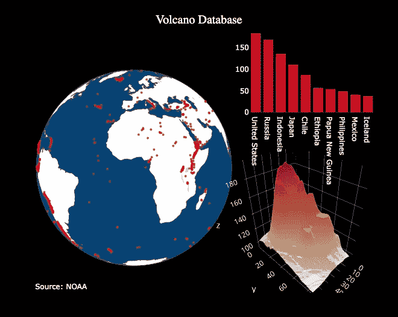

Example of plotly figures ([source](https://plot.ly/python/mixed-subplots/))

## 非常简单的概述

`[plotly](https://plot.ly/python/)` [](https://plot.ly/python/)Python 包是构建在`[plotly.js](https://plot.ly/javascript/)` [上的开源库，而](https://plot.ly/javascript/)又构建在`[d3.js](https://d3js.org/)` [上。](https://d3js.org/)我们将在 plotly 上使用一个名为`[cufflinks](https://github.com/santosjorge/cufflinks)`的包装器，用于处理熊猫数据帧。因此，我们的整个堆栈是 cufflinks>plotly>plotly . js>d3 . js，这意味着我们获得了用 Python 编码的效率和 D3 令人难以置信的[交互图形能力。](https://github.com/d3/d3/wiki/Gallery)

( [Plotly 本身](https://plot.ly/)是一家图形公司，有几款产品和开源工具。Python 库是免费使用的，我们可以在离线模式下制作无限的图表，加上在线模式下多达 25 个图表，以便与世界分享。)

本文中的所有工作都是在 Jupyter 笔记本中完成的，plotly +袖扣在离线模式下运行。用`pip install cufflinks plotly`安装 plotly 和袖扣后，导入以下程序在 Jupyter 中运行:

```
# Standard plotly imports
import plotly.plotly as py
import plotly.graph_objs as go
from plotly.offline import iplot, init_notebook_mode# Using plotly + cufflinks in offline mode
import cufflinks
cufflinks.go_offline(connected=True)
init_notebook_mode(connected=True)
```

# 单变量分布:直方图和箱线图

单变量——单变量——图是开始分析的标准方式，直方图是绘制分布图的常用图([尽管它有一些问题](https://www.andata.at/en/software-blog-reader/why-we-love-the-cdf-and-do-not-like-histograms-that-much.html))。在这里，使用我的中等文章统计(你可以在这里看到[如何获得你自己的统计](/analyzing-medium-story-stats-with-python-24c6491a8ff0)或在这里使用[我的](https://github.com/WillKoehrsen/Data-Analysis/tree/master/medium))让我们制作一个文章鼓掌数量的交互式直方图(`df`是一个标准的熊猫数据框架):

```
df['claps'].iplot(kind='hist', xTitle='claps',
                  yTitle='count', title='Claps Distribution')
```

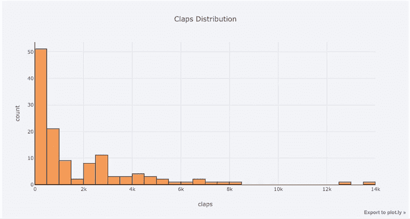

Interactive histogram made with plotly+cufflinks

对于那些习惯了`matplotlib`的人来说，我们所要做的就是多加一个字母(`iplot`而不是`plot`)，我们就会得到一个更好看、更具交互性的图表！我们可以单击数据以获得更多细节，放大图的各个部分，正如我们稍后将看到的，选择不同的类别来突出显示。

如果我们想要绘制重叠的直方图，也很简单:

```
df[['time_started', 'time_published']].iplot(
    kind='hist',
    histnorm='percent',
    barmode='overlay',
    xTitle='Time of Day',
    yTitle='(%) of Articles',
    title='Time Started and Time Published')
```

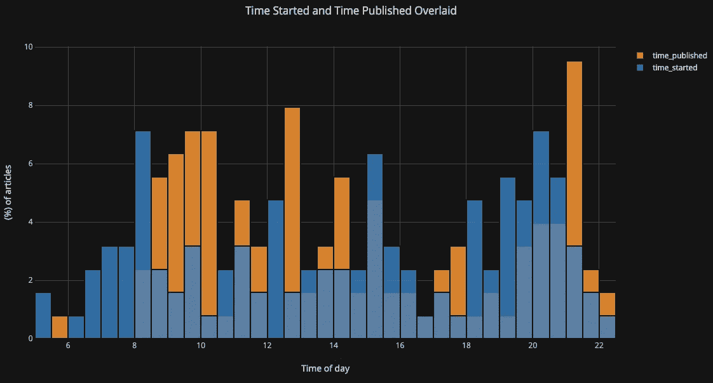

通过一点点`pandas`操作，我们可以做一个柱状图:

```
# Resample to monthly frequency and plot 
df2 = df[['view','reads','published_date']].\
         set_index('published_date').\
         resample('M').mean()df2.iplot(kind='bar', xTitle='Date', yTitle='Average',
    title='Monthly Average Views and Reads')
```

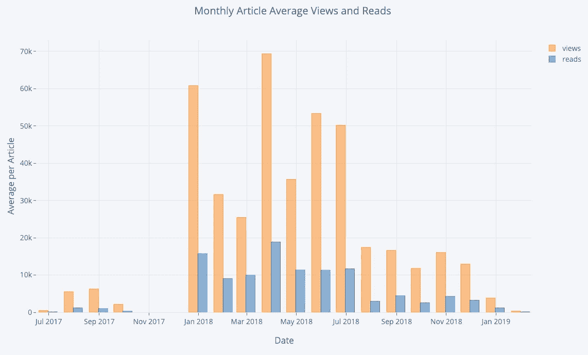

s 我们看到了，我们可以把熊猫的[力量和 plotly +袖扣结合起来。对于出版的每个故事的粉丝的箱线图，我们使用一个`pivot`，然后绘制:](https://pandas.pydata.org/pandas-docs/stable/10min.html)

```
df.pivot(columns='publication', values='fans').iplot(
        kind='box',
        yTitle='fans',
        title='Fans Distribution by Publication')
```

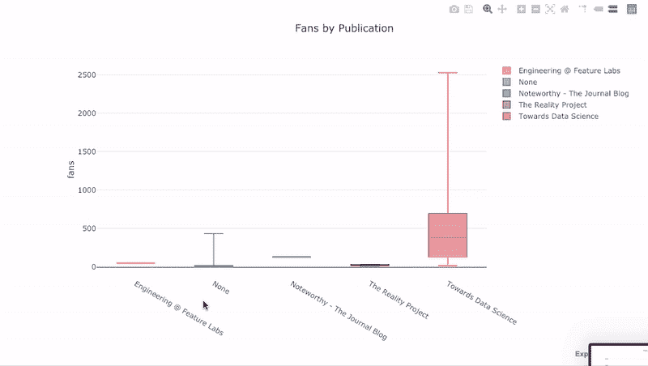

交互性的好处是我们可以随心所欲地探索数据并对其进行分类。盒状图中有很多信息，如果没有看到数字的能力，我们会错过大部分信息！

# 散点图

散点图是大多数分析的核心。它让我们看到一个变量随时间的演变，或者两个(或更多)变量之间的关系。

## 时间序列

相当一部分真实数据都有时间因素。幸运的是，plotly +袖扣的设计考虑到了时间序列可视化。让我们把我的 TDS 文章做成一个数据框架，看看趋势是如何变化的。

```
 Create a dataframe of Towards Data Science Articles
tds = df[df['publication'] == 'Towards Data Science'].\
         set_index('published_date')# Plot read time as a time series
tds[['claps', 'fans', 'title']].iplot(
    y='claps', mode='lines+markers', secondary_y = 'fans',
    secondary_y_title='Fans', xTitle='Date', yTitle='Claps',
    text='title', title='Fans and Claps over Time')
```

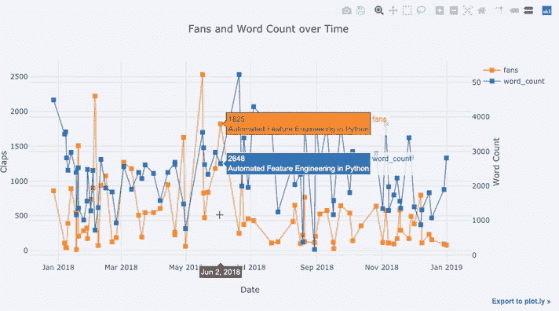

在这里，我们在一条线上做了很多不同的事情:

*   自动获得格式良好的时间序列 x 轴
*   添加一个辅助 y 轴，因为我们的变量有不同的范围
*   添加文章标题作为悬停信息

要了解更多信息，我们还可以很容易地添加文本注释:

```
tds_monthly_totals.iplot(
    mode='lines+markers+text',
    text=text,
    y='word_count',
    opacity=0.8,
    xTitle='Date',
    yTitle='Word Count',
    title='Total Word Count by Month')
```

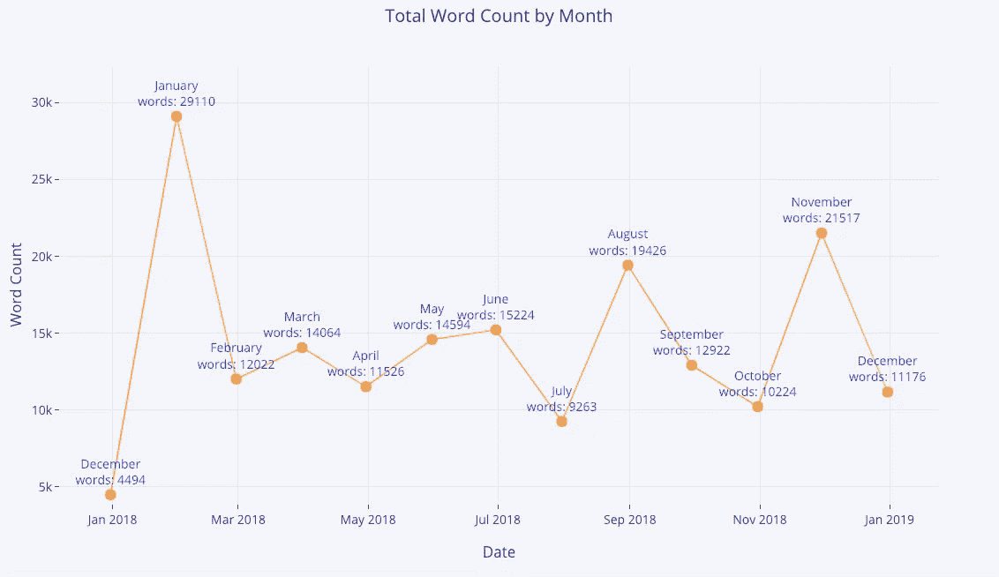

Scatterplot with annotations

对于由第三个分类变量着色的双变量散点图，我们使用:

```
df.iplot(
    x='read_time',
    y='read_ratio',
    # Specify the category
    categories='publication',
    xTitle='Read Time',
    yTitle='Reading Percent',
    title='Reading Percent vs Read Ratio by Publication')
```

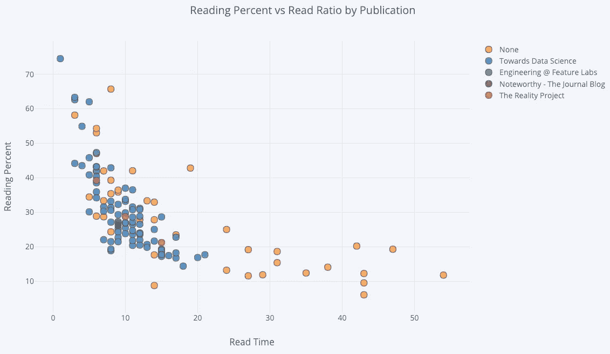

让我们通过使用对数轴——指定为 plotly 布局——(有关布局细节，请参见 [Plotly 文档](https://plot.ly/python/reference/))并通过一个数字变量来确定气泡的大小，来变得更复杂一些:

```
tds.iplot(
    x='word_count',
    y='reads',
    size='read_ratio',
    text=text,
    mode='markers',
    # Log xaxis
    layout=dict(
        xaxis=dict(type='log', title='Word Count'),
        yaxis=dict(title='Reads'),
        title='Reads vs Log Word Count Sized by Read Ratio'))
```

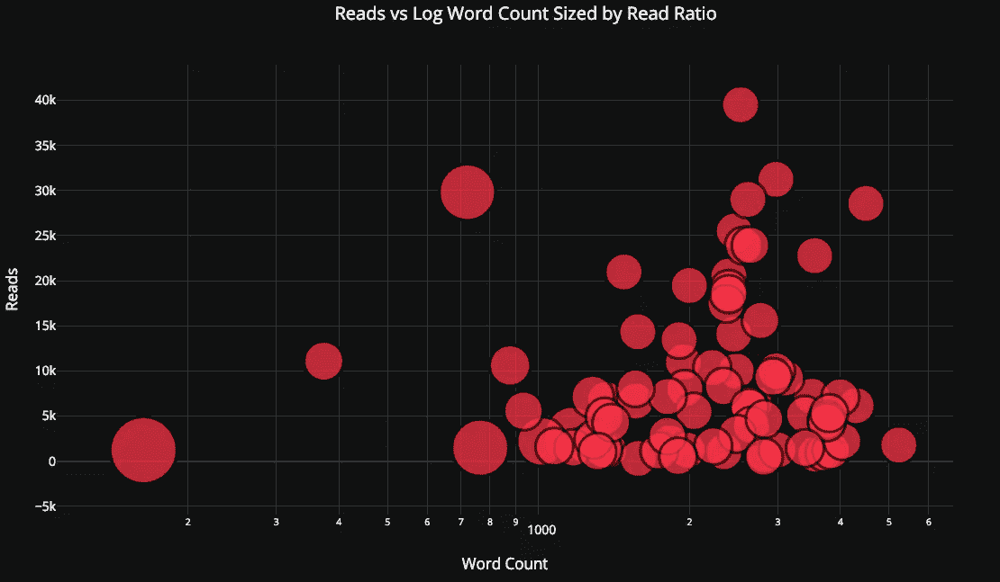

再多做一点工作([详见笔记本](https://nbviewer.jupyter.org/github/WillKoehrsen/Data-Analysis/blob/master/plotly/Plotly%20Whirlwind%20Introduction.ipynb#)，我们甚至可以把四个变量([这个不建议](https://serialmentor.com/dataviz/aesthetic-mapping.html))放在一个图上！

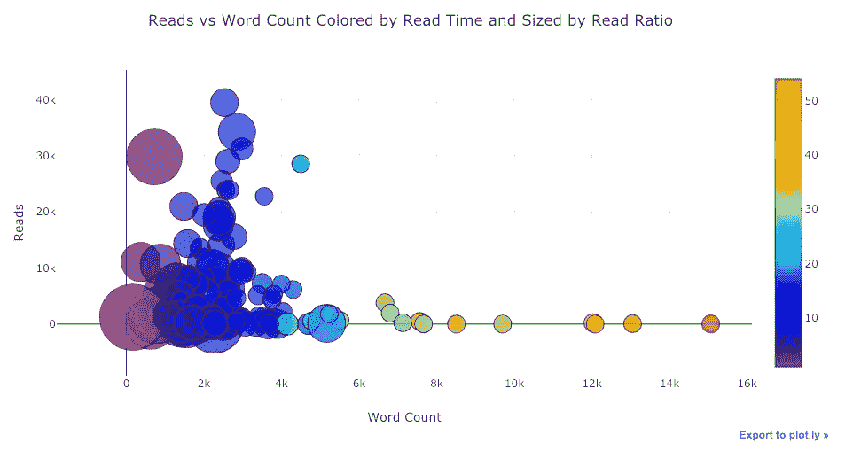

像以前一样，我们可以将熊猫与 plotly+袖扣结合起来，以获得有用的情节

```
df.pivot_table(
    values='views', index='published_date',
    columns='publication').cumsum().iplot(
        mode='markers+lines',
        size=8,
        symbol=[1, 2, 3, 4, 5],
        layout=dict(
            xaxis=dict(title='Date'),
            yaxis=dict(type='log', title='Total Views'),
            title='Total Views over Time by Publication'))
```

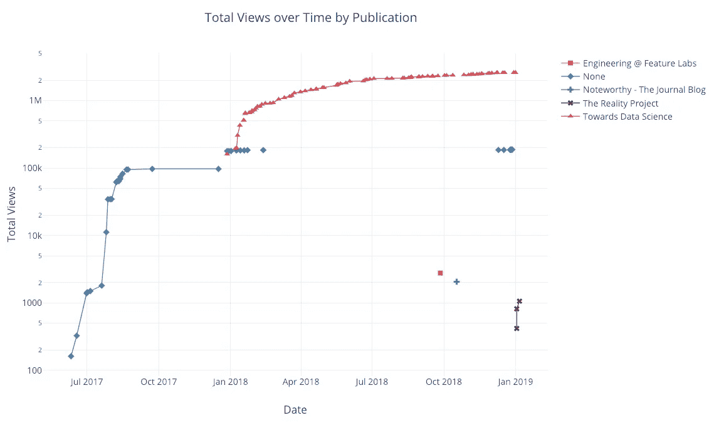

查看笔记本[或文档](https://plot.ly/python/)了解更多附加功能的示例。我们可以用一行代码在绘图中添加文本注释、参考线和最佳拟合线，并且仍然具有所有的交互。

# 高级绘图

现在我们将进入几个你可能不会经常用到的情节，但是它们可能会给你留下深刻的印象。我们将使用[情节](https://plot.ly/python/figure-factory-subplots/) `[figure_factory](https://plot.ly/python/figure-factory-subplots/)`，将这些不可思议的情节保持在一条线上。

## 散布矩阵

当我们想要探索许多变量之间的关系时，一个[散点矩阵](https://junkcharts.typepad.com/junk_charts/2010/06/the-scatterplot-matrix-a-great-tool.html)(也称为 splom)是一个很好的选择:

```
import plotly.figure_factory as fffigure = ff.create_scatterplotmatrix(
    df[['claps', 'publication', 'views',      
        'read_ratio','word_count']],
    diag='histogram',
    index='publication')
```

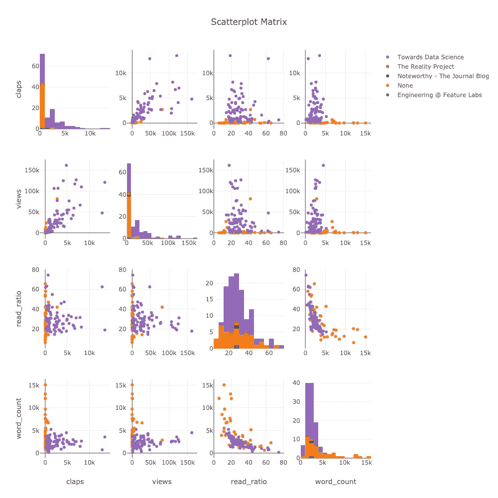

甚至这个图也是完全交互式的，允许我们探索数据。

## 相关热图

为了可视化数值变量之间的相关性，我们计算相关性，然后制作一个带注释的热图:

```
corrs = df.corr()figure = ff.create_annotated_heatmap(
    z=corrs.values,
    x=list(corrs.columns),
    y=list(corrs.index),
    annotation_text=corrs.round(2).values,
    showscale=True)
```

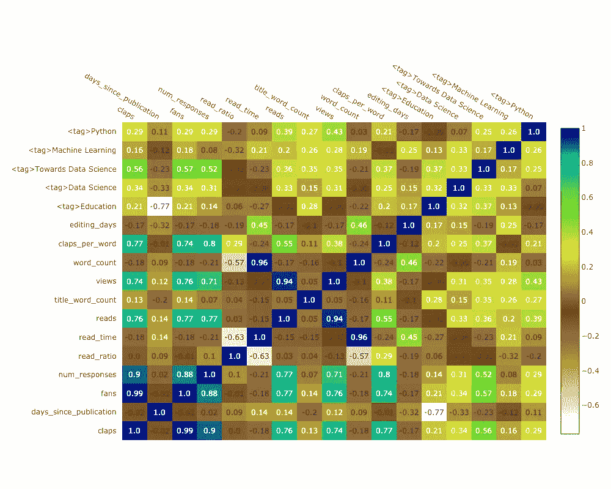

情节的清单还在继续。袖扣还有几个主题，我们可以用它们轻松打造完全不同的风格。例如，下面我们在“空间”主题中有一个比率图，在“ggplot”中有一个扩散图:

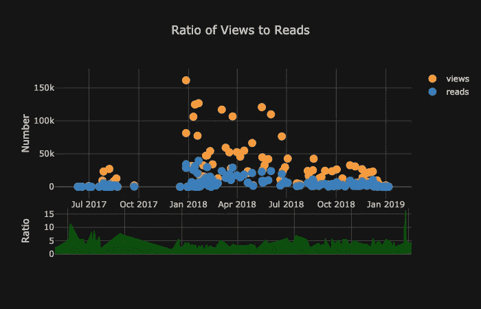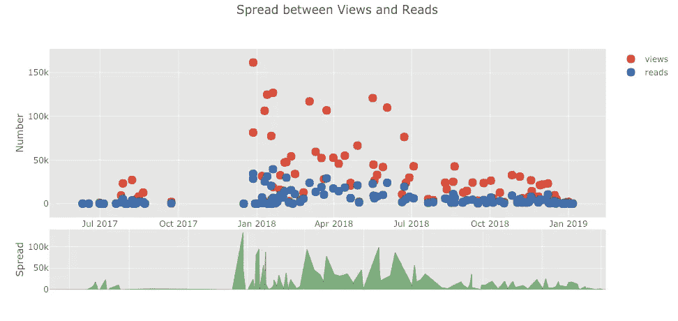

我们还得到 3D 图(表面和气泡):

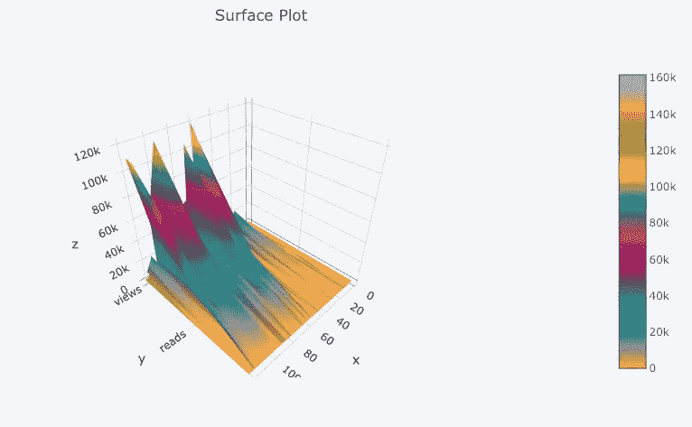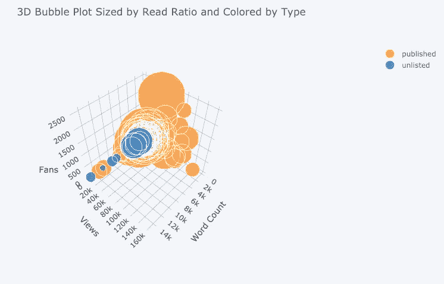

对于那些如此倾向的[，你甚至可以做一个饼状图:](https://interworks.com/blog/rcurtis/2018/01/19/friends-dont-let-friends-make-pie-charts/)

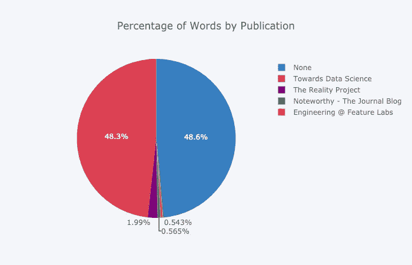

## 在 Plotly Chart Studio 中编辑

当您在笔记本中绘制这些图时，您会注意到图表右下角有一个小链接，上面写着“Export to plot.ly”。如果你点击那个链接，你就会被带到[图表工作室](https://plot.ly/create/)，在那里你可以润色你的最终演示图。您可以添加注释，指定颜色，并通常清理一切为一个伟大的数字。然后，你可以在网上发布你的数据，这样任何人都可以通过链接找到它。

下面是我在 Chart Studio 中修改的两张图表:

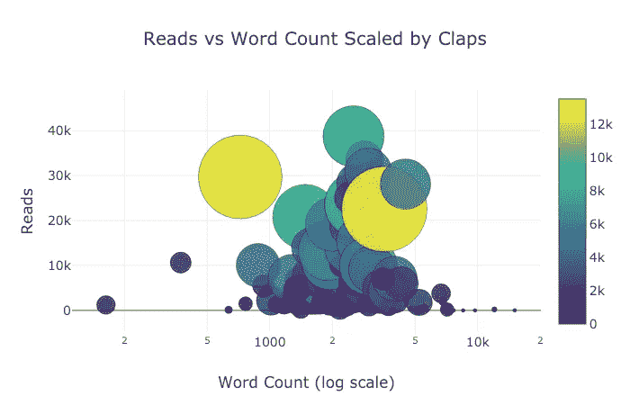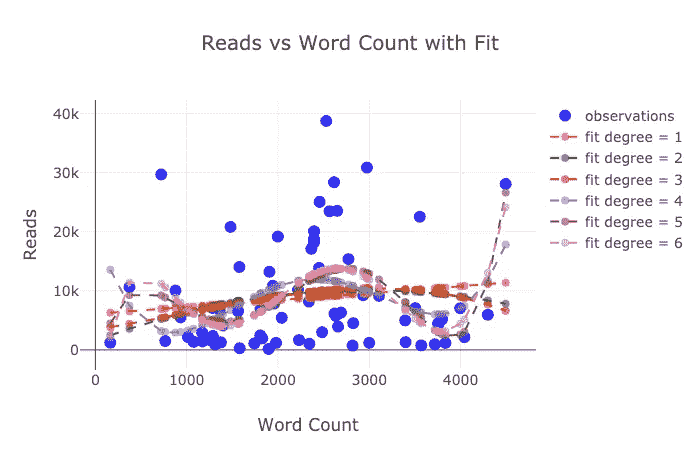

尽管这里提到了一切，我们仍然没有探索该库的全部功能！我鼓励你查阅 plotly 和袖扣文档，以获得更多令人难以置信的图形。

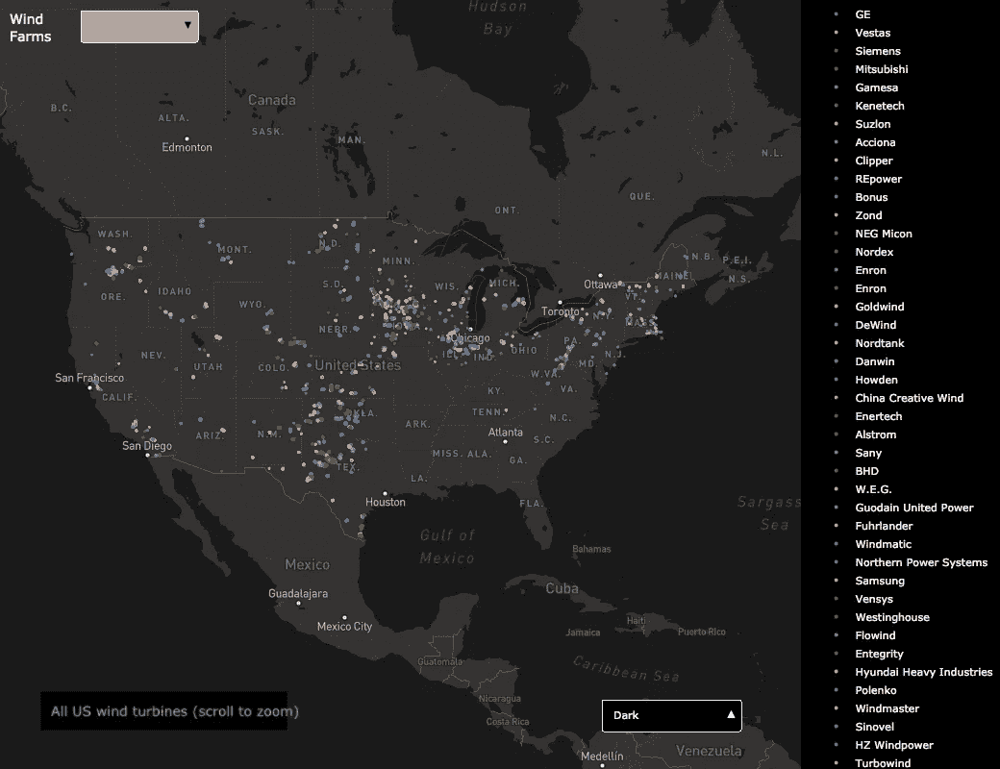

Plotly interactive graphics of wind farms in United States [(Source)](https://plot.ly/python/dropdowns/)

# 结论

沉没成本谬误最糟糕的地方在于，你只有在放弃努力后才意识到自己浪费了多少时间。幸运的是，现在我已经犯了坚持`matploblib`太久的错误，你也不用了！

当考虑打印库时，我们需要几样东西:

1.  **快速勘探单线图**
2.  **子集化/调查数据的交互元素**
3.  **根据需要挖掘细节的选项**
4.  **轻松定制最终演示文稿**

目前，用 [Python 做所有这些事情的最佳选择是 plotly](https://plot.ly/python/) 。Plotly 允许我们快速地进行可视化，并通过交互性帮助我们更好地了解我们的数据。此外，让我们承认，绘图应该是数据科学中最令人愉快的部分之一！与其他图书馆，绘图变成了一个乏味的任务，但与 plotly，有再一次在制作一个伟大的数字的喜悦！

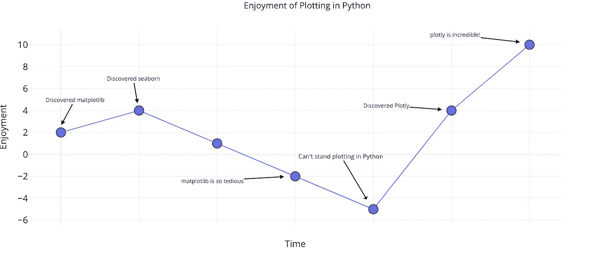

A plot of my enjoyment with plotting in Python over time

现在已经是 2019 年了，是时候升级您的 Python 绘图库了，以便在您的数据科学可视化中获得更好的效率、功能和美感。

一如既往，我欢迎反馈和建设性的批评。可以在 Twitter [@koehrsen_will 上找到我。](http://twitter.com/@koehrsen_will)