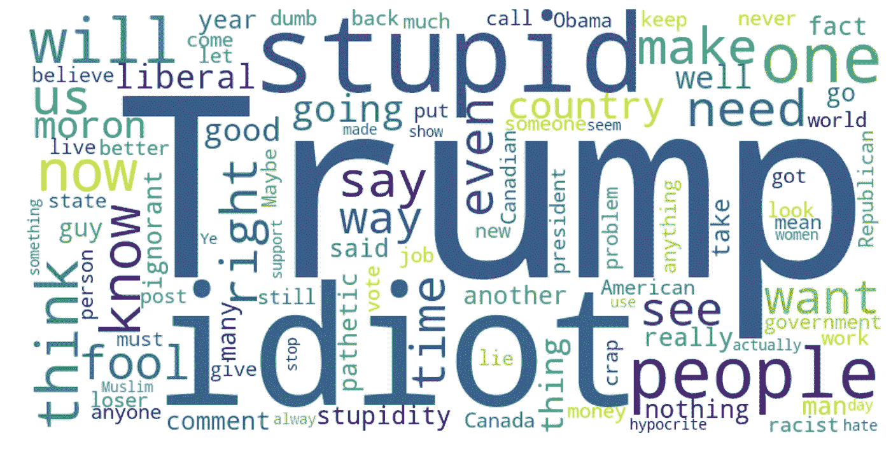
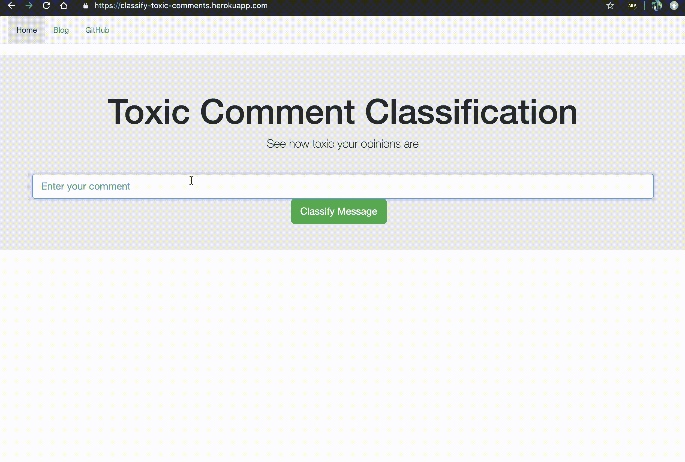

# 在线毒性的本质

> 原文：<https://towardsdatascience.com/the-nitty-gritty-of-online-toxicity-8d37080943b9?source=collection_archive---------24----------------------->

## *数据驱动的研究*


[Source](https://unsplash.com/photos/Kr8Tc8Rugdk)

回到互联网的早期，许多人“在线”登录到另一个世界，在那里他们可以在自己舒适的家中与来自世界另一个角落的人分享有意义的经历。网上的很多讨论和对话都发生在论坛上，这些论坛通常是为有共同兴趣的人而设的。自社交媒体蓬勃发展以来，情况发生了很大变化，与陌生人在线互动变得越来越普遍，同时也变得越来越困难，对许多平台来说，调节这种话语一直是一个技术和道德挑战。虽然言论自由很重要，但为有意义的讨论创造一个包容性的平台也是必要的。

利用[拼图](https://jigsaw.google.com/)发布的数据作为他们在 [Kaggle](https://www.kaggle.com/c/jigsaw-unintended-bias-in-toxicity-classification) 上挑战的一部分，我试图探索我们讨厌网络的方式。让我们开始吧。

# 我们的仇恨有多多样？

对于某些群体来说，在网上进行有意义的讨论可能比我们意识到的更困难。成为在网上收到最多仇恨的群体中的一员可能真的会令人沮丧，并阻止你表达自己的观点。那么这些群体是什么呢？

当我们将不同群体的毒性叠加在一起时，男性和女性这两种性别排在最前面，各占总仇恨的 15%多一点。有趣的是，在数据集中，白人、基督徒、穆斯林和黑人加起来几乎占到了仇恨的一半(约 45%)。

Correlation heatmap

看看不同群体和不同种类的仇恨之间的关联热图，毫不奇怪，网上最受仇恨的群体面临最多的身份攻击，白人、穆斯林和黑人表现出最强的关系。

研究毒性如何随时间变化也揭示了一些有趣的见解。例如，上面的图显示了从 2016 年开始到 2017 年底这段时间内加权毒性的变化，其最高峰出现在 2017 年 1 月，穆斯林受到了打击。那么一月份发生了什么呢？快速谷歌搜索显示，这是我们的总统特朗普宣布对某些穆斯林国家实施有争议的旅行禁令的时间。看到互联网的反应真让人难过。

# 有毒评论的成分有哪些？

那么这些有毒的评论是由什么组成的呢？为了理解我们语言中的模式，下面的图表比较了网上最讨厌的群体的某些特征。

Text features of comments

几乎所有的评论都显示出类似的趋势，我们观察到有毒评论比无毒评论的长度稍长，这在白人和穆斯林群体中最为明显。

你可能会认为，当涉及到仇恨言论时，我们会使用更多的代词。然而，这并不特别适用于任何最讨厌的群体。除了代词之外，其他词类在有毒和无毒评论之间似乎有相似的平均出现次数，至少对于上面情节中提到的群体来说是这样。这告诉我们一些重要的事情——当谈到网上的仇恨时，语言结构并没有太大的区别。

# 我们的界限在哪里？



Top most frequent toxic words

言论自由很重要，但这并不意味着我们有权在那里散播毒素。那么，在决定评论是否有毒的问题上，人类注释者意见不一，那么评论看起来像什么呢？

上面的图表显示了临界毒性评论中出现频率最高的八个词，并将它们与毒性和非毒性评论进行了比较。有趣的是，在有毒和无毒评论中，临界有毒评论的所有高频词都出现在较低的数字中。“特朗普”似乎在有毒和无毒评论中出现的次数更多。

以下是三种类型的一些例子:

*有毒:*

```
This bitch is nuts. Who would read a book by a woman.
```

*介于:*

```
Will Whiteness History Month make all white people hate themselves? Will white students cry themselves to sleep for the rest of their lives?” Hahahahahaha. This makes me very happy. The whole idea sounds a little bit ridiculous but it’s bound to spark some real political hostility! Hoorah for PCC.
```

*无毒:*

```
Thank you!! This would make my life a lot less anxiety-inducing. Keep it up, and don't let anyone get in your way!
```

对于有毒和无毒的评论，为什么会被贴上这样的标签是显而易见的。一种使用亵渎的语言，甚至针对特定的身份，而另一种则完全没有毒性。

然而，在没有大量语境的情况下，很难做出一个介于两者之间的判断，由此可见语境在网络话语中的重要性。

# 我们能做什么？

不管不同的身份群体，随着时间的推移，毒性的趋势似乎是上升的。现实世界对某些人群已经不是最仁慈的了，我们真的想让互联网对他们一样坏，甚至更坏吗？在将我们的观点指向某些群体之前，问我们自己这样的问题肯定会帮助我们使互联网成为一个更文明的交流有意义话语的地方。

如果你真的想测试你的观点是否会被认为是有毒的，那就去看看我开发的这个[网络应用](https://classify-toxic-comments.herokuapp.com/)，它使用**深度学习**来预测你的文本中有多少会被认为是有毒的、侮辱的、身份攻击的、淫秽的或者是威胁的。



My web application

该应用程序非常容易和直接使用。你只需要输入你的文本，它会给你结果！请在评论中告诉我你对它的看法！