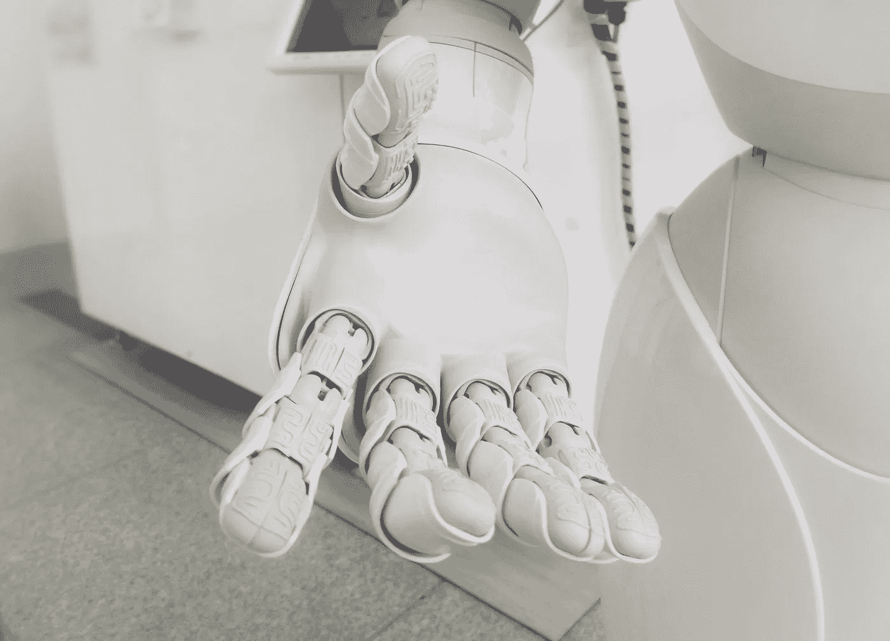
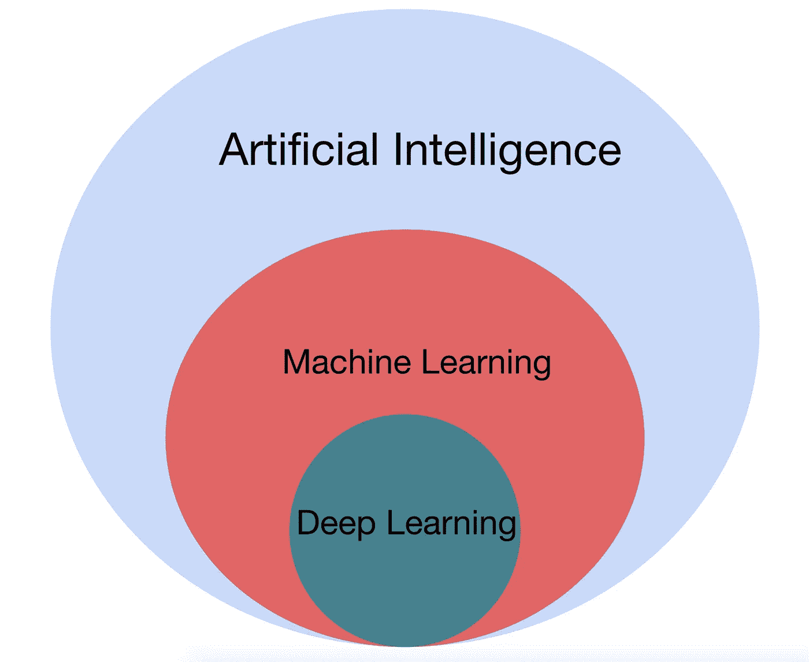

# 非技术性人工智能指南

> 原文：<https://towardsdatascience.com/the-non-technical-guide-to-artificial-intelligence-e9e5da1a15c5?source=collection_archive---------6----------------------->

(Image Source: [https://unsplash.com/photos/jIBMSMs4_kA](https://unsplash.com/photos/jIBMSMs4_kA))

根据麦肯锡的数据，从现在到 2030 年，人工智能将创造约 13 万亿美元的 GDP 增长。相比之下，2017 年整个美利坚合众国的国内生产总值约为 19 万亿美元。领先的人工智能科学家，如吴恩达，将人工智能描述为第四次工业革命或“新电力”。人工智能无疑是数字化转型的核心，它在整个行业的应用将极大地改变我们的世界和我们做生意的方式。问题是，许多人想参与这场人工智能革命，但他们被其技术复杂性所淹没。他们不知道人工智能有什么能力，更不用说如何为他们的公司使用它了。而这正是这篇博文旨在解决的问题:让没有技术背景的人更容易理解人工智能，这样他们就能够自己评估人工智能的可能用例。这很重要，因为没有人比他们更了解他们业务的来龙去脉，他们可以就如何在公司内使用人工智能提出最有价值的想法。
请注意，这篇文章很大程度上受到了 [Andrew NG 在](https://en.wikipedia.org/wiki/Andrew_Ng)关于这个话题的内容的启发。
那么“流行语”的背后是什么？让我们直入主题吧。

## **目录:**

*   对人工智能的误解
*   什么是机器学习？
*   人工智能术语
*   什么是数据？
*   你如何获得数据？
*   数据的误用
*   摘要

# **对人工智能的误解**

(图片来源:[https://unsplash.com/photos/1K6IQsQbizI](https://images.unsplash.com/photo-1484069560501-87d72b0c3669?ixlib=rb-1.2.1&ixid=eyJhcHBfaWQiOjEyMDd9&auto=format&fit=crop&w=2700&q=80))

围绕 AI 有很多不必要的炒作，这大多是因为很多人都有一个共同的误解。人工智能可以分为两个部分或两个想法:

## **人工狭义智能(ANI)**

这描述了擅长一个特定任务的人工智能，他们在这个任务上被训练和发展。例如，这可以是一个基于历史数据预测房价的人工智能系统，或者是向你推荐 youtube 视频的算法。其他例子有预测性维护、质量控制等。ANI 是一个非常强大的工具，它将在未来几年为我们的社会增加很多附加价值。我们近年来看到的所有进步，以及我们经常在新闻中听到的，都发生在 ANI 领域。这些吸引人的新闻文章使人们错误地认为科学在 AGI 取得了很大进步，但事实上我们只在一个方面取得了进步

## **人工通用智能(AGI)**

这是人工智能的最终目标:**一个和人类一样聪明或者比人类更聪明的计算机系统**。AGI 能成功地完成任何人类能完成的智力任务。这也是人工智能在人类中引起最大恐惧的部分。他们想象一个计算机比人聪明得多的世界，几乎所有的工作都是自动化的，甚至是类似终结者的场景。这就是我说的不必要的炒作。这导致了对人类未来的非理性恐惧，而事实上，**我们距离真正的 AGI** 还有许多技术突破。

# **什么是机器学习？**

你可以说机器学习是人工智能的支柱技术。它使用**统计技术赋予计算机程序从数据中学习的能力(例如，逐步提高其在特定任务中的性能)，而无需显式编程**。

机器学习是人工智能的工具，它引起了所有的炒作，并且**实现了几乎所有通过人工智能系统创造的价值。**它也可以分成不同的部分，但只有一个部分负责通过机器学习创造的 80%的价值。我说的是**监督学习**。

监督学习算法只是通过学习大量数据中的关系来学习**输入(A)到输出(B)的映射**。想象一下，您想要构建一个可以将电子邮件分类为垃圾邮件和非垃圾邮件的系统。你需要积累大量“有标签的”电子邮件的例子。这意味着每封电子邮件都有一个标签，它会告诉你它是否是垃圾邮件。你需要积累成千上万封带有标签的电子邮件，然后你可以将这些数据输入到有监督的机器学习算法中。在训练过程中，该算法将分析你给他的所有电子邮件，并迭代地提高对垃圾邮件和非垃圾邮件的属性区分的理解。在这个例子中，系统必须将电子邮件(A)映射到一个标签，该标签表明该邮件是否是垃圾邮件(B)。

就像我说的，你通过给他几千封带标签的邮件来训练算法。在你对这些数据进行算法训练后，你可以给他一封全新的电子邮件(该算法从未见过)作为输入，它会告诉你它是否认为该电子邮件是垃圾邮件。另一个例子是在线广告，其中输入是关于用户的信息(A ),系统的输出是告诉用户是否会点击添加的标签(B)。另一个例子是语音识别，其中输入是作为音频文件的语音(A ),输出是音频文件中所说内容的抄本(B)。另一个例子是，当你给算法一张钢板的图像(A)时，它必须告诉算法它是有缺陷的还是无缺陷的(B)。

乍看之下，这似乎是一项相当有限的技术，但如果你为它找到正确的应用，它会非常强大。这是通过人工智能为我们的社会创造附加价值的唯一主要原因。这项技术的不同用例似乎是无穷无尽的，人们每天都会发现新的用例。

# **人工智能术语**

人工智能是一个非常复杂的领域，有很多术语，一开始可能会很混乱。你可能听说过神经网络、深度学习或数据科学。我们现在将看看人工智能最重要的术语，并揭示它们的含义，以便您能够与其他人谈论人工智能，并思考如何在您的业务中应用人工智能。

我给你最常用的人工智能术语的定义，但是请注意**人工智能是一个非常不透明的领域，许多术语可以互换使用**并且有时不一致。

## **人工智能**

人工智能是计算机科学的一个领域，强调创造像人类一样工作和反应的智能机器。就像我已经提到的，当人们谈论人工智能时，他们大多指的是人工通用智能(AGI)。你应该将 AI 视为整个领域，将机器学习和深度学习视为用于使计算机智能行为的技术。

## **机器学习**

机器学习是人工智能的一个子领域。这是一个研究领域，它赋予计算机从数据中学习的能力，而无需显式编程。所以有了机器学习，基本上就是训练程序去执行某个任务。所以机器学习往往会产生一个正在运行的 AI 系统，基本上就是一个软件。

机器学习项目的例子:
假设你是一家房地产公司，你有很多关于房子的数据。你与一家机器学习公司合作，建立一个机器学习系统来预测未来的房价。这样的系统可以让你更好地决定投资哪栋房子，并计算出清算投资的正确时间。

## **深度学习**

深度学习是机器学习的一个子部分，它是所有媒体炒作和 ANI 大部分突破的原因，我们近年来看到了这些突破，今天仍然可以看到。

这基本上与机器学习是一回事:你给算法贴上标签的数据，它就学会预测标签。**与机器学习的区别在于，你使用更现代、更复杂的算法，称为神经网络**。相比之下:在机器学习中，你使用更简单、传统的算法。

由于它们的复杂性、新的技术发现以及足够数据和计算能力的可用性，深度学习算法能够在许多任务上打破以前的基准，甚至在某些任务上超过人类(例如:组织病理学图像分析，或者推荐关于网飞的电影)。

虽然，神经网络(例如，深度学习算法)几乎总是比传统算法执行得更好，但是它们具有某些缺点。如果你想了解更多，可以看看我的文章:“神经网络的利与弊”([https://towardsdatascience . com/hype-missions-of-Neural-Networks-6af 04904 ba5b](/hype-disadvantages-of-neural-networks-6af04904ba5b))。

你经常听说神经网络是像人脑一样构建的，或者是受其启发而构建的，但实际上，它们几乎没有任何关系。的确，它们最初是由大脑激发的，但是它们如何工作的细节与生物人脑如何工作完全无关。

请注意，许多人交替使用深度学习和神经网络这两个术语。

深度学习项目的例子:
当你从高层次的角度看时，深度学习项目与机器学习项目并没有太大的不同。你只需要更多的数据、更强的计算能力和高技能的工程师。

## **数据科学**

数据科学项目的输出通常是一组见解，可以帮助您做出更好的商业决策，例如决定是否投资某个项目，是否应该获得某些设备，或者是否应该重新构建您的网站。你可以说**数据科学是通过使用统计方法**、可视化等分析数据来从数据中提取知识和见解的科学。输出通常是演示文稿或幻灯片，总结结论，供高管、领导或产品团队做出某些决策。

数据科学项目的例子:
假设你在网络广告行业。通过分析你公司的销售数据，你的数据科学家发现旅游行业并没有从你这里购买很多附加产品。因此，你可以将销售团队的重点转向旅游行业的公司。

另一个例子:
假设你正在经营一家电子商务公司，你雇佣了一些数据科学家来深入了解你的业务。该项目的成果可能是一张幻灯片，展示如何修改定价以提高整体销售额的计划，或如何更有效地营销特定产品的见解。

有人说 AI 是数据科学的子集，有人说正好相反。所以，这取决于你在和谁说话，但我会说，数据科学是一个跨学科的领域，它使用了许多来自人工智能机器学习和深度学习的工具，但它也有自己单独的工具。它的目标主要是推动商业洞察力。

你可能也听说过其他的流行词汇，比如强化学习、生成性对抗网络(Gans)等等。这些只是让人工智能系统智能行动的其他工具，或者换句话说，进行机器学习，有时进行数据科学。

你现在知道人工智能、机器学习、数据科学和深度学习(例如神经网络)。我希望这让你对人工智能中最常用的术语有所了解，并且你可以开始思考这些东西如何应用到你的业务中。

# **什么是数据？**

数据可以采取多种形式:电子表格、图像、音频、传感器数据等。这些数据分为两大类:结构化和非结构化数据。

**结构化数据(“存在于巨大电子表格中的数据”)**
结构化数据，顾名思义，**按照预定义模式以结构化格式存储的数据**。它是指驻留在记录或文件的固定字段中的任何数据。它可以是文本的，也可以是非文本的。
下面你可以看到一个来自流行的 Titanic 数据集的结构化数据的例子。它包含了泰坦尼克号上每位乘客的信息。

**非结构化数据**
非结构化数据本质上是指未通过预定义模式结构化的所有其他数据。它可以是文本或非文本的，但是**当人们谈论非结构化数据时，他们通常指的是图像、视频、音频文件、文档等。**

我已经解释了什么是监督学习。由于监督学习是最常用的机器学习类型，**当人们说“数据”时，他们大多指的是带标签的数据**。例如:您有一个包含 100，000 只狗和猫的照片的数据集，其中每张照片都有一个标签，要么是“猫”，要么是“狗”。
另一个例子是包含房价信息的数据集。在这里你会有关于房子的信息(如平方米，卧室数量，位置等。)以及它们作为标签的价格。

# **如何获取数据？**

你可以在互联网上找到许多问题的数据集(有些是免费的，有些是收费的)，但大多数时候你需要创建自己的数据集(如果你还没有)，专门为你试图用人工智能解决的问题量身定制。

获取数据有三种主要方式:

## 1.人工标记

假设您想要构建一个分类器，它可以检测给定图片上是男人还是女人。为了训练这样一个分类器，你需要创建或获取许多男人和女人的图像。然后，你需要给每个图像分配一个标签:男人(标签 1)或女人(标签 2)。你也可以花钱请人帮你贴标签。:亚马逊机械土耳其人:mturk.com)。

## 2.观察行为。

想象一下，你经营一家电子商务公司，想要预测客户何时会购买，这反过来使你能够更好地管理你的股票等。你可以通过简单地观察你的用户在你的网站上的行为以及他们如何购物来创建一个数据集。这将产生描述每个用户的动作的数据集(由一些变量描述，例如:一天中的时间、他们点击的位置等。)，加上一个标签:购买(标签 1)或者不购买(标签 2)。
另一个例子是，您观察机器的行为，这可以帮助您预测机器何时需要维护等。

## 3.使用免费的数据源，购买数据，或者从合作伙伴那里获取数据

像 [Kaggle](http://kaggle.com) 这样的数据集有很多免费来源。你也可以使用[谷歌数据搜索](http://toolbox.google.com/datasetsearch)，它的工作方式类似谷歌，但只针对数据集。如果您没有找到任何东西，您可以在数据市场上寻找数据集，或者从合作伙伴那里获得数据集。

# **数据误用**

(图片来源:[https://unsplash.com/photos/1K6IQsQbizI](https://unsplash.com/photos/1K6IQsQbizI))

初看起来，获取数据似乎很简单，但是可能会出错。**在人工智能&机器学习中，我们说:“垃圾进垃圾出”，这意味着你从你的人工智能系统中获得了质量，你在训练中投入了质量。**

想象一下，你知道你想要创建一个特定的 AI 应用程序，你开始获取数据(你认为有用)。你的计划是积累两年的数据，然后建立一个 AI 系统。这是非常糟糕的做法。在这种情况下，正确的方式应该是获取你能够获得的数据，并尽快将其交给人工智能专家。他可以在经过一番评估后告诉你，其中哪些部分是有用的，哪些部分是完全没用的，你应该额外补充哪些数据。这样做，你就不会有这样的风险:你在两年内获得了数据，然后你意识到这是错误的数据，你不能用它做任何事情。为了节省金钱和时间:与专家一起快速评估您的数据质量。

另一个大问题是不正确的标签。例如:被标记为狗的猫图像和被标记为猫的狗等。你明白我的意思。这阻止了你的算法学习真正区分猫和狗的东西，并完全混淆了它。好消息是，随着数据总量的增加，错误标签的问题变得越来越不重要。如果你有一个超过 200 万张带标签的猫狗图片的巨大数据集，一些不正确的标签不会影响它的性能。

另一个问题是，一些人假设，因为他们的公司有很多数据，这些数据是有用的，或者一个人工智能团队可以让它变得有用。那是完全错误的。**虽然，数据越多通常越好，但你可以有数十亿的数据条目，这些条目毫无价值，即使是世界上最好的人工智能工程师也无法从毫无价值的东西中创造价值。因此，请不要把数据扔给人工智能团队，并假设它在某种程度上是有价值的。你可能认为这是常识，但我在业内多次看到这种情况，因为对数据和 AI 的一种误解。甚至有创业公司的成立是因为人们认为他们拥有有用的数据，而事实上他们没有。其他问题包括缺少值、多种类型的数据(可以解决，但代价很高)等等。**

# 摘要

我希望这篇文章从高层次的角度为你提供了人工智能领域的坚实介绍，并且你现在对人工智能如何工作以及它真正能做什么有了更好的理解。如果你觉得有什么遗漏或者解释的不够清楚，可以在评论里告诉我。总结:你了解了关于人工智能的常见误解(例如，人们经常混淆 AGI 和人工智能)，以及机器学习和数据到底是什么。你现在已经熟悉了该领域最常见的术语:数据科学、深度学习、人工智能和机器学习。此外，你还学习了从哪里获取数据，你不应该如何获取数据，以及拥有大量数据并不一定意味着你可以用它来做人工智能。

**这篇文章最初发表在我的博客上(**[**【https://machinelearning-blog.com】**](https://machinelearning-blog.com/)**)。**