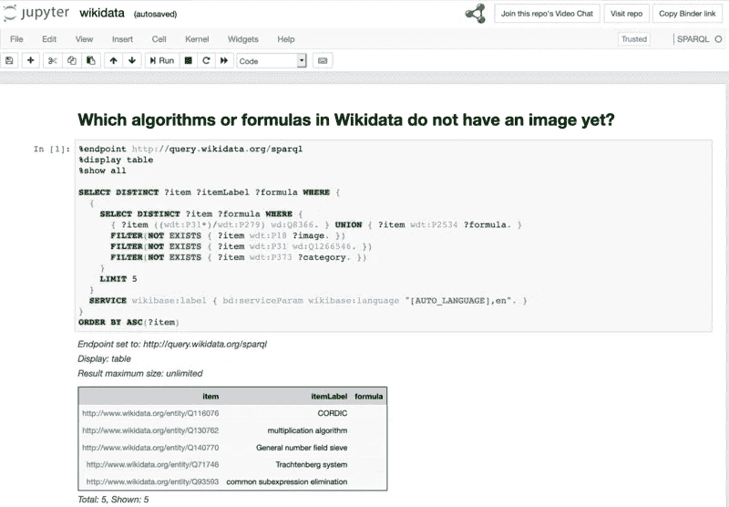
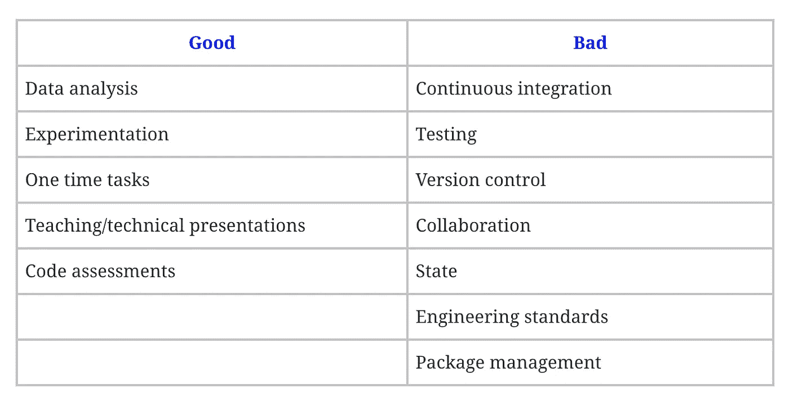

# 笔记本反模式

> 原文：<https://towardsdatascience.com/the-notebook-anti-pattern-b1b55910929e?source=collection_archive---------11----------------------->

在过去的几年中，试图解决将机器学习模型引入生产的挑战的工具有了很大的增加。这些工具似乎有一个共同点，那就是将笔记本电脑整合到生产流程中。本文旨在解释为什么这种在生产中使用笔记本的趋势是一种反模式，并给出一些建议。

# 什么是笔记本？

我们先来定义一下这些是什么，给那些没接触过笔记本的读者，或者换个称呼。

笔记本是网络界面，允许用户创建包含代码、可视化和文本的文档。它们看起来如下:

Image credit to [https://commons.wikimedia.org/wiki/File:Screenshot_of_a_Jupyter_Notebook_with_SPARQL_kernel_after_running_a_query_to_the_Wikidata_Query_Service_as_of_21_September_2020.png](https://commons.wikimedia.org/wiki/File:Screenshot_of_a_Jupyter_Notebook_with_SPARQL_kernel_after_running_a_query_to_the_Wikidata_Query_Service_as_of_21_September_2020.png)

# 笔记本有什么用？

与你从介绍中可能得到的相反，笔记本并不都是坏的。它们在某些情况下非常有用，这将在下面的小节中描述。

## 数据分析

这可能是它们最常见的用途。当遇到一个新的数据集时，人们需要挖掘数据并进行某些可视化，以便理解它。笔记本电脑有助于实现这一点，因为它允许我们:

*   快速开始
*   在一个地方查看原始数据和可视化
*   可以使用许多现有的清洁和可视化工具
*   记录我们的进展和发现(可以提取为 HTML)

## 实验

当谈到机器学习时，在选择解决问题的最终方法之前，会进行大量的实验。笔记本可以用来处理数据和各种模型，以便了解哪些数据适用，哪些不适用。

## 一次性任务

笔记本也是一个很好的游乐场。有时，一个人需要执行一次自动化的任务，但可能不熟悉或不习惯编写 bash 或使用其他类似的工具。

## 教学或技术演示

在讲授 python 或为同行进行技术演示时，您可能希望在后面立即显示代码和代码的结果。笔记本在这方面非常有用，因为它们允许你在同一个文档中运行代码并显示结果。它们可以显示可视化，用标题表示部分，并提供演示者可能需要的附加文档。

## 代码评估

如果你的公司向候选人提供代码挑战，笔记本可能是一个有用的工具。这个也要看你的公司需要考核什么。笔记本允许候选人将文档、解释和他们的解决方案合并到一个页面中。如果候选人给出了一揽子要求，他们也很容易为评估员运行。然而，他们不能提供的是对候选人对软件工程原理的理解的足够广泛的评估，我们将从下一节中更好地理解。

# 笔记本不擅长什么？

如今，许多公司都在努力解决将模型投入生产的难题。这些公司中的数据科学家可能来自非常不同的背景，包括:统计、纯数学、自然科学和工程。他们有一个共同点，那就是他们通常习惯使用笔记本电脑进行分析和实验，因为该工具就是为此目的而设计的。因此，提供基础设施的大公司一直致力于通过在笔记本电脑生态系统中提供“一键式部署”工具来弥合“生产差距”，从而鼓励在生产中使用笔记本电脑。不幸的是，由于笔记本电脑从一开始就不是为此目的而设计的，这可能会导致生产系统不可维护。

生产笔记本的想法总是让我想到连体画的实用性——*看起来很美，但在某些场景下非常不实用。*

现在我们知道了笔记本电脑可以做得很好的地方，让我们在下面的章节中深入了解它们真正不擅长的地方。

## 持续集成

笔记本电脑不是为通过 CI 渠道自动运行或处理而设计的，因为它们是为探索而设计的。它们倾向于涉及文档和可视化，这将给任何 CI 渠道增加不必要的工作。尽管可以将它们提取为普通的 python 脚本，然后在 CI 管道上运行，但是在大多数情况下，您会希望为脚本运行测试，而不是脚本本身(除非您正在创建一些需要由管道公开的人工制品)。

## 测试

笔记本不可测试，这是我对它们的主要痛点之一。没有围绕这些创建测试框架，因为它们的目的是作为游戏场所，而不是生产系统。与流行的观念相反，数据产品中的测试与其他软件产品中的测试一样重要和可能。为了测试一个笔记本，需要将笔记本上的代码提取到一个脚本中，这意味着笔记本无论如何都是多余的。它需要被维护以匹配提取的脚本中的代码，否则会陷入一些未经测试的混乱状态。

如果您想了解更多关于测试 ML 管道的知识，请查看文章:[测试您的 ML 管道](/testing-your-machine-learning-ml-pipelines-81f9c436727c)。

## 版本控制

如果您曾经不得不在 git 或任何其他版本控制系统上放置一个笔记本并打开一个拉请求，您可能已经注意到这个拉请求是完全不可读的。这是因为笔记本需要跟踪单元格的状态，因此当它运行来创建您漂亮的 HTML 视图时，幕后会发生许多变化。这些更改也需要版本化，导致视图不可读。

当然，您可能在一个使用配对而不是拉请求的团队中，所以您可能不关心拉请求不可读。但是，由于可读性降低，您失去了版本控制的另一个优势:当恢复代码，或者查看旧版本中可能引入或修复了问题的更改时，您需要完全依赖提交消息并手动恢复以检查更改。

这是笔记本电脑的一个众所周知的问题，但也是人们正在努力解决的问题。至少在你的版本控制系统的 web 视图中，有一些插件可以用来缓解这个问题。这种工具的一个例子是[回顾笔记本应用](https://github.com/marketplace/review-notebook-app)。

## 合作

在笔记本上协作很难。你唯一可行的合作选择是配对，或者像文明的游戏一样在笔记本上轮流。这就是为什么:

*   笔记本有许多在后台管理的状态，因此在同一个笔记本上异步工作会导致许多不可管理的合并冲突。对于远程团队来说，这可能是一个特别的噩梦。
*   所有的代码都在同一个地方(除了导入的包)，因此相同的代码会不断地发生变化，这使得跟踪变化的效果变得更加困难。由于缺乏测试(如上所述)，这尤其糟糕
*   上面版本控制中已经提到的问题

## 状态

国家在上面都已经提到了，但它值得自己的重点。笔记本有笔记本宽状态。每次运行单元时，此状态都会发生变化，这可能会导致以下问题:

*   不可管理的合并冲突发生在状态内部，而不是代码本身
*   版本控制缺乏可读性
*   缺乏可重复性。您可能已经在笔记本中处理了一个不再可重现的状态，因为导致该状态的代码已经被删除，但是该状态还没有被更新。

## 工程标准

笔记本鼓励糟糕的工程标准。我想在这里强调一下**鼓励**这个词，因为笔记本用户可以避免很多这样的事情。笔记本中常见的反模式有:

*   **依赖状态**:笔记本严重依赖状态，尤其是因为它们通常涉及到对前几个单元格中的数据执行一些操作，以便将这些数据输入到一些算法中。对状态的依赖会在整个代码中导致意想不到的后果和副作用。
*   复制:人们不能将一个笔记本导入到另一个笔记本中，因此当在不同的笔记本中尝试多个实验时，人们倾向于复制粘贴相同的部分。如果这些笔记本中有一本发生变化，其他的就会立即过时。这可以通过提取代码的公共部分并将其导入到单独的笔记本中来改善。在笔记本本身中也可以看到很多重复，尽管这很容易通过使用功能来避免。
*   **缺乏测试**:我们无法测试一台笔记本电脑，正如我们在上面的测试部分所看到的。

## 包装管理

笔记本没有包管理。笔记本使用安装在其运行环境中的软件包。需要手动跟踪该特定笔记本使用的包，因为在相同环境中运行的不同笔记本可能需要不同的包。一个建议是，总是在一个全新的虚拟环境中运行一个新的笔记本电脑，单独跟踪该特定笔记本电脑的要求。或者，一个环境中的所有笔记本都依赖于一个需求文件。

# 那么我们能做什么呢？

很好，现在我们知道了为什么生产中的笔记本电脑是一个坏主意，为什么我们需要停止把实验工具打扮成生产工具。然而，这给我们留下了什么？这取决于你的团队的技能和结构。您的团队很可能由以下人员组成:

*   具有工程技能的数据科学家
*   或者，数据科学家专注于实验，ML/数据工程师将模型投入生产

所以我们来看看下面的两个场景。

## 拥有工程技能的数据科学家团队

在这种情况下，您的数据科学团队负责端到端的模型。也就是说，负责实验和生产。以下是一些需要记住的事情:

1.  如果笔记本是首选工具，您可以继续使用笔记本进行实验，但在以下情况下，请远离笔记本:

*   合作
*   把模型带到你操场以外的任何地方

2.从现有的软件工程框架和原则中学习

*   [测试并验证管道](/testing-your-machine-learning-ml-pipelines-81f9c436727c)
*   [车型连续交付](https://www.thoughtworks.com/insights/articles/intelligent-enterprise-series-cd4ml)
*   [编写可维护的代码](https://medium.com/mindorks/how-to-write-clean-code-lessons-learnt-from-the-clean-code-robert-c-martin-9ffc7aef870c)
*   [一路重构](https://martinfowler.com/books/refactoring.html)

3.查看其中的一些工具和架构，它们可能会帮助您设计您的基础架构，或者只是提供一些灵感(请注意，有时可以选择笔记本电脑—这是一个陷阱！):

*   [Kubeflow](https://www.kubeflow.org/)
*   [蔚蓝 DevOps](https://azure.microsoft.com/en-us/services/devops/)
*   [TFX](https://www.tensorflow.org/tfx)
*   [使用 AWS lambda 部署模型](https://aws.amazon.com/blogs/machine-learning/how-to-deploy-deep-learning-models-with-aws-lambda-and-tensorflow/)

## 工程和数据科学技能的分离

一些较大的组织更喜欢更专业的技能，数据科学家从事实验工作，ML/数据工程师将这些工作投入生产。以上场景中列出的要点仍然适用，但我有一个针对此场景的额外建议:

*求求你，求求你* ***不要把模特扔过围栏！*** *坐在一起，交流并结对/mob 编程，将管道投入生产。* ***除非为最终用户提供价值，否则模式不会起作用。***

# 结论

像任何工具一样，有使用笔记本的地方，也有避免使用笔记本的地方。让我们做最后一次回顾。

总之，我希望您能从这篇文章中获得两条信息:

1.  给 ML 从业者:笔记本是用来实验的，不是用来生产的。坚持将软件工程原理和框架用于生产，它们是根据我们应该利用的过去的经验设计的。
2.  对开发工具的人来说:我们很感谢你让每个人的工作变得更简单，♥，但是请不要再使用笔记本反模式了。专注于创建易于使用的工具，鼓励积极的软件工程模式。我们想要:

*   易测性
*   版本控制
*   合作
*   再现性
*   可量测性

*原载于 2019 年 10 月 21 日*[*http://intothedepthsofdataengineering.wordpress.com*](https://intothedepthsofdataengineering.wordpress.com/2019/10/21/the-notebook-anti-pattern/)*。*