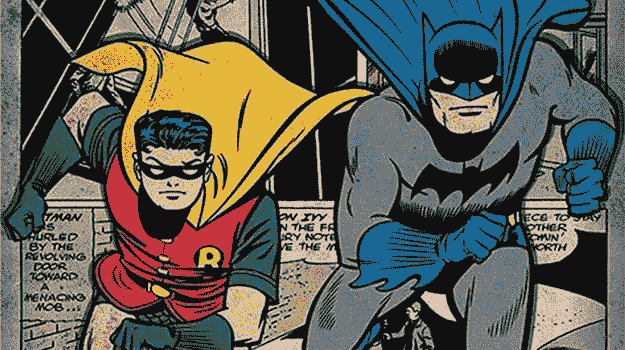
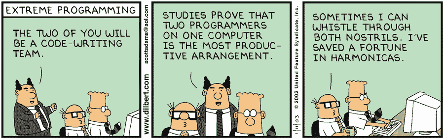
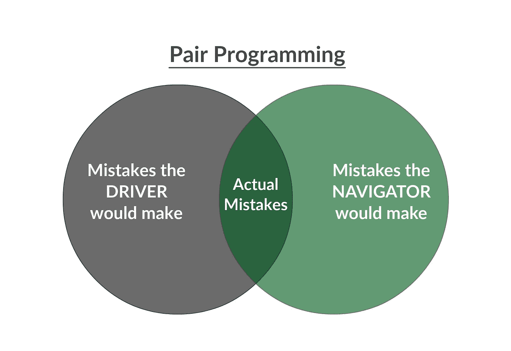
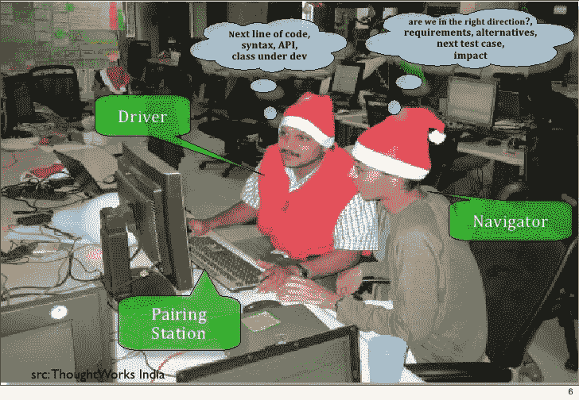
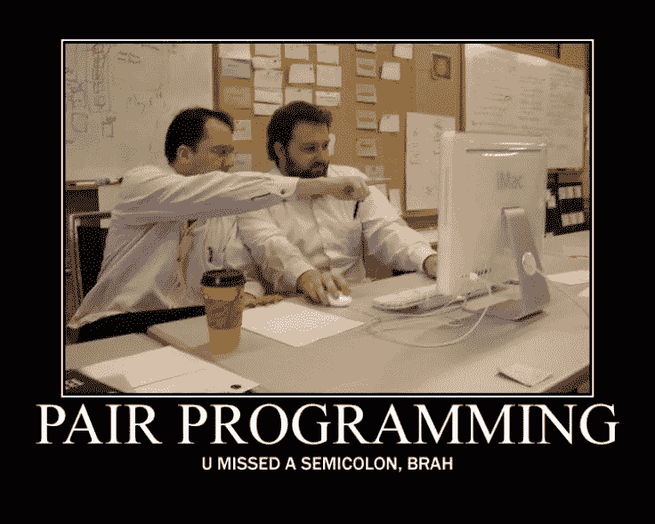

# 古语云:“三个臭皮匠，顶个诸葛亮。”

> 原文：<https://towardsdatascience.com/the-old-saying-two-heads-are-better-than-one-4c7d133e16a4?source=collection_archive---------13----------------------->

## 结对编程——一些历史、技术和我坚决支持它的原因。

我经常听到人们说，当他们独自工作时，他们能够发挥出最佳水平。还有，我明白有些想法/方法对一个人有利，对另一个人未必有利。然而，我坚信“三个臭皮匠胜过一个诸葛亮”这句话下面的两个视频是两个人“和谐”合作并取得巨大成功的优秀音乐范例。第一首是莫札特的《D 大调四手联弹钢琴奏鸣曲，K.381/123a》，第二首是泽金哈·德·阿布鲁的四手联弹吉他作品《提科·提科·诺·福巴》:

*   [莫扎特四手联弹 D 大调奏鸣曲](https://www.youtube.com/watch?v=iy3y_zf9Ft8.)
*   [提科提科 no Fubá](https://www.youtube.com/watch?v=CcsSPzr7ays)

音乐当然不是合作有利于项目成功的唯一领域。布法罗大学的社会学教授迈克尔·p·法雷尔(Michael P. Farrell)在他的著作《 [**合作圈:友谊动态和创造性工作**](https://www.press.uchicago.edu/ucp/books/book/chicago/C/bo3645929.html) 》中对紧密的创造性群体进行了研究。这项研究着眼于六个合作圈子中的群体动态，如社会改革家伊丽莎白·卡迪·斯坦顿和苏珊·b·安东尼，以及 c·s·刘易斯、j·r·r·托尔金和《暗示》。他写道，*“大多数为新愿景奠定基础的脆弱见解，并不是在整个团队在一起时出现的，也不是在成员单独工作时出现的，而是在他们成对合作并相互回应时出现的。”*

Georges Braque and Pablo Picasso

纵观历史，协作为重大成果提供框架的情况屡见不鲜；莫奈和雷诺阿，巴勃罗·毕加索和乔治·布拉克，蝙蝠侠和罗宾……不胜枚举！事实上，在过去的 35 年里，大约一半的诺贝尔生理学或医学奖都颁给了科学合作伙伴。

在“**二的力量:在创造性的组合中寻找创新的本质**”中，约书亚·沃尔夫·申克引用了一段采访，其中约翰·列侬解释说，他或保罗·麦卡特尼将*“写出好的部分，简单的部分，比如‘我看了今天的新闻’或其他什么。”在另一个到来之前，他们中的一个会缺乏灵感。列侬接着说，*“我唱一半，他就会受到启发去写下一段，反之亦然。”任何人都可能时不时地陷入创作的困境，但两个人同时这样做是罕见的。**

维基百科上结对编程的正式定义是:

> [**结对编程**](https://en.wikipedia.org/wiki/Pair_programming) 是一种敏捷软件开发技术，两名程序员在一个工作站一起工作。一个是*驱动*，编写代码，而另一个是*观察者*或*导航者*，在每一行代码被输入时对其进行检查。这两个程序员经常交换角色。

结对编程不是轮流使用计算机，也不是采用老师对学生的方法。指导关系与两个人平等合作完全不同，即使其中一个人有更多的经验。**结对编程的核心是让两个人一起思考同一个问题，这样就可以比一个人单独解决问题更快、更高质量地开发出解决方案**。随着质量的提高，收益将在项目的后期显现。一开始可能会感觉很尴尬，但是像其他新技能一样，结对编程需要一些时间来适应。结对编程有点类似于约会；这是一种社交技能，会随着练习而提高。首要目标是努力以合作的方式发挥作用。这包括每个合作伙伴的给予和索取，无论他们的公司地位如何。一个普遍的观点是，配对程序的理想方法是并排坐在显示器前，前后滑动键盘。稍后会有更多相关信息…

结对编程的结构有两个角色:驱动者和导航者。

*   **驱动**就是手放在键盘上写代码的那个。
*   **导航员**是在输入每一行代码时对其进行观察和检查的人。

司机的根本工作是处理打字和将想法写入电脑的细节。然而，驾驶员的主要目标是在信任和支持下为导航员服务。如果他们有问题，他们应该表达自己的观点或挑战事物，但由于他们的主要工作是键入代码，他们很难提前几个步骤进行思考。虽然这需要在不完全理解任务的情况下舒适地工作，但这通常是一种更有效的工作方式。

另一方面，由于不必键入代码，导航器能够与更全面的上下文一起工作。导航器的总体目标是为驾驶员提供清晰和容易处理的信息。他们应该用一种更概念性的思维框架来思考这个问题。导航器应该及时地给驱动程序提供实现可接受的抽象级别所需的指令，这样驱动程序就可以最有效地输入它们。因为导航者是在一个更高的抽象层次上思考问题，他们对手头的整体任务和他们想要去的方向有一种感觉。

The diagrams I found had poor resolution quality, so I made this on creately.com

如果驾驶员在导航员指挥的时候有了下一步该做什么的想法，解决的办法就是交换角色。这可以帮助双方保持彼此同步。集思广益的时候互相交换想法不仅会减少错误，还会激发创造力和工作流程。出色的结对程序员的一个关键特征是知道什么时候说“让我们先试试你的想法。”

我能给结对程序员的一个建议是休息一下，互相问问题。这将有助于你们参与到有意义的对话中，并鼓励彼此加深理解。休息也是来回传递键盘的理想方式。

# 配对和工作站流程

A typical pair programming setup

在研究过程中，我发现有几种不同的配对策略。一些可能的配对选项可以在[这里](https://stackify.com/pair-programming-styles/)找到。在我为这个博客进行研究的过程中，我发现了一个更有趣的方法，叫做“**乒乓配对**”本质上，这种方法是这样的:

1.  编码员 A 写了一个新的测试，发现它失败了。
2.  编码器 B 实现通过测试所需的代码。
3.  程序员 B 编写下一个测试，发现它失败了。
4.  编码器 A 实现通过测试所需的代码。
5.  回到顶端。

这听起来不像是我理想中的工作流程，但我不会去敲打它，直到我尝试过。

最近我从一位同学那里了解到一件令人兴奋的事情，那就是 [Atom](https://atom.io/) 有一个名为 [Teletype](https://teletype.atom.io/) 的包，它允许开发人员与团队成员共享他们的工作空间，并实时协作编写代码。这是一个高级的屏幕共享门户，允许每个主机的访客在同一个工作区内单独键入和编辑代码。当主持人在文件之间移动时，协作者会自动跟随活动选项卡。我认为这是一个非常酷的功能，我肯定会在我的下一个项目中测试这个功能，看看我的团队的生产力是否可以提高。

# 一些好处:

*   结对压力有助于确保项目的及时交付
*   改进新团队成员的入职
*   更好的团队建设和沟通
*   降低修复缺陷的成本
*   更少的分心，导致更高的生产力
*   程序员信心的增加
*   提高满意度
*   持续审查

# 需要记住的一些提示:

全天“频繁地”交换角色是很重要的。你不必设置明确的计时器，因为它会中断工作流程。许多人建议你应该从几分钟到二三十分钟转换角色。成对轮换可能是有益的。然而，如果你是一个经理，总是特别地分配每一对或者选择接近项目发布的有选择性的对，这不是建议的方法。

> “从单独编程到协作编程的调整期就像吃了一个辣椒。第一次尝试，可能会因为不习惯而不喜欢。然而，你吃得越多，你就越喜欢它。”— [匿名](http://www.defprogramming.com/quotes-tagged-with/pair-programming/)

上面的引用真的引起了我的共鸣。此外，我写这篇博客的最初灵感来自于阅读《纽约客》的文章[“成就谷歌的友谊”](https://www.newyorker.com/magazine/2018/12/10/the-friendship-that-made-google-huge/amp?__twitter_impression=true&utm_source=Benedict%27s%20newsletter&utm_campaign=4dfe2fdf3b-Benedict%27s%20Newsletter_COPY_01&utm_medium=email&utm_term=0_4999ca107f-4dfe2fdf3b-70766589&fbclid=IwAR0ciOzmd_uG_1SFxoh5zjSLBFq_IEH5Q9WAed33LHmkkkIMXDvtISXsQ_o)(快来看看！很棒的读物)。这篇文章详细描述了杰夫·迪恩和桑杰·格玛沃特如何成为谷歌的高级研究员——该公司第一位也是唯一一位 11 级工程师。如果谷歌的两位顶级工程师能够成功地改变公司以及整个互联网的道路，这让我相信结对编程和实现高度之间有着重要的关联。

# 最后…

一位成功的敏捷编程教练卢埃林·法尔科(Llewellyn Falco)使用了短语“[强风格结对编程](http://llewellynfalco.blogspot.com/2014/06/llewellyns-strong-style-pairing.html)”他说*“为了让一个想法从你的大脑进入电脑，它必须经过其他人的手。这种编程风格完全是为了增加沟通和协作。”*我从卢埃林的博文中得到的主要启示是，沟通和协作是成功的基础。

就我个人而言，从经验来看，我在两人一组的环境中工作效率更高。我的音乐背景告诉我，比起成为独唱艺术家，我更喜欢在合奏中表演。这并不是说我依赖他人，而是说，当我觉得有义务比自己做得更好时，我的信心会成倍增加。还有，我是那种靠别人的精力吃饭的人。当我结对编程时，我的生产率显著提高。我目前的技能表明，我目前是一个更好的导航员，而不是司机，但我计划专注于在这两方面都很棒。我希望读完这篇文章后，你能明白为什么这种类型的合作受到鼓励，为什么它可能对你未来的项目有益。

lolz