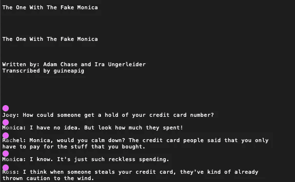

# 有所有朋友数据分析的那个

> 原文：<https://towardsdatascience.com/the-one-with-all-the-friends-analysis-59dafcec19c5?source=collection_archive---------18----------------------->

## 为最受关注的节目提供另类的视角


The crew ([source](https://wall.alphacoders.com/tags.php?tid=38393&lang=Portuguese))

《老友记》是我最喜欢的电视剧之一(可能是最喜欢的*)而且我肯定不止我一个人不止一次地重播了整个系列。我一直在想，对于这个如此熟悉的团体，是否还有什么需要了解的。看到[这个用 R](http://giorasimchoni.com/2017/06/04/2017-06-04-the-one-with-friends/) 看节目的帖子后，我觉得我自己也要试一试。这篇文章深入到该剧的剧本中去寻找更多的东西，包括最受欢迎的角色和他们在这几季中的旅程。但是首先它将介绍使用 Python 格式化文本文件并将其导出到 SQLite 数据库的方法。本项目中使用的文本文件包含来自电视节目 F.R.I.E.N.D.S .的脚本，并从[该资源库](https://fangj.github.io/friends/)下载。然后提供一些关于我们熟知的角色的有趣发现，有些是意料之中的，有些是令人惊讶的！这是一个非常有趣的爱好项目，也是我一直想做的事情。随意跳过编码部分，直接跳到可视化，希望你喜欢！*

# 遍历脚本

每个脚本都是一个文本文件，在脚本实际开始之前包含一些关于剧集、标题、作者和转录者的信息。我们需要找到一种方法将一个**脚本**转换成数据库中的行，然后解决如何为多个**脚本做这件事。**


Example of a Script in the .txt Files

我们将开始尝试迭代脚本。它们存储在多个文本文件中，并使用格式`season.episode`进行了有益的命名。我们可以利用 python 中的操作系统库来浏览我们的文本文件。


Currently where all Scripts are Stored

目前，下面的代码将遍历我们的`scripts`文件夹中的所有文件来获得`filename`。然后使用`.`分隔符分割文件名，这些数字存储在变量中，并附加到主列表中。创建`master_list`是因为最终我们想要将结果存储在数据帧中。

# 正则表达式

现在我们知道了如何浏览我们朋友的文件，我们需要看看如何从每个文件中分离出行。为了做到这一点，我将使用正则表达式，脚本是相当混乱的，格式都不同，取决于转录。相关的模式是`character_name: speech`，但是这有时会跨越多行。正则表达式就像一个真正强大的`ctrl-F`，它们被用来搜索字符串中的模式，一个很好的介绍可以在这里找到。我们的正则表达式的目的是匹配粉色点所指示的预期行之前的空间。我们的目标是找到这个空间，这样我们就可以使用这些位置分割整个文件，给我们提供字符-语音对组。



Purple dots indicate where the expression will match

使用的正则表达式如下所示。首先我们在冒号`\w+(?=:)`前匹配字符串，所以现在我们已经“找到”了每个字符的名称。然而，如果我们想匹配之前的空间，我们必须使用`\s`。您可以[自己测试一下](https://regex101.com/r/GFOGbq/2)，正如您在示例中看到的，正则表达式也匹配编写器和转录器之前的空格，这将需要在之后删除。现在我们用 python 实现正则表达式。在下面的代码中，我们也可以将角色的名字和语音分开。

这与我们在上一节中的循环相结合，并且`mater_array`被转换成熊猫数据帧:

# 清洁

尽管我们尽了最大努力，但结果仍未 100%可供分析。我们的第一个问题是每个字符有多个名称，这可以通过执行`sorted(df['char'].unique())`看到，这将返回列中所有唯一值的列表。要纠正这一点需要一些手工工作，包括查看某个名字的多种拼写，区分大小写！要更改名称，我们使用熊猫`replace`方法:

现在我们需要解决正则表达式引起的问题，因为它抓住了作者和转录者。这些行的格式都以结束于**。因此，正则表达式将冒号前的最后一个单词作为字符名。这意味着我们可以通过用**删除字符**来删除所有这些行。再见。**

*   由编写
*   **由转录**

********

****Clean data is key! via [gfycat](https://gfycat.com/gifs/search/monica+clean)****

# ****感情****

****在处理字符串时，情感分析就摆在桌面上，更深入的讨论可以在[这篇博文](https://quotennial.github.io/loveisland/)中找到。使用类似的方法，对于数据库中的每一行，计算情感分数并存储在`line_sent`列中:****

# ****导出到 SQL****

****现在，这可能不是一个必要的步骤，因为我们将使用的大多数 SQL 命令可以使用 pandas 来完成。然而，我认为有时改变不同的数据帧扫描有时会变得混乱，SQL 语言可以提供一种更可读的方式来访问这些数据。因此，我们现在要将熊猫数据帧移到 SQL 数据库中。我正在使用 SQLite 的 [DB 浏览器。](https://sqlitebrowser.org)****

****最后，我们的脚本被格式化并放置在 SQL 数据库中。这种方式的数据争论可以将原始数据转化为更有用的数据集。即使我们没有给数据集增加太多东西，不同的组织结构也可以进行更广泛的分析。现在我们有了以这种方式格式化的脚本，我们可以利用 SQL 来进一步深入了解该节目，如本文[中所述](https://quotennial.github.io/friends-analysis/)。****

********

****via [tenor](https://tenor.com/search/brand-new-information-gifs)****

# ****最受欢迎的朋友****

****这一部分着眼于剧中每个角色的角色。前一篇文章介绍了将数据放入 SQL 数据库的过程。这是为了使类似“在整个系列中谁的行数最多”这样的查询相当简单:****

********

****《瑞秋》以 9294 行位居榜首，《罗斯》紧随其后(9070 行)，每集平均 39 行左右。这并不完全令人震惊，因为它们都是 10 季的主要情节。几乎形影不离的是莫妮卡和钱德，分别是 8403 和 8398。****

********

****纵观整部剧的台词数量，我们可以看到罗斯和瑞秋一直主导着台词，直到第四季。这是伦敦集发生的时候，钱德勒和莫妮卡有了一个更大的共同故事，翻译了更多的台词。我认为菲比没有得到更多台词是一种耻辱，她每一季都有 800 句台词。雷切尔确实说过:****

> ****呃，有人离开这个团体只是时间问题。我一直以为菲比应该去。 *—拉结 5.05*****

# ****谈论最多的****

********

****via [giphy](https://giphy.com/gifs/Friends-season-2-friends-tv-S9ndPlQlnSnqvGMMZv)****

****说得最多的人并不一定意味着你最受欢迎，所以现在我们来看看谁说得最多。这是一个相当困难的任务，以准确捕捉每个字符的所有提及。一个可能的解决方案是列出每个角色的昵称(如果我漏掉了什么，请告诉我！).值得注意的是，这是我们在这篇文章中用来查找每个角色的参考资料的方法，使用下面详细描述的昵称。****

****为了得到计数，我们首先遍历字符，记录提及次数。使用嵌套的 for 循环来获取每个角色的昵称，我们使用 pandas `count()`方法来记录被提及的次数。****

********

****当只使用全名时，罗斯是被提及最多的。“Chan”、“Joe”、“Mon”和“Rach”都比他们的全名被提到更多。这支持了包含昵称的决定，但也强调了结果对选择正确的名字是多么敏感。****

********

# ****话****

## ****流行语****

****有一些流行的口号，例如“臭猫”在整个节目中被提到了 37 次。臭名昭著的“我们分手了”这句台词被提到了 17 次。乔伊的搭讪语“你好吗”被说了 37 次。****

## ****最大词汇量****

********

****via [tenor](https://tenor.com/view/joey-friends-wisdomous-gif-7498897)****

****另一个有趣的方面是每个角色使用的词汇。这是通过首先选择如上所示的主要人物所说的所有台词来完成的。之后所有非字母字符都被删除。然后，每个字符的每一行被拆分成单词(使用中间的空格进行拆分)并添加到一个集合中。一个集合不允许有重复的值，这非常适合我们在这种情况下的使用。****

****不出所料，罗斯名列榜首，他对恐龙的热情是整个系列的一个笑话。尽管他的职业生涯始于纽约史前历史博物馆，后来成为纽约大学的教授，但一些现实生活中的古生物学家[并不相信](https://redditblog.com/2015/10/24/an-actual-paleontologist-grades-friends-paleontologist-ross-gellar/)。看到乔伊排在最后，我肯定不是唯一感到惊讶的人。考虑到这个角色的典型漫画，乔伊似乎确实有一些话，即使是编造的！****

********

# ****你好吗？****

****由于我们已经为每条线计算了一个情感分数，所以我们能够在整个赛季中监控这个分数。****

********

****上图显示了瑞秋和罗斯在前两季的情感轨迹。计算每集的总情感分数，因为分数的范围在-1 到 1 之间，总分数将给出特定剧集中大多数情感的指示。****

****第 104 集是瑞秋拿到第一份薪水的地方，这可能是积极情绪的原因，第 117 集乔治·克鲁尼客串也是如此。罗斯在第一集经历了高潮和低谷，在第 112 集发现他怀了个男孩，然后在第 121 集和马赛尔说再见。最后，两个角色都在第 207 集出现了一个高峰，罗斯发现了，矛盾的罗斯发现瑞秋对他有感觉。这可能是为什么罗斯对那一集的总体感觉是“低调但积极的”。****

# ****网络****

****到目前为止，我们主要看了我们的朋友的孤立，这里我们将看到他们如何互动。看看一个角色提到另一个角色的次数，说出这部剧的名字，这样我们就可以画出每个角色与另一个角色之间的关系网络。下表显示了结果；从左至右阅读告诉我们，瑞秋提到自己 187 次，提到乔伊最多:739 次。从上到下读可以理解为瑞秋提到钱德勒 321 次，罗斯提到他 332 次，妻子(莫妮卡)提到他最多:622 次。****

****表格中有一些有趣的发现，瑞秋被罗斯提到最多(622 次，一次[让他付出了婚姻的代价](https://youtu.be/5-1-W-qH6Fc?t=253))，罗斯被瑞秋提到最多:550 次。有趣的是，虽然莫妮卡说钱德最多，但钱德说乔伊最多。****

********

****via [gfycat](https://gfycat.com/gifs/search/joey+e)****

****这张表格确实提供了一些见解，但这并不是审视这些发现的最令人满意的方式。所以我们可以使用 Github 上提供的功能[创建一个和弦图。每个字符部分的和弦的大小代表他们说了多少次连接字符的名字。换句话说，如果您从左到右阅读表中的值，这就是每个字符部分显示的内容。通过观察粉红色的切片，可以更清楚地看出乔伊和莫妮卡在钱德勒的提及次数中所占的比重。](https://github.com/fengwangPhysics/matplotlib-chord-diagram/blob/master/matplotlib-chord.py)****

********

# ****图和中心性****

****所以我们现在已经建立了一个朋友网络，我们可以计算他们每个人的中心性分数。中心性旨在回答这个问题:*谁是这个网络中最重要或最核心的人？*。显然这是一个取决于重要性定义的主观问题。在我们定义我们的重要性度量之前，我们必须首先把我们的表转换成一个图。我们将使用网络 x，使用上表中的值(存储在`network_data`中)创建一个有向加权图。节点是字符，权重是提及次数。我们还可以通过检查节点之间的边权重来检查图形是否创建正确。****

```
**out: {'weight': 426} # yay! it matches our table**
```

****现在我们已经创建了我们的图表，我们计算[特征向量中心性](https://www.youtube.com/watch?v=9vs1zSqd070)作为重要性的度量(用于谷歌的页面排名)。该算法旨在基于与重要人物的联系，量化人们在社交网络中的影响力。在这种情况下，我们将“重要性”定义为与重要人物的联系。通过强调与其他人的联系，很容易看出这一点如何适用于其他更大的网络，如 Twitter。使用“互动”(转发和喜欢)作为权重，这种算法可能能够给你一个网络中连接最多的账户，潜在地获得比关注者最高数量更多的洞察力。对任何希望衡量(或改变)公众意见的人来说，这是有价值的信息。****

****Networkx 使生活变得简单，应用`eigenvector_centrality_numpy`方法并定义权重来计算每个节点的分数。按重要性排序的结果如下所示。最初看到结果时，我很惊讶，但是当我想到这个措施时，它开始变得有意义了。我认为乔伊可以被视为团队的粘合剂，总是与其他角色互动。考虑到罗斯和瑞秋占据了彼此的大部分时间，看到他们在低端并不完全令人惊讶。这个帖子对菲比来说不太好🙁 ​ .这些结果是主观的，解释也是如此，我很想听听你对中心性分数的看法。****

****我希望你喜欢这个流行节目中的另类观点。虽然我知道《老友记》可能不是每个人都喜欢的，但我确实认为这种分析可以适用于几乎任何长期播出的剧集。也许你可以为你最喜欢的节目尝试一些类似的东西，让我知道你找到了什么！****

****感谢阅读🙂****

*****原载于*[*【https://quotennial.github.io/friends-analysis/】*](https://quotennial.github.io/friends-analysis/)****