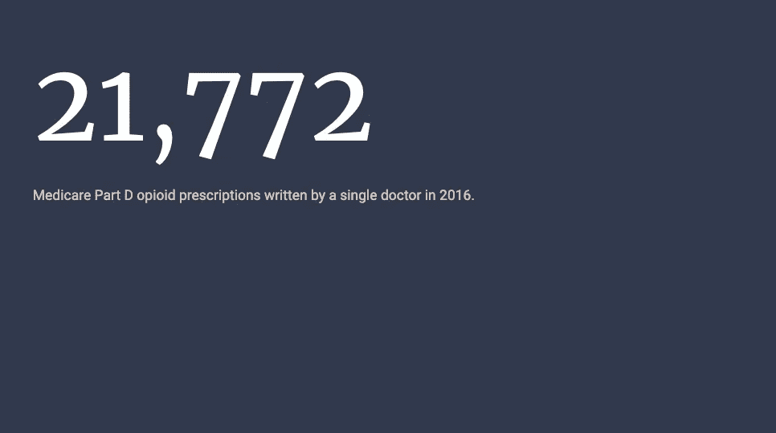
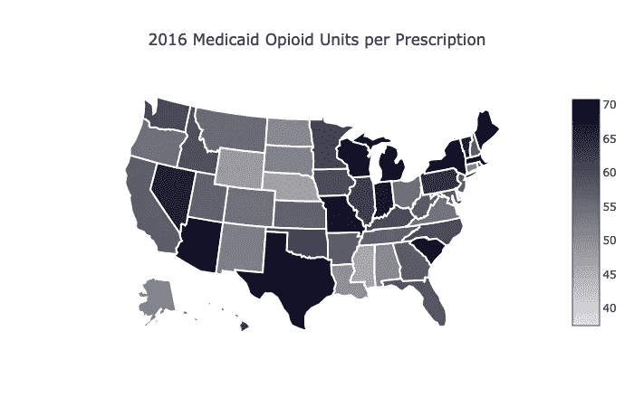
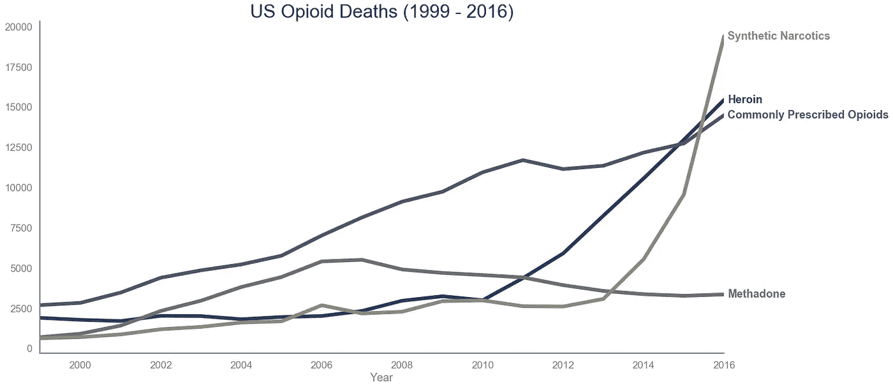

# 数据中的阿片类药物危机

> 原文：<https://towardsdatascience.com/the-opioid-crisis-in-data-16098bd6dd55?source=collection_archive---------17----------------------->

## 使用医疗保险和医疗补助处方数据探索性分析阿片类药物过量死亡

Photo by [rawpixel](https://unsplash.com/photos/K1PGQK2coPM?utm_source=unsplash&utm_medium=referral&utm_content=creditCopyText) on [Unsplash](https://unsplash.com/search/photos/drugs?utm_source=unsplash&utm_medium=referral&utm_content=creditCopyText)

众所周知，美国正处于阿片类药物危机之中。

可以争论的是这场危机的原因。作为一名药学出身的人，我对处方很感兴趣。具体来说，如果我能找到阿片类药物处方和过量死亡之间的关联。

## 背景

阿片类药物流行是一个全国性的问题，涉及处方止痛药和非法阿片类药物，这两种药物都可能导致潜在的致命过量。

它始于 20 世纪 90 年代末，当时制药公司开始推广处方止痛药，承诺可以缓解疼痛而不会上瘾。

医生开始更频繁地开出处方，阿片类药物的销量飙升。

成千上万的人开始滥用止痛药，其中许多人上瘾或用药过量。

## 奥施康定滥用

奥施康定于 1996 年首次亮相，其制造商普渡制药公司大力宣传其可提供 12 小时止痛效果。

然而，即使在上市之前，临床试验表明患者只能获得大约 8 小时的疼痛缓解。随着药效逐渐消失，患者会出现戒断症状——包括强烈的药物渴求——这会促进成瘾和依赖。

正如《洛杉矶时报》的文章所述，超过 700 万美国人滥用奥施康定——这种药物通常被认为是引发阿片类药物流行的罪魁祸首。

## 阿片类药物概述

阿片类药物是一类从罂粟植物中提取的高成瘾性麻醉物质，包括合法的和非法的。它们可以是处方止痛药(Percocet、MS Contin、Duragesic)或街头毒品(海洛因)。

所有阿片类药物都会刺激大脑中的阿片受体。虽然它们的威力各不相同，但它们都会抑制中枢神经系统(减缓身体功能——包括呼吸)，减少身体和心理上的疼痛。

## 阿片效应

阿片类药物有许多有益的作用，最明显的是缓解疼痛。它们也能引起放松和舒适的感觉，困倦，并能抑制咳嗽。

不幸的是，它们也有许多不利影响。一些最常见的负面影响包括便秘、恶心和呕吐、嗜睡和情绪波动。

使用阿片类药物还会导致成瘾，在过量的情况下，会导致呼吸衰竭和死亡。

## 数据

数据来自几个公开的来源。

*   [**医疗补助数据**](https://data.medicaid.gov/State-Drug-Utilization/State-Drug-Utilization-Data-2016/3v6v-qk5s) :该数据集报告由州医疗补助机构支付的承保门诊药物的药物利用数据。数据包括州、药品名称、NDC、处方数量和报销金额。
*   [**2016 年 Medicare D 阿片类药物处方者汇总文件:**](https://data.cms.gov/Medicare-Part-D/Medicare-Part-D-Opioid-Prescriber-Summary-File-201/6wg9-kwip) 该文件显示了参与 Medicare D 部分计划的提供者的阿片类药物处方率。这是一个处方者级别的数据集，包含处方者专业、州和邮政编码的阿片类药物索赔的数量和百分比信息。

A single provider wrote over 21,000 opioid prescriptions in 2016 — just for Medicare Part D patients!

*   [**Medicare 提供者利用和支付数据集:**](https://data.cms.gov/Medicare-Part-D/Medicare-Provider-Utilization-and-Payment-Data-201/yvpj-pmj2) 该文件包含 D 部分参与提供者处方的药物级别信息，按品牌和通用名列出。
*   [**药品数据:**](http://www.ncqa.org/hedis-quality-measurement/hedis-measures/hedis-2018/hedis-2018-ndc-license/hedis-2018-final-ndc-lists) 药品数据来自 HEDIS 用药列表目录。药物按品牌和通用名以及药物类别列出。
*   [**死亡数据:**](https://wonder.cdc.gov/mcd.html) 死亡数据取自 CDC WONDER。数据基于死亡证明，包含单一潜在死因和多达 20 种其他多种死因。

## 质疑疾控中心奇迹

[CDC WONDER](https://wonder.cdc.gov/wonder/help/faq.html#1) 是一个“向公众提供疾病控制和预防中心(CDC)信息资源”的在线系统。。。使用 CDC WONDER，您可以搜索和阅读关于公共卫生问题的已发布文件。。。并在疾控中心的信息系统上查询数字数据集。”在这种情况下，我们感兴趣的是死亡率数据。

死亡是用 ICD-10 编码分类的。使用潜在的死亡原因代码识别药物中毒死亡:

*   **X40–X44(意外中毒)**
*   **X60–X64(故意自我投毒)**
*   **X85(毒品袭击)**
*   **Y10–Y14(不明原因中毒)**

药物中毒死亡通过 ICD-10 分类代码进一步分类:

*   **T40.0 鸦片**
*   **T40.1 海洛因**
*   **T40.2 其他阿片类药物(羟考酮、氢可酮、吗啡、氢吗啡酮)**
*   **T40.3 美沙酮**
*   **T40.4 其他合成麻醉剂(芬太尼、曲马多)**
*   T40.5 可卡因
*   T40.6 其他和未分类的麻醉剂
*   T40.7 大麻衍生物
*   T40.8 麦角酰二乙胺(LSD)
*   T40.9 其他和未分类的精神障碍药物(致幻剂)

# 特征工程和数据清理

因为数据来自五个不同的来源，所以需要进行大量的清理。我从过滤吗啡当量(MED)的药物数据开始。临床医生使用 MED 来比较不同阿片类药物的相对强度。使用 HEDIS 药物数据，我删除了 MED 为空的所有行，因为非阿片类药物没有 MED。接下来，我使用阿片类药物数据来过滤出医疗保险和医疗补助数据集中感兴趣的行。

为了合并数据集，我合并了 state(公共元素)上的所有数据。

最后，我设计了新的特性，包括每个处方的单位、每个受益人的日供应量以及平均值和中位数。

# 探索性分析

首先，我们看到由专科医生开出的阿片类药物。有趣的是，家庭医疗和内科的全科医生开的阿片类药物数量最多。

虽然这可能是因为家庭实践中的处方数量比疼痛管理等专业中的处方数量多，但进一步调查将是有趣的事情。

在这里，我们可以看到最常用于 Medicare 部分患者的阿片类药物。维柯丁显然是最受欢迎的。

下面是一个图表，显示了每个州每份处方中阿片类药物单位的平均数量。许多国家的类阿片处方平均超过 70 个单位。

最近，各国对初始阿片类药物处方进行了限制。更多信息可在这篇[药房时报文章](https://www.pharmacytimes.com/contributor/marilyn-bulloch-pharmd-bcps/2019/02/opioid-prescribing-limits-across-the-states)中找到。有趣的是，看看这些新的处方限制是否会导致每张处方开出更少的单位。

在这里，我们可以看到 1999 年至 2016 年期间每年阿片类药物死亡人数是如何增加的。有趣的是，美沙酮相关的死亡减少了，而所有其他类型的阿片类药物相关的死亡增加了。大约从 2013 年开始，与合成麻醉剂(包括芬太尼在内的一组药物)相关的死亡人数开始飙升。

# 进一步研究

有趣的是，通过查看以下内容来扩展此处的分析:

*   死者人口统计
*   人种
*   年龄
*   收入
*   多年处方数据
*   商业和自费处方数据
*   阿片类药物住院
*   Narcan 访问和使用
*   全国药物使用调查

# 限制

## 药物数据的局限性

药物数据有很大的局限性。最值得注意的是，这些数据并不代表美国处方的所有阿片类药物。

医疗保险和医疗补助数据仅代表一部分处方，并不代表医生的全部实践。值得注意的是，失踪人口是商业保险和自费患者。

虽然医疗保险数据更详细，包含个人处方者和邮政编码，但医疗补助数据是在州一级汇总的。

## 死亡数据的局限性

通过 CDC Wonder 获得的许多死亡数据都被隐瞒了。我无法找到个人后代的人口统计和地点的死亡数据，只能使用按州汇总的数据。

为了保护死者的隐私，并防止研究人员了解个人身份，在每类死者少于 11 人的所有情况下，死亡数据都被隐藏。

此外，ICD-10 类别代码并不相互排斥。每个死亡可以用多达 20 个死因代码进行编码。因此，我们无法知道其他因素在死亡中起了多大的作用。

# 结论和下一步措施

这一分析仅仅触及了表面，还有许多更有趣的关系有待探索。

我想继续我的分析，并应用监督学习技术来看看阿片类药物处方和过量死亡之间是否有任何关联。

这个项目是我的监督学习顶点的一部分。源代码可以在我的 [github](https://github.com/terrah27/supervised_capstone) 上找到。