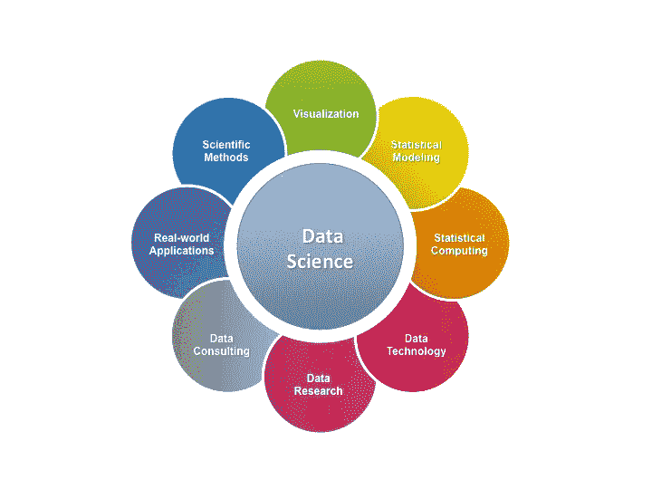

# 数据科学的起源

> 原文：<https://towardsdatascience.com/the-origin-of-data-science-9bf29ded1b5?source=collection_archive---------31----------------------->

## 这是一个虚构和创造性的故事，讲述了数据科学如何发展成为统计学、ML、深度学习和计算机科学的交叉学科。

在一些平行宇宙中，就像我们热爱的地球一样，也有一个名为**科学、**的星球，它是教育星系中其他星球如艺术、人文、科技等的邻居。就像我们的星球有各种各样的国家一样，科学也有不同的领域。最强大的领域无疑是**数学**。几乎所有其他科学领域都从它那里引进资源。但是最近，另一个领域正变得日益强大。许多人认为它不是任何独立的领域，而只是数学的一个领域。这个领域被称为**统计学。**一个分布广泛、资源丰富的领域，但不幸的是最近经历了许多公共暴乱。同样是邻近领域，**机器学习**已经开始介入这个领域。所以有一点是肯定的，现在统计的环境并不太平。

由于国家有不同的状态，统计领域也有不同的领域，如*可视化，概率，分类，方差分析，抽样分布，随机过程等。*每个领域都由一些被称为*分析过程或算法的高度复杂的人员控制。*在不同的领域，不同的算法相互竞争，最终被宣布为最佳算法。例如，在分类领域，logistic、svm、决策树和朴素贝叶斯之间的竞争非常激烈。但是这些过程是如何获得力量的呢？谁在帮助他们到达顶峰？它们是最重要的，也可能是任何分析中最容易被忽视的部分。数据。统计学的名声，或者确切地说，统计的各种过程的名声，是由于数据。但不幸的是，数据没有得到任何名声。他们紧张、沮丧和愤怒。他们想要改变。他们再也无法接受算法利用数据让自己出名的事实。

因此，在一个吉祥的日子里，不同类型的数据聚集在一起，以达成解决问题的方法。他们还邀请了不同领域的顶级算法，以和平的方式达成相互和解。会议以一个高维图像数据为首。

**会议负责人:**我尊敬的流程和算法，我亲爱的各位数据；我们今天聚集在这里解决我们之间的宿怨。我的数据朋友们！我们被算法出卖了。他们在利用我们，他们在改变我们，分裂我们，但不提供任何设施作为回报。我们不会再容忍这种事了。我们想要自由。

**表:**但我们是为了你好。我给了你们这些人一个合适的眼神。谁在乎你的原始形态？没有人，绝对没有人。我给了你一个结构化的外观。

**柱状图:**我给你提供了一个图形化的外观，至少比表格要好。(轻蔑地看了一眼表格)(饼图和散点图从后面点头)。

**连续数据:**是的，我们同意。但是我们得到了什么呢？每个人都在称赞你。直方图是呈现分组连续数据的一种很好的方式。为什么我们不能像你一样出名？

**算术平均:**看伙计们，别误会。我们在帮助你。你们是统计学这一神圣领域的基石。这是人类社会，他们总是需要精确和紧凑的数据形式。他们无法理解你的原始形态。这就是他们接受我们帮助的原因。我们只是用一种简洁的形式来表现你们，这样…

**数字数据:**以便他们讨论 AM 是最有用的集中趋势衡量指标？对吗？来吧女士。！不要试图愚弄我们。如果我们这边有几个异类，你就完了。而对于你的朋友 GM，只有零就可以了。所以请闭上你的嘴。

**中值:**哈哈哈哈哈哈……我应该说点什么吗？

**连续数据:**哦先生们，拜托！！别胡说了。我们不是来打架的。是的，绝对先生，看起来你有点生气。想贡献你的观点吗？

**分类数据:**嗯，我有个问题。(对算法)你们大多数人不知道如何对付我，那些有一些知识的人已经把我和我的同类分成了假人。为什么？我们因此被虐待。如果你们这么有效率，为什么不能用我们的原始形态来对付我们？我可以有 50 个不同的值，为此你会把我分成 49 个假人吗？这是不合理的，一点也不合理。这违反了数据权利法。你在制造假人之前征得我的同意吗？

现在大家都沉默了。没有人有任何答案。突然，K-NN 站起来说:“从会议一开始，你就指责我们。你给我们带来的痛苦呢？”

会议负责人(一脸惊讶):对不起？我们给你带来了的痛苦？你在开玩笑吗？你能详细说明一下吗？

(带着他自己的骄傲):你忘了“维度诅咒”吗？嗯？因为你的高维度，我们已经有几次突然失败了。

会议负责人:我们还能做些什么？你们开始抓住我们所有人的时候，我们试图让自己变得更复杂。我们认为如果我们增加我们的维度，你将无法捕捉我们。但与此同时，你们这些人变得对功能过于贪婪。你开始搜索变量越来越多的数据来更好的训练自己。这不是我们的诅咒，这是你自己贪婪的诅咒。

(盯着可视化技术)只有你们这些人保持了信仰。非常感谢你！！

**3D 散点图:**不要！！因为我们有 PCA，t-SNE 站在我们这边，我们今天仍然保持沉默。

(站起来继续说):伙计们，让我把这一点说清楚。无论你们数据人从你们这边尝试什么，最终都会失败。你增加了你的维度，我们邀请了 PCA，LDA 到我们的区域。你甚至把自己转换成非结构化的格式。你用文本挑战我们，我们用 NLP 回复。你给我们看图像，我们打电话给 CNN。你比不上我们的进步。你要做什么？(大喊)你会怎么做？我知道该怎么做。你们将把自己变成**大数据。**对吧？大量实时数据。没问题。我们还有 MapReduce 和 Spark。今天统计学处于最佳状态。没有人能打败我们。

**序数数据:**所以你是说 MapReduce 和 Spark 也属于统计学领域？

**3D 散点图:**是。这个领域就是一切。

**K-Means(抱着他，让他坐下):**不要太激动 3d。这次你有点错了。诚然，这个领域对我们几乎每个人都是必要的，但这还不够。我来自你的邻近领域机器学习，但我仍然同样重要和著名。

**正态分布:**所以它是一个 if 条件，不是 if 且只有 if。在我的监督下，并不是所有事情都像不相关和独立之间的关系一样。呵呵(害羞的笑)

**离散数据:**你又是一个皮条客。你答应我们你会给我们一个好的对称钟形。几乎我的每一个连续数据同伴都掉进了这个陷阱。现在我们明白了。所有这些过程都利用你来接近我们，因为你是最容易处理一些美丽的属性的。我们相信我们，信任你，但是你背叛了我们。

**正态分布:**哦先生您好！！不要怪我。谁告诉你要变大的？你不知道我的打手 CLT 吗？你们都知道。尽管如此，你还是开始大幅增加你的体型。抱歉，伙计们，你们自己也在我下面。

线性回归是一个古老而明智的过程，他静静地坐着，观察着这些激烈的争论。现在他站起来，其他人都停下来。想着他会说什么。

**线性回归:**对，我的同胞数据。你是对的。没有你我们什么都不是。我们需要你训练我们自己，我们需要你测试我们自己，我们需要你验证我们自己。因为你们这些人，即使在今天，我们中也没有人是完美的。我们谁也不能说他/她对每一种类型的你都有效率。K-means 不能捕捉你们中间任意形状的集群，但是 DBscan 可以。(DBscan 引以为豪)。而 K-means 可以将每个人都标记到一个集群中，但 DBscan 不能。(DBscan 挤压)。我们今天的一切，好的或坏的，高效的或低效的，都是因为你。因为你的种类和数量，我们没有人是 100%准确的。

(停顿后，他继续说):但另一方面，这也是事实，人类重视你，因为我们在那里。没有我们你会变成什么样？一些无用的冗余的无关紧要的数据。我们需要彼此，我的朋友。因此，我提出了一个建议。你想听吗？

**会议负责人:**是啊当然，为什么不呢！！

**线性回归:**我们何不为你创造一个新的居住区？来自统计学和我们的邻居机器学习的一些过程也将在那里。这个领域并不完全属于统计学的范畴。我还会谈到其他领域。它将是统计学、机器学习、深度学习和计算机科学的交叉领域。但最重要的是，在那里你会得到最高的尊重。我们将一起留在那里，相互合作，产生一些伟大的见解作为我们的资源。那么，你怎么说？

他们似乎都很开心。经过他们之间的小讨论，会议负责人对所有人说:好吧，我们接受你的提议。但是我们有一个请求。我们希望那个地区以我们的名字命名。

**线性回归:**很公平。(思考了几秒钟，微笑着说)那么数据科学怎么样？！！！！

每个人都开始高兴地跳起来。他们终于有了对自己有利的东西。进程和算法也很高兴，因为没有什么东西从它们身上拿走。

这就是数据科学如何发展成为统计学、机器学习、深度学习、计算机科学和数据交叉部分的指定领域，其中每个成员都有自己的角色，并被赋予同等的重要性。

对于数据科学家和数据科学爱好者来说，关注数据也很重要。不管你的模型有多复杂或者多受欢迎，如果数据是垃圾或者格式不正确，你的模型将会变得无足轻重。所以首要的重点应该是数据。清理数据，使数据格式正确。最后选择一种适合该数据的算法。并非每种聚类算法都适合每种类型的数据。选择合适的数据应该是任何分析的第一步。

这是我的第一个帖子。评论区的反馈或批评将有助于我将来写出更好的创造性作品。