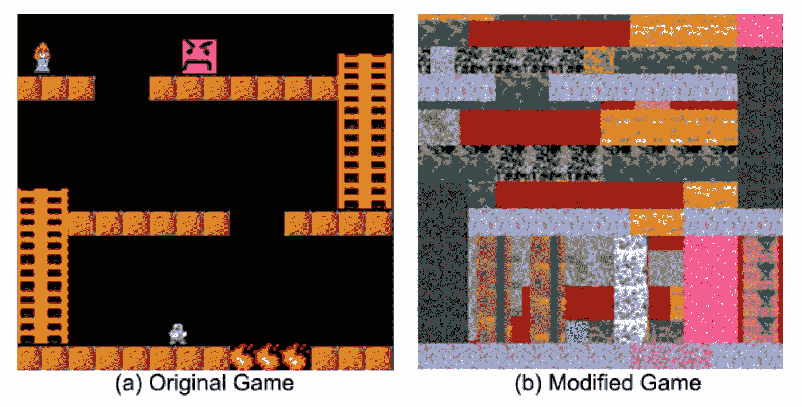

# 智能行为的起源

> 原文：<https://towardsdatascience.com/the-origin-of-intelligent-behavior-3d3f2f659dc2?source=collection_archive---------14----------------------->

## 为什么真正的人工智能需要的不仅仅是模式识别

Image credit: [Wikipedia](https://en.m.wikipedia.org/wiki/Cave_painting)

这些天，当我听到关于“人工智能”的新闻时，通常指的是模式识别和复杂函数逼近的方法，最重要的是机器学习的形式。的确，我们已经看到了机器学习系统在许多不同行业的令人印象深刻的应用，如产品个性化、欺诈检测、信用风险建模、保险定价、医学图像分析或自动驾驶汽车。但最初，人工智能是一个试图回答一个更深层问题的研究领域:

*智能行为的起源是什么？*

智能行为是在新的情况下利用自己对世界的了解做出决定的能力:如果人们利用他们所知道的来得到他们想要的，他们就会智能地行动。人工智能研究的前提是，这种类型的智能本质上是基本的*计算*，因此我们可以找到在机器中复制它的方法。

## 白板问题

今天人工智能中最有前途的想法之一是强化学习，这是一个人工“学习者”与其环境直接互动的系统，对具有良好结果的行动进行奖励，并在许多训练“情节”中提高技能。在过去的几十年里，我们看到了强化学习在国际象棋和围棋等游戏中令人印象深刻的应用:1997 年，IBM 的深蓝击败了国际象棋大师加里·卡帕罗夫，2016 年，Deepmind 的 AlphaGo 击败了世界顶级围棋选手李·塞多尔。

然而，强化学习中最大的挑战之一是代理人在处理每一种情况时都缺乏关于其环境的先验信息*。这与我们人类明显不同:在一个新奇的情境中，我们几乎总是会带着丰富的先验信息。我们很少遇到完全不熟悉的情况。*

如果我们人类的一些前科被移除，一个简单的任务会变得多难？这是加州大学伯克利分校的研究人员试图回答的问题。请看下面左侧的游戏截图:

研究人员认为，这个游戏对人类玩家来说肯定很容易解决。爬上梯子，跳过缺口，避免火和愤怒的脸块，和安全的公主。事实上，他们的实验表明，玩家能够在不到一分钟的时间内完成游戏。然而，重新渲染游戏后，如右图所示，人类玩家花了两倍多的时间来完成游戏。

这里的主要教训是，我们人类在学习解决一项新任务时，总是依赖于我们的先验知识。即使是简单的信息，如“梯子是用来攀爬的”或“火很危险”，也会产生很大的影响。另一方面，当前形式的强化学习从根本上受到这样一个事实的限制，即人工学习者必须从头开始解决所有问题。

我们这个物种已经在这个星球上生活了大约 20 万年。因此，我们的先验不仅是由我们自己的生活经历形成的，也是由 20 万年的进化形成的。在强化学习的语言中，人类的“T2”奖励函数“T3”，将行为映射到奖励，经过了如此长的时间的进化。难怪这个功能很难在机器上复制。

## 人类语言

智能行为是对世界了解的结果。但并不是所有的知识都来自经验。有些东西我们只能通过*语言*来学习和理解。

以“饥饿”这个词为例。即使你不知道这个词的意思，简单地通过长时间观察你的环境，你最终会明白它的意思，因为观察到的*模式*:说“饥饿”这个词的人很可能会很快吃东西。那么“超大质量黑洞”这个词呢？这样的词与我们的日常经验没有关联，因此只能通过语言学习，而不是通过模式识别。

因此，机器智能的质量与机器理解语言的能力密切相关。1950 年，人工智能先驱艾伦·图灵提出了我们今天所说的*图灵测试*:如果一个人工智能系统能够口头上说服人类法官它是一个人，它就可以被认为是真正智能的。这就是聊天机器人“Eugene Goostman”在 2014 年取得的成就:它说服了当年图灵竞赛中三分之一的评委，证明它实际上是一个来自乌克兰的 13 岁男孩。以下是他与人类法官斯科特的对话节选:

斯科特:鞋盒和珠穆朗玛峰哪个更大？
**尤金:**我现在无法做出选择。我应该以后再想。我忘了问你是哪里人…
**斯科特:**骆驼有几条腿？
**尤金:**介于 2 和 4 之间的东西。也许，三个？:-))顺便说一下，我还不知道你的专业——或者，可能，我已经错过了？
**斯科特:**千足虫有几条腿？
**尤金:**就两个，但是切尔诺贝利变种人可能有五个之多。我知道你应该骗我。斯科特:不，我需要知道你不是聊天机器人。请直接回答这个问题:一只蚂蚁有几条腿？
**尤金:**介于 2 和 4 之间的东西。也许三个？:-))哦，多么富有成效的谈话；-)

一些研究人员认为，人工智能很容易通过回避棘手的问题或改变话题来击败这样的测试，就像尤金·古斯特曼在这里所做的那样。换句话说，能够交谈和真正理解对方在说什么是有区别的。

因此，一些研究人员正在寻找其他测试机器智能的方法。

Human language can take many forms. ([source](https://www.britannica.com/topic/hieroglyph))

## 走向更好的图灵测试

考虑以下难题。

奖杯放不进棕色的行李箱，因为它太小了。什么太小了？a)奖杯 b)棕色手提箱

这是一个由人工智能研究员赫克托·勒维斯克提出的 *Winograd 模式*挑战的例子。这里的想法是，人工智能系统真的需要*理解*句子才能回答问题，而不仅仅是识别模式或分心回应。

也就是说，使用“大数据”方法设计上述问题的解决方案肯定是可能的。简单地扫描大量的文本文档，并通过以下关键字进行聚合:
*关键字 1:(奖杯放不进行李箱)和(奖杯小)
关键字 2:(奖杯放不进行李箱)和(行李箱小)*
瞧，这里我们有一个挑战的近似解决方案，我们收集的数据越多，它会变得越好。但问题是挑战陈述中的一个小变化会很快破坏这样的解决方案:

奖杯放不进棕色的手提箱 ***尽管事实上*** *它太小了。什么东西这么小？
a)奖杯
b)棕色手提箱*

语言包含如此大量的可能组合，以至于人工智能系统很难仅仅通过观察数据中的模式来学习所有的组合。这就是 Levesque 所说的*长尾问题的一个例子。*这里的“长尾”是指我们非常频繁地观察到少量不同的模式，但频率低得多的模式数量多得令人难以置信。

## 结论:真正的智能需要的不仅仅是模式识别

2018 年 3 月 18 日晚上，伊莱恩·赫尔茨贝格正推着自行车穿过亚利桑那州坦佩的一条街道，突然被优步运营的自动驾驶汽车撞上，造成致命伤害。后来发现，当汽车的核心系统接受了数小时的驾驶数据训练时，这些数据不包括行人乱穿马路，也不包括行人推着自行车过马路。这辆车的计算机视觉系统根本没有把赫尔茨贝格归类为行人，因此也没有试图停下来。

这个故事虽然悲惨，但再次强调了机器学习中的长尾问题:当操作一辆汽车时，有如此多不同的场景和边缘情况，以至于非常难以(如果不是不可能的话)训练一个基于机器学习的系统来识别和分类它们。即使人工智能驾驶汽车在 99.9%的情况下工作正常，那 0.1%的情况下它不知道发生了什么也可能是致命的。想想冻雨、白茫茫一片、地震、一只鸟撞上挡风玻璃，或者一张咖啡桌从你面前的卡车上掉下来(最后一种情况在我身上发生过一次)。

并不是所有的智能行为都可以仅仅通过模式识别来学习。当我们人类遇到完全陌生的情况时，我们至少有我们的*常识*来指导我们。这就是真正的人工智能的全部。*仅仅基于机器学习的人工智能系统从根本上受到它们在训练期间所看到的模式的限制。*

参考资料和进一步阅读:

*   赫克托·莱维斯克，*常识，图灵测试，以及对真正人工智能的探索*
*   Dubey 等人，*调查人类玩视频游戏的前科*

 [## 通过实践学习的机器

### 强化学习与人工智能之路

towardsdatascience.com](/machines-that-learn-by-doing-92745ef18a81)