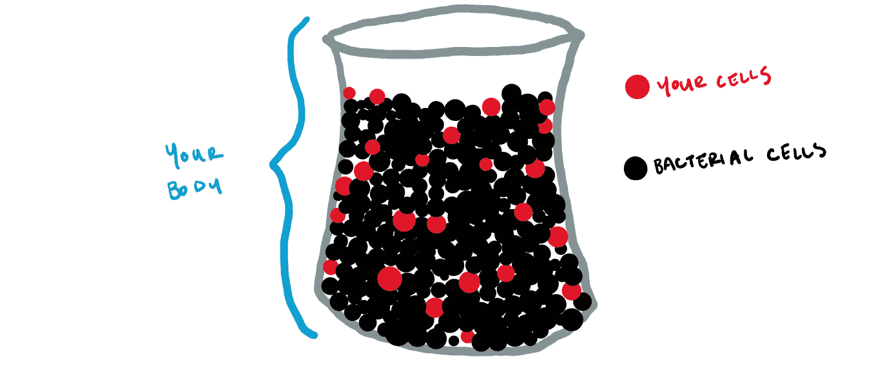
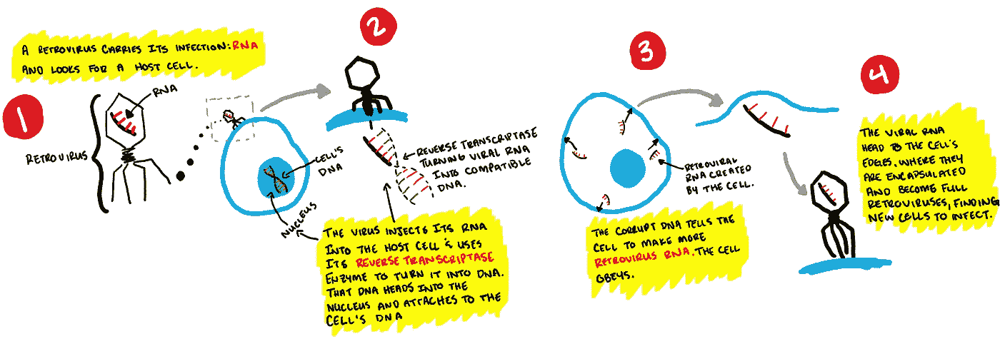
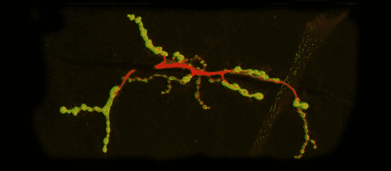

# 我们智力的病毒起源

> 原文：<https://towardsdatascience.com/the-origins-and-future-of-intelligence-chapter-2-c10097b362ca?source=collection_archive---------19----------------------->

## [关于工程智能的其他故事](https://towardsdatascience.com/tagged/engineered-intelligence)

## 神经通讯&大脑结构由逆转录病毒祖先优化

[这个系列的第一章从看科学家如何测量和比较智力开始。通过这个镜头，我们能够更好地理解智力是如何工作的——至少，我们理解它是如何工作的。事实证明，这不是关于大脑的大小，也不是大脑:质量的比例，而是关于神经元以及神经元如何相互作用。如果你没有读过第一部分，并且有兴趣了解我们的大脑是如何工作的，你可以在这里阅读:](https://hackernoon.com/the-origins-future-of-intelligence-part-1-4ed4da8bf4af)

 [## 智力的起源:第一章

### 人类智能是如何工作的

medium.com](https://medium.com/@wandererli/the-origins-future-of-intelligence-part-1-4ed4da8bf4af) 

现在我们对它是如何工作的有了更好的理解，问题仍然是为什么它会这样工作；也就是说，人类发生了什么事情，让我们的大脑变成了一个发电站，让我们不仅有能力生存，还能主宰我们的星球？最近，一个令人惊讶的关于有机体如何继承这种能力的新理论出现了:病毒给了我们这种能力。第二章着眼于我们的病毒祖先，以及它是如何产生智力的。

# 你几乎不是你

我们喜欢想象生活是简单的。一个卵子和精子的组合携带了创造我们的所有遗传物质。它是我们是谁的基础，无论我们是一个单细胞，一个新生婴儿还是一个完全成熟的成年人。

但现实并非如此简单。例如，你可能知道[细菌存在于我们的肠道](https://en.wikipedia.org/wiki/Gut_flora)，帮助我们消化。有趣的副作用:[那些细菌会影响你的身体健康(肥胖、糖尿病等)。)以及你的心理健康(自闭症、焦虑、抑郁)。此外，这些细菌并不是唯一存在于我们体内的细菌；事实上，微生物的数量是我们身体细胞的 10 倍。](https://www.ncbi.nlm.nih.gov/pmc/articles/PMC5859957/)

You have 9 bacterial cells for every 1 cell you have in your body

这样想:想象你身体里的所有细胞(你的和你的微生物的)都被转化成大小一致的口香糖——无论你想要什么味道，都没关系。那些口香糖球被放进一个桶里。然后你可以伸手进去，试着抓一个口香糖球，那是你的细胞，而不是微生物。据统计，在达到十次后，你只能拉出一个你自己的细胞口香糖球。

Scanning Electron Microscope Image of a virus

考虑到这一点，也就不难相信你的 DNA 中没有多少是你自己的。你的大部分 DNA 来自病毒。[大约 5%到 8%的人类基因组](https://www.ncbi.nlm.nih.gov/pmc/articles/PMC387345/)来自远古病毒。基于病毒的遗传密码以你可能从未想过的方式影响着身体。例如，基于病毒的遗传密码[调节女性体内控制出生时间的激素](https://journals.plos.org/plosbiology/article?id=10.1371/journal.pbio.3000028)。是的，你可能已经猜到了我的方向——基于病毒的遗传密码最近被认为是智力的催化剂。具体来说，是逆转录病毒的[祖先](https://www.ncbi.nlm.nih.gov/pubmed/10486975)，即逆转录转座子，找到了与我们大脑(以及我们其他方面)进化共生的方式。

## 逆转录病毒祖先在我们的 DNA 中变成化石

科学家们用一个术语来描述可以追溯到逆转录病毒起源的生物遗传密码:内源性逆转录病毒(ERVs)。当具体谈到人类时，有时它被称为人类内源性逆转录病毒(HERVs)。

Viruses hijack cells like pirates hijack ships

为什么是逆转录病毒而不是其他类型的病毒？因为逆转录病毒做的事情有点不同。一个普通的病毒找到一个宿主细胞，把自己注射进去，然后劫持细胞的控制权，就像海盗可能跳上一艘船把它据为己有一样。但与盗版不同的是，病毒利用这些细胞的控制来制造病毒的克隆体。这些克隆体随后逃离细胞(通常通过强力手段，杀死被感染的细胞),并寻找其他细胞进行感染。

The circle of life for the retrovirus.

逆转录病毒做的事情略有不同，它们是在一种[酶](https://en.wikipedia.org/wiki/Enzyme)的帮助下完成的(就像红牛在细胞水平上的行动；酶被用来启动细胞内的某些活动)他们称之为[逆转录酶](https://en.wikipedia.org/wiki/Reverse_transcriptase)。逆转录酶就像在倒带时看转录酶视频。转录酶也是一种酶；它利用 DNA 产生 RNA。然而，逆转录病毒内部有 RNA，所以它使用*反向*转录酶将其 RNA 转化为 DNA。然后，该 DNA 找到进入细胞核的途径，在那里它可以将自己附着到细胞现有的 DNA 上。

> 如果这个解释有点晦涩难懂，你只需要知道逆转录病毒可以将它们的代码转化为 DNA，然后可以添加到 a 细胞现有的 DNA 中。

这种注射了病毒的 DNA 给细胞的 DNA 增加了一行额外的代码，告诉细胞制造更多的病毒。细胞会不假思索地这么做，因为它现在已经被洗脑了。新克隆的病毒在细胞膜上沿着细胞的边缘形成，在细胞打开门，脸上带着洗脑的微笑向它们挥手告别后离开。虽然这似乎对个体人类来说是孤立的，但想象一下逆转录病毒的基因找到了进入卵子或精子细胞的途径。到那时，下一个生命的基本构件将包含逆转录病毒 DNA。

## 诺亚方舟

Arc gene under a scanning electron microscope ( J. Ashley et al., Cell 172, 1–13 Jan. 11, 2018\. 2017 Elsevier Inc.)

所有的背景信息都清楚了，我们终于进入了最相关的部分:把 ERVs 和大脑拼在一起。它从[突触](https://en.wikipedia.org/wiki/Synapse)开始，突触是神经细胞向其他神经细胞传递电信号或化学信号的部分。突触向另一个神经发出信号后，神奇的事情发生了。一个叫做 Arc 的基因激活并开始制造 RNA。RNA 携带着一个信息，这个信息被传递到其他神经。RNA 被封装并送出细胞。如果你还记得，这就是逆转录病毒的作用。

> [实际上，*弧*用记忆的原材料‘感染’其他神经元。](https://www.scientificamerican.com/article/prehistoric-viruses-and-the-function-of-the-brain/)

这是因为研究人员认为[弧是 ERV](https://www.cell.com/cell/fulltext/S0092-8674(17)31504-0) 。在这一点上，我们不知道 RNA 中编码和传递的信息到底是什么，但我们知道 Arc 在大脑中起着非常重要的作用，特别是在[存储信息](https://www.nih.gov/news-events/news-releases/memory-gene-goes-viral)方面——随着时间的推移，它告诉神经[如何组织自己以有效地存储更多信息](https://www.cell.com/cell/references/S0092-8674(17)31509-X)。如果 Arc 基因不能正确地发送指令，神经突触就会死亡。这种基因与神经疾病有牵连。当研究人员从动物身上移除 Arc 基因时，这些动物仍然可以存储短期记忆，但[不再能够存储长期记忆](https://www.ncbi.nlm.nih.gov/pmc/articles/PMC3207967/)。换句话说，Arc 是一件大事。

虽然我们一直从人类智力的角度来看待智力，但我想指出，Arc 基因并不是人类独有的；它存在于许多生物体中，其行为方式也相似。话虽如此，[负责做出这一发现的研究人员](https://www.nature.com/articles/d41586-018-00492-w)彼此独立(Budnik 的小组研究了苍蝇的 Arc，而 Shepherd 的小组研究了啮齿类动物的 Arc)认为 Arc 基因“似乎是从在不同时间进入物种基因组的两种不同的逆转录病毒进化而来的。"

这与我们在科学课上学到的东西非常不同，但 Arc 基因的起源等新发现要求我们保持开放的态度，改变我们对我们是谁的核心以及我们如何变得聪明的理解。到目前为止，研究表明，大约 8%的人类 DNA 来自逆转录病毒，但这可能只是冰山一角。不管隐藏在背后的其他奇怪的起源故事是什么，我们确实知道 Arc 在我们大脑中的存在是我们可以感谢我们的病毒祖先的。

信息如何传递到大脑中不同的神经元是理解智力的关键，但不是唯一的。正如第一章所讨论的，人类大脑区别于其他生物大脑的一个重要因素是我们大脑皮层中神经元的密度。第三章将研究这种密度异常现象，并探讨它是如何产生的。