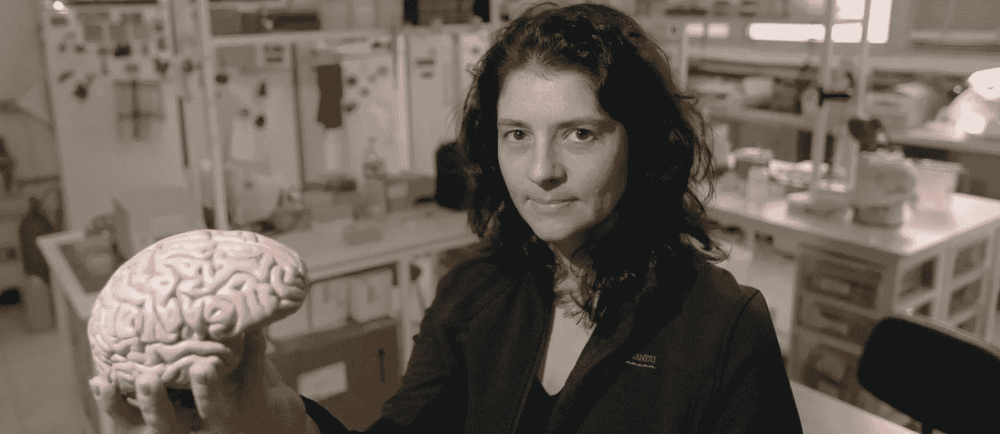
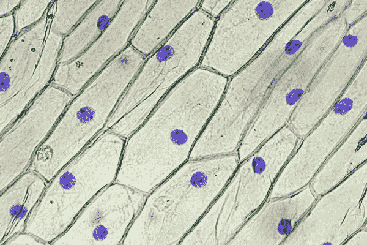

# 如何测量和预测智力

> 原文：<https://towardsdatascience.com/the-origins-future-of-intelligence-part-1-4ed4da8bf4af?source=collection_archive---------30----------------------->

## [关于工程智能的其他故事](https://towardsdatascience.com/tagged/engineered-intelligence)

## 智力是如何起作用和不起作用的

# 介绍

作为世界上最有价值的人工智能初创公司[sense time 的实习生，一个一直萦绕在我脑海深处的问题是:是什么造就了人类的智能？也就是说，在未来，是否还会有一条线在逻辑上将我们拥有的东西和我们的机器人对手被给予的东西区分开来？这些问题看起来就像对生命本身的定义达成一致一样具有挑战性；也就是说，生命在什么时候被注入到看似无生命的亚原子粒子的集合体中？](https://www.forbes.com/sites/bernardmarr/2019/06/17/meet-the-worlds-most-valuable-ai-startup-chinas-sensetime/#2d4c8fe309fc)

然而，问题在于我们对自己的智力没有清晰的认识。有一些理论，但是很多都没有经受住时间的考验，而且随着新证据的出现，目前被接受的理论可能会在未来被揭穿。然而，我们能做的是检查现有的证据，看看这对我们的未来意味着什么。

我正在写一系列探索人类智能的文章，这个系列分为许多部分。第一章着眼于关于智力如何工作的不同理论和我们目前测量智力的方法。接下来的章节将着眼于智能产生的不同方式，以及未来的智能(自然的和人工的)如何超越我们目前的智能能力。

Snailfinity Gauntlet

关于人类智慧的出现有很多争论。虽然人们可能会把天赋视为简单的进化工具，就像鱼有鳃，鸟有翅膀一样，但我们的天赋是不同的。它不仅是一种生存工具，也是一种让我们弱小的物种统治地球的工具。就好像有一天一只蜗牛拼凑出了无限长的手套，没有人会质疑这只蜗牛是怎么做到的。

## 智力不仅仅是一个进化的种族

加入一杯达尔文主义，一茶匙好莱坞科幻小说，也许还会撒上一点口袋妖怪来调味，你会得到一个关于进化对智力影响的非常倾斜的观点。为了生存，进化是一场碰运气的游戏，但它经常被描绘成类似于看着一个婴儿变成一个聪明的成年人。然而，通常进化并不要求你变得更聪明，只是更能适应。智力可能会被混合到等式中，但它不是必需的。

Evolution doesn’t necessarily make you smarter.

以老鼠为例。我们都同意，就智力而言，老鼠不如人类(至少就我们的理解而言)。大约 8000 万年前，人类和老鼠的血统从一个共同的祖先分裂出来。科学家估计，自那次分裂以来，老鼠的进化速度比人类的[快三倍](https://www.nature.com/news/2004/040329/full/news040329-11.html)，这是从老鼠基因组与人类相比的多样性得出的一个指标。尽管老鼠的进化速度更快，但人类仍然拥有更高的智力。

也就是说，进化中出现的适应因物种而异，取决于影响物种生存的变量。对人类来说，这个变量很可能是智力，而对鸟类来说，它可能是更有效的翅膀。换句话说，一个个体物种的智力可能会通过进化得到提高，但进化作为一把涵盖所有生物的大伞，并不一定会提高智力。

# 智能是如何工作的

在过去的一个世纪里，科学家们通过各种各样的假说来研究人类的智力。然而，不管采用哪种方法，有一点是肯定的:人类基准。如果人类不在列表的顶端，那么分析肯定是有缺陷的。这种测量有助于剔除一些先前流行的理论，尤其是与大脑指标直接相关的理论。

## 尺寸并不重要

我们人类喜欢比较身体各部分的大小。虽然这些尺寸对比中的大多数与许多其他物种相比都有所欠缺，但大脑一直是我们可以自豪地展示的人类成就的见证。有了如此令人印象深刻的大脑，难怪纯粹的大脑大小决定智力的观点会作为一种可接受的自然法则流传一段时间。也就是说，直到其他竞争者进入竞技场——特别是抹香鲸。

不，抹香鲸不叫抹香鲸，因为它看起来像一个头重脚轻的精子细胞。[精子是鲸脑的滑稽简称](https://en.wikipedia.org/wiki/Sperm_whale)，鲸脑是抹香鲸头部的一种液体。在相当长的一段时间里，这是一种真正有价值的液体，因为它被用于油灯、蜡烛、润滑剂等。

关于它滑稽的名字已经说得够多了，让我们来谈谈它的相关性——抹香鲸拥有地球上最大的大脑。但是抹香鲸并不比人类聪明(至少就目前人类的理解而言)。那么，如果那个巨大的大脑没有试图在量子物理学中取得下一个突破，它在做什么呢？听起来很明显，较大的动物只需要较大的大脑来管理正常的日常功能。用科学术语来说，这叫做[异速生长](https://www.ncbi.nlm.nih.gov/pmc/articles/PMC5148715/)。

异速生长只解释了为什么更大的生物需要更大的大脑，它并没有声称更大的大脑会导致更高的智力。要么是大脑大小与智力相关的假设是错误的，要么是有一个缺失的部分必须被添加到考虑因素中以验证它。缺失的部分是大脑和身体的比例。

## 大脑质量与预期的大脑大小

最近，大脑与身体的比例作为衡量智力的标准已经成为主流真理，类似于人类只使用了大脑 10%的神话(通过像[无限](https://www.imdb.com/title/tt1219289/)和[露西](https://www.imdb.com/title/tt2872732/)这样的非常棒的电影而流行)。但就像 10%大脑的谣言一样，大脑与身体的比例也是一个有缺陷的神话(曾经被认为是真理)。

这个脑体比在科学上被称为[脑化(in-seh-full-I-zay-shun)商](https://en.wikipedia.org/wiki/Encephalization_quotient#)(简称 EQ)。尽管对于那些不精通拉丁语的人来说，这似乎是一个令人生畏的名字，但这个想法很简单，来源于异速生长标度(在前面的神话中讨论过的身体和大脑大小之间的相关性)。异速生长标度告诉我们大脑的大小取决于一个物种的身体大小。

情商则更进了一步——例如，当大脑比我们从异速生长的角度预期的要大时会发生什么。从情商来看，我们预计大脑与异速生长模型相比越大，这个物种就越聪明。

不是吹牛，但我的大脑化商数是巨大的。

你的也是。在所有体型相似的哺乳动物中，人类的情商最高:7.4–7.8。请理解为:人类的大脑比我们预期的同样大小的哺乳动物的大脑大 7.4-7.8 倍。情商假说似乎被人类排名第一的事实所证实。

但是事情在中间开始分崩离析。例如，2007 年一项对 25 种灵长类动物的研究得出结论，[猩猩是除人类之外最聪明的灵长类动物](https://www.thetimes.co.uk/article/chimps-knocked-off-top-of-the-iq-tree-pm25bc6fqsd)——比黑猩猩和大猩猩更聪明。猩猩是[唯一可以交流过去](https://www.sciencemag.org/news/2018/11/orangutans-are-only-great-apes-besides-humans-talk-about-past)的灵长类动物。按情商，猩猩(1.9 情商)排在黑猩猩(1.7 情商)和大猩猩(1.5 情商)之上。另一方面，与卷尾猴(4.8 EQ)和松鼠猴(2.8 EQ)相比，它们的情商有所下降。

## 重要的是内在

到目前为止，试图将纯粹的大脑大小与智力联系起来(无论是通过大小还是比例)还没有成功。实验转向了其他理论，我们现在偶然发现了一个似乎非常合适的理论:这与大脑的大小无关，而是与大脑的内部结构有关。

大脑的动力细胞是神经元。因此，也许这就像计算神经元的数量一样简单，而不是看大脑的整体大小。在我迄今为止试图理解智力的所有研究中，我遇到了许多令人印象深刻的研究人员，但一位名叫[苏珊娜·赫库兰诺-胡泽尔](https://www.amazon.com/Human-Advantage-Brains-Became-Remarkable/dp/0262533537/ref=sr_1_2?crid=2NN7WPUBDFC79&keywords=suzana+herculano-houzel&qid=1562568444&s=gateway&sprefix=suzana+her%2Caps%2C479&sr=8-2)的心理学家因其将大脑组成和智力联系起来的独特技术而脱颖而出。

Suzana holding the main ingredient for her famous soup.

通过混合各种物质(大脑是主要成分)，Suzana 会将完整的大脑变成糊状，并使用特殊的化学物质来改变神经元细胞核的颜色。然后，她必须计算变色细胞核的数量，这决定了大脑中神经元的数量(因为所有神经元都有一个细胞核)。当然，由于大脑中有数十亿的神经元，我会假设她计算了整个解决方案的一个子段，并推断出(如果我错了，请纠正我，苏珊娜！).

Staining the nucleus of onion cells — not exactly neurons, but you can see it makes it easier to spot and count nuclei.

根据神经元计数逻辑，如果我们真的是智力冠军，人类应该拥有所有动物中最多的神经元。不幸的是，在做了大象脑汤之后，苏珊娜计算出[非洲象大脑的神经元数量](http://nautil.us/issue/35/boundaries/the-paradox-of-the-elephant-brain)是人类大脑的 3 倍。在这种情况下，人类作为竞争者被淘汰了。

但在深入研究后，其他更重要的结果开始出现:所有这些神经元中只有 2%(或 56 亿)位于负责更高级思维的大脑皮层。相比之下，人类在同一位置大约有 160 亿个神经元。虽然非洲象的神经元总数比人类多 3 倍，但在智力方面，人类的神经元数量几乎是前者的 3 倍。

现在，大脑和智力之间的相关性不是集中在大脑本身的大小，而是它的内容。[新研究](https://www.ncbi.nlm.nih.gov/pmc/articles/PMC4685590/)着眼于皮层神经元(大脑皮层中的神经元)的数量和神经元间的距离。另一个有趣的术语，神经元间距离就是神经元之间的距离。就像在计算机中一样，神经元之间的物理距离决定了信息从一个地方发送到另一个地方的速度——毕竟，信息只能传播这么快，所以它传播的越远，到达目的地的时间就越长。除了跨物种之外，这项研究还被应用于仅针对人类的研究，以证实[更聪明的人有更大的神经元，也有更快的电信号在这些神经元之间传递信息](https://www.humanbrainproject.eu/en/follow-hbp/news/brains-of-smarter-people-have-bigger-and-faster-neurons/)。

智力研究的领域正在迅速扩展，并且正处于一个激动人心的时刻。随着人工智能的出现，智能研究变得比以往任何时候都更加重要，因为这些发现可以用于创建更好的神经网络和算法。像麻省理工学院这样的领先机构[将人工智能开发和神经研究](https://quest.mit.edu/)与像 [SenseTime](http://news.mit.edu/2018/mit-sensetime-announce-effort-advance-artificial-intelligence-research-0228) 和 [IBM](https://mitibmwatsonailab.mit.edu/) 这样的合作伙伴结合起来。

在这一部分，我们已经探索了智能是如何工作的(至少，到目前为止我们是如何理解它的)。在我的下一部分中，我将首先探究它到底从何而来。虽然进化有助于提高人类的智力，但起源事件仍然是一个令人兴奋的谜。

# 阅读第二章

 [## 智力的起源:第二章

### 从病毒中诞生的智慧

medium.com](https://medium.com/@wandererli/the-origins-and-future-of-intelligence-chapter-2-c10097b362ca)