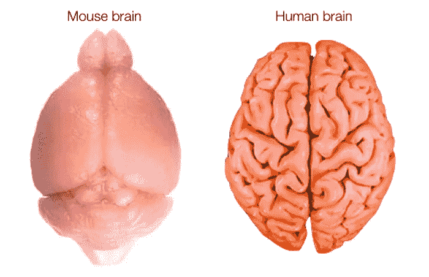
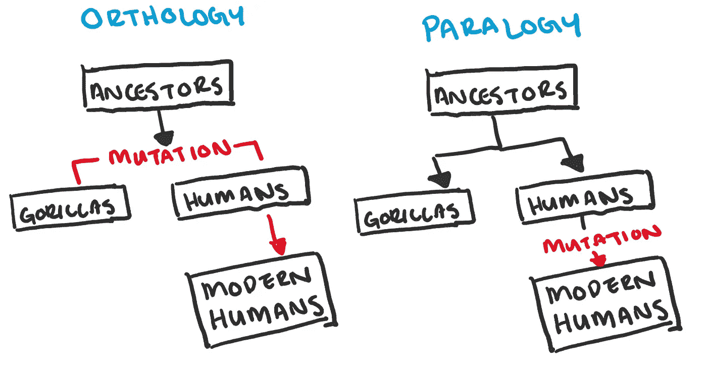
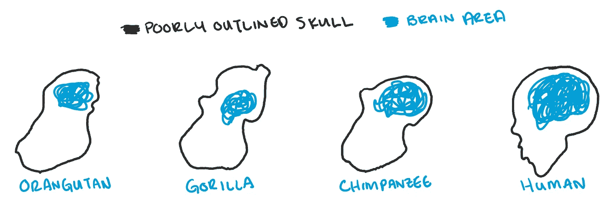

# 人类智慧的起源

> 原文：<https://towardsdatascience.com/the-origins-of-intelligence-chapter-3-1c42da5ea372?source=collection_archive---------24----------------------->

## [关于工程智能的其他故事](https://towardsdatascience.com/tagged/engineered-intelligence)

## 人类是如何变得比其他生物更聪明的

Don’t have time to read? Listen to the podcast version here.

# 简短的概要

在[第一章](https://medium.com/@wandererli/the-origins-future-of-intelligence-part-1-4ed4da8bf4af)中，我们得出结论，在大脑中，神经元是智力的主要成分。然而，神经元在我们大脑中互动和形成的方式也产生了巨大的影响。这就是为什么在《T4》第二章中，我们探索了智力的病毒起源，它影响大脑如何存储长期信息，并随着时间的推移重新配置自己以进行优化。

 [## 阅读第二章

### 从病毒中诞生的智慧

medium.com](https://medium.com/@wandererli/the-origins-and-future-of-intelligence-chapter-2-c10097b362ca) 

## 人的因素

在这一章中，我们将看一下使人类大脑区别于其他动物的主要因素之一，这一点我们在第一章中提到过。这个因素就是我们大脑的大小。具体来说，[人类拥有所有哺乳动物中最大的相对大脑皮层尺寸](https://www.sciencedaily.com/releases/2016/06/160602152011.htm)。但是正如我们在第一章中了解到的，重要的不是大小，而是大脑皮层中神经元的数量，这也是人类获得的。

Source: [Elizabeth Atkinson, Washington University in St. Louis.](https://www.livescience.com/47421-human-brain-wrinkles.html)

由于大量的神经元聚集在那个区域，人类的大脑对其褶皱[特别性感，这也是其结果。不是所有的动物都有这种神经奢侈；看看人类和老鼠大脑的比较。缺少褶皱使老鼠的大脑看起来更像一只剥了皮的鸡，而不是一个认知发电站。老鼠的大脑非常随遇而安，而人类的大脑，一旦像熨烫衬衫一样展开成扁平的块状，覆盖的表面积比眼睛看到的要大得多(阅读:我们比老鼠有更多的神经元，即使是相对于大小而言)。](https://www.livescience.com/62892-why-brains-have-folds.html)

当然，在老鼠和人类之间有着广泛的动物种类；我们的褶皱不是独一无二的——其他动物也在大脑中形成了褶皱。许多动物，如大象，比我们有更多更大的大脑。但是我们大脑皮层中的神经细胞数量仍然值得夸耀。

# 人类大脑的起源故事:进化中的一个缺口

我们超能力的起源很像 x 战警复仇女神的背景故事。我们曾经只是普通的猴子，做着神经元较少的猴子所做的典型事情。在我们进化时间线的某个时刻，DNA 复制错误导致了突变。那个错误给了我们超智能的力量(嗯，与我们的猴子兄弟姐妹相比)，我们用它最终奴役了作为集体物种的世界。

好了，现在你已经阅读了事件的戏剧性再现，我将根据最近的证据把它分成几个部分，这些证据导致了这个轰动的背景故事的形成。

## 我们进化史上的一个缺口

虽然原始人智能的进化(原始人是任何类型的类人猿，包括大猩猩、猩猩、黑猩猩、人类，以及我们所有灭绝的祖先——不要与原始人混淆，原始人是人类和人类的祖先分支，如尼安德特人)令人印象深刻，但在时间线的某个点上，原始人(不要与原始人混淆)智能踩下油门，将其他可怜的生物甩在身后。最近的研究表明，基因元凶之一是 NOTCH2NL 基因家族，是 NOTCH2 受体的旁系同源物。

旁系同源物是物种遗传密码基中特定基因发生变化的结果。这只是一种花哨的说法:这是发生在人科内部的突变。有趣的是，NOTCH2 是在哺乳动物中发现的[(并非人类独有)，并参与了制造神经元的过程(称为神经发生)。](https://www.the-scientist.com/daily-news/human-specific-genes-implicated-in-brain-size-36691)

另一方面，NOTCH2NL 只在人类中发现，甚至在我们的原始人表亲中也没有。这就是为什么它是一个 paralog 而不是所谓的 ortholog。直系同源物是来自共同祖先的突变；例如，如果我们和我们的原始人表亲有它，但是除了原始人之外没有其他物种有它，那么它很可能是一个直向同源物。如果在另一片土地上(比如 NOTCH2NL)，只有我们有，而我们的原始人表亲都没有，那就是 paralog。

发表在 Cell 上的一篇 [2018 NOTCH2NL 研究论文将这些基因与人类胎儿期神经元的加速发育联系起来。](https://www.cell.com/cell/fulltext/S0092-8674(18)30399-4?_returnURL=https%3A%2F%2Flinkinghub.elsevier.com%2Fretrieve%2Fpii%2FS0092867418303994%3Fshowall%3Dtrue)[根据 NOTCH2NL 研究的另一篇论文的共同资深作者 David Haussler](https://phys.org/news/2018-05-notch2nl-human-specific-genes-big-brains.html) 的说法，视差图是我们大脑大 3 倍的原因。为了检验这一假设，研究人员在小鼠胚胎中人工表达了 NOTCH2NL 基因；这些胚胎显示出用于神经发生的祖干细胞数量增加。另一方面，从等式中去除 NOTCH2NL 导致较少的神经元发育。

> “从一个干细胞中，你可以再生两个祖细胞，生成两个神经元，或者生成一个祖干细胞和一个神经元。**notch 2 nl 所做的是以一种轻微的方式将这个决定偏向于再生祖细胞，这些祖细胞以后可以继续制造更多的神经元。”**
> 
> -[Pierre Vanderhaeghen](http://www.vib.be/en/research/scientists/Pages/Pierre-Vanderhaeghen-Lab.aspx),[Cell 发表的关于 NOTCH2NL 的研究论文](https://www.cell.com/cell/fulltext/S0092-8674(18)30399-4?_returnURL=https%3A%2F%2Flinkinghub.elsevier.com%2Fretrieve%2Fpii%2FS0092867418303994%3Fshowall%3Dtrue)的合著者

为了进一步支持 NOTCH2NL 在人类大脑发育中的作用，基因的复制或缺失会影响人类大脑的发育。科学家已经将其与大头(大头)或小头(小头——就像 2016 年寨卡病毒爆发[导致的小头)以及像多动症和自闭症这样的神经发育障碍联系起来。](https://www.cdc.gov/pregnancy/zika/testing-follow-up/zika-syndrome-birth-defects.html)

# 继续教育

正如我之前提到的，在小鼠中人工表达 NOTCH2NL 导致更大量的祖干细胞，从而产生更多的神经元。虽然你不能教一只老狗新把戏，我们可能离教新的量子物理不远了。开个玩笑——算是吧。

NOTCH2NL 只是我们发现的推动神经元发展的基因家族之一，但它可能不是人类智力和所有其他智力之间的唯一界限。[环境因素](https://www.nature.com/articles/s41586-018-0127-x.epdf?referrer_access_token=pREXUHJI9ihsy_4JHCHImtRgN0jAjWel9jnR3ZoTv0P3xzykm_FWrQbvcvdvAq0x61Oz1AigINpHZ1L6Uf1KdUyVUCsTGXce7P7vDBo_xFdsn8edG4lFQNMc1LJlDEL3lyKTer9hwEGGZTLQwkcnZMmy2S5ZTCYxfQwv4Su6195osAnNMkqH2hESPxy4gY8grEoGxdeaS9d8LW3QHLY4R4UGq0qwfcFgDQ6l1FwvxrE0eD3Vz7HCVuU2mLmckaXwllcH7-vXlxnutvsZEbXUvw%3D%3D&tracking_referrer=www.the-scientist.com)可能也在我们的大脑发育中发挥了关键作用(例如，掌握火来烹饪食物)；这一结果来自于计算机模拟的[社会和环境对大脑发育的影响](https://www.the-scientist.com/the-nutshell/what-made-human-brains-so-big-36663)(剧透:环境的影响比社会情境大得多)。

也就是说，会说话的狗可能已经朝着成为现实迈出了额外的一步。NOTCH2NL 可以帮助提供学习的大脑容量，我们自己的支持可以提供合适的环境来培育资源饥渴的智能大脑的发展。这足以让我们开始讨论对地球上其他生命的潜在影响。谁知道呢，也许在我们在太空中发现任何智慧生命之前，我们最终会在我们自己的星球上制造智慧生命。但那是另一个系列的故事了。敬请期待；)