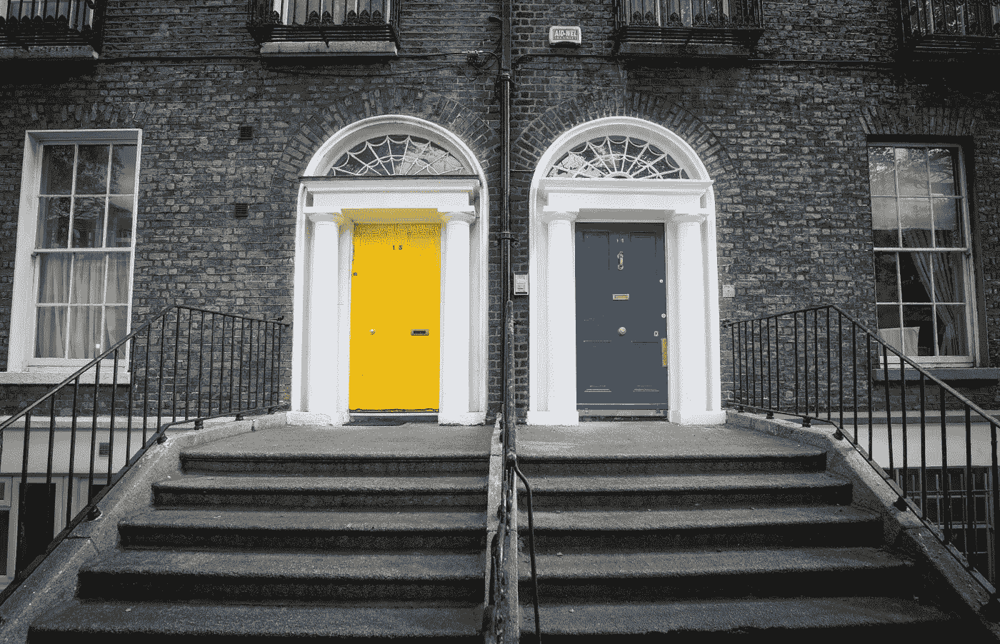
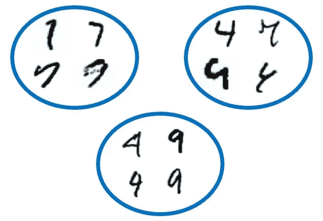
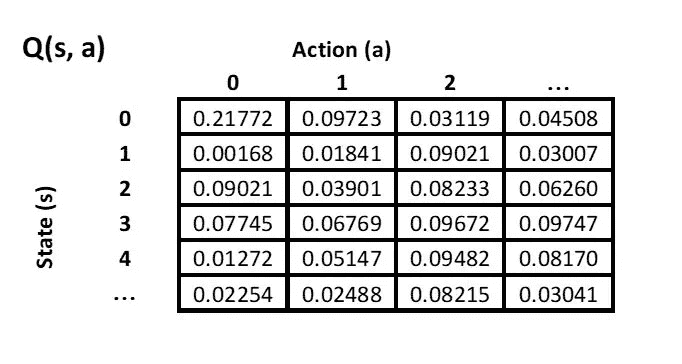
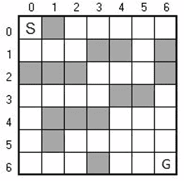
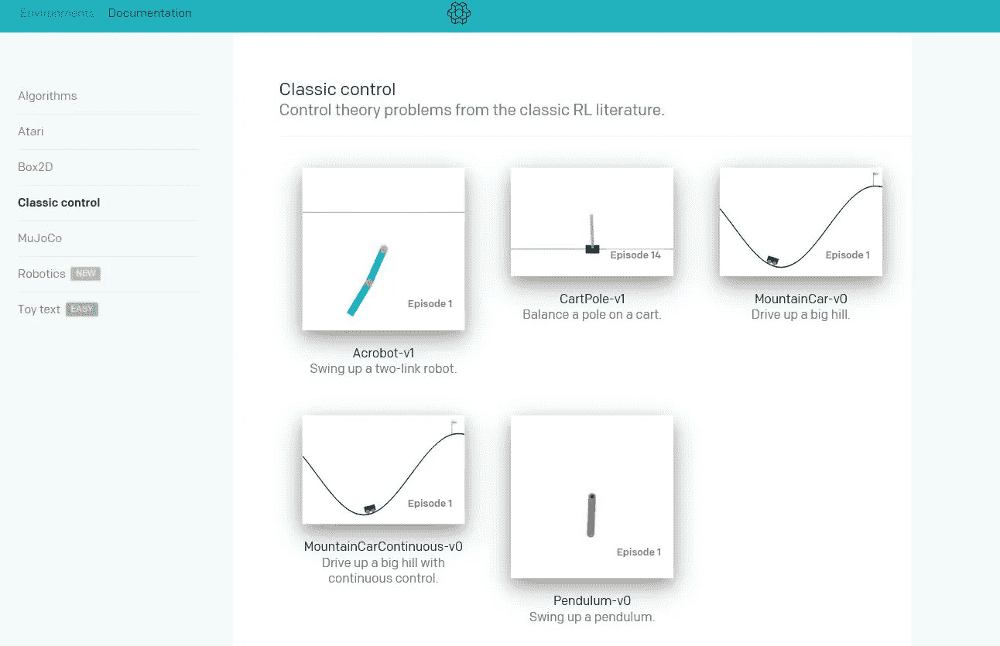

# 强化学习:机器学习的另一种类型

> 原文：<https://towardsdatascience.com/the-other-type-of-machine-learning-97ab81306ce9?source=collection_archive---------8----------------------->

## 强化学习简介

这是强化学习和 OpenAI 健身房系列文章的第一篇。

# 介绍

假设你在玩电子游戏。你进入一个有两扇门的房间。1 号门后面是 100 金币，后面是通道。门 2 后面是一枚金币，接着是另一个不同方向的第二个通道。一旦你穿过其中一扇门，就没有回头路了。你应该选择哪一扇门？

如果你仅仅基于最大化你的直接回报(或分数)来做决定，那么你的答案将是 1 号门。然而，大多数视频游戏的目的不是最大化你在游戏的单个部分的分数，而是最大化你在整个游戏中的分数。毕竟，据你所知，在 2 号门后面的通道尽头可能有 1000 枚金币。

真正回答这个问题的唯一方法是多次玩这个游戏；每次尝试不同的门；然后根据你收集的信息，确定你的最佳策略。

我刚才描述的场景是强化学习(RL)的一个经典例子，这是一种经常被忽视的“其他”类型的机器学习。在这篇文章中，我将带您了解 RL 的基本特征，并介绍 Q-learning，这是一种基本的 RL 算法。

# 什么是强化学习？

强化学习与监督学习和非监督学习是机器学习的三种基本类型之一。

在监督学习中，给你一个带标签的数据集，目的是使用该数据集来确定一个通用规则，该规则允许你标记你可能遇到的任何新的数据点。

例如，使用一个带有标签的宠物图片的数据集，创建一个模型，允许您标记您可能遇到的任何新的宠物图片。

在无监督学习中，给你一个未标记的数据集，目的是简单地通过检查数据点之间存在的关系，得出关于数据底层结构的结论。

例如，在 MNIST 手写数字数据集中识别相似图像的聚类。

然而，在强化学习中，你通常会看到一个最初未知的“环境”(如迷宫、美国证券交易所，甚至是真实世界)，而不是预先看到一个数据集，你必须通过谈论该环境中的行为(例如，在视频游戏中选择两扇门中的哪一扇门)来收集数据，并观察结果。

RL 应用于的问题类型被称为“顺序决策问题”,最终目标是确定将使您的长期收益最大化的最佳行动顺序。

环境最初是未知的这一事实很重要，因为如果环境是完全已知的，那么您就不需要为了收集关于它的信息而与它进行交互。

RL 问题的主要特征是:

*   *一个最初未知的环境* : 你必须探索这个环境以便获得关于它的信息；
*   *延迟反馈*:在采取一项行动后，可能需要一段时间才能完全意识到那项行动的长期后果；和
*   *顺序决策*:收到的整体奖励通常是一系列多项行动的结果，而不是单一的独立行动。

许多研究已经投入到开发用于解决 RL 问题的算法中。其中最著名的是 Q-learning。

# q 学习

RL 算法有两种类型:“基于模型的”和“无模型的”。

在“基于模型”的 RL 中，我们使用预先确定的环境模型(可能准确，也可能不准确)来确定最佳行动方案(也称为最佳*策略*),而在“无模型”RL 中，我们的目标是通过与环境互动来确定最佳策略。

反过来，无模型 RL 算法可以分为两种类型:“策略上的”和“策略外的”，与我们如何与环境交互以收集有关它的信息有关。

使用“政策上”算法，我们在做出决策时根据我们的“最佳”政策来决定我们的行动，然后使用从采取该行动中收集的信息来改进最佳政策。

另一方面，对于“非策略”算法，我们在与环境交互(或探索)时的行为可能与我们认为在采取行动时最佳的行为无关。

例如，我们可能会故意选择采取我们知道在短期内是次优的行动，以确定它是否会在长期内带来更大的回报。

Q-Learning 是一种“无模型、无策略”的 RL 算法。

Q-learning 的工作方式是构建一个 Q 值表 Q(s，a)，表示在环境状态 *s* 下采取行动 *a* 的预期贴现(长期)回报，然后通过与环境交互来迭代改进该表，直到找到最佳 Q 表。

最初，Q 表中的所有值都设置为小随机数(除了终端状态的 Q(s，a)值设置为 0)。

每次在环境中采取一个动作，都会产生一个(状态、动作、奖励、新状态)元组。这表示紧接在行动之前的环境状态， *s* ，在该状态下采取的行动， *a* ，在该行动之后收到的立即奖励*，r* ，以及在该行动之后的新环境状态，*s’*。

这些(状态、动作、回报、新状态)元组用于迭代地更新 Q 表中的值，其中更新的 Q(s，a)值，表示为 Q’(s，a)，被设置为等于旧的 Q(s，a)值和由新的观察暗示的 Q 值的加权平均值。即(I)即时奖励和(ii)从新状态开始收到的预期折扣奖励之和，假设你总是选择最优行动。

这可以用下面的更新规则来表示:

> Q'(s，a) = (1 — w) * Q(s，a) + w *(r + d * Q(s '，argmax a' : Q(s '，a '))

其中:

*   *w* 是应用于新信息的权重(也称为学习率)；和
*   d 是贴现率，它考虑了这样一个事实，即现在收到的 1 美元比将来收到的 1 美元更有价值。

一旦找到最优 Q 表，给定状态下的最优动作就是使该状态下的 Q(s，a)最大化的动作(即 argmax a: Q(s，a))。

这种算法的效果如何取决于用于与环境交互的探索策略的选择——如果你从未访问过环境的特定状态或在该状态下采取特定行动，那么你永远不会知道在该状态下采取行动的后果。

然而，我们也不只是想在我们的环境中随意移动。理想情况下，一旦我们收集了一些关于我们环境的信息，我们会通过将我们未来的探索集中在我们认为可能产生最大回报的状态和行动上来利用这些信息。一种方法是使用ε贪婪策略。

在ε贪婪策略下，在给定状态下， *s* ，以概率(1—ε)选择贪婪最佳行动(即对于该状态使 Q(s，a)最大化的行动)，否则选择随机行动。

通常ε会随时间衰减。这鼓励在算法的早期迭代中探索环境，但随后，随着时间的推移，减少了探索的数量，使我们能够更专注于利用这些信息。

如果所有的状态-动作对被访问足够多的次数，Q-学习算法保证最终收敛到最优表上，尽管收敛需要多长时间是另一回事。

# 例子

考虑以下迷宫(摘自[此处](https://samyzaf.com/ML/rl/qmaze.html)):

你的目标是训练一个机器人找到通过这个迷宫的最佳路径，从单元(0，0)开始，到单元(6，6)结束，给定没有环境的先验知识。

为了鼓励机器人找到最短的路径，机器人每次移动到一个空的(白色)单元时，应用 0.04 个单位的小惩罚，并且在迷宫周围放置障碍物(用灰色标记)，如果机器人进入包含其中一个障碍物的单元，则导致 0.75 个单位的较大惩罚。

机器人只能向上、向下、向左或向右移动(即不允许对角线移动)。然而，每次移动都有一定程度的不确定性，例如，机器人只有 80%的机会沿预定方向移动，20%的机会沿与预定方向成直角的方向移动(两种可能性各半)。

机器人无法移动到迷宫的边界之外，如果它试图这样做，会撞到墙上，其位置保持不变。

如果机器人成功到达迷宫的尽头，它将获得 1 个单位的奖励。

假设贴现率为 0.9，学习率为 0.3，ε贪婪探索策略(常数)ε等于 0.5，在 Q 学习算法的 50，000 次迭代之后，我们得到以下策略。该图显示了机器人在每个方格中采取的最佳方向。

寻找这个解决方案的 Python 代码可以在[这里](https://github.com/gkhayes/maze_reinforcement_learning)找到。

# **现实世界中的强化学习**

虽然从上面给出的例子中可能看起来不明显，但研究人员已经找到了许多将 RL 应用于现实世界的方法。RL 已经成功地用于开发自动股票交易系统；优化化学反应；训练自动驾驶汽车；教电脑比任何人都玩得好；除了别的以外。

然而，对于那些希望开始 RL 的人来说，历史上最大的障碍之一是获得一个有趣和具有挑战性的实验环境。这就是 RL 是机器学习家族中最不为人知的成员的原因。然而，自从 OpenAI 健身房推出以来，情况就不再是这样了。

[OpenAI Gym](https://gym.openai.com/) 是一个 Python 包，包含一系列 RL 环境，从简单的“玩具”环境，如示例中描述的环境，到更具挑战性的环境，包括模拟机器人环境和 Atari 视频游戏环境。

Examples of some of the environments available in OpenAI Gym

这个软件包使业余和专业的计算机科学家有可能试验一系列不同的 RL 算法，甚至有可能开发他们自己的算法。

# **总结**

强化学习是机器学习的一个分支，处理从与反馈可能延迟的环境交互中进行学习。在本教程中，我们讨论了 RL 的基本特征，并介绍了所有 RL 算法中最著名的一种，Q-learning。

Q-learning 包括为所有状态-动作对创建一个 Q(s，a)值表，然后通过与环境交互来优化该表。只要每个状态-动作对被访问足够多的次数，该算法就保证收敛。但是，当可能的状态和/或动作的数量变得如此之大以至于不再可能时，会发生什么呢？

在我的下一篇文章中，我将介绍如何开始使用 OpenAI Gym，它包括几个允许我们更详细地探索这个问题的环境。

*Genevieve Hayes 博士是数据科学家、教育家和人工智能及分析专家，拥有*[*Genevieve Hayes Consulting*](https://www.genevievehayes.com/)*。你可以在*[*LinkedIn*](https://www.linkedin.com/in/gkhayes/)*或者*[*Twitter*](https://twitter.com/genevievekhayes)*上关注她。她还是* [*价值驱动数据科学*](https://www.genevievehayes.com/episodes/) *的主持人，这是一个每月两次的播客，面向希望最大化其数据和数据团队价值的企业。*

*想要发掘企业数据的价值，但不知道从哪里开始？**[***下载免费的数据科学项目发现指南。***](https://www.genevievehayes.com/discovery-guide/)*