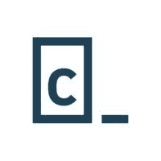
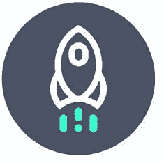
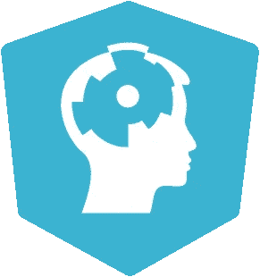
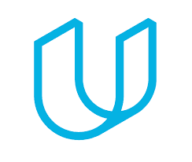
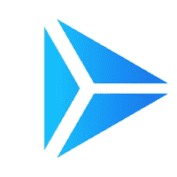
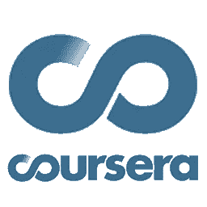

# 通向数据科学之路:MOOC 评论

> 原文：<https://towardsdatascience.com/the-path-to-data-science-mooc-reviews-7b00d8517ccf?source=collection_archive---------5----------------------->

Photo credit: [Annie Spratt](https://unsplash.com/@anniespratt), UK

我已经成了一名 MOOC 鉴赏家；在我的就业之旅的这个阶段，我已经尝试了每一个主要的 MOOC 课程，我仍然涉猎这些课程以保持记忆犹新。

最棒的是，我没花多少钱就学到了很多东西。迄今为止，Udacity 是最贵的，我是无息贷款买的。他们经常提供折扣，其中许多是每月订阅 30-50 美元。为了简洁起见，我不想在这里重点介绍每个项目的教学大纲，而是解释它们的优缺点。

我参加这么多课程的部分动机是我对教育的兴趣；我认为 MOOC 的形式让许多聪明人重新思考学习，Coursera 和 SharpestMinds 提供了一种重要的形式，可以与学术界的某些方面竞争。不过，如果你不记得其他事情的话:MOOCs 是培养行业技能和增加教育的好方法；他们为你提供学术界无法提供的技能培养。他们不能代替学术教育，你仍然需要

1.  构建您自己的项目，并且
2.  **回答自己的问题**

成为一名数据科学家。最接近学术界的应该是 Coursera。通过使用 MOOCs 的*组合*，自学书籍，并利用我的正规教育，我最终成为了一名数据科学家。

## 代码学院:

我强烈推荐 Codecademy Pro。价格是值得的，演习*真的*给适量的大脑伤害，以及良好的解释。我建议明确你在某些课程上的进度，如果你有困难就重做它们(重做错过的问题对于任何技术都是很好的练习)。

我参加了他们的基本 Python 3 课程，以使我成为一个更好的 Python 用户，但他们有一个计算机科学职业跟踪，它更复杂，涵盖了递归、算法和数据结构等主题。

Codecademy 的优势在于它结合了代码跟踪、指导项目、测验和视频:他们真的在推动对材料的整体理解。你需要所有这些格式来真正理解一些技术。

## 数据请求:

想象 Codecademy，但是更难。这些课程非常详细。这是一个学习的好地方，但是即使是一个普通的任务也要花很多时间。我喜欢他们的“低价优质教育”精神(目前每月 30 美元，高级计划 50 美元，如果你购买一年，会便宜得多)，这使得任何人都可以卷起袖子工作。对我来说，由于我已经涵盖了许多这些概念，我觉得不值得完成任何主要的证书，但通过任务的奋斗使我成为一个更好的数据科学的编码者和实践者。

在 Premium 计划中，你每月会接到导师的电话，他会审阅你的简历或给出技术建议；利用这个机会。他们能给你的最有价值的东西就是批评。

Dataquest 提供了一个很好的课程选择，将带你进入高级 Python 主题，作为一个统计学专家，我发现他们对统计的解释非常好。我建议从 Codecademy 到 Dataquest，超越基本技能，变得强大。

我的一个抱怨是他们可能会拒绝困难；在学习一项应用技能时，有必要重复和反复练习。然而，它们涵盖了大量的材料，似乎拥有所有 MOOC 中最好的 SQL 课程。他们进入红移和真正先进的数据工程的东西。我认为一些 DQ 任务对任何有抱负的数据科学家来说都是必不可少的，这几乎让其他 MOOCs 变得过时。

## 数据营:

我的观点是:数据营是对教育的认真尝试。这是一个让你放松的好地方，视频格式也不友好。我当时很享受，但这只是漫长过程的第一步。code-along 格式就像 Codecademy，但是你不写代码，只是填空。这里有一些不错的大脑损伤，但它不是你最好的选择。

视频(和一般的讲座)不是教授技术概念的好方法。如果你完全是数据科学的新手，这是一个很好的开始和激励的地方，但我仍然推荐 DataQuest。

许多 DataCamp 的学习者(包括我自己)报告说他们参加了 DC 课程，然后去 DataQuest 强化他们的技能，这是我推荐的(从不同的来源学习相同的东西总是一个好的实践)。

我会说 DataCamp 有最好的 R 课程选择，如果你想熟悉一个新的 R 课程包，你不能错过 data camp；他们的讲师是世界级的。它也向你展示了什么是好的代码。每月 30 美元，我认为几个月是增加你的教育的好方法。

## Udacity(机器学习工程师):

这个程序涵盖了主要的最大似然算法，我认为这些视频对我已经学过的东西很有帮助；他们拓展了我对支持向量机的理解，但我不认为他们会单独教你。

这里的项目也很好，迷你实验室(不需要)是很好的技能建设者。我认为给我的项目评分的工作人员非常棒，非常彻底。他们真的促使我为我使用的每一个工具写好解释，并证明我的决定是正确的。

2000 美元是这个项目目前的全部标价，我认为他们实际上已经拆除了它，并从根本上改变了它。我在网站上看到的机器学习工程师项目现在似乎更小，专注于部署和数据工程，而我所讨论的是所有主要的 ML 和深度学习算法(没有覆盖部署)。

最终，我会说 2000 美元对我来说太多了，Udacity 的“职业服务”是一个笑话(我得到了一个很好的简历审查，仅此而已)。然而，它会在你的简历上看起来不错，并且可能帮助我获得面试机会。

## 跳板(中级数据科学，带 Python):

跳板本身并不创造太多内容，而是将你链接到网上免费或低价的教育资源。对于机器学习基础，我认为这是一个好主意；有很多高质量的内容，为什么要牺牲学生的利益来重新发明轮子呢？它面向第一次在 Jupyter 中进行数据科学项目的学生，并且做得很好(我之前列出的 MOOCs 都是浏览器内的代码，无需打开你的*o*wn*Jupyter 笔记本)。*

跳板真正有价值的资产是他们的导师。这是我第一次看到很多机器学习概念，我的导师真的拷问我，以确保我知道我的东西。聪明的家伙。

每月 500 美元，我认为这是一个培养你能力的好方法。准备好接受挑战，获得一个不错的证书，并与一位经验丰富的导师互动。来自教职员工和社区的学生支持非常酷，教职员工会很快回复邮件。如果没有他们，我在数据科学领域将一事无成。

## 夏普敏兹:

SharpestMinds 提供了我长期以来一直在寻找的东西，作为一个生活在科技领域较小的小城市的人:一个与真正的数据科学家互动的机会。你需要申请才能进入，要获得一个导师，你应该在教育/技能方面达到 80%,但是一旦你进去了，你就成功了。

其他学员都很聪明，在数据科学方面和我走得差不多，所以社区 Slack 有一些有趣的项目和帖子。通常在空闲时，人们会说“我的公司正在招聘，如果你对 X 话题感兴趣，给我发消息。”

当我拿着纯数学硕士学位走过毕业典礼台时，我感觉就像有人把我推出飞机，并对我说“快点，在你落地之前找份工作。”夏普明斯就像是第 101 空降师从天而降，递给我一顶降落伞。

这可能是任何 MOOC 或训练营有史以来最好的“职业服务”,因为在你找到工作之前，他们不会得到报酬。SM 现在平均每 3 天就有一名新员工(考虑到在 2019 年获得入门级数据科学职位的难度，这是一个令人印象深刻的壮举)。

它的成功部分源于它的特异性和选择性:这是**而不是**一个为那些想知道“数据科学适合我吗”的人设计的程序它是为那些拥有丰富知识并试图获得最佳入门级 DS 职位的人准备的。你需要努力与 SM 合作，并与你的导师一起建立一个雄心勃勃的项目，一旦你被聘用，你欠他们第一年工资的一小部分(他们会提前安排)。他们还非常关注你的简历和在线表现，导师会用模拟面试来指导你。

本质上，这不是一个 MOOC 或训练营，而是为那些试图成为职业选手的人提供的教育和职业服务。

**Coursera:**

一种很好的学习方式。它从根本上不同于代码 MOOCs，而是侧重于概念理解。这里的测验真的会让你思考，我从来不觉得这些视频是在浪费我的时间。

我用 Coursera 上了一门基础 R 课程和 SQL 入门课程，这帮我躲过了很多面试，因为雇主总是在寻找懂 SQL 的人。我可能不需要告诉你 Coursera，但如果你在申请工作，确保你的简历和 LinkedIn 上有一些他们的证书；保守派不知道所有新的 MOOCs，但每个人都知道(并尊重)Coursera。

## 做真正的麦考伊:

别忘了，为了建立编码技能，你需要去 Edabit 或 Hackerrank 看看你是否能升级。从简单开始，不要超越你自己，让这些基础真正强大起来(当你向后切割字符串和构建时间序列图时，你会需要它们)。人们通过连续几个月每天数小时的编码成为程序员。你将不可避免地需要找到有趣的数据集，并在其上测试你自己的知识；没有哪门 MOOC 能重现这一点。如果你想成为一名数据科学家，不要只是敲掉 MOOCs 让简历好看；实际上建立雇主正在寻找的技能。